# Data Model ERD — F&B ERP

**Phase 3a Architecture diagram (Task 24).** Domain-grouped Mermaid `erDiagram` blocks covering every table named in `architecture.md` §5.1 (Schema file organization).

## How to read this diagram

This ERD is the **forward-looking shape** of the persistent layer that Phase 4 epics will author table-by-table. It captures, per domain:

- **Tables** (one Mermaid `erDiagram` block per epic-aligned schema file from `architecture.md` §5.1).
- **Key columns only** — primary key, foreign keys, the canonical `brand_id` scoping column, status / state fields, and a small handful of domain-defining attributes (e.g., `trn`, `irn`, `expiry_date`). It does **not** show every column. Standard columns (`created_at`, `updated_at`, `created_by`, `updated_by` per `architecture.md` §5.3) are omitted from each table to keep diagrams readable.
- **Cardinality** — derived from Master Spec §2 (Domain Model) and the Master Spec §8 Module Interface Contracts. Cardinality glyphs follow Mermaid ER conventions: `||--o{` = one-to-many, `}o--o{` = many-to-many (typically materialized via a junction table that is itself diagrammed), `||--||` = one-to-one.
- **DL-015 invariant** — every brand-scoped table carries `brand_id` as a FK to `brands.id` and shows the relationship explicitly. Tables that are NOT brand-scoped (system tables: `migrations`, `pgboss.*`, `brands` itself) carry no `brand_id` line.

What this diagram does **not** show:

- RLS policies (see `architecture.md` §4 + DL-014).
- Audit-trigger wiring (see `architecture.md` §7 + DL-013).
- Index strategy (see `architecture.md` §5.2 / §5.6 + DL-015).
- TRN sequence tables (see `architecture.md` §5.5).
- Compliance placeholder columns (see `architecture.md` §5.4 + Master Spec §6.5) — these are nullable strings/numerics on transactional tables; their presence is a schema invariant, not a relationship-graph concern.

Cross-references: `architecture.md` §5 (schema file organization, the canonical table list this diagram tracks against), Master Spec §2 (domain model), Master Spec §8 (module interface contracts), `decision-log.md` DL-015 (`brandScopedTable` helper — every brand-scoped table FK to `brands`), DL-012 (`brandedDb` query wrapper — consumer of the brand-scoped marker), DL-014 (RLS template — defence-in-depth pair), DL-013 (audit-trigger opt-in for the four critical tables).

---

## 1. Org core (`org.ts`)

Brand → Cluster → Location → Department is the canonical hierarchy from Master Spec §2.1. `brands` is itself **NOT** brand-scoped — it is the tenant root. Every other org-core table IS brand-scoped (DL-015).

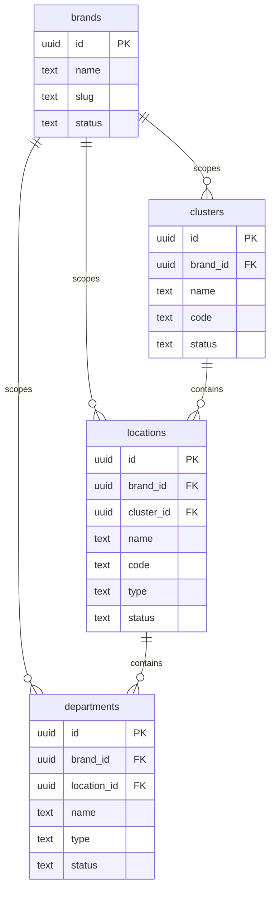

---

## 2. Auth (`auth.ts`)

Users, roles, role assignments, sessions. `users` is brand-scoped per DL-015 (brand admins manage their own user roster); `roles` is also brand-scoped to allow per-brand role definitions. `user_roles` is the junction table that materializes the many-to-many between users and roles (assignment is also scoped to a `location_id` to allow per-location role grants — see Master Spec §2.1).

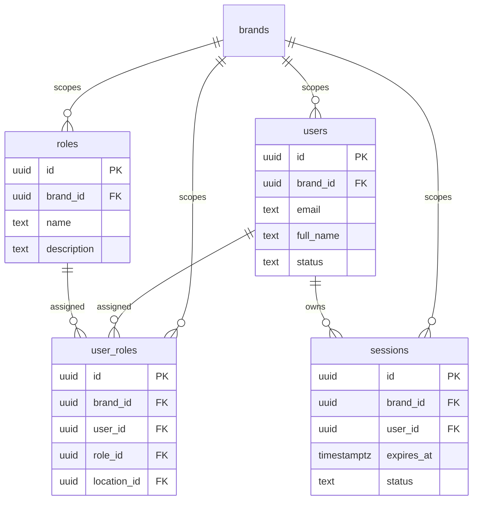

---

## 3. Inventory (`inventory.ts`)

Items, batches (FEFO-tracked per DL-016 part 1), stock levels, and the enablement matrix that gates every stock movement (Master Spec §2.4 / §7.3 — `inventoryService.checkEnablement` invariant). All four are brand-scoped.

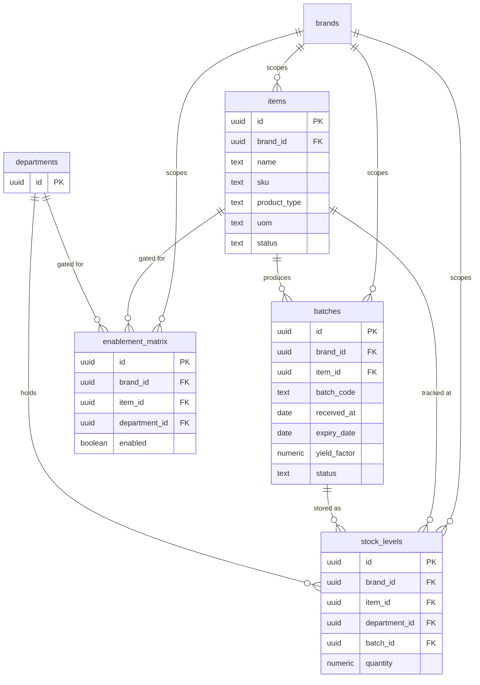

---

## 4. Procurement (`procurement.ts`)

Vendors (scope-tagged per Master Spec §2.7), purchase orders + lines, goods receipts + lines. POs and GRs are TRN-bearing transactional tables (Master Spec §6.2 → `architecture.md` §5.5). The `irn` placeholder column on `purchase_orders` carries the IRN-paste idempotency unique constraint per DL-016 part 2.

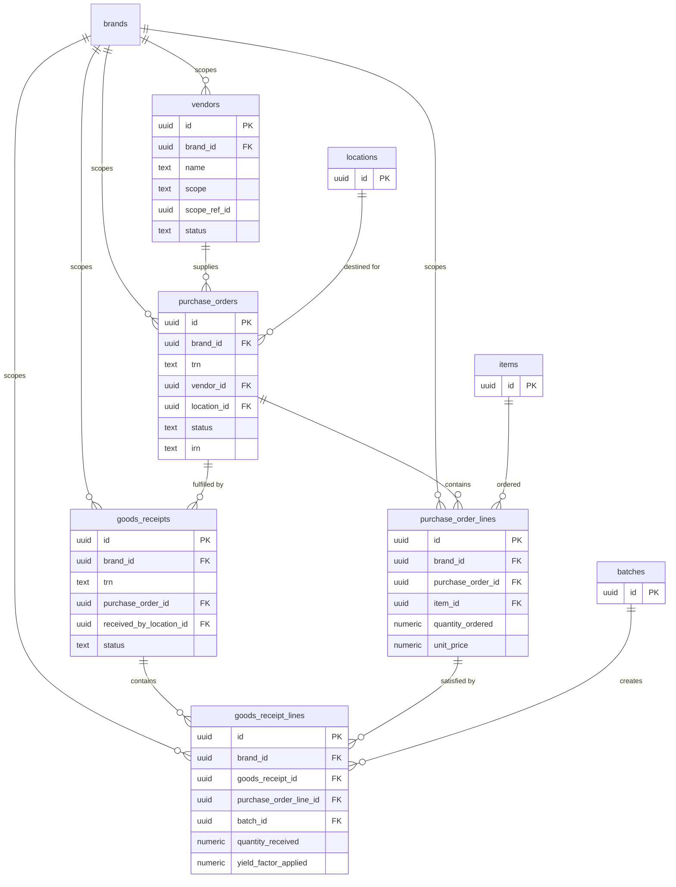

---

## 5. Recipes (`recipes.ts`)

Recipes are versioned (version snapshot per release per Master Spec §2.5 yield cascade). `recipe_cost_snapshot` is the materialized roll-up table carved out by DL-008 — refreshed event-driven (yield-factor or ingredient-price write) and via nightly backstop cron (`architecture.md` §9.4).

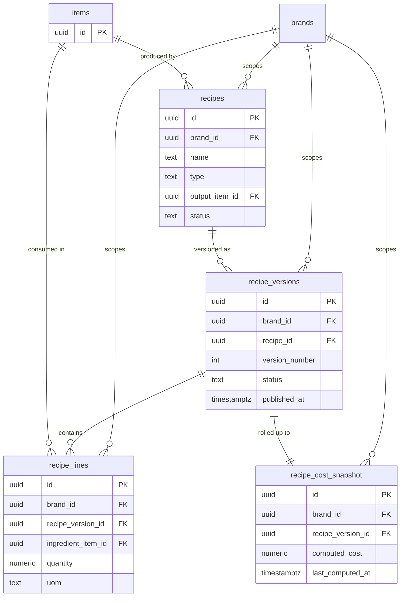

---

## 6. Production (`production.ts`)

Production orders drive the 5-status state machine (DL-001) and trigger `inventoryService.deductStock` at the In Progress transition (DL-016 part 1, `SELECT ... FOR UPDATE` row-lock pattern). Production outputs feed downstream dispatch.

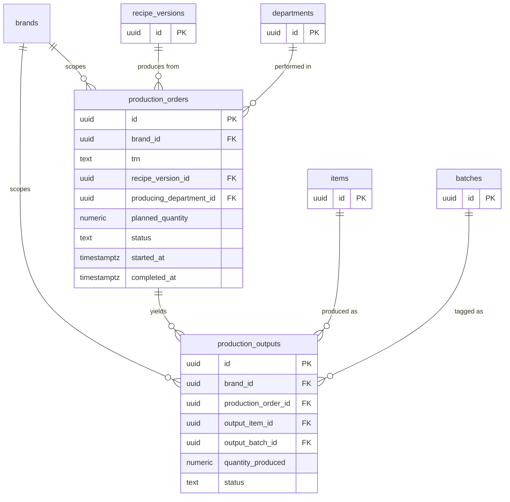

---

## 7. Dispatch (`dispatch.ts`)

Dispatch challans (TRN-bearing — see Master Spec §6.2 sample form `DC-2026-POS-AA-001234`) move final products from production / dispatch departments to POS counter service. Lines reference batch lots so traceability is preserved end-to-end.

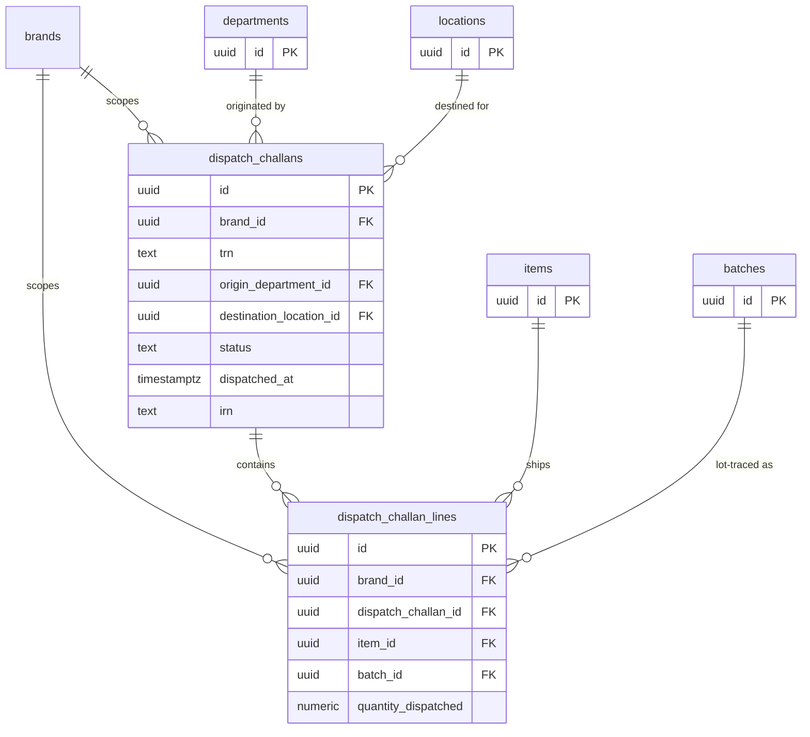

---

## 8. POS (`pos.ts`)

POS locations (a typed subset of `locations` — see `pos_locations` join / view), POS sales (one row per ticket), POS imports (provenance for batch-imported sales from external POS systems). Sales TRN bears the per-POS-location segment (Master Spec §6.2 sample `DC-2026-POS-AA-001234` form).

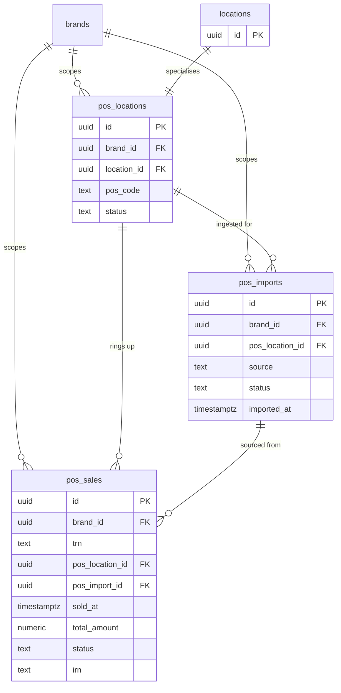

---

## 9. Accounting (`accounting.ts` + `reporting.ts`)

Chart of accounts, journal entries, journal lines (double-entry — debit / credit balance enforced at service layer per Master Spec §6 / §8.4). `chart_of_accounts` is one of the four DL-013 audit-trigger backstop tables. `report_line_config` and `saved_report_definitions` live in `reporting.ts` per `architecture.md` §5.1 and back the §6.3 Trial Balance / P&L / Balance Sheet outputs.

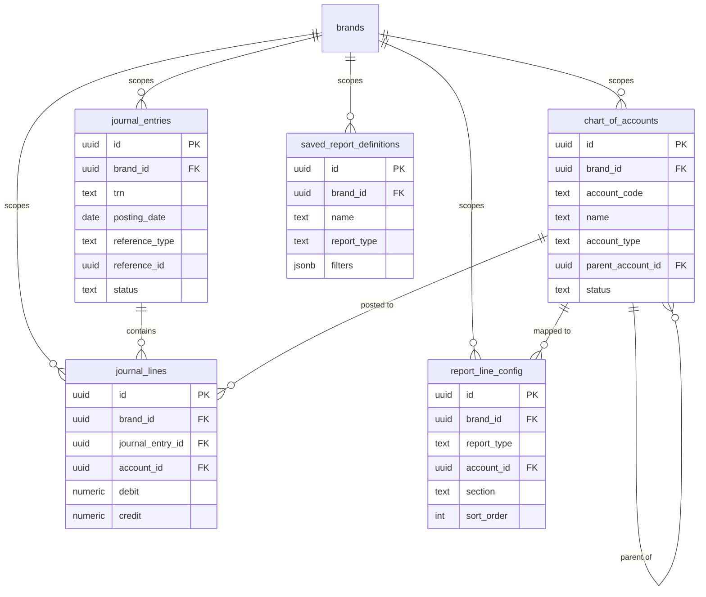

---

## 10. HRM (`hrm.ts`)

Per `architecture.md` §5.1, Epic 11 owns `employees`, `attendance`, `shifts`. Forward-permitted shape — full schema lands with Epic 11.

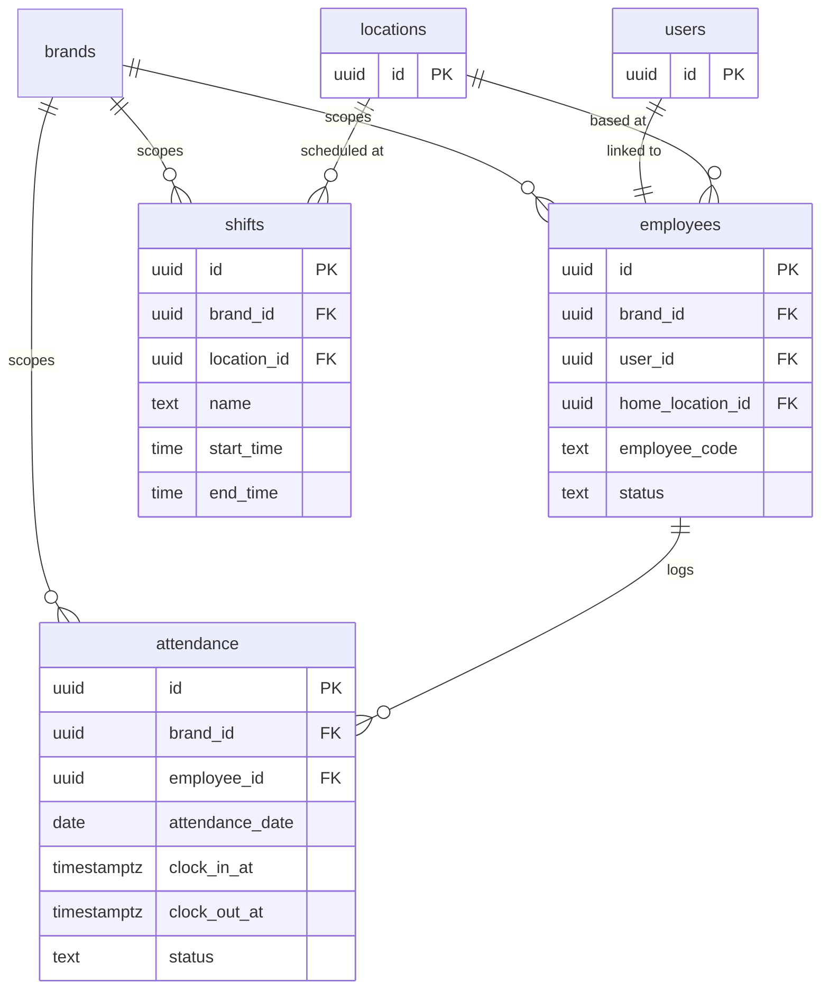

---

## 11. Audit & Notifications (`audit.ts`, `notifications.ts`)

`audit_log` schema is reproduced from `architecture.md` §5.6 / DL-013. `notifications` and `notification_type_config` back the Notification Center (Master Spec §7.3, `architecture.md` §11). All three are brand-scoped.

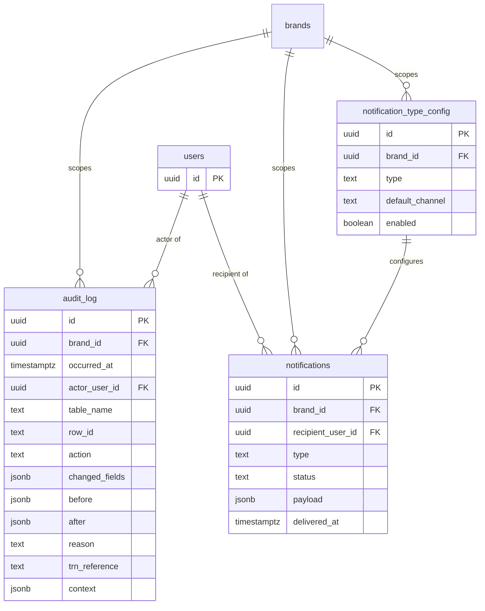

---

## 12. Approvals (`approvals.ts`)

Unified Approval Engine per Master Spec §7.3 / §8.2. `approval_matrix` is the data-driven routing config (`architecture.md` §6 referenced); `approval_requests` is the request envelope; `approval_actions` is the action log (one row per approve / reject step).

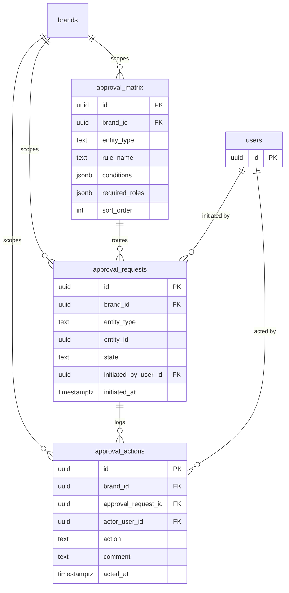

---

## 13. Files (`files.ts`)

Polymorphic attachment table — entity-attribution is `(entity_type, entity_id)`, paths follow the per-brand bucket layout from DL-017.

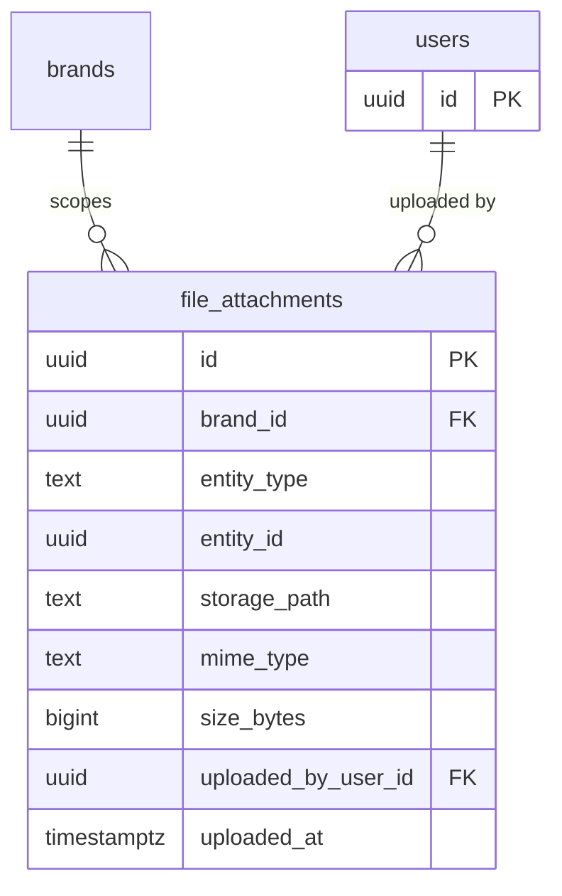

---

## See also (forthcoming in same Phase 3a session)

- `service-graph.md` — Service-layer call graph (Master Spec §8 contracts realized as TypeScript modules per `architecture.md` §6).
- `sequence-b2b-challan.md` — B2B dispatch sequence (challan creation → IRN paste → POS receipt; per `_planning/04-b2b-challan-spec.md`).
- `sequence-production-order-lifecycle.md` — Production Order 5-status state machine (DL-001) with `deductStock` row-lock (DL-016 part 1).
- `sequence-approval-routing.md` — Unified Approval Engine routing (Master Spec §8.2 + DL-016 part 3 status-guarded UPDATE).
