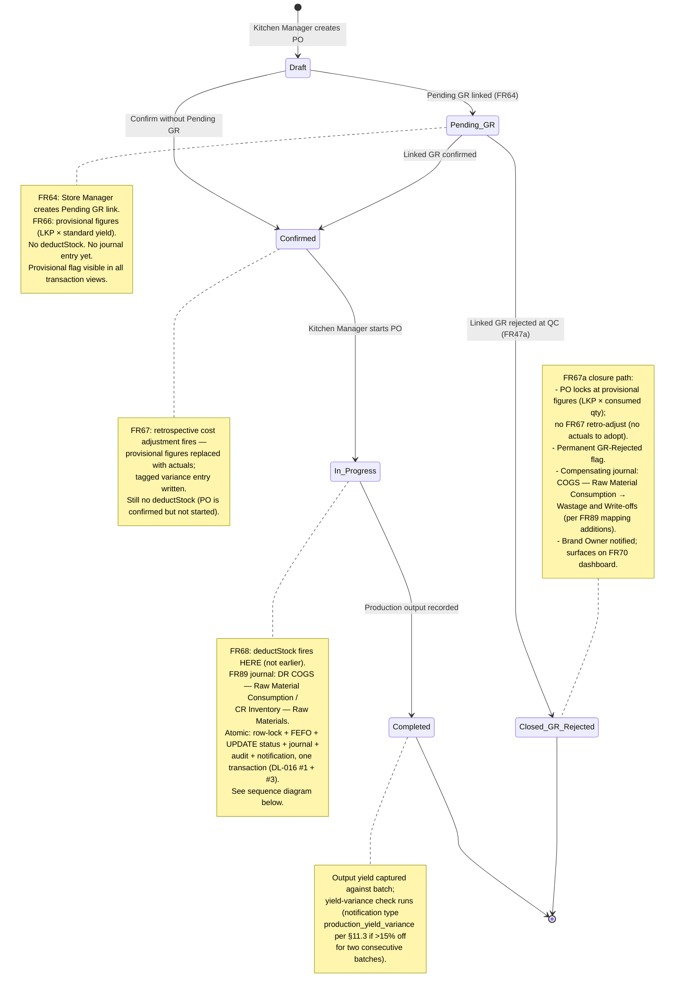

# Production Order — 5-Status Lifecycle (State + Sequence Diagrams)

**Phase 3a Architecture diagram (Task 27).** Mermaid `stateDiagram-v2` covering the canonical 5-status lifecycle plus a `sequenceDiagram` zooming in on the high-stakes `Confirmed → In Progress` transition (the only transition that fires `inventoryService.deductStock`).

## How to read these diagrams

The Production Order lifecycle is canonical at five statuses per `decision-log.md` DL-001: `Draft → Pending GR → Confirmed → In Progress → Completed`. Material deduction fires *exactly* at the `Confirmed → In Progress` transition — never earlier (Pending GR or Confirmed do not deduct) and never later. The Kitchen Manager explicitly starts the production order, which moves it to In Progress and triggers the deduction. There is one additional terminal state, `Closed — GR Rejected`, reached from `Pending GR` when the linked Goods Receipt is rejected at QC (PRD FR67a closure path); it is shown in the state diagram and called out below as the only branch off the linear 5-status chain.

Mechanism notes (used inline in both diagrams):

- Every transition is a **status-guarded UPDATE** per `_planning/architecture.md` §8.3 / DL-016 mechanism #3 — `UPDATE production_orders SET status = $next, ... WHERE id = $id AND status = $expected_old AND brand_id = $brand`. Double-click or replayed transitions affect 0 rows and return idempotently.
- The `Confirmed → In Progress` transition additionally takes the **`SELECT ... FOR UPDATE` row lock** on `stock_batches` per `_planning/architecture.md` §8.1 / DL-016 mechanism #1, ordered by `expiry_date ASC` (FEFO per PRD FR31). The status flip, batch deduction, COGS journal entry (FR89), audit row (`_planning/architecture.md` §7.3, application-layer pattern), and notification enqueue (`_planning/architecture.md` §11.4 / DL-011) all share **one Postgres `BEGIN/COMMIT`**.
- `brand_id` scoping is implicit on every DB call below — `brandedDb` middleware (DL-012, `_planning/architecture.md` §4.2) injects it automatically on every SELECT / UPDATE / INSERT against org-scoped tables.

**Conventions in the sequence diagram below:**

- Solid arrows (`->>`) are synchronous in-process calls inside the Express request lifecycle.
- Dashed arrows (`-->>`) are responses or asynchronous fan-outs.
- `Note over A,B` annotates cross-cutting context (TRN reference, transaction boundaries, FR citations).
- `rect rgb(...)` blocks group steps that share a single Postgres transaction (atomicity boundary).
- `par` blocks denote async fan-out after the transaction commits.

---

## State diagram — 5 canonical statuses + GR-Rejected closure



---

## Sequence diagram — the `Confirmed → In Progress` transition (deductStock fires)

This is the single high-stakes transition per DL-001 — the one that mutates inventory, posts the COGS journal, and emits the deduction audit + notifications. All five effects share one Postgres transaction.

```mermaid
sequenceDiagram
    autonumber
    actor Kitchen as Kitchen Manager (UI)
    participant API as Express API<br/>(auth + brandedDb)
    participant Production as productionService
    participant Inventory as inventoryService
    participant Accounting as accountingService
    participant Audit as auditLog
    participant DB as Postgres<br/>(branded scope)
    participant Notif as notificationCenter

    Note over API,DB: brand_id is bound by brandedDb middleware (DL-012);<br/>every query in this diagram is brand-scoped automatically.

    Kitchen->>API: POST /production-orders/:id/start
    API->>Production: startProductionOrder(poId)

    Production->>Inventory: checkEnablement(itemId, departmentId)
    Note right of Inventory: Master Spec §7.3 invariant —<br/>must precede any stock movement;<br/>cached on req.db (architecture.md §6.2.1).
    Inventory-->>Production: enabled = true

    rect rgb(230, 245, 230)
        Note over Production,DB: ── Single Postgres transaction (atomic) ──<br/>All steps below share ONE BEGIN/COMMIT.<br/>(architecture.md §6.1, §8.1)

        Production->>DB: UPDATE production_orders<br/>SET status='in_progress', started_at=now(), started_by=$user<br/>WHERE id=$poId AND status='confirmed'<br/>(DL-016 mechanism #3 — status-guarded UPDATE)
        DB-->>Production: 1 row updated (or 0 → idempotent no-op)
        Note over Production,DB: 0 rows ⇒ already started or wrong state ⇒<br/>service returns alreadyTransitioned=true,<br/>transaction rolls back without side effects.

        Production->>Inventory: deductStock(itemId, deptId, qty,<br/>reason='production_order_start',<br/>trnReference=PO TRN)
        Note right of Inventory: FR68 invocation point —<br/>fires exactly at this transition (DL-001).

        Inventory->>DB: SELECT * FROM stock_batches<br/>WHERE item_id=$i AND department_id=$d<br/>AND quantity_remaining>0<br/>FOR UPDATE ORDER BY expiry_date ASC
        Note right of DB: Row lock (DL-016 mechanism #1).<br/>FEFO order per PRD FR31.<br/>Concurrent deductStock calls on the same<br/>(item, department) serialize naturally.
        DB-->>Inventory: locked candidate batches

        Inventory->>Inventory: allocateFefo(batches, qty)
        Note right of Inventory: If sum(quantityRemaining) < qty:<br/>throw InsufficientStockError →<br/>transaction rolls back; no UPDATE,<br/>no journal, no audit, no notification.

        Inventory->>DB: UPDATE stock_batches SET quantity_remaining=...<br/>(per allocated batch)
        DB-->>Inventory: ok

        Inventory->>Accounting: createJournalEntry(cogsEntry)
        Note right of Accounting: FR89 mapping rule:<br/>DR COGS — Raw Material Consumption<br/>CR Inventory — Raw Materials<br/>trnReference = PO TRN<br/>(architecture.md §6.2.4 — balanced + atomic).
        Accounting->>DB: validate balanced; INSERT journal_entries
        DB-->>Accounting: journal_id
        Accounting-->>Inventory: journalEntryId

        Inventory->>Audit: record({tableName:'stock_batches',<br/>action:'business_action',<br/>reason, trnReference, context:{allocations}})
        Note right of Audit: architecture.md §7.3 application-layer pattern.<br/>Audit row commits in same tx as the<br/>business write (DL-013).
        Audit->>DB: INSERT audit_log
        DB-->>Audit: ok

        Inventory-->>Production: {success, newBalance, journalEntryId}

        Production->>Audit: record({tableName:'production_orders',<br/>action:'status_transition',<br/>reason:'PO started',<br/>trnReference: PO TRN,<br/>context:{from:'confirmed', to:'in_progress'}})
        Note right of Audit: Second audit row — captures the<br/>state transition itself with its TRN<br/>and changedFields (architecture.md §7.3).
        Audit->>DB: INSERT audit_log
        DB-->>Audit: ok

        Production->>Notif: send({type:'production_order_started', ...})
        Note right of Notif: Transactional pg-boss enqueue (DL-009 / §11.4):<br/>writes notifications row + enqueues email job<br/>inside the SAME transaction.<br/>Realtime channel #3 (DL-010) pushes to UI.
        Notif->>DB: INSERT notifications + pg-boss enqueue
        DB-->>Notif: ok
    end

    Production-->>API: {status:'in_progress', startedAt, journalEntryId}
    API-->>Kitchen: 200 OK

    par Async fan-out (after COMMIT)
        Notif-)Kitchen: in-app push (Realtime channel #3)
        Notif-)DB: pg-boss worker picks up email job<br/>(architecture.md §11.4 / DL-011)
    end

    Note over Production,DB: From here the PO is mutating live stock.<br/>Next transition (In Progress → Completed) records<br/>production output and runs the yield-variance check<br/>(notification type production_yield_variance,<br/>architecture.md §11.3).
```

---

## Why these five (and only five) transitions

| From | To | Trigger | Side effects | FR citation |
|---|---|---|---|---|
| Draft | Pending GR | Store Manager creates Pending GR link | None (provisional flag set) | FR64, FR66 |
| Draft | Confirmed | Confirm without Pending GR | None | FR68 (lifecycle) |
| Pending GR | Confirmed | Linked GR confirmed | FR67 retrospective adjustment + tagged variance | FR67 |
| Pending GR | Closed — GR Rejected | Linked GR rejected at QC | FR67a closure: lock at provisional, GR-Rejected flag, COGS → Wastage reclassification (per FR89 additions) | FR67a, FR47a, FR89 |
| Confirmed | In Progress | Kitchen Manager starts PO | `deductStock` (FEFO, row-lock, DL-016 #1) + COGS journal (FR89) + audit + notification, one tx | FR68, FR89 |
| In Progress | Completed | Production output recorded | Output captured; yield-variance check | FR68 (lifecycle) |

The 5-status spine is `Draft → Pending GR → Confirmed → In Progress → Completed`. `Closed — GR Rejected` is a sixth terminal state but it is a branch off `Pending GR`, not a new step on the spine — DL-001 names exactly five canonical statuses, and FR67a defines the closure path for the GR-rejected branch.

---

## Cross-references

**Decision log:**
- DL-001 — Production Order canonical 5-status lifecycle (the binding decision this diagram reproduces).
- DL-016 — Concurrency / idempotency mechanisms; #1 (row-lock for stock deduction) and #3 (status-guarded UPDATE for state transitions) both fire on the `Confirmed → In Progress` transition.
- DL-012 — `brandedDb` factory; the `brand_id` scoping is implicit in every DB call shown.
- DL-013 — Audit trail two-layer model (application-layer primary, trigger backstop).
- DL-009 — pg-boss transactional enqueue pattern used by the notification step.
- DL-010 — Realtime channel #3 (`production_orders`) pushes the status flip to the Kitchen Manager UI.
- DL-011 — Notification Center transport + dispatch model.

**Architecture spec:**
- `_planning/architecture.md` §6.2.1 (`inventoryService.deductStock` refinement — invocation point fixed at In Progress, row-lock pattern, FEFO, atomic with COGS journal).
- `_planning/architecture.md` §7 (Audit Trail Architecture — application-layer pattern, reason discipline, same-transaction rule).
- `_planning/architecture.md` §8.1 (Pattern 1: Row-lock for stock deduction — full code shape).
- `_planning/architecture.md` §8.3 (Pattern 3: Status-guarded UPDATE — applies to every transition above).
- `_planning/architecture.md` §11.3 (Notification type catalogue — `production_order_overdue`, `production_yield_variance`).
- `_planning/architecture.md` §11.4 (Send pipeline — transactional enqueue inside the originating service's transaction).

**PRD:**
- FR64 — Pending GR links + auto-progression.
- FR66 — Last Known Price + standard yield as provisional costs; Provisional flag.
- FR67 — Retrospective cost adjustment on linked GR confirmation; tagged variance.
- FR67a — GR-Rejected closure path (lock at provisional, reclassification journal, FR70 dashboard).
- FR68 — `deductStock` fires at In Progress (canonical 5-status lifecycle).
- FR89 — Auto-generated balanced journal entries; mapping rule for "Production Order moved to In Progress" fires at the same transition as FR68.

**Sibling diagrams:**
- `_planning/architecture-diagrams/data-model-erd.md` — entity relationships behind `production_orders`, `stock_batches`, `journal_entries`, `audit_log`, `notifications`.
- `_planning/architecture-diagrams/service-graph.md` — in-process service call graph (Production / Inventory / Accounting / Audit / Notification edges shown here are explicit nodes there).
- `_planning/architecture-diagrams/sequence-b2b-challan.md` — parallel two-stage journal flow for B2B dispatch challans (uses the same DL-016 #1 + #3 mechanisms).
- `_planning/architecture-diagrams/sequence-approval-routing.md` — *forthcoming*; will cover the Unified Approval Engine state transitions referenced by Master Spec §8.2 (uses DL-016 #3 throughout).
