# Service Graph — F&B ERP

**Phase 3a Architecture diagram (Task 25).** Mermaid `flowchart LR` covering the in-process service-call graph of `apps/api`, the transactional pg-boss handoff to `apps/worker`, the five Supabase Realtime push surfaces, and Sentry's two error sinks.

## How to read this diagram

This graph traces a single authenticated HTTP request from the edge through the Express middleware stack (§17.11), into the service layer (§6), into Postgres (§4–§5), and — when applicable — onto the pg-boss queue and the `apps/worker` process (§9). The five Realtime channels (§10.1 / DL-010) emerge from Postgres row changes and push to the frontend; they are deliberately decoupled from the HTTP-response path. Sentry observes both processes as two independent ingestion lines (§9.6, §17.11 step 1 and step 9).

A few conventions apply throughout:

- **Stadium nodes (`( )`)** mark transport edges (HTTP request, Realtime WebSocket).
- **Rectangles (`[ ]`)** mark in-process modules (middleware steps, services, Drizzle, brandedDb).
- **Hexagons (`{{ }}`)** mark external dependencies that live outside the Railway-Mumbai backend (Supabase Postgres, Resend, Sentry).
- **Solid arrows (`-->`)** are synchronous in-process calls or transactional writes within the request lifecycle.
- **Dashed arrows (`-.->`)** are asynchronous boundaries: pg-boss claim → worker handler, Realtime row-change → client, Sentry capture → SaaS ingest.
- **Subgraphs** group nodes by tier so the four layers (HTTP, Service, Persistence, Worker) read top-to-bottom while flow runs left-to-right.

The `brandedDb` middleware (DL-012) is rendered as a distinct node *between* the Express stack and every service call. This is the multi-tenant gateway: every service method receives `brandedDb` as its first argument (§6.1), so no service-internal arrow bypasses the brand-scope boundary. The diagram mirrors that invariant — there is no edge from the route handler to a service that does not first pass through `brandedDb`.

What this diagram does **not** show:

- Per-service internal logic (transaction patterns, FEFO row-locks, status-guarded UPDATEs — see `architecture.md` §6.2 and §8).
- The full §17.11 middleware chain in step-by-step ordering — only the four steps that constitute the service-graph entry point are surfaced (auth → tenant binding → audit context → route handler). CORS, body parsing, idempotency cache, error handler are summarised as a single "Express middleware stack" node.
- pg_cron schedules (§9.4) — these are SQL-native schedulers internal to Postgres; they enqueue pg-boss jobs but do not appear as a separate process.
- RLS policies (§4.3) — these enforce row visibility but are invisible from the call-graph perspective.
- TanStack Query cache invalidation flow on the frontend (§10.2) — out of scope; this diagram ends at the Realtime push surface.

Cross-references: `architecture.md` §6 (service-layer architecture, the canonical service list this diagram tracks against), §9 (background jobs and pg-boss topology), §10 (real-time subscriptions and the five-channel catalogue), §17.11 (Express middleware stack); `decision-log.md` DL-009 (pg-boss + worker process), DL-010 (5 Realtime channels), DL-011 (Notification Center pipeline), DL-012 (`brandedDb` factory — the multi-tenant gateway).

---

## The graph

```mermaid
flowchart LR
    %% External edge
    client(Authenticated client request)

    %% HTTP layer
    subgraph http ["HTTP layer (apps/api)"]
        sentryReq[Sentry requestHandler]
        middleware[Express middleware stack: CORS, body-parse, idempotency cache, error handler]
        auth[Auth: verify Supabase JWT, attach req.user]
        tenant[Tenant binding: req.db = brandedDb req.user.brand_id]
        auditCtx[Audit context: SET LOCAL app.user_id]
        route[Route handler: defineRoute Zod-validated]
    end

    %% Service layer
    subgraph svc ["Service layer (apps/api/src/services/)"]
        brandedDb[brandedDb wrapper: auto-injects brand_id, RLS session var]
        inventoryService[inventoryService]
        procurementService[procurementService]
        recipeService[recipeService]
        productionService[productionService]
        dispatchService[dispatchService]
        accountingService[accountingService]
        approvalEngine[approvalEngine]
        notificationCenter[notificationCenter]
        exportService[exportService]
        searchService[searchService]
        auditLog[auditLog.record]
    end

    %% Persistence
    subgraph persist ["Persistence (Supabase Postgres, Mumbai)"]
        drizzle[Drizzle ORM]
        pg{{Supabase Postgres: business tables, audit_log, pgboss.job}}
    end

    %% Background workers
    subgraph workers ["Background workers (apps/worker)"]
        pgboss[pg-boss queue: claim by row-lock]
        wSendEmail[handler: send_email]
        wRenderPdf[handler: render_pdf]
        wGenExport[handler: generate_export]
        wRecipeCost[handler: recompute_recipe_cost]
        wPosImport[handler: pos_sales_import]
        wEscalate[handler: approval_escalate]
        wDailyFinal[handler: daily_sales_finalize]
        wLowStock[handler: low_stock_digest]
        wNotifDigest[handler: notification_digest]
        wProvAging[handler: provisional_cost_aging_check]
        wVariance[handler: variance_recalculate]
    end

    %% External services
    subgraph external ["External services"]
        resend{{Resend: transactional email}}
        storage{{Supabase Storage: PDF, export files}}
        sentryIngest{{Sentry: error and trace ingest}}
    end

    %% Realtime
    subgraph realtime ["Realtime channels (DL-010)"]
        ch1[approval_requests filter approver_id]
        ch2[notifications filter user_id]
        ch3[production_orders filter location_id]
        ch4[dispatch_challans filter source_dept and dest_pos]
        ch5[issue_tracker_threads filter thread_id]
        frontend(Frontend: useRealtimeChannel hook)
    end

    %% HTTP path
    client --> sentryReq
    sentryReq --> middleware
    middleware --> auth
    auth --> tenant
    tenant --> auditCtx
    auditCtx --> route

    %% Route handler dispatches into services via brandedDb gateway
    route --> brandedDb
    brandedDb --> inventoryService
    brandedDb --> procurementService
    brandedDb --> recipeService
    brandedDb --> productionService
    brandedDb --> dispatchService
    brandedDb --> accountingService
    brandedDb --> approvalEngine
    brandedDb --> notificationCenter
    brandedDb --> exportService
    brandedDb --> searchService
    brandedDb --> auditLog

    %% Cross-service composition (services call services in-process, same request)
    productionService --> inventoryService
    productionService --> accountingService
    procurementService --> approvalEngine
    procurementService --> recipeService
    dispatchService --> inventoryService
    dispatchService --> accountingService
    recipeService --> inventoryService
    approvalEngine --> notificationCenter
    inventoryService --> auditLog
    procurementService --> auditLog
    productionService --> auditLog
    dispatchService --> auditLog
    accountingService --> auditLog
    approvalEngine --> auditLog
    recipeService --> auditLog

    %% Every service writes through Drizzle, scoped by brandedDb
    inventoryService --> drizzle
    procurementService --> drizzle
    recipeService --> drizzle
    productionService --> drizzle
    dispatchService --> drizzle
    accountingService --> drizzle
    approvalEngine --> drizzle
    notificationCenter --> drizzle
    exportService --> drizzle
    searchService --> drizzle
    auditLog --> drizzle
    drizzle --> pg

    %% Transactional pg-boss enqueue (same transaction as business write per DL-009)
    notificationCenter -- boss.send send_email in tx --> pg
    exportService -- boss.send generate_export in tx --> pg
    recipeService -- boss.send recompute_recipe_cost in tx --> pg
    approvalEngine -- boss.send approval_escalate in tx --> pg
    dispatchService -- boss.send render_pdf in tx --> pg
    accountingService -- boss.send render_pdf in tx --> pg
    productionService -- boss.send render_pdf in tx --> pg
    productionService -- boss.send variance_recalculate in tx --> pg

    %% Worker claims from pgboss.job
    pg -. row-lock claim .-> pgboss
    pgboss --> wSendEmail
    pgboss --> wRenderPdf
    pgboss --> wGenExport
    pgboss --> wRecipeCost
    pgboss --> wPosImport
    pgboss --> wEscalate
    pgboss --> wDailyFinal
    pgboss --> wLowStock
    pgboss --> wNotifDigest
    pgboss --> wProvAging
    pgboss --> wVariance

    %% Worker side effects
    wSendEmail --> resend
    wRenderPdf --> storage
    wGenExport --> storage
    wRecipeCost --> pg
    wPosImport --> pg
    wEscalate --> pg
    wDailyFinal --> pg
    wLowStock --> pg
    wNotifDigest --> resend
    wProvAging --> pg
    wVariance --> pg

    %% Realtime emerges from Postgres row changes (DL-010)
    pg -. row change .-> ch1
    pg -. row change .-> ch2
    pg -. row change .-> ch3
    pg -. row change .-> ch4
    pg -. row change .-> ch5
    ch1 -. WebSocket push .-> frontend
    ch2 -. WebSocket push .-> frontend
    ch3 -. WebSocket push .-> frontend
    ch4 -. WebSocket push .-> frontend
    ch5 -. WebSocket push .-> frontend

    %% Sentry error ingestion (both processes)
    route -. throws .-> sentryIngest
    wSendEmail -. throws .-> sentryIngest
    wRenderPdf -. throws .-> sentryIngest
    wGenExport -. throws .-> sentryIngest
    wRecipeCost -. throws .-> sentryIngest
    wPosImport -. throws .-> sentryIngest
    wEscalate -. throws .-> sentryIngest
    wDailyFinal -. throws .-> sentryIngest
    wLowStock -. throws .-> sentryIngest
    wNotifDigest -. throws .-> sentryIngest
    wProvAging -. throws .-> sentryIngest
    wVariance -. throws .-> sentryIngest
```

---

## Notes on selected edges

**`brandedDb` is the gateway, not a decoration.** Per DL-012 there is no escape hatch in normal service code — the wrapper auto-injects `brand_id` on INSERT, AND-filters `brand_id` on SELECT/UPDATE/DELETE, and sets the `app.user_id` Postgres session variable consumed by the §7.4 audit-trigger backstop. The diagram renders this as a single node every service call passes through; the architecture's three-layer enforcement model (§4.1) layers RLS underneath as a database-side defence-in-depth that is not call-graph-visible.

**Transactional pg-boss enqueue (DL-009 / §9.2).** Every `boss.send(...)` arrow into Postgres is rendered with the qualifier "in tx" because pg-boss accepts the same Drizzle transaction handle as the business write. The job and the business state commit (or roll back) atomically. There is no "wrote the order but failed to enqueue the notification" failure mode; equally, there is no "enqueued the notification but the order rolled back" failure mode. This is the property that lets §8.4 forbid synchronous post-commit side effects.

**`render_pdf` has three producers.** `dispatchService` (challan PDFs), `accountingService` (journal-entry PDFs), and `productionService` (production-order PDFs) all enqueue `render_pdf` jobs. Per DL-019 PDF rendering lives on the worker (never in the API request path) so API latency is bounded by a single INSERT into `pgboss.job`, not the puppeteer rendering cost.

**`send_email` has two producers.** `notificationCenter` enqueues `send_email` for "in-app + immediate email" types per DL-011. `exportService` enqueues `send_email` for the notify-when-ready surface — when a long-running Tally / Zoho Books / Generic CSV export completes, the user receives an in-app notification plus (if their type-config requests it) an email with the signed download URL.

**Notification Center digest path.** `notification_digest` is scheduled (pg-boss cron) per §9.3 — daily aggregation of `digest_eligible` notifications per user. Its handler enqueues `send_email` jobs (or sends directly to Resend), captured here as the `wNotifDigest --> resend` edge. The producer is the cron schedule, not a service-layer call; this is rendered as a job-catalogue handler with no upstream service edge.

**Realtime channels list (DL-010 / §10.1).** Five and only five. `approval_requests` (channel #1), `notifications` (channel #2), `production_orders` (channel #3), `dispatch_challans` (channel #4 — split into source/destination bindings the client merges), `issue_tracker_threads` (channel #5). No other tables emit Realtime push in MVP. Polling endpoints (POS sales sync status, integration dashboard, job queue depth) and on-demand-refresh dashboards are explicitly NOT Realtime per DL-010 — they do not appear on this graph.

**Sentry receives errors from both processes.** Per §9.6 and §17.11 step 9, Sentry ingests errors from `apps/api` (caught by the terminal error handler) and from `apps/worker` (each pg-boss job invocation is wrapped in `Sentry.startTransaction(...)` so failed-after-retries jobs trigger an alert with the full payload + stack trace). Two ingestion lines, one Sentry project.

---

## Service catalogue coverage

| Service | Origin | Represented |
|---|---|---|
| `inventoryService` | Master Spec §8.1 / §6.2.1 | Yes |
| `procurementService` | §6.1 service-layer principles | Yes |
| `recipeService` | §6.1 service-layer principles | Yes |
| `productionService` | §6.1 service-layer principles | Yes |
| `dispatchService` | §6.1 service-layer principles | Yes |
| `accountingService` | Master Spec §8.4 / §6.2.4 | Yes |
| `approvalEngine` | Master Spec §8.2 / §6.2.2 | Yes |
| `notificationCenter` | Master Spec §8.3 / §6.2.3 | Yes |
| `exportService` | §6.3 (PRD FR96) | Yes |
| `searchService` | §14.5 (DL-018) | Yes |
| `auditLog` | §6.1 + §7.3 | Yes |
| `recipeService.recomputeCost` | §6.3 carve-out (DL-008) | Surfaced as `recompute_recipe_cost` worker handler |

No services from §6 are silently omitted. `recomputeCost` is the entry point on `recipeService` that enqueues the `recompute_recipe_cost` job (DL-008 event-driven refresh of `recipe_cost_snapshot`); the worker-side roll-up is shown as the `wRecipeCost` handler.

## Worker job catalogue coverage (§9.3)

| Job name | In diagram |
|---|---|
| `send_email` | Yes (`wSendEmail`) |
| `render_pdf` | Yes (`wRenderPdf`) |
| `generate_export` | Yes (`wGenExport`) |
| `recompute_recipe_cost` | Yes (`wRecipeCost`) |
| `pos_sales_import` | Yes (`wPosImport`) |
| `approval_escalate` | Yes (`wEscalate`) |
| `daily_sales_finalize` | Yes (`wDailyFinal`) |
| `low_stock_digest` | Yes (`wLowStock`) |
| `notification_digest` | Yes (`wNotifDigest`) |
| `provisional_cost_aging_check` | Yes (`wProvAging`) |
| `variance_recalculate` | Yes (`wVariance`) |

All 11 MVP job types from `architecture.md` §9.3 are represented. Scheduled-only jobs (those whose only producer is pg-boss cron — `pos_sales_import`, `daily_sales_finalize`, `low_stock_digest`, `notification_digest`, `provisional_cost_aging_check`) carry no upstream service-layer edge in the diagram; their producer is the schedule itself, not a service-layer call.

---

## See also (siblings in same Phase 3a session)

- `data-model-erd.md` — Persistent-layer ERD (the schema this graph reads and writes through Drizzle).
- `sequence-b2b-challan.md` (forthcoming) — B2B dispatch sequence (challan creation → IRN paste → POS receipt; per `_planning/04-b2b-challan-spec.md`).
- `sequence-production-order-lifecycle.md` (forthcoming) — Production Order 5-status state machine (DL-001) with `inventoryService.deductStock` row-lock (DL-016 part 1).
- `sequence-approval-routing.md` (forthcoming) — Unified Approval Engine routing (Master Spec §8.2 + DL-016 part 3 status-guarded UPDATE; the in-flight detail behind the `approvalEngine` node above).
