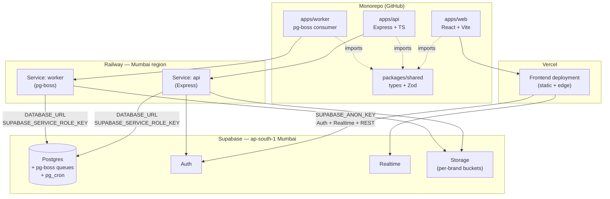

# F&B ERP — Architecture Reference

*Phase 3a deliverable — single source of truth for all architectural decisions*

Version 1.0 — 2026-05-05
Status: LIVING — amendment via DL entry

---

## Table of Contents

1. [Executive Summary & Reading Order](#1-executive-summary--reading-order)
2. [Tech Stack — Final Confirmed (with OQ resolutions)](#2-tech-stack--final-confirmed-with-oq-resolutions)
3. [Monorepo Structure & Deployment Topology](#3-monorepo-structure--deployment-topology)
4. [Multi-Tenancy Implementation](#4-multi-tenancy-implementation)
5. [Database & Schema Conventions](#5-database--schema-conventions)
6. [Service Layer Architecture](#6-service-layer-architecture)
7. [Audit Trail Architecture](#7-audit-trail-architecture)
8. [Concurrency & Idempotency Patterns](#8-concurrency--idempotency-patterns)
9. [Background Jobs & Scheduling](#9-background-jobs--scheduling)
10. [Real-Time Subscriptions](#10-real-time-subscriptions)
11. [Notification Center](#11-notification-center)
12. [Caching Strategy](#12-caching-strategy)
13. [File Storage](#13-file-storage)
14. [Search Strategy](#14-search-strategy)
15. [PDF Generation](#15-pdf-generation)
16. [Resilience & Offline](#16-resilience--offline)
17. [REST API Conventions](#17-rest-api-conventions)
18. [UI Design Tool Workflow](#18-ui-design-tool-workflow)
19. [Mockups vs Production Code Relationship](#19-mockups-vs-production-code-relationship)
20. [CI/CD Quality Gates](#20-cicd-quality-gates)
21. [Cross-Reference Index](#21-cross-reference-index)

Anchors for §2–§21 are forward-declared; sections land in subsequent Phase 3a build-plan tasks.

---

## 1. Executive Summary & Reading Order

### Mission

This document is the canonical architecture reference for the F&B ERP system. It captures every architectural decision made during Phase 3a (resolving Master Spec §11 OQ1–OQ8 + OQ11–OQ17, formally recording OQ9, and producing the OQ10 column-mapping deliverable) together with cross-cutting conventions that span every Phase 4 epic. Per Master Spec §11, these architectural decisions "must be resolved before any epic implementation begins" — this document is where that resolution is written down so it survives session resets and binds every subsequent contributor (human or AI agent) to the same architectural choices.

This is a reference document, not a tutorial. Sections are designed to be read partially, on demand, by an engineer or AI agent picking up a Phase 4 epic. Use the reading order below to orient before diving into the section relevant to the current task.

### Reading order

When picking up a Phase 4 epic for the first time, read in this sequence:

1. **Master Spec §1–§4** (`_planning/02-master-spec.md`) — domain model, closed architectural decisions, MVP scope. Establishes vocabulary and non-negotiables.
2. **This document §1–§4** (each section lands in subsequent Phase 3a build-plan tasks; today only §1 is authored) — orientation: how the doc is structured, the final tech stack with OQ resolutions, monorepo and deployment topology, the multi-tenancy implementation pattern that every service touches.
3. **Relevant epic-specific sections in this document** — depending on the epic, this typically means §5 (schema conventions), §6 (service layer), §7 (audit), §8 (concurrency), and whichever of §9–§16 the epic activates (e.g., notifications for Epic 3, PDF for Epic 6 dispatch).
4. **Relevant FRs in the PRD** (`_planning/03-prd.md`) — functional requirements numbered FR1–FR119; the epic's stories cite these directly.
5. **Screen inventory entries** (`_planning/05-screen-inventory.md`) — the canonical UI inventory; for each in-epic screen pull the row's 12 schema fields (purpose, data displayed, user actions, device class, tier, etc.).

Skim Master Spec §5 (Epic Implementation Sequence) to confirm epic ordering and gating rules. Defer DESIGN.md, decision log, and codebase inventory to point-of-need lookups.

### How this doc relates to other reference files

| File | Role |
|---|---|
| `CLAUDE.md` | Session-bootstrap instructions and critical rules; loaded automatically at session start. |
| `_planning/02-master-spec.md` | Single source of truth for scope, closed architectural decisions, domain model, and §11 OQ list. This document defers to it on anything closed in §3. |
| `_planning/03-prd.md` | Functional requirements (FR1–FR119); Phase 4 stories cite FRs directly. |
| `_planning/05-screen-inventory.md` | Canonical UI inventory: 112 screens × 12 schema fields each. |
| `_planning/06-phase-roadmap.md` | Canonical phase sequence and gating rules; defines what Phase 3a closes and what gates Phase 4. |
| `DESIGN.md` (project root) | Design tokens, components, visual system; consumed mechanically by mockups (Phase 2c-scoped) and production frontend (Phase 4). |
| `decision-log.md` | Append-only micro-decision log (DL-NNN entries); architectural-decision provenance for amendments to this document. |
| `codebase-inventory.md` (post-Epic-1) | Map of project structure once Epic 1 lands; not yet present, will be created after Phase 4 Epic 1. |

### Decision-log binding

This document is bound to the following decision-log entries. Every architectural commitment in §2–§21 traces back to one of these DLs; amendments require a new DL entry per the next subsection.

| DL | Title | One-line summary |
|---|---|---|
| DL-001 | Production Order canonical 5-status lifecycle | The Production Order lifecycle is canonical at five statuses: `Draft → Pending GR (no deduction) → Confirmed (no deduction yet — order is confirmed but not started) → In Progress (deduction fires via inventoryService.deductStock()) → Completed`. Material deduction fires exactly at the In Progress transition — never earlier (Pending GR or Confirmed do not deduct) and never later. The Kitchen Manager explicitly starts the production order, which moves it to In Progress and triggers the deduction. |
| DL-004 | OQ9 UI design tool resolution: in-repo Vite + shadcn (formal capture) | Master Spec §11 OQ9 (UI design tool selection — Stitch / Claude Imagine / hybrid) RESOLVED. Chosen path: in-repo Vite + React + Tailwind + shadcn/ui in this Claude Code workspace. NOT Google Stitch, NOT claude.ai Artifacts, NOT a hybrid of the two. Original §11 OQ9 options list (Stitch / Imagine / hybrid) is superseded — the chosen path was not on that list. |
| DL-005 | Mockups-vs-production-code seed relationship | `mockups/` (Phase 2c-scoped Vite + React + Tailwind + shadcn harness) is **visual specification, not production code seed**. Phase 4 epic implementation builds production code in `apps/web` + `apps/api` per Master Spec §3.2 monorepo structure, consuming `mockups/` as visual reference + reusing the 21 shell components (CC-* patterns) by copy-port (NOT by import dependency). The two trees stay separate. |
| DL-006 | OQ1 Monorepo tooling: Turborepo on pnpm workspaces | Master Spec §11 OQ1 (Monorepo tooling — Turborepo vs Nx vs pnpm workspaces) RESOLVED. Chosen: **Turborepo orchestrator on top of pnpm workspaces.** Package manager is pnpm; pnpm workspaces define the monorepo shape (`apps/web`, `apps/api`, `packages/shared`); Turborepo runs the task graph (`build`, `lint`, `typecheck`, `test`, `dev`) with local caching from day one. Remote caching deferred — enable only if GitHub Actions CI minutes become painful in Phase 4. |
| DL-007 | OQ2 Backend deployment target: Railway (Mumbai region) | Master Spec §11 OQ2 (Backend deployment target — Railway vs Render vs Fly.io) RESOLVED. Chosen: **Railway, deployed to the Railway-Mumbai region.** Express.js API process (Master Spec §3.1 FINAL) runs as a Railway service connected to the GitHub `apps/api` workspace via Turborepo (DL-006). PR preview environments enabled from day one. Hobby plan to start; usage-based billing scales with load. |
| DL-008 | OQ8 Caching layer: no Redis in MVP; TanStack Query + Postgres only; recipe-cost-snapshot carve-out | Master Spec §11 OQ8 (Caching layer — Redis additionally for hot paths?) RESOLVED. Chosen: **No additional server-side caching layer in MVP.** TanStack Query (FINAL §3.1) handles client-side server-state caching; Postgres + indexed `brand_id`-scoped reads handle the server-side read path. **One carve-out:** recipe cost roll-up (Master Spec §2.5 yield cascade — recursive across raw → semi → final products) is materialized as a Postgres `recipe_cost_snapshot` table, refreshed on yield-factor or ingredient-price write. This is database-resident memoization (one source of truth in Postgres), not a new caching layer. |
| DL-009 | OQ7 Background job engine: pg-boss + pg_cron | Master Spec §11 OQ7 (Background job engine — BullMQ vs Inngest vs pg_cron) RESOLVED. Chosen: **pg-boss** (Postgres-backed Node job queue) as the **primary application-level job engine** (notifications, accountant exports, recipe cost recompute, POS sales import, approval escalation, variance calculation, PDF rendering). **pg_cron** (Supabase Postgres extension) as the **complement for DB-only scheduled tasks** (materialized view safety-net refresh, audit log retention sweeps). No Redis. No Inngest in MVP. |
| DL-010 | OQ3 Real-time strategy: triaged subscription list (5 channels) | Master Spec §11 OQ3 (Real-time strategy — event-triage for Supabase Realtime FINAL §3.1) RESOLVED. **Five Realtime subscription channels in MVP** (all others use polling or on-demand refresh): `approval_requests` (filtered to approver), `notifications` (filtered to user), `production_orders` (filtered to user's locations), `dispatch_challans` (filtered to source dept or destination POS), `issue_tracker_threads` (filtered to user's threads). Polling (TanStack Query `refetchInterval`) covers POS sales sync, integration dashboard, and job queue depth. On-demand refresh covers all dashboards / reports / inventory views / master data. Optimistic UI covers low-contention writes and approval actions. |
| DL-011 | OQ16 Notification Center transport + dispatch model | Master Spec §11 OQ16 (Notification Center transport + dispatch — channels, email provider, dispatch model per FR19) RESOLVED. In-app channel writes to `notifications` table → Supabase Realtime channel #2 from DL-010 pushes to UI. Email channel uses **Resend** (React Email templates), enqueued via **pg-boss** (DL-009) — never synchronous. SMS / WhatsApp / mobile push deferred post-MVP. Dispatch model is data-driven via `notification_type_config` table with three shapes: in-app only, in-app + immediate email, in-app + batched daily digest email (digest aggregated via pg_cron). |
| DL-012 | OQ11 Multi-tenant query pattern: brandedDb factory | Master Spec §11 OQ11 (Multi-tenant query pattern enforcement — Express middleware vs Drizzle wrapper vs `withBrand` builder) RESOLVED. Chosen: **`brandedDb(brandId)` Drizzle factory.** Express middleware extracts `brand_id` from the Supabase JWT, constructs a per-request `brandedDb` instance wrapping Drizzle's query builder, and attaches as `req.db`. The wrapped builder automatically AND's `brand_id = $brandId` into every SELECT / UPDATE / DELETE on org-scoped tables and auto-injects `brand_id` into INSERTs. There is no escape hatch in normal service code; bypass requires explicit use of the underlying unscoped Drizzle client (reserved for migrations / housekeeping / pg-boss worker init). |
| DL-013 | OQ12 Audit trail: application-layer primary, trigger backstop on critical tables | Master Spec §11 OQ12 (Audit trail mechanism — triggers vs application-layer) RESOLVED. Chosen: **application-layer primary via `auditLog.record(...)` called from service methods**, with **Postgres trigger backstop on a critical-table set** (`users`, `enablement_matrix`, `recipes`, `chart_of_accounts`). Application-layer call is inside the same transaction as the mutation (atomic). Triggers on the four critical tables write `audit_log` rows on INSERT/UPDATE/DELETE with `actor_user_id` from `current_setting('app.user_id', true)` set by `brandedDb` middleware. When both layers fire, prefer the application-layer row (richer business context). |
| DL-014 | OQ14 RLS policy authoring: per-epic from canonical template, with CI lint | Master Spec §11 OQ14 (RLS policy authoring strategy — when, by whom, from what template) RESOLVED. Chosen: **per-epic authoring**, every `CREATE TABLE` migration emits RLS policies from the **canonical 2-policy template** authored in Phase 3a. **CI lint flags any new table without accompanying RLS policies in the same migration.** Template enables RLS, adds a `<table>_brand_isolation` policy that scopes all operations to the user's brand, and adds a `<table>_service_role_bypass` policy so Express (using the service_role key) is unrestricted. System tables get only the service_role bypass. |
| DL-015 | OQ15 brand_id index migration template: brandScopedTable Drizzle helper | Master Spec §11 OQ15 (canonical migration template / Drizzle helper for `brand_id` index per §3.2) RESOLVED. Chosen: **`brandScopedTable(name, columns)` Drizzle helper** that consolidates DL-012 + DL-013 + DL-014 + DL-015 into a single declaration. Per call, the helper adds `brand_id uuid not null` with a RESTRICT-on-delete FK to `brands.id`, adds the `idx_<table>_brand_id` index (or composite when explicit), emits the canonical 2-policy RLS template (DL-014), tags the table for `brandedDb` recognition (DL-012), and wires audit-trigger generation (DL-013) for the four critical tables via opt-in flag. |
| DL-016 | OQ17 Concurrency / idempotency: per-mechanism resolution | Master Spec §11 OQ17 (Concurrency / idempotency for deductStock + IRN paste + PO approval) RESOLVED with three mechanism-specific patterns. (1) `inventoryService.deductStock`: **Postgres `SELECT ... FOR UPDATE` row lock on the affected stock-batch rows, inside a single transaction** (FEFO selection, deduction, and journal entry all atomic; no advisory locks). (2) IRN paste: **unique constraint on `(brand_id, irn)`** with ON CONFLICT — IRN itself is the natural idempotency key. (3) PO approval: **status-guarded UPDATE** — `WHERE status = 'pending' AND brand_id = $brand`; double-click affects 0 rows and surfaces "Already approved by X at HH:MM". Pattern (3) generalizes to all state-machine transitions. |
| DL-017 | OQ13 File storage layout: per-brand bucket, signed-URL via Express | Master Spec §11 OQ13 (File storage layout — per-brand vs per-entity bucket; signed-URL vs direct upload) RESOLVED. Chosen: **per-brand Supabase Storage bucket with `${entityType}/${entityId}/${filename}` path structure, accessed via Express-issued signed URLs.** One bucket per brand (`brand-${brand_slug}`). Browser POSTs upload-intent to Express → Express validates size, MIME, entity-attribution authorization, content-type → Express generates a short-TTL (5 min) signed PUT URL → browser PUTs directly to Supabase Storage. Reads use short-TTL (5 min) signed GET URLs generated on demand. No client-side Supabase JS for storage operations; all access mediated by Express to enforce authorization + audit trail. |
| DL-018 | OQ6 Full-text search: Postgres tsvector + pg_trgm | Master Spec §11 OQ6 (Full-text search strategy — tsvector vs Meilisearch / Typesense) RESOLVED. Chosen: **Postgres `tsvector` (GIN-indexed) + `pg_trgm` (fuzzy / trigram matching).** No dedicated search service in MVP. Each searchable table gets a generated `search_vector tsvector` column populated via trigger (or generated column in PG12+) from the relevant text fields, with a GIN index. `pg_trgm` provides similarity matching for typo tolerance, used as a fallback when tsvector returns no results or as a UNION for combined ranking. Reconsider triggers post-MVP if latency exceeds 100ms or real faceted search is needed. |
| DL-019 | OQ5 PDF generation: @react-pdf/renderer on pg-boss worker | Master Spec §11 OQ5 (PDF generation library — react-pdf vs puppeteer vs @react-pdf/renderer) RESOLVED. Chosen: **`@react-pdf/renderer` (server-side), executed on the pg-boss worker process** (DL-009). Output written to per-brand Supabase Storage bucket (DL-017); API returns signed download URL once PDF lands. Used for B2B + dispatch challans, invoices, POs, GR slips, production order printouts, and financial report PDF exports. Charts in financial reports render server-side as SVG and embed via @react-pdf/renderer's SVG primitive; for chart-heavy reports, Excel is the primary path and PDF is the secondary "snapshot" path. |
| DL-020 | OQ4 Offline capability: deferred post-MVP; MVP resilience via TanStack retry + LocalStorage drafts | Master Spec §11 OQ4 (Offline capability depth — core for MVP or deferred; if core, which workflows) RESOLVED. Chosen: **Defer offline-first capability to post-MVP. No PWA / service worker / IndexedDB / sync engine in MVP.** MVP resilience covered by two lighter mechanisms: (1) TanStack Query automatic mutation retry on transient network failure with exponential backoff and jitter; (2) LocalStorage form-draft auto-save every 5 seconds on long-form screens (Goods Receipt entry, Recipe authoring, Production Order creation, B2B challan creation), restored on next visit with a confirmation prompt. Reconsider trigger is production telemetry showing a meaningful `network_offline_during_submit` event count. |

DL-002 (Tailwind v4 amendment) and DL-003 (Phase 3a re-sequencing) exist in the decision log but are governance / sequencing decisions rather than architectural commitments and are therefore not part of the binding list above. They remain authoritative for their respective domains.

### How to amend this doc

Amendments are not silent edits. To change any commitment in this document:

1. Open a new DL entry in `decision-log.md` (next available DL-NNN) following the format at the top of that file. Capture **Decision**, **Source**, **Why this matters**, and **Cross-references**.
2. In the **same commit**, update the affected section(s) of this document and append the new DL number to the binding list in §1.
3. The commit message must reference the DL number ("DL-NNN amends architecture.md §X — …").

The binding table above must include every architectural-domain DL entry. When adding a new architectural DL (one whose `Cross-references` cite this document or that resolves a Master Spec §11 OQ), update the binding table in the same commit. Governance/sequencing DLs (e.g., DL-002, DL-003) that do not introduce architectural commitments are intentionally excluded.

Never edit this document without an accompanying DL entry. The decision-log binding above is the audit trail; if a section says one thing and no DL backs it, that is an error and must be reconciled before further work proceeds. This rule mirrors the Master Spec §3 governance clause prohibiting silent overrides.

---

## 2. Tech Stack — Final Confirmed (with OQ resolutions)

This section reproduces Master Spec §3.1 verbatim and folds in the architectural OQ resolutions captured in `decision-log.md` (DL-006 through DL-020 minus governance entries). Where Master Spec §3.1 carried a `⚠ TBD` row, the resolved entry replaces it; where the OQ resolution introduces a new concern not yet in §3.1 (background jobs, email transport, search extension, PDF library, monorepo orchestrator), a new row is added. The `Decision` column either preserves the Master Spec wording or cites the resolving DL.

### 2.1 Frontend

| Technology | Version | Purpose | Decision |
|---|---|---|---|
| React | 18+ | UI framework | ✅ FINAL |
| TypeScript | 5.x strict mode | Type safety end-to-end | ✅ FINAL — no `any` types |
| Tailwind CSS | 4.x | Utility-first styling | ✅ FINAL — superseded 3.x at Phase 2c-prep, see DL-002 |
| shadcn/ui + Radix | Latest | Component library | ✅ FINAL |
| Inter | — | Font family | ✅ FINAL |
| TanStack Table | Latest | Data grids | ✅ FINAL |
| TanStack Query | Latest | Server state / caching | ✅ FINAL |
| React Hook Form + Zod | Latest | Forms + validation | ✅ FINAL |
| Zustand | Latest | Client state | ✅ FINAL |
| Recharts | Latest | Charts / visualisation | ✅ FINAL |

### 2.2 Backend

| Technology | Version | Purpose | Decision |
|---|---|---|---|
| Node.js | 20+ | Runtime | ✅ FINAL |
| Express.js | Latest | API server + business logic | ✅ FINAL |
| TypeScript | 5.x | End-to-end type safety | ✅ FINAL |
| Supabase | Hosted | PostgreSQL + Auth + Realtime + Storage | ✅ FINAL |
| Supabase Auth | — | Email/password (SSO post-MVP) | ✅ FINAL |
| Supabase RLS | — | Defence-in-depth (see §3.2) | ✅ FINAL |
| Supabase Realtime | — | WebSocket subscriptions | ✅ FINAL |
| Drizzle ORM | Latest | Type-safe DB access | ✅ FINAL — chosen over Prisma |
| pg-boss | Latest | Postgres-backed job queue | ✅ FINAL — DL-009 |
| Background jobs | pg-boss + pg_cron | Application-level job engine + DB-only scheduled tasks | ✅ FINAL — DL-009 |

### 2.3 Infrastructure

| Technology | Version | Purpose | Decision |
|---|---|---|---|
| Vercel | — | Frontend deployment | ✅ FINAL |
| Railway (Mumbai region) | — | Backend deployment | ✅ FINAL — DL-007 |
| GitHub | — | Version control | ✅ FINAL |
| GitHub Actions | — | CI/CD | ✅ FINAL |
| Sentry | — | Error tracking | ✅ FINAL |
| Resend | — | Email transport (React Email templates, enqueued via pg-boss) | ✅ FINAL — DL-011 |
| tsvector + pg_trgm (Postgres) | — | Full-text + fuzzy search extensions | ✅ FINAL — DL-018 |
| @react-pdf/renderer | Latest | PDF generation (server-side, on pg-boss worker) | ✅ FINAL — DL-019 |
| Turborepo on pnpm workspaces | Latest | Monorepo orchestrator + package manager | ✅ FINAL — DL-006 |

### 2.4 What is intentionally NOT in this stack

The OQ resolutions also crystallised explicit rejections. These are not "later" or "maybe" — they are out of scope for MVP, and adding any of them requires a new DL entry per the §1 amendment rule.

- **Redis (no server-side cache layer)** — DL-008. TanStack Query handles client-side server-state caching; indexed `brand_id`-scoped Postgres reads handle the server-side path. Recipe cost roll-up is materialised as a Postgres `recipe_cost_snapshot` table (database-resident memoisation), not a separate cache.
- **BullMQ (no Redis-backed job queue)** — DL-009. pg-boss provides transactional job creation in the same Postgres transaction as the business state change; BullMQ would resurrect the Redis decision rejected in DL-008 and break that exactly-once property.
- **Inngest (no third-party orchestration runtime)** — DL-009. Step-function DX is excellent but introduces vendor lock-in on orchestration runtime, US hop latency for control plane, and step-function complexity is overkill for current MVP job shapes.
- **Meilisearch / Typesense (no dedicated search service)** — DL-018. Postgres tsvector + pg_trgm covers the bounded ERP search surface (items, vendors, recipes, customers, transactions) at MVP scale without added infrastructure.
- **Puppeteer (no headless-Chrome PDF rendering)** — DL-019. Puppeteer ships ~100MB of Chrome binary, bloats the Railway worker image, slows cold starts, and introduces rendering nondeterminism. @react-pdf/renderer is a pure-Node (~5MB) component-based PDF library.
- **PWA / service worker / IndexedDB / sync engine (no offline-first capability)** — DL-020. Offline-first is deferred post-MVP. MVP resilience is covered by TanStack Query mutation retry with exponential backoff and LocalStorage form-draft auto-save on long-form screens.

### 2.5 Reconsider triggers

Each rejection above carries a post-MVP reconsider trigger drawn verbatim from the resolving DL. These are the empirical conditions that would re-open the decision; until one fires, the rejection stands.

| Technology | Reconsider trigger | DL |
|---|---|---|
| Redis | P95 API latency >300ms attributable to recurring read patterns | DL-008 |
| BullMQ | Sustained job throughput >100/sec | DL-009 |
| Inngest | Need durable multi-step workflows with branching / retry-per-step / time-traveling state | DL-009 |
| Meilisearch | Search latency on indexed Postgres exceeds 100ms at observed load; or need real faceted search at scale where Postgres facet aggregation becomes expensive | DL-018 |
| PWA | Production telemetry on `network_offline_during_submit` event count showing outage events cause real lost work at observed frequency | DL-020 |

When a trigger fires, the response is a new DL entry plus a same-commit amendment to this section per the §1 rule — not a silent reintroduction of the rejected technology.

---

## 3. Monorepo Structure & Deployment Topology

This section defines the physical shape of the codebase (one git repo, pnpm workspaces, Turborepo task graph) and the deployment topology (Vercel + Railway + Supabase, all India-region for the latency rationale in DL-007). It exists to make the Phase 4 Epic 1 bootstrap unambiguous: there is one correct way to lay the project out and one correct way to wire the deploy targets.

Source decisions: DL-006 (Turborepo on pnpm workspaces), DL-007 (Railway-Mumbai backend + implicit Supabase ap-south-1 commitment), DL-009 (pg-boss worker as separate Railway service). Master Spec §3.1 (Vercel FINAL frontend, Supabase FINAL DB, Express FINAL API, Node 20 FINAL) and §3.2 (`Monorepo. Shared TypeScript types in packages/shared. Frontend in apps/web, backend in apps/api.`) define the FINAL constraints this section operationalizes.

### 3.1 Monorepo layout

The repository is a single pnpm workspace with three deployable applications, one shared package, and a separate (non-deployable) mockup harness. Per DL-009, the pg-boss worker is its own application — sibling to `apps/api`, NOT a sub-process of it — because it deploys as a distinct Railway service.

```
/
  apps/
    web/         (React + Vite + TS frontend, deploys to Vercel)
    api/         (Express + TS backend, deploys to Railway as service "api")
    worker/      (pg-boss worker process, deploys to Railway as service "worker")
  packages/
    shared/      (TS types + Zod schemas + shared business constants)
  mockups/       (Phase 2c-scoped Vite harness — visual specification, NOT production code per DL-005)
  _planning/
  docs/
  DESIGN.md
  CLAUDE.md
  decision-log.md
  turbo.json
  pnpm-workspace.yaml
  package.json
```

Notes on each location:

- **`apps/web`** — React + Vite + TypeScript. Consumes types and Zod schemas from `packages/shared`. Build output deploys to Vercel.
- **`apps/api`** — Express + TypeScript. Produces pg-boss jobs; never executes them in the request path (DL-009). Imports the same `packages/shared` for request/response schema validation that the frontend uses.
- **`apps/worker`** — Node + TypeScript long-running process. Subscribes to pg-boss queues and runs job handlers (notification dispatch, PDF rendering, accountant exports, recipe cost recompute, POS sales import, approval escalation, variance calculation per DL-009). Shares the same `DATABASE_URL` and `SUPABASE_*` env vars as `apps/api` because pg-boss is a Postgres-backed queue (DL-009) and storage writes target the same Supabase project.
- **`packages/shared`** — TypeScript-only. Domain types (`Brand`, `Outlet`, `Material`, `Recipe`, etc.), Zod schemas mirroring those types for runtime validation at API boundaries, and shared business constants (status enums, role identifiers, OQ-resolved enumerations). Built first in the Turbo task graph; every other workspace depends on it.
- **`mockups/`** — The Phase 2c-scoped 15 mockup foundation. Vite + React harness with shadcn-vite components (DL-004). NOT a production deployable; treated by Turborepo as a workspace for `lint` / `typecheck` / `dev` purposes only. Per DL-005, mockups are visual specification artefacts, not production code.

### 3.2 Turborepo task graph

Turborepo (DL-006) orchestrates per-package tasks across the workspace. Six pipeline tasks cover the lifecycle:

| Task | Inputs | Outputs | Depends on | Cache |
|---|---|---|---|---|
| `dev` | source files | live dev server (no artefact) | — | NO (`cache: false`, `persistent: true`) |
| `build` | source files | `dist/**`, `.vercel/**` | `^build` (build dependencies first) | yes |
| `lint` | source files | none (pass/fail signal) | — | yes |
| `typecheck` | source files, types from deps | none (pass/fail signal) | `^build` (need built `packages/shared` `.d.ts`) | yes |
| `test` | source files, build output | test report | `build` (own package built first) | yes |
| `test:integration` | source, build, env (`DATABASE_URL`, `SUPABASE_URL`, `SUPABASE_SERVICE_ROLE_KEY`) | test report | `build` (own package) | yes (env-aware) |

The `^build` semantics matter: when `apps/api` is built, Turbo first builds `packages/shared` (its dependency), so type declarations are present. `typecheck` follows the same rule for the same reason — `apps/api`'s `tsc --noEmit` needs `packages/shared/dist/**.d.ts` resolved on disk.

`turbo.json` skeleton (Turborepo v2 syntax — `tasks:` not `pipeline:`):

```json
{
  "$schema": "https://turbo.build/schema.json",
  "tasks": {
    "build": {
      "dependsOn": ["^build"],
      "outputs": ["dist/**", ".vercel/**"]
    },
    "dev": {
      "cache": false,
      "persistent": true
    },
    "lint": {},
    "typecheck": {
      "dependsOn": ["^build"]
    },
    "test": {
      "dependsOn": ["build"]
    },
    "test:integration": {
      "dependsOn": ["build"],
      "env": ["DATABASE_URL", "SUPABASE_URL", "SUPABASE_SERVICE_ROLE_KEY"]
    }
  }
}
```

Local caching is on by default. Remote caching is **deferred** (see §3.6).

### 3.3 pnpm workspace setup

`pnpm-workspace.yaml` declares the three workspace globs:

```yaml
packages:
  - apps/*
  - packages/*
  - mockups
```

`apps/*` matches `apps/web`, `apps/api`, `apps/worker`. `packages/*` matches `packages/shared`. `mockups` is listed explicitly (singular path, not a glob) — it is one workspace, not a directory containing many.

### 3.4 Deployment topology

Three deploy targets, all in / connecting to the Mumbai region (DL-007). Vercel hosts the frontend; Railway runs two distinct services (the Express API and the pg-boss worker, per DL-009); Supabase is the shared backend (Postgres + Auth + Realtime + Storage per Master Spec §3.1).



Key arrows:

- **`apps/web` → Vercel → Supabase Auth/Realtime.** Frontend authenticates users directly against Supabase Auth and subscribes to the triaged Realtime channel set (DL-010).
- **`apps/api` → Railway "api" service → Supabase Postgres + Storage + Auth.** API process is the primary writer to Postgres, the producer of pg-boss jobs, and the issuer of signed Storage URLs.
- **`apps/worker` → Railway "worker" service → Supabase Postgres + Storage.** Worker subscribes to pg-boss queues (which live in Postgres per DL-009), executes handlers, writes outputs (e.g., generated PDFs to Storage). Worker does NOT terminate user-facing HTTP requests.
- All three Railway/Vercel deploy targets connect to **the same Supabase project** in `ap-south-1`. Co-location is the entire latency thesis of DL-007 — breaking it (e.g., provisioning Supabase in `us-east-1`) silently destroys the rationale.

### 3.5 Bootstrap obligations for Phase 4 Epic 1

The Phase 3a architecture build plan surfaces these as explicit setup tasks so they aren't deferred to "later" and forgotten. All five must complete before the first Epic 1 story can land:

- [ ] **Create the Supabase project in `ap-south-1` (Mumbai) region.** This is non-default — Supabase's project-creation UI offers `us-east-1` as a common default. Selecting the wrong region here invalidates DL-007's co-location latency rationale and is non-trivial to migrate post-bootstrap. Verify region in the Supabase project settings page before proceeding.
- [ ] **Create the Vercel project linked to `apps/web`.** Configure the build command and output directory to use Turborepo (`turbo build --filter=web`); root directory points at the monorepo root, not `apps/web/`, so Turbo's task graph resolves correctly.
- [ ] **Create the Railway service "api" in the Mumbai region linked to `apps/api`.** Build/start commands invoke Turborepo (`turbo build --filter=api`, then `node apps/api/dist/server.js` or equivalent). PR preview environments enabled per DL-007.
- [ ] **Create the Railway service "worker" in the Mumbai region linked to `apps/worker`.** Same monorepo, separate service (DL-009). Build/start commands invoke Turborepo (`turbo build --filter=worker`, then start the pg-boss consumer entrypoint). No public HTTP port exposed; this process consumes queues, it does not serve traffic.
- [ ] **Wire environment variables across the three deploy targets:**
  - `apps/web` (Vercel): `SUPABASE_URL`, `SUPABASE_ANON_KEY`.
  - `apps/api` (Railway "api"): `SUPABASE_URL`, `SUPABASE_SERVICE_ROLE_KEY`, `DATABASE_URL` (direct Postgres connection string for Drizzle + pg-boss producer side).
  - `apps/worker` (Railway "worker"): `SUPABASE_URL`, `SUPABASE_SERVICE_ROLE_KEY`, `DATABASE_URL` (same connection string — pg-boss consumer side), `RESEND_API_KEY` (email channel per DL-011 lives on the worker because email send is enqueued and dispatched out-of-band, never synchronous).

The `RESEND_API_KEY` placement on the worker (not the api service) is deliberate: per DL-011, all email sends route through pg-boss to avoid synchronous third-party calls in API request paths.

### 3.6 Remote cache enablement criterion

Turborepo Remote Cache is **disabled at bootstrap** and remains so until a measurable cost trigger fires (DL-006 default). The trigger is **GitHub Actions CI minutes becoming a measurable cost** — concretely, when monthly CI minutes consumed by the project approach the GitHub free-tier ceiling for the account, or when CI wall-clock time on a typical PR exceeds ~10 minutes and is dominated by re-running already-cached work across runners.

Until then, local caching alone (which is on by default with zero configuration) covers the solo-developer iteration loop. Enabling Remote Cache prematurely adds a Vercel account dependency and a token-management surface for no measurable gain at the current project shape (one developer, one CI runner per PR, no concurrent contributors competing for cache hits).

When the trigger fires: enable Vercel Remote Cache, store the token as a GitHub Actions secret, and add a same-commit DL entry recording the trigger that fired and the date — same discipline as the §2 reconsider-trigger table.

---

## 4. Multi-Tenancy Implementation

Master Spec §1.2 commits the system to "single-tenant now, multi-tenant ready" — every org-scoped table carries `brand_id` from day one, and the `brand_id` filter on every query is a non-negotiable rule per Master Spec §3.2 and §7.2 ("a missing `brand_id` filter is a security vulnerability"). This section specifies how that rule is enforced mechanically rather than by memory.

### 4.1 Three-layer enforcement model

Master Spec §3.2 frames multi-tenant isolation as defence-in-depth: the application layer is primary enforcement; RLS is the database backstop. This architecture realises that frame as three concrete layers, each anchored to a decision-log entry.

| Layer | Role | Mechanism | Decision |
|---|---|---|---|
| **Layer 1 — Application primary** | Mechanically scopes every query through the query builder so service code physically cannot omit the `brand_id` filter. | `brandedDb(brandId)` Drizzle factory wraps SELECT / UPDATE / DELETE / INSERT against org-scoped tables. | DL-012 |
| **Layer 2 — Database backstop** | Protects against direct DB access (Supabase Studio admin session, ad-hoc psql, debug query) when the application layer is bypassed. | Postgres Row Level Security policies — canonical 2-policy template per org-scoped table. | DL-014 |
| **Layer 3 — Declaration** | Single declaration that emits the `brand_id` column, the `brand_id` index, the RLS policy pair, and the marker the wrapper consumes — all in one call. | `brandScopedTable(name, columns)` Drizzle helper. | DL-015 |

**Why three layers, not two.** Master Spec §3.2 says explicitly: "RLS = Defence-in-depth, not primary enforcement. Express IS primary enforcement." Layer 1 honours that primacy — it is what fires on every real request. Layer 2 fires only when Layer 1 is bypassed (direct DB access). Layer 3 exists because Layer 1 and Layer 2 must stay in lockstep at the table level — adding an org-scoped table without RLS, or without the wrapper marker, recreates exactly the per-table-memory failure mode that Layer 1 was designed to eliminate. The helper makes the lockstep mechanical: one helper call, both layers wired.

### 4.2 `brandedDb` factory specification

Per DL-012, `brandedDb` is the application-layer primary enforcement boundary.

**API.** `const db = brandedDb(brandId)` returns an interface with the same shape as a Drizzle client (`db.select(...)`, `db.insert(...)`, `db.update(...)`, `db.delete(...)`).

**Behaviour on org-scoped tables** (tables declared with `brandScopedTable`, see §4.4):

- `SELECT` — auto-AND's `brand_id = $brandId` into the WHERE clause. No service code path can read a row from a different brand.
- `UPDATE` and `DELETE` — auto-AND's `brand_id = $brandId` into the WHERE clause. No service code path can mutate a row from a different brand.
- `INSERT` — auto-injects `brand_id = $brandId` into the row payload. Service code does not pass `brand_id` explicitly; passing one is rejected (the wrapper owns that field).

**Behaviour on system tables** (tables declared with plain Drizzle `pgTable` — `migrations`, `pgboss.*`, system-level audit views, the `brands` table itself): unchanged Drizzle. The wrapper recognises org-scoped tables by the `brandScopedTable` marker (§4.4) and short-circuits to the underlying Drizzle client for everything else.

**Express middleware wiring.** A single piece of middleware mounted before all route handlers:

1. Reads the Supabase JWT from the request (per §2 / Master Spec §3.2 — Express verifies the JWT via the Supabase service-role key).
2. Extracts `brand_id` from `auth.jwt().user_metadata.brand_id`.
3. Constructs `req.db = brandedDb(brand_id)` so downstream service-method calls receive the scoped client via dependency injection.
4. Sets the Postgres session variable `app.user_id = <jwt.sub>` on the underlying connection. This variable is consumed by the audit-trigger backstop on the four critical tables (§7 of this document; DL-013).

**Service-method signature pattern.** Every service method takes the scoped DB as its first argument:

```typescript
async function approvePurchaseOrder(
  db: BrandedDb,
  poId: string,
  approverId: string,
  reason: string,
): Promise<PurchaseOrder> {
  // db is brand-scoped; queries below cannot leak across tenants
  ...
}
```

The route handler passes `req.db` through. There is no thread-local, no implicit context — the scoped client is a value, threaded explicitly. This pattern makes service methods trivially testable (pass an in-memory `brandedDb` against a test brand) and removes any chance of "forgot to pull `brandId` from context" bugs.

**Bypass mechanism.** Migrations, the pg-boss worker initialisation path, and a small set of housekeeping scripts need to operate across all brands or before any brand context exists. They import `unscopedDb()` explicitly — a separately-named symbol that returns the underlying Drizzle client without the scoping wrapper. The naming is deliberate: any code review or grep for `unscopedDb` immediately surfaces a bypass site for inspection. Normal service code never imports it.

### 4.3 RLS canonical 2-policy template

Per DL-014, every `CREATE TABLE` migration emits RLS policies from this canonical template — authored Phase 3a, applied per-epic, enforced by CI lint (§20 of this document).

**For org-scoped tables:**

```sql
ALTER TABLE <table> ENABLE ROW LEVEL SECURITY;

-- Policy 1: brand isolation (defence-in-depth for direct DB access)
CREATE POLICY <table>_brand_isolation ON <table>
  FOR ALL
  USING (brand_id = (
    SELECT brand_id FROM users WHERE id = auth.uid()
  ));

-- Policy 2: service_role bypass (Express uses this key per Master Spec §3.2)
CREATE POLICY <table>_service_role_bypass ON <table>
  FOR ALL TO service_role
  USING (true);
```

Policy 1 is the actual defence-in-depth — it fires when a non-service-role principal (e.g., a developer connecting via Supabase Studio with a user JWT) hits the table directly. Policy 2 is the Express bypass — Express connects with the service-role key, so its queries are scoped by Layer 1 (`brandedDb`), not by RLS. Both policies must be present together: dropping Policy 2 breaks Express; dropping Policy 1 breaks the backstop.

**For system (non-org-scoped) tables** — `migrations`, `pgboss.*`, system-level audit views, the `brands` table itself:

```sql
ALTER TABLE <table> ENABLE ROW LEVEL SECURITY;
CREATE POLICY <table>_service_role_only ON <table>
  FOR ALL TO service_role
  USING (true);
```

Single policy: only the service role (Express) can touch these tables. There is no brand isolation to enforce because these tables are not brand-scoped; the protection is "no anonymous or user-JWT access ever."

### 4.4 `brandScopedTable` helper specification

Per DL-015, `brandScopedTable` is the single declaration that wires Layers 1, 2, and 3 together for an org-scoped table.

**Conceptual usage:**

```typescript
export const purchaseOrders = brandScopedTable('purchase_orders', {
  trn: text('trn').notNull().unique(),
  vendorId: uuid('vendor_id').notNull().references(() => vendors.id),
  status: poStatusEnum('status').notNull(),
  // brand_id, brand_id index, RLS policies all generated automatically
});
```

**What the helper guarantees per call** (verbatim from DL-015):

1. Adds `brand_id uuid not null` column with FK to `brands.id` (cascade on brand delete: RESTRICT — never silently drop tenant data).
2. Adds `idx_<table>_brand_id` B-tree index on `brand_id` (or composite with hot-path columns when explicitly declared).
3. Emits the canonical 2-policy RLS template from §4.3 / DL-014.
4. Tags the table for the `brandedDb` wrapper (§4.2 / DL-012) to recognise as org-scoped.
5. Wires audit-trigger generation (DL-013, §7 of this document) for the four critical tables (`users`, `enablement_matrix`, `recipes`, `chart_of_accounts`) via an opt-in flag.

**Composite-index option syntax.** Default emission is the single-column `brand_id` B-tree. Hot-path tables that filter by `(brand_id, location_id)` or similar declare composite indexes via an explicit options object:

```typescript
export const productionOrders = brandScopedTable('production_orders', {
  // ...columns
}, {
  indexes: { brandLocation: ['brand_id', 'location_id'] },
});
```

The helper does not guess index strategies. Composite indexes are an explicit performance decision per table (DL-015).

**Audit-trigger opt-in flag.** The four critical tables enumerated in DL-013 (`users`, `enablement_matrix`, `recipes`, `chart_of_accounts`) opt into the trigger backstop with an explicit flag:

```typescript
export const recipes = brandScopedTable('recipes', {
  // ...columns
}, {
  auditTrigger: true,
});
```

Every other org-scoped table relies on the application-layer audit pattern alone (`auditLog.record(...)` from service methods — see §7). Cross-reference DL-013.

**Opt-out for system tables.** Tables that are not brand-scoped (`migrations`, `pgboss.*`, the `brands` table itself, system-level views) use plain Drizzle `pgTable`. Choice of helper is the marker — `brandScopedTable` means org-scoped, `pgTable` means system / non-scoped. The `brandedDb` wrapper consumes this distinction.

### 4.5 Tenant theme integration with DESIGN.md §3

The `brand_id` column is also the join key for tenant visual identity. DESIGN.md §3 specifies a "tenant slot" mechanism: a small set of tokens (`tenant_display_name`, `tenant_logo_full_url`, `tenant_logo_nibble_url`, `tenant_brand_accent`, `tenant_brand_accent_soft`, `on_tenant_brand_accent`) that the frontend reads when rendering tenant-facing chrome — login screen, sidebar header, mobile top bar, B2B challan PDF header, accountant export PDF header, outbound email templates. DESIGN.md §3.1 enumerates the surfaces; DESIGN.md §3.2 gives the Wild Sugar concrete config.

**Schema bridge.** DESIGN.md §3.3 ("Adding a future tenant") describes the supply side abstractly — a new tenant supplies a logo full lockup, a logo nibble, a primary accent hex, and a display name. The bridge from that abstract description to the database is explicit: the `brands` table carries one column per DESIGN.md §3.2 token.

| DESIGN.md token | `brands` table column | Type / format |
|---|---|---|
| `tenant_display_name` | `display_name` | text |
| `tenant_logo_full_url` | `logo_full_url` | text (Supabase Storage URL) |
| `tenant_logo_nibble_url` | `logo_nibble_url` | text (Supabase Storage URL) |
| `tenant_brand_accent` | `accent_hex` | text (hex format `#RRGGBB`) |
| `tenant_brand_accent_soft` | `accent_soft_hex` | text (hex format `#RRGGBB`) |
| `on_tenant_brand_accent` | `on_accent_hex` | text (hex format `#RRGGBB`) |

**Frontend consumption.** A `useTenantTheme()` hook reads the row for the current `brand_id` (single row in single-tenant deployment; one row per tenant post-MVP) and exposes the six tokens to chrome components. The hook is the only consumer that touches the `brands` table from the browser-relevant code path; everything else queries via `brandedDb` against org-scoped tables.

**Why this matters.** DESIGN.md §3.3 leaves the supply mechanism abstract by design — it is a UI-system contract, not a data-layer contract. The schema bridge is what makes "adding a future tenant" a database insert plus two PNG uploads, with zero product code changes. DESIGN.md §3 retains its position as the single source of truth for *which* tokens exist; this section is the single source of truth for *where they live in the database* and *how the application reads them*. Cross-reference DESIGN.md §3.

### 4.6 Multi-tenant SaaS migration path (post-MVP)

Today the JWT carries one fixed `brand_id` per the single-tenant deployment model (Master Spec §1.2): there is exactly one `brands` row, every user's `user_metadata.brand_id` points at it, and `brandedDb` scopes every query to that single brand. Post-MVP, when the system serves multiple tenants, the JWT carries the tenant binding from the auth flow — the `brand_id` is per-user rather than constant. **Application code does not change.** `brandedDb`, the RLS policies, the `brandScopedTable` declarations, and `useTenantTheme()` already key on `brand_id`; the only difference is which `brand_id` value each request carries. This is the explicit guarantee Master Spec §1.2 makes when it says "single-tenant now, multi-tenant ready."

---

## 5. Database & Schema Conventions

This section codifies the schema-authoring rules every Phase 4 epic must follow. The conventions consolidate Master Spec §3.2 (Drizzle modular schema files), Master Spec §6.5 (compliance placeholder fields), Master Spec §7.2 (database rules), and the OQ resolutions that govern multi-tenant scoping (DL-012, DL-014, DL-015) and audit capture (DL-013). The goal is mechanical enforcement: an org-scoped table is one `brandScopedTable` call away from satisfying every requirement in this section, and CI lint catches what slips past the helper.

### 5.1 Schema file organization

Drizzle schema files are modular per domain — one file per epic-aligned domain — to keep IDE responsiveness usable as the schema grows (Master Spec §3.2 calls this out explicitly). Files live in `apps/api/src/db/schema/`:

```
schema/
  auth.ts            (users, roles, sessions)
  org.ts             (brands, clusters, locations, departments)
  inventory.ts       (items, batches, stock_levels, enablement_matrix)
  procurement.ts     (vendors, purchase_orders, goods_receipts)
  recipes.ts         (recipes, recipe_versions, recipe_lines)
  production.ts      (production_orders, production_outputs)
  dispatch.ts        (challans, challan_lines)
  pos.ts             (pos_locations, pos_sales, pos_imports)
  accounting.ts      (chart_of_accounts, journal_entries, journal_lines)
  hrm.ts             (employees, attendance, shifts)
  audit.ts           (audit_log)
  notifications.ts   (notifications, notification_type_config)
  approvals.ts       (approval_requests, approval_actions)
  files.ts           (file_attachments)
  reporting.ts       (report_line_config, saved_report_definitions)
  index.ts           (re-exports for the brandedDb wrapper to discover org-scoped tables)
```

**Coverage against Master Spec §5 (Epic Implementation Sequence).** Every epic that owns persistent data has at least one schema file:

| Epic | Schema file(s) |
|---|---|
| Epic 1 — Master Data Management | `org.ts`, plus item / category tables in `inventory.ts` |
| Epic 2 — User Management & Security | `auth.ts` |
| Epic 3 — Shared Infrastructure | `audit.ts`, `notifications.ts`, `approvals.ts`, `files.ts` |
| Epic 4 — Inventory Management | `inventory.ts` |
| Epic 5 — Procurement | `procurement.ts` |
| Epic 6 — Recipe Management | `recipes.ts` |
| Epic 7 — Production Planning | `production.ts` |
| Epic 8 — Dispatch & Distribution | `dispatch.ts` |
| Epic 9 — POS Integration | `pos.ts` |
| Epic 10 — Accounting & Financial | `accounting.ts` (and `reporting.ts` for §6.3 Trial Balance / P&L / Balance Sheet line config tables) |
| Epic 11 — HRMS | `hrm.ts` |
| Epic 12 — Analytics & Reporting | Read-only against existing tables; saved-report definitions live in `reporting.ts` |

The `index.ts` re-export module is what `brandedDb` (DL-012) walks at startup to enumerate org-scoped tables — every domain file's `brandScopedTable` declarations must be re-exported there or the wrapper will not scope queries against them.

### 5.2 Naming conventions

- **Table names:** plural, snake_case (`purchase_orders`, `journal_entries`, `stock_levels`).
- **Column names:** snake_case (`vendor_id`, `created_at`, `tax_rate_percent`).
- **Enum types:** end with `_enum` (`po_status_enum`, `production_status_enum`, `approval_state_enum`).
- **Foreign-key columns:** `{referenced_table_singular}_id` (`vendor_id` references `vendors.id`; `cluster_id` references `clusters.id`; `actor_user_id` references `users.id`).
- **Index names:** `idx_<table>_<column>` (`idx_purchase_orders_brand_id`, `idx_journal_entries_trn`); composite indexes append additional columns (`idx_production_orders_brand_id_location_id`).
- **Drizzle TypeScript identifiers:** camelCase mirroring the snake_case table/column (`purchaseOrders`, `vendorId`). The schema definition declares the snake_case database name explicitly via the column helper's name argument.

### 5.3 Standard columns on every table

Every table — org-scoped or system — carries:

| Column | Type | Default | Notes |
|---|---|---|---|
| `id` | `uuid` | `gen_random_uuid()` | Primary key. |
| `created_at` | `timestamptz` | `now()` | NOT NULL. Set on insert. |
| `updated_at` | `timestamptz` | `now()` | NOT NULL. Bumped on update via Drizzle middleware. |
| `created_by` | `uuid` | — | FK to `users.id`. NOT NULL on user-driven inserts; nullable for system / migration-seeded rows. |
| `updated_by` | `uuid` | — | FK to `users.id`. Set by the `brandedDb` write path (DL-012). |

**Org-scoped tables (declared via `brandScopedTable` per DL-015) additionally carry:**

| Column | Type | Default | Notes |
|---|---|---|---|
| `brand_id` | `uuid` | — | NOT NULL. FK to `brands.id` with `ON DELETE RESTRICT` — never silently drop tenant data. The helper emits the column, the `idx_<table>_brand_id` index, and the canonical 2-policy RLS template (DL-014) automatically. |

System / non-scoped tables (`migrations`, `pgboss.*`, `brands` itself, system-level views) use plain Drizzle `pgTable` and author RLS manually using the system-table template from DL-014 (one `service_role`-only policy).

### 5.4 Compliance placeholder field convention

Master Spec §6.5 establishes the placeholder strategy for compliance fields (GST, e-invoicing, TDS, e-way bill). The convention is reproduced verbatim here for binding force on schema authors:

> These fields exist from day one. Optional, nullable, never cause a validation failure if empty. When full compliance features are built in v2, the system writes to the same fields automatically. Schema convention applies to all placeholder fields:
>
> ```
> -- All placeholder fields follow this pattern:
> field_name TYPE,        -- nullable: true (NEVER NOT NULL)
>                         -- [PLACEHOLDER] tag in schema comment
>                         -- When feature built: system writes here, manual entry disabled
>                         -- DO NOT create a second field when building the feature.
> ```

**Three rules every schema author must obey:**

1. **Always nullable.** Never add `NOT NULL` to a placeholder field. Master Spec §7.2 calls this out: "All placeholder compliance fields are nullable. Never add `NOT NULL` to a placeholder field."
2. **`[PLACEHOLDER]` tag in the Drizzle column comment.** The tag is grep-able: CI lint (see §20) scans for placeholder fields and flags any that drop the tag, gain a `NOT NULL`, or get duplicated.
3. **Never create a duplicate field in v2.** The placeholder field IS the permanent field. When the v2 feature ships, the system writes to the same column and disables manual entry — no new column, no migration that adds `irn_v2` next to `irn`.

The catalogue of placeholder fields (GST fields on POs/GRs/Sales/Dispatch Challans, e-invoicing fields on POs/Sales, TDS fields on Vendor Payments, e-way bill fields on Stock Transfers/Dispatch Challans) lives in Master Spec §6.5. Schema authors consult that catalogue rather than re-deriving it here. When a new placeholder field is added in a future epic, the addition is a Master Spec §6.5 amendment plus a DL entry — never a per-epic ad-hoc decision.

### 5.5 TRN columns

Every transactional table — every table that represents a financially significant business event per Master Spec §6.2 — carries:

```
trn varchar(40) not null unique
```

The TRN format is fixed by Master Spec §6.2: `{TYPE}-{YYYY}-{LOCATION_CODE}-{SEQUENCE}` (e.g., `PO-2026-BRD-000123`, `GR-2026-CKA-000456`, `DC-2026-POS-AA-001234`). The 40-character width accommodates the longest currently-defined form (`DC-2026-POS-AA-001234`) plus headroom for future location codes.

**Generation contract.** TRN values are produced exclusively by `accountingService.getTRN(transactionType, locationCode)` per Master Spec §8.4. The call:

- Atomically increments the sequence for the `(type, year, location)` tuple.
- Returns the formatted string ready to insert.
- Runs **inside the same Postgres transaction** as the row insert so a failed insert does not burn a TRN sequence number (the `getTRN` reservation rolls back with the business write).

Service-layer code never composes TRN strings by hand and never reads sequence tables directly. Master Spec §7.2 ("Use Drizzle ORM for all queries. No raw SQL string interpolation.") forbids the alternative path.

### 5.6 Migration discipline

- **Location.** Migrations live in `apps/api/src/db/migrations/` — Drizzle's filesystem migration store. Drizzle Kit generates SQL from schema diffs; hand-written SQL is permitted only for RLS policies, audit triggers, and pg-boss schema bootstrap (concerns Drizzle Kit does not model).
- **Granularity.** One migration per logical change: a single table create, a single column add, a single index add, a single RLS policy add. Never bundle a table create with an unrelated column add — bisecting a regression across a multi-concern migration wastes time and obscures intent.
- **RLS on every CREATE TABLE.** Per Master Spec §7.2 ("Enable RLS on every table from creation") and DL-014 (RLS authoring strategy), every `CREATE TABLE` migration includes the canonical RLS policy block in the same file. CI lint (see §20) parses migration SQL and fails the build if any `CREATE TABLE` lacks an `ENABLE ROW LEVEL SECURITY` plus at least one `CREATE POLICY` on the new table.
- **`brandScopedTable` auto-includes the pair.** Org-scoped tables declared via the helper get the column, the `brand_id` index, and the 2-policy RLS template emitted automatically (DL-015 guarantees 1–4). Manual `pgTable` declarations for system tables author RLS manually using the system-table template from DL-014.
- **Audit-trigger backstop.** The four critical tables (`users`, `enablement_matrix`, `recipes`, `chart_of_accounts`) opt in to the trigger backstop via `brandScopedTable(..., { auditTrigger: true })` per DL-013. The trigger writes `audit_log` rows on INSERT/UPDATE/DELETE, capturing `actor_user_id` from `current_setting('app.user_id', true)` (set by `brandedDb` middleware per DL-012). The `audit_log` schema sketch is reproduced from DL-013:

  ```
  audit_log (
    id uuid pk, brand_id uuid fk, occurred_at timestamptz,
    actor_user_id uuid, table_name text, row_id text,
    action text,         -- 'insert' | 'update' | 'delete' | 'business_action'
    changed_fields jsonb,
    before jsonb, after jsonb,
    reason text,         -- application-layer only; null from trigger
    trn_reference text,
    context jsonb
  )
  ```

  See §7 (Audit Trail Architecture) for the application-layer `auditLog.record(...)` contract that complements the trigger backstop.
- **No destructive migrations without a DL entry.** Dropping a column or table requires an explicit DL entry justifying the destruction, plus a backup-export step in the migration. Soft-deprecation (rename to `_deprecated_<name>`, keep nullable, schedule removal in a later release) is the default.

### 5.7 Forbidden patterns

The following patterns are non-negotiable failures, mirroring Master Spec §7.2 (Database Rules) — a CI lint, code review, or self-check that surfaces any of them blocks the merge:

- **`any` types in schema or service code.** Master Spec §7.1: "Strict mode is ON. Zero `any` types in non-test files."
- **Raw SQL string interpolation.** Master Spec §7.2: "Use Drizzle ORM for all queries. No raw SQL string interpolation." Drizzle's `sql` template tag is permitted only for migration-side DDL (RLS policies, triggers) and never for runtime queries.
- **Missing `brand_id` filter on org-scoped queries.** Master Spec §7.2: "Every query touching org-scoped data MUST include a `brand_id` filter. A missing `brand_id` filter is a security vulnerability." `brandedDb` (DL-012) is the mechanical enforcement; bypassing the wrapper is the failure mode.
- **`NOT NULL` on a placeholder compliance field.** Master Spec §7.2 + §6.5. Forbidden by the placeholder convention (see §5.4 above).
- **Duplicate column for a v2 compliance feature.** Master Spec §7.2: "Never create a duplicate field when building a compliance feature. The placeholder field IS the permanent field." A v2 migration that adds `irn_v2` next to `irn` is a hard reject — extend the existing column's behaviour instead.
- **Missing `brand_id` index on a major table.** Master Spec §7.2: "Every major table MUST have a `brand_id` index created in its initial migration." `brandScopedTable` (DL-015) emits the index automatically; tables that opt out of the helper but should not have are caught by code review.
- **Missing RLS on a new table.** Master Spec §7.2: "Enable RLS on every table from creation." CI lint enforces (see §20).

---

## 6. Service Layer Architecture

This section defines how cross-module business logic is organized, how services compose, and how the Master Spec §8 Module Interface Contracts are realized in TypeScript code under the Phase 3a conventions established in §3–§5. The Master Spec §8 contracts are stable public APIs — they define intent. The conventions below define the mechanical shape every service file in the codebase follows.

### 6.1 Service-layer principles

The principles below are non-negotiable conventions that every service module in `apps/api/src/services/` must follow. They are the application-layer counterpart to §5's database conventions: they make wrong patterns mechanically harder to write than right patterns.

- **One service module per domain.** The codebase has exactly one module per business domain: `inventoryService`, `procurementService`, `recipeService`, `productionService`, `dispatchService`, `accountingService`, `approvalEngine`, `notificationCenter`, `auditLog`. Cross-domain logic lives in the calling Express route handler, which composes services. Services do not reach into each other's tables — they only call each other's exported methods.
- **Services receive `brandedDb` as their first argument (DL-012).** Every service method takes a `brandedDb` instance (constructed by the Express middleware per §4 and DL-012) as its first positional parameter. No service method reads `brand_id` from a thread-local, an `AsyncLocalStorage`, or any ambient context. The wrapper auto-scopes every query the service issues, including INSERT auto-injection, SELECT/UPDATE/DELETE auto-AND-filters, and bypass denial. **Important contract note:** the Master Spec §8 signatures reproduced verbatim in §6.2 below define *intent* — they describe the business arguments. The actual TypeScript files prepend `db: BrandedDb` to every method signature per this convention. This is a Phase-3a refinement applied universally, not a change to Master Spec §8 contracts.
- **Services compose, services do not call HTTP.** When `productionService.startProductionOrder` needs to deduct stock, it calls `inventoryService.deductStock(db, ...)` as a direct in-process function call inside the same Express request lifecycle. There is no internal HTTP fan-out, no service mesh, no RPC boundary between domain services. The single Express process is the integration point.
- **Mutations are wrapped in transactions.** Every service method that writes business state opens a Postgres transaction at the entry point. The transaction span covers (a) the business write, (b) the corresponding `audit_log` write per §7, and (c) any pg-boss enqueue per §9 (DL-009 transactional job creation). Either everything commits or everything rolls back. There is no "wrote the order but failed to enqueue the notification" failure mode.
- **Services throw typed errors.** Services do not return error envelopes; they throw domain-specific Error subclasses (see §6.5). The Express middleware specified in §17 catches these and maps to the standard error envelope per Master Spec §7.5.
- **Services export named methods on a plain object.** Each service file exports a single object literal with named methods (e.g., `export const inventoryService = { getAvailableStock, deductStock, ... }`). No class instances, no DI containers, no inheritance. Plain objects are easier to mock in tests, easier to tree-shake, and consistent with the functional style §5 establishes for schema definitions.

### 6.2 Refined Master Spec §8 contracts

The signatures below are reproduced verbatim from Master Spec §8.1–§8.4. Phase-3a refinements appear as **Refinement:** notes immediately after each contract. Refinements add invocation-point precision, idempotency mechanism, atomicity guarantees, and dispatch model — they never change the signature shape. The implementation TypeScript files prepend `db: BrandedDb` per §6.1; the contracts below describe the business arguments per Master Spec §8.

#### 6.2.1 inventoryService (Master Spec §8.1)

```typescript
inventoryService.getAvailableStock(itemId: string, departmentId: string)
  → Promise<StockLevel>
  → Returns: { itemId, departmentId, quantity, unit, lastUpdatedAt }

inventoryService.deductStock(
  itemId: string,
  departmentId: string,
  quantity: number,
  reason: StockDeductionReason,
  trnReference: string
)
  → Promise<DeductionResult>
  → Returns: { success, newBalance, journalEntryId }
  → Throws:  InsufficientStockError | EnablementViolationError
  → Ordering: Applies FEFO (First Expiry, First Out) batch selection per
              PRD FR31 — caller does not pick batches; service selects
              earliest-expiry batches first within the named department.

inventoryService.checkEnablement(itemId: string, departmentId: string)
  → Promise<boolean>
  → Must be called before any stock movement operation

inventoryService.transferStock(
  fromDeptId: string,
  toDeptId: string,
  itemId: string,
  quantity: number,
  trnReference: string
)
  → Promise<TransferResult>
  → Enforces: product type flow rules + enablement + cluster boundary rules
```

**Refinement (`getAvailableStock`):** Pure read. No transaction needed (default Postgres read-committed isolation is sufficient for a snapshot view). Uses the same indexed `(brand_id, item_id, department_id)` access path as `deductStock` so the cached query result is consistent with the next deduction's view.

**Refinement (`deductStock`):**
- **Invocation point fixed at Production Order In Progress transition (DL-001).** `deductStock` fires exactly when a Production Order moves from `Confirmed` to `In Progress` — never earlier (Pending GR or Confirmed do not deduct), never later. Any caller invoking `deductStock` from a different state transition is a contract violation.
- **Atomicity via row-lock pattern (DL-016 mechanism #1).** Inside the deduction transaction, the implementation issues `SELECT ... FOR UPDATE` on the candidate stock-batch rows for `(item_id, department_id)`, ordered by `expiry_date ASC` (FEFO). FEFO selection happens *inside the lock* — no race window between selecting batches and writing the deduction. Concurrent `deductStock` calls on the same item × department serialize naturally on these row locks.
- **`InsufficientStockError` rolls back the transaction.** If the locked batches do not sum to the requested quantity, the service throws `InsufficientStockError` *inside* the transaction; the transaction rolls back; the caller surfaces the error or retries.
- **Atomic with the COGS journal entry (FR89).** The journal entry generated per Master Spec §7.6 (DR COGS — Raw Material Consumption, CR Inventory — Raw Materials) writes inside the same transaction as the stock deduction. They commit or roll back as a unit.

**Refinement (`checkEnablement`):**
- **Pure read; no transaction needed.** Returns boolean from a single indexed `(brand_id, item_id, department_id)` lookup against the enablement table.
- **Cached for the duration of a single request.** The `brandedDb` request scope (per §4) memoizes the result for the request lifetime, so a route handler that calls `checkEnablement` upfront and then invokes `deductStock` (which re-checks internally) does not re-hit Postgres. Cache lives on `req.db`; nothing crosses the request boundary.
- **Master Spec §7.3 invariant:** Must be called before any stock movement. `deductStock` calls it internally as a defence-in-depth check; route handlers that need to render UI affordances (e.g., disable a "deduct" button) call it explicitly upfront.

**Refinement (`transferStock`):**
- **Enforces three rule families per the Master Spec §8.1 contract:**
  - **Product type flow rules** per PRD FR42 / FR43 (raw materials flow source → kitchen; semi-products flow kitchen → kitchen / kitchen → outlet within cluster; final products flow kitchen → outlet within cluster; raw materials never flow outlet → outlet).
  - **Enablement rules** per Master Spec §2.4 — the destination department must have the item enabled or the transfer fails before any write.
  - **Cluster boundary rules** per PRD FR44 — transfers across cluster boundaries are rejected; cross-cluster movements happen only via the formal stock-transfer document workflow (a different code path from intra-cluster `transferStock`).
- **Atomicity:** Single transaction wrapping the FROM-side deduction (uses the same FEFO + row-lock pattern as `deductStock`), the TO-side increment, and the audit log entries on both sides.

#### 6.2.2 approvalEngine (Master Spec §8.2 — Epic 3)

```typescript
approvalEngine.createApprovalRequest(entity: ApprovalEntity) → Promise<ApprovalRequest>
approvalEngine.getApprovalStatus(referenceId: string)        → Promise<ApprovalStatus>
approvalEngine.getPendingApprovals(approverId: string)       → Promise<ApprovalRequest[]>
```

**Refinement:**
- **Routing matrix is data-driven via `approval_matrix` table.** Per Master Spec §7.3 ("always route through the Unified Approval Engine"), no module hard-codes its approver chain. `approval_matrix` rows configure per-entity-type the required approver roles, value-band thresholds, and escalation timers; `createApprovalRequest` reads the matrix to derive the routing graph for the new request. New approval flows in Phase 4 epics are *configuration*, not code.
- **State transitions use the status-guarded UPDATE pattern (DL-016 mechanism #3).** Approve / reject actions execute as `UPDATE approval_requests SET status = 'approved', ... WHERE id = $req AND status = 'pending' AND brand_id = $brand`. A double-click or replayed action affects 0 rows; the service detects this and returns the current state (e.g., "Already approved by X at HH:MM") rather than throwing. This pattern generalizes to every state-machine transition in the codebase per DL-016.
- **State transitions notify the Notification Center.** On approve / reject, the service enqueues a `notificationCenter.send` call inside the same transaction (DL-009 transactional pg-boss enqueue) for the originator and any downstream watchers configured per `approval_matrix`.
- **Concurrency:** Multiple approvers acting simultaneously are serialized by the row-level lock implicit in the guarded UPDATE; whichever transaction commits first wins, the second sees the updated status and returns idempotently.

#### 6.2.3 notificationCenter (Master Spec §8.3 — Epic 3)

```typescript
notificationCenter.send(notification: NotificationPayload)         → Promise<void>
notificationCenter.sendBulk(notifications: NotificationPayload[])  → Promise<void>
```

**Refinement (data-driven dispatch model per DL-011):**
- **Payload includes a `type` field.** `NotificationPayload.type` is a typed identifier (e.g., `low_stock_alert`, `approval_pending`, `gr_received`) that maps into the `notification_type_config` table.
- **`notification_type_config` determines dispatch shape.** Per type, the config row specifies `(in_app: boolean, email_mode: 'none' | 'immediate' | 'digest', digest_window: ...)`. Three dispatch shapes:
  1. **In-app only** — service writes a `notifications` row; Supabase Realtime channel #2 (per DL-010 / §10) pushes to the recipient's UI. No email queued.
  2. **In-app + immediate email** — service writes the `notifications` row *and* enqueues a `send_email` pg-boss job. The user sees in-app instantly; email lands shortly after.
  3. **In-app + batched daily digest email** — service writes the `notifications` row with `digest_eligible: true`. A pg_cron job (daily) aggregates pending digestible notifications per user and enqueues a single digest email per user.
- **`send` returns immediately.** The synchronous work is the in-app `notifications` row write plus the pg-boss enqueue (a single Postgres insert). Email rendering, provider call, retry logic — all happen on the pg-boss worker, never in the API request path. This bounds API latency to the local DB write.
- **`sendBulk` opens a single transaction** that writes all `notifications` rows and enqueues all email jobs together; partial failures roll back the entire batch.
- **Email transport: Resend (DL-011).** React Email templates compose with DESIGN.md tokens. The pg-boss email worker is the only code path that calls Resend's SDK.

#### 6.2.4 accountingService (Master Spec §8.4 — Epic 10)

```typescript
accountingService.createJournalEntry(entry: JournalEntryInput) → Promise<JournalEntry>
// entry: { trnReference, date, lines: [{accountCode, debit?, credit?, narration}] }
// Validates: debits === credits (balanced entry)

accountingService.getTRN(transactionType: TRNType, locationCode: string) → Promise<string>
// Generates next sequential TRN. Immediately reserved (atomic increment).
```

**Refinement (`createJournalEntry`):**
- **Trigger event = source transaction status change to "confirmed" (Master Spec §7.6).** Per Master Spec §7.6 ("Every confirmed transaction auto-generates a journal entry. Triggered by status change to confirmed."), `createJournalEntry` is invoked from inside the source-transaction transaction at the moment its status transitions to `confirmed`. The journal entry write is atomic with the source mutation — both commit or both roll back. There is no separate "journal sweep" job; journals are not eventually-consistent with their source transactions.
- **Balance validation before write.** The service computes `sum(debits) === sum(credits)` *before* executing the INSERT. An unbalanced entry throws `ValidationError` synchronously and aborts the wrapping transaction. This is mechanical defence against accidentally writing an unbalanced journal — never logged, never repaired-after-the-fact.
- **Account codes resolved against the chart-of-accounts table.** Unknown account codes throw `ValidationError`; no silent insert of nonexistent accounts.

**Refinement (`getTRN`):**
- **Atomic increment via Postgres `RETURNING` clause + per-(type, location, year) sequence.** Implementation uses a `trn_sequence(brand_id, transaction_type, location_code, year, next_value)` table and an `UPDATE trn_sequence SET next_value = next_value + 1 WHERE ... RETURNING next_value` statement. The UPDATE atomically increments and returns the reserved value in a single round trip. Two concurrent callers serialize on the row lock; each receives a distinct value.
- **No gaps tolerated under normal operation.** The sequence is reserved inside the source transaction — if the source transaction rolls back, the TRN allocation rolls back too (the UPDATE is part of the same transaction), so the next caller reuses the same value. Per Master Spec §7.6 "TRN is immutable" — once committed, TRNs are never reused; once allocated and rolled back, the value is naturally returned to the pool.
- **Per-(type × location × year) namespacing.** Sequence keys include `year` so TRN format like `PO/MUM/2026/00001` resets cleanly at year boundaries without sequence-table sprawl.

### 6.3 Service catalogue (services beyond Master Spec §8)

These services are not in Master Spec §8 but are required by the architecture and called from Phase 4 epics. They follow the same §6.1 conventions.

- **`recipeService.recomputeCost(recipeId)` — refreshes `recipe_cost_snapshot` (DL-008 carve-out).** Per Master Spec §2.5, the recipe cost cascade (raw → semi-product → final product) is recursive and queried on every food-cost dashboard render. DL-008 carved out a Postgres-resident materialization (`recipe_cost_snapshot` table) refreshed on yield-factor write or ingredient-price write. `recomputeCost` is the entry point: triggered by a pg-boss event (DL-009) emitted from `recipeService.updateYieldFactor` and `procurementService.recordPriceChange`. Worker computes the recursive roll-up and updates the snapshot row. Per Master Spec §7.3, recipe-cost cascade must be automatic — `recomputeCost` enforces that.
- **`exportService.generateExport(format, dateRange, type)` — Tally / Zoho Books / Generic CSV (PRD FR96).** PRD FR96 mandates dual-format export (Tally + Zoho Books + Generic CSV) from MVP. Column-name mapping is the OQ10 Phase 3a deliverable (Task 23 of the architecture build plan). `generateExport` runs on a pg-boss worker (long-running file generation never blocks the API request); output writes to Supabase Storage (per §13) and surfaces via signed URL when complete. The user receives a notification (per §6.2.3 / §11) when the export is ready to download.
- **`auditLog.record(...)` — already specified in §7.** Cross-reference: §7 (Audit Trail Architecture) defines the application-layer `auditLog.record(...)` contract that complements the Postgres-trigger backstop (per §5.6). Service mutations call `auditLog.record(db, ...)` inside their transactions to capture business-action context (`reason`, `trn_reference`) that the trigger cannot see.

### 6.4 Service file location

All services live under `apps/api/src/services/{domain}.service.ts`. One file per domain. Each file exports a single object literal with named methods:

```
apps/api/src/services/
  inventory.service.ts
  procurement.service.ts
  recipe.service.ts
  production.service.ts
  dispatch.service.ts
  accounting.service.ts
  approval-engine.service.ts
  notification-center.service.ts
  audit-log.service.ts
  export.service.ts
```

Test files mirror the structure under `apps/api/src/services/__tests__/{domain}.service.test.ts`. The named-export-on-plain-object pattern (per §6.1) means tests mock methods by replacing properties on the imported object — no DI container, no class subclassing.

### 6.5 Error model

Services throw typed `Error` subclasses. Express middleware (specified in §17) catches and maps them to the standard error envelope per Master Spec §7.5 (`{ code, message, details?, timestamp }`).

The canonical error types and their mapping:

| Thrown error | Master Spec §7.5 category | Example trigger |
|---|---|---|
| `ValidationError` | `validation` | Unbalanced journal entry, malformed payload, unknown account code |
| `EnablementViolationError` | `business_rule_violation` | Stock movement attempted on a department where the item is not enabled |
| `InsufficientStockError` | `business_rule_violation` | `deductStock` candidate batches sum to less than requested quantity |
| `ApprovalConflictError` | `business_rule_violation` | Concurrent approve/reject on an already-finalized request (status-guarded UPDATE returned 0 rows) |
| `BusinessRuleViolationError` | `business_rule_violation` | Generic catch-all (cluster boundary violation, product type flow violation, etc.) |
| `NotFoundError` | `not_found` | Lookup by ID returns no row |
| `AuthorizationError` | `authorization` | Caller lacks role for the requested operation (rare — most authz happens in middleware) |

All other thrown errors (programmer errors, system failures) map to `system` per Master Spec §7.5.

The middleware mapping is one-way: services never construct error envelopes themselves. Routes never `try/catch` business errors and mutate them into envelopes. The single mapping point in §17 is the only place the envelope shape is materialized.

---

## 7. Audit Trail Architecture

This section is the canonical home of the audit-trail design. It binds every Phase 4 epic to a single mechanism for recording who changed what, when, and why, and to a single consumer pattern for the per-entity timeline screen pattern (CC-AUDIT-LINK).

The audit trail is mandated by PRD FR20 (append-only audit) and FR21 (per-entity activity timeline). The mechanism is fixed by DL-013 (application-layer primary, trigger backstop on four critical tables) and DL-012 (`brandedDb` middleware sets `app.user_id` Postgres session variable for the trigger backstop's actor identity). Append-only enforcement at the database level (no UPDATE / DELETE on `audit_log` rows) is governed by Master Spec §6.5 and reproduced in §5.6 of this document.

### 7.1 Two-layer audit model

Two complementary layers run concurrently. They are not redundant; they cover different bypass classes.

- **Application-layer (primary).** Every service-layer mutation calls `auditLog.record(db, { ... })` after the mutation succeeds, *inside the same Postgres transaction* (atomic with the business write — both commit or neither commits). The application layer is the only layer that can capture business context: human-supplied `reason`, the originating TRN (`trnReference`), and the screen / source `context`. This is the high-value audit signal that FR20/FR21 + CC-AUDIT-LINK actually surface.
- **Trigger backstop (defence-in-depth).** Postgres triggers on a small, explicit critical-table set write `audit_log` rows on INSERT/UPDATE/DELETE without going through the service layer. The set is exactly four tables (DL-013):
  - `users` — RBAC role/scope changes
  - `enablement_matrix` — material × department enablement (Master Spec §2.4 data integrity domain)
  - `recipes` — yield factor + cost (Master Spec §2.5 cascade impact)
  - `chart_of_accounts` — accounting structure (Master Spec §6 reporting integrity)

  Triggers fire only as a backstop: they cover the bypass class where someone touches the database directly (Supabase Studio admin session, a debug query, a migration script) without going through the service layer. Reason field is `null` from the trigger (no business context available). When both layers fire on the same write (which can happen if a service method mutates one of the four tables and the trigger also fires), prefer the application-layer row when reading — it is richer.

The four-table set is intentionally small. Adding a fifth table to the trigger backstop is a DL-level decision; it is not a routine schema change. Every other org-scoped table relies on application-layer audit only — the bypass-protection cost vs. signal value tradeoff did not cross the threshold for those tables.

### 7.2 `audit_log` schema

Reproduced verbatim from DL-013 "Schema sketch:". §5.6 (Migration discipline) reproduces this same schema for migration-discipline context — §7 is the canonical home.

```
audit_log (
  id uuid pk, brand_id uuid fk, occurred_at timestamptz,
  actor_user_id uuid, table_name text, row_id text,
  action text,         -- 'insert' | 'update' | 'delete' | 'business_action'
  changed_fields jsonb,
  before jsonb, after jsonb,
  reason text,         -- application-layer only; null from trigger
  trn_reference text,
  context jsonb
)
```

Notes on the columns:

- `action` is an enum-like text. The first three values (`insert` / `update` / `delete`) are the structural CRUD actions. The fourth, `business_action`, is reserved for service-layer events that are not 1:1 with a single row mutation (e.g. "approval routed to user X", "production order force-closed", "vendor scope widened from POS to Cluster"). Business-action rows always carry a `reason` and typically reference a TRN.
- `changed_fields` is the diff key set (e.g. `["unit_price", "quantity"]`) for `update` actions. Computed at the service layer from the before/after diff. For `insert` and `delete` it is null.
- `before` and `after` are full row snapshots as `jsonb`. For `insert`, `before` is null; for `delete`, `after` is null. Triggers populate via `to_jsonb(OLD)` / `to_jsonb(NEW)`.
- `reason` is text. Application-layer rows carry the human-supplied reason where the action mandates it (see §7.5 catalogue) or null where it does not. Trigger rows always carry null.
- `trn_reference` ties the audit row to the originating transaction reference number. Set by application-layer rows where the mutation is part of a TRN-bearing transaction (PO, GR, transfer challan, B2B challan, journal entry, etc.). Null on trigger rows and on service actions that are not TRN-bearing (a user RBAC change, a chart-of-accounts edit).
- `context` is a free-form `jsonb` blob for screen identifier, source classifier, and any other lightweight provenance that is useful for the CC-AUDIT-LINK timeline UI but not worth a dedicated column.

Append-only enforcement: per Master Spec §6.5 + FR20, UPDATE and DELETE on `audit_log` rows are blocked at the database level. Phase 4 Epic 1 ships the migration that revokes UPDATE/DELETE on the table from every application role; only INSERT is granted to the service role used by `brandedDb`. A CI lint additionally blocks any migration that attempts to grant UPDATE or DELETE on `audit_log`.

### 7.3 Application-layer pattern

Services call `auditLog.record(db, { ... })` inside the mutation transaction. The first argument is the same `brandedDb` instance the surrounding mutation uses, so the audit row inherits the `brand_id` scoping (DL-012) and lands in the same transaction.

```typescript
// Inside a service method, after the mutation
await auditLog.record(db, {
  action: 'update',
  tableName: 'purchase_orders',
  rowId: poId,
  before: oldRow,
  after: newRow,
  changedFields: diffKeys,
  reason: input.reason,            // human-supplied
  trnReference: oldRow.trn,
  context: { screen: 'PUR-004', source: 'approval_action' },
});
```

Conventions:

- **Same transaction, always.** `auditLog.record` is called on the wrapped `db` inside the same `db.transaction(...)` block as the business mutation. Calling it after the transaction has committed is a discipline failure caught by code review.
- **`changedFields` is computed at the service layer.** For `update` actions, the service computes the diff key set from `before` / `after` and passes it explicitly. The audit module does not re-derive the diff — service-layer code is the source of truth on what counts as "changed" (e.g. timestamp-only updates may be excluded by convention).
- **`context.screen` is the screen code.** Use the canonical screen code from `_planning/05-screen-inventory.md` (e.g. `PUR-004`, `INV-007`). The CC-AUDIT-LINK timeline UI uses `context.screen` to render the originating screen affordance.
- **`reason` is null when not required.** Routine CRUD actions (e.g. editing a recipe ingredient quantity within tolerance) pass `reason: null`. Reason-required actions (see §7.5 catalogue) pass the human-supplied string and the surrounding service method's input validation rejects requests without one.

### 7.4 Trigger backstop pattern

The plpgsql trigger function is a single template, applied to each of the four critical tables.

```sql
CREATE OR REPLACE FUNCTION audit_critical_table_trigger() RETURNS trigger AS $$
BEGIN
  INSERT INTO audit_log (
    brand_id, occurred_at, actor_user_id, table_name, row_id,
    action, before, after, reason
  ) VALUES (
    COALESCE(NEW.brand_id, OLD.brand_id), now(),
    current_setting('app.user_id', true)::uuid,
    TG_TABLE_NAME, COALESCE(NEW.id, OLD.id)::text,
    TG_OP::text, to_jsonb(OLD), to_jsonb(NEW), null
  );
  RETURN COALESCE(NEW, OLD);
END;
$$ LANGUAGE plpgsql;
```

Applied to each of the four tables:

```sql
CREATE TRIGGER audit_users_trigger
  AFTER INSERT OR UPDATE OR DELETE ON users
  FOR EACH ROW EXECUTE FUNCTION audit_critical_table_trigger();

CREATE TRIGGER audit_enablement_matrix_trigger
  AFTER INSERT OR UPDATE OR DELETE ON enablement_matrix
  FOR EACH ROW EXECUTE FUNCTION audit_critical_table_trigger();

CREATE TRIGGER audit_recipes_trigger
  AFTER INSERT OR UPDATE OR DELETE ON recipes
  FOR EACH ROW EXECUTE FUNCTION audit_critical_table_trigger();

CREATE TRIGGER audit_chart_of_accounts_trigger
  AFTER INSERT OR UPDATE OR DELETE ON chart_of_accounts
  FOR EACH ROW EXECUTE FUNCTION audit_critical_table_trigger();
```

Notes:

- **`actor_user_id` from session variable.** The trigger reads `current_setting('app.user_id', true)::uuid`. The `brandedDb` middleware (DL-012) sets this Postgres session variable at the start of every request from the authenticated Supabase JWT. Direct DB sessions (Supabase Studio, manual `psql`) typically do not set this variable; the `true` second argument to `current_setting` returns null in that case, and the audit row is written with `actor_user_id` null — the row is still preserved (the bypass is detectable: a `null actor_user_id` on a trigger-emitted row signals direct-DB write).
- **`brand_id` from the row.** `COALESCE(NEW.brand_id, OLD.brand_id)` ensures the audit row inherits the same `brand_id` scoping as the mutated row, so RLS / `brandedDb` reads of `audit_log` continue to scope correctly.
- **`reason` is hard-coded null.** Triggers cannot capture business reason; the column is null on every trigger-emitted row. Application-layer rows always populate `context` (the §7.3 pattern always sets at least `context.screen`), so `reason` alone is not a sufficient discriminator — routine application-layer CRUD also passes `reason: null` per §7.5. Querying `audit_log WHERE reason IS NULL AND context IS NULL` is the canonical filter for "trigger-emitted (i.e., bypass-class) audit rows", matching the §7.7 timeline render rule.
- **Opt-in via `brandScopedTable`.** Per DL-013 + DL-015, the four critical tables opt in to the trigger backstop via the `brandScopedTable(..., { auditTrigger: true })` helper. Adding the trigger to a fifth table requires a DL entry per §7.1.

### 7.5 Reason field discipline

The `reason` field carries the business justification for an action. Two regimes apply:

- **Reason-required actions.** A defined catalogue of actions (see §7.6) requires a non-null `reason` string. Required-ness is enforced at the **service-method input layer** — the input schema (Zod) rejects requests without `reason` before the mutation runs. This is the same enforcement layer that validates other business-rule constraints (Master Spec §7.5 → maps to `ValidationError` per §6.5 of this document). Reason-required actions cover three categories:
  1. **Warn-and-log overrides.** Per Master Spec §1 + FR59 / FR62 / FR65 / FR114 / FR115, the warn-and-log model lets a Kitchen Manager / Store Manager proceed past a warning by supplying a reason. The reason is the audit evidence that the warn was acknowledged.
  2. **Manual adjustments and variances.** Inventory adjustments, closing inventory variances, yield variances, and substitutions all require a reason because they break the otherwise-deterministic flow (PO → GR → stock; recipe → output).
  3. **Force-actions.** Force-close production order, manual override of pricing, scope-widening of vendor records, GST invoice override for non-registered customers — actions where the system would otherwise refuse, but the user has authority to override given a documented reason.

- **Routine CRUD.** Inserts and routine updates that do not break a flow rule, do not override a warning, and do not force-close anything carry `reason: null`. Examples: editing a recipe ingredient name (typo fix), updating a user's display name, adding a new vendor record. The audit row still captures the before/after diff and actor — only the human reason field is null.

Code reviewers verify: every service method in the §7.6 catalogue has its input schema rejecting null `reason`, and every service method NOT in the catalogue passes `reason: null` (or the TypeScript type `null`) to `auditLog.record`.

### 7.6 Reason-required action catalogue

Compiled from PRD FR-tagged "with reason" / "reason required" / "manual override" / "mandatory reason code" workflows. Source FRs in the third column; screen ids reference `_planning/05-screen-inventory.md`. The catalogue is the canonical list — additions require a PRD update + DL entry.

| Action | Screen(s) | Why required (PRD source) |
|---|---|---|
| Per-user permission grant / revoke (overrides on top of fixed role) | USR-* (User Management) | FR15a — each override records mandatory reason code, modifying user, timestamp, optional expiry. |
| Closing inventory variance recording (POS, Dispatch) | POS-* closing flow, DSP-* closing flow | FR35 — physical closing inventory at POS / Dispatch with mandatory reason codes for variances. |
| Inventory adjustment (manual stock adjustment outside flow) | INV-* adjustment screens | FR37 — mandatory reason codes + approval workflow. |
| Goods Receipt rejection at formal QC | PUR-* GR flow | FR47a — rejection reason code is mandatory; captured in audit trail; cascades to PO close + Credit Note draft + production-order closure path. |
| Production warn-and-log override: enablement / stock warning at production-order creation | PRO-* production order create / edit | FR59, FR62 — Kitchen Manager overrides red/yellow ingredient warnings with reason; permanently logged on management dashboards. |
| Ingredient substitution at production order level | PRO-* production order detail | FR61 — mandatory reason code at substitution time + enablement check on substitute + audit capture; surfaced on Brand Owner override-frequency dashboard (FR70). |
| Pending-GR / unconfirmed-GR override (Kitchen Manager proceeds before GR confirmed) | PRO-* production order, INV-* GR confirm | FR65 — override unconfirmed GR with reason code, proceed immediately while notifying Store Manager. |
| Production output yield variance recording | PRO-* output recording | FR69 — record actual vs expected yield, mandatory reason codes for variance. |
| GST invoice raised for Unregistered / Consumer customer | DSP-* B2B invoice / FIN-* GST invoice | FR73, FR119 — warning + mandatory reason code override before `gst_invoice_raised = true` is allowed; logged on Brand Owner dashboard. |
| Implausibility-warn override (GR > 150% of PO; output > theoretical max; closing > opening + receipts − dispatches) | PUR-*, PRO-*, POS-*, DSP-* | FR114 — warn requiring reason code override to proceed; consistent with warn-and-log model (CC-IMPLAUSIBILITY-WARN). |
| Duplicate-warn override (likely duplicate GR / dispatch / record) | PUR-*, DSP-* | FR115 — confirm and proceed with reason code if entry is legitimate (CC-DUPLICATE-WARN). |
| Vendor scope change (widening POS → Cluster → Brand; narrowing where allowed) | PUR-* vendor master | Master Spec §3 vendor scope rules — scope widening with reason code captured in audit trail; narrowing requires no open transactions at removed locations. |
| Force-close / cancel pre-confirmed transaction (CC-REVERSE-CANCEL) | All TRN-bearing screens | FR117 — reverse/cancel pre-confirmed only; post-confirmed correction is a compensating document; reverse action carries reason. |

The catalogue intentionally excludes purely-structural admin actions (creating a new user, defining a new chart-of-accounts code) — those carry `reason: null` by default and rely on the trigger backstop for the four critical tables.

### 7.7 CC-AUDIT-LINK consumer pattern

Per `_planning/05-screen-inventory.md` §3 line 166: `CC-AUDIT-LINK | Per-record link to append-only audit timeline | FR20, FR21`.

Every entity-detail screen in Phase 4 wires up CC-AUDIT-LINK by mounting a single shared component, `<AuditTimeline />`, that reads `audit_log` rows scoped to the entity and renders the chronological history.

**Component contract:**

```typescript
interface AuditTimelineProps {
  /** The audited table's name — matches audit_log.table_name verbatim. */
  tableName: string;
  /** The entity's primary key value — matches audit_log.row_id (always serialized as text). */
  entityId: string;
  /**
   * Optional: limit the timeline to actions matching this set.
   * Default: all actions ('insert' | 'update' | 'delete' | 'business_action').
   */
  actionFilter?: Array<'insert' | 'update' | 'delete' | 'business_action'>;
  /** Optional: cap the visible row count (default 50, with "Load more" affordance). */
  pageSize?: number;
}
```

**Read query (server-side, via the audit service):**

```sql
SELECT *
FROM audit_log
WHERE table_name = $1
  AND row_id = $2
  AND brand_id = $brandId   -- via brandedDb wrapper, automatic
ORDER BY occurred_at DESC
LIMIT $pageSize;
```

The query is scoped by `brandedDb` (DL-012) automatically — no manual `brand_id` filter needed in service code.

**Render conventions** (per FR21 activity timeline + DESIGN.md timeline tokens):

- Rows ordered most-recent first.
- Each row shows: timestamp (relative + absolute on hover), actor (display name from `actor_user_id` join), action verb (from `action` column), and a one-line summary of the change.
- For `update` rows, the summary lists `changed_fields` keys; expanding the row shows the before/after diff for each changed field.
- For `business_action` rows, the summary is `context.label` (services populate this for human readability) and `reason` is rendered prominently.
- For trigger-emitted rows (`reason IS NULL` and `context IS NULL`), the row is rendered with a "system" actor prefix and a small "direct DB" badge — these are the bypass-class rows surfaced for operator visibility.
- The `trn_reference` column, when non-null, links to the originating transaction screen via the canonical TRN-display affordance (CC-TRN-DISPLAY).

**Mounting:**

- Every Tier 1 hero screen and every entity-detail screen for an audited table includes the affordance — typically as a "History" tab or side-panel toggle on the entity detail.
- Screen-inventory entries that mark `chrome: includes CC-AUDIT-LINK` are the canonical inventory of where the component mounts.
- The component is one of the foundation chrome components built in Phase 2c-scoped (15 mockup foundation) and frozen at the chrome-freeze review gate per the Phase 4 invariants.

---

## 8. Concurrency & Idempotency Patterns

This section is the canonical reference for the three concurrency / idempotency mechanisms used across the system. Per DL-016, each of the three problem shapes (multi-row stock deduction, paste-style external identifier capture, state-machine transition) gets its own pattern — there is no generic idempotency-key middleware. All three patterns are Postgres-native; no Redis (DL-008), no separate locking service. Service-layer code adheres to one of these three patterns whenever it mutates data subject to concurrent access.

### 8.1 Pattern 1: Row-lock for stock deduction

**Use case.** `inventoryService.deductStock` (Master Spec §8.1) — the canonical stock-decrementing call. Per DL-001, this fires exactly at the Production Order **In Progress** transition (the third of the five canonical statuses `Draft → Pending GR → Confirmed → In Progress → Completed`). The Kitchen Manager explicitly starts a production order; the same transaction that flips the status row also locks and deducts the underlying stock batches and writes the COGS journal entry (FR89). Every other deduction site (sales, dispatch challan dispatch, manual adjustment) routes through this same service method and inherits the same pattern.

**Mechanism.** Inside a single Postgres transaction:

1. `SELECT ... FROM stock_batches WHERE item_id = $i AND department_id = $d AND quantity_remaining > 0 FOR UPDATE ORDER BY expiry_date ASC` — locks all candidate batches scoped to the affected (item, department), ordered FEFO (Master Spec §8.1, PRD FR31).
2. Walk locked batches in FEFO order, decrementing `quantity_remaining` until the requested quantity is satisfied. Raise `InsufficientStockError` if the requested quantity exceeds the sum across locked batches.
3. `UPDATE stock_batches` for each touched batch with the new `quantity_remaining`.
4. `INSERT INTO journal_entries` for the COGS posting (FR89 mapping rule for the originating transaction class).
5. `INSERT INTO audit_log` for the business-action row (per §7.3, application-layer pattern, populated with `reason`, `trn_reference`, `context`).
6. `COMMIT`.

**Code shape (TypeScript, Drizzle):**

```typescript
await db.transaction(async (tx) => {
  // 1. Lock candidate batches FEFO
  const batches = await tx
    .select()
    .from(stockBatches)
    .where(
      and(
        eq(stockBatches.itemId, itemId),
        eq(stockBatches.departmentId, departmentId),
        gt(stockBatches.quantityRemaining, 0),
      ),
    )
    .orderBy(asc(stockBatches.expiryDate))
    .for('update');

  // 2. FEFO walk + InsufficientStockError if total < requested
  const allocations = allocateFefo(batches, quantity);

  // 3. Apply per-batch UPDATEs
  for (const a of allocations) {
    await tx
      .update(stockBatches)
      .set({ quantityRemaining: a.remainingAfter })
      .where(eq(stockBatches.id, a.batchId));
  }

  // 4. COGS journal entry (FR89)
  await tx.insert(journalEntries).values(buildCogsEntry(allocations, trnReference));

  // 5. Audit row (§7.3)
  await tx.insert(auditLog).values({
    tableName: 'stock_batches',
    action: 'business_action',
    context: { label: 'Stock deducted', allocations },
    reason,
    trnReference,
  });
});
```

`brand_id` is not shown in the predicates above because `brandedDb` (DL-012, §4.2) auto-injects it on every SELECT / UPDATE / INSERT against org-scoped tables — mirroring the framing in §8.3. In production service code the developer writes the predicates as shown; the wrapper adds the `brand_id` filter (and INSERT injection on the audit row) transparently. A Phase 4 engineer must not copy this shape into a raw `tx` query that bypasses `brandedDb`, or the brand filter is lost.

**Why row lock, not advisory lock.** Per DL-016, advisory locks (`pg_advisory_xact_lock(item_id, dept_id)`) were explicitly rejected. Row locks are scoped to actual data rows the system intends to mutate; advisory locks are namespace-managed conventions whose lock-key discipline drifts as the codebase evolves. Concurrent deductions on the same `(item_id, department_id)` serialize naturally because they contend on the same `stock_batches` rows.

**Failure semantics.** `InsufficientStockError` raised inside the transaction triggers rollback — none of the UPDATEs, journal entry, or audit row commit. The caller (typically the Production Order status-transition service) propagates the error to the UI; the operator either reduces the production quantity or sources additional stock and retries.

### 8.2 Pattern 2: Unique constraint for paste-style idempotency

**Use case.** IRN paste in DSP-010 (Master Spec §6.5 e-invoicing fields — `irn` placeholder field). In MVP the user pastes a 64-char IRN hash from the IRP portal manually; in v2 the system generates it. The user may paste the same IRN twice (network blip, page reload, two operators racing). Re-paste must not duplicate state.

**Mechanism.** Add a unique constraint `(brand_id, irn)` to every table that captures an IRN — purchase orders, sales transactions, dispatch challans. The INSERT (or UPDATE that sets `irn`) uses `ON CONFLICT (brand_id, irn) DO NOTHING` and a follow-up SELECT to surface the existing record:

```typescript
const inserted = await db
  .insert(dispatchChallans)
  .values({ ...payload, irn })
  .onConflictDoNothing({ target: [dispatchChallans.brandId, dispatchChallans.irn] })
  .returning();

if (inserted.length === 0) {
  // The IRN was already attached to a record. Surface "already attached" in the UI.
  const existing = await db
    .select()
    .from(dispatchChallans)
    .where(eq(dispatchChallans.irn, irn));
  return { alreadyAttached: true, current: existing[0] };
}
```

The UI ("IRN already attached" toast or inline state in DSP-010) consumes the `alreadyAttached` flag and stops short of any further mutation.

**Generalization.** Any user-pasted external identifier follows this pattern. Likely future occurrences:

- e-way bill number (when transport tracking lands).
- IRN cancel reason / cancellation reference.
- Transporter ID / vehicle number tied to dispatch.
- Bank UTR / payment reference on vendor payments.

In each case the pasted identifier is the natural idempotency key — no separate idempotency-key infrastructure (header, table, middleware) is needed. The unique constraint enforces it at the database boundary; the service layer reads back the existing row on conflict and returns it to the caller.

### 8.3 Pattern 3: Status-guarded UPDATE for state-transition idempotency

**Use case.** Every state-machine transition in the system. The motivating example (DL-016) is PO approval (PUR-004) — a double-click on "Approve" must not approve twice, and a stale tab reopened after another user acted must not silently overwrite their action. The same shape applies everywhere a row's `status` column drives behavior.

**Mechanism.** A single `UPDATE ... WHERE id = $id AND status = $expected_old AND brand_id = $brand RETURNING *`. Postgres reports `0 rows affected` when the row's current status no longer matches `$expected_old` — meaning either the transition already happened, or the row is in a state that disallows it. The service performs a follow-up SELECT to fetch the current state and returns an `alreadyTransitioned` (or equivalent) marker to the caller.

**Code shape:**

```typescript
const updated = await db
  .update(purchaseOrders)
  .set({ status: 'approved', approvedAt: new Date(), approvedBy: userId })
  .where(
    and(
      eq(purchaseOrders.id, poId),
      eq(purchaseOrders.status, 'pending'),
    ),
  )
  .returning();

if (updated.length === 0) {
  const current = await db
    .select()
    .from(purchaseOrders)
    .where(eq(purchaseOrders.id, poId));
  return { alreadyTransitioned: true, current: current[0] };
}

return { alreadyTransitioned: false, current: updated[0] };
```

`brand_id` is added automatically by `brandedDb` (DL-012, §4.2) — it is shown explicitly above only to make the guard explicit; in production service code the developer writes `eq(purchaseOrders.id, poId)` and `eq(purchaseOrders.status, 'pending')` and `brandedDb` injects the `brand_id` predicate.

**Generalization — canonical pattern for ALL state-machine transitions.** Every status-bearing entity in the system uses this pattern for every transition. The state machines that exist in MVP scope:

- **Purchase Order status** — `draft → pending → approved → ...` (PUR-004 approval, plus subsequent close transitions).
- **Goods Receipt status** — receipt confirmation, formal QC pass / reject (FR47a, Master Spec §10).
- **Production Order 5-status** — `Draft → Pending GR → Confirmed → In Progress → Completed` (DL-001). Each arrow is a status-guarded UPDATE; the **In Progress** transition additionally takes the row lock from §8.1 inside the same transaction.
- **Dispatch Challan status** — challan creation, dispatch, acknowledgement (DSP-010 + B2B challan spec).
- **Approval Engine generic status** — every entity routed through `approvalEngine.requestApproval` / `decide` (Master Spec §8.2) is a row whose `status` is mutated by the engine using exactly this pattern.
- **Confirmed-vs-not on every transactional entity** — Master Spec §7.6 (and the §6 Universal Accounting Engine table) rule "every confirmed operational transaction auto-generates a journal entry, triggered by status change to 'confirmed'" depends on the transition itself being idempotent under guard. Without this pattern the journal-mapping rule could double-post on retry.

**Helper signature.** The architecture build plan (Phase 4 Epic 1 setup) lands a service-layer helper:

```typescript
function transitionStatus<T extends { id: string; status: string }>(
  table: PgTable,           // Drizzle table reference
  id: string,
  fromStatus: T['status'],
  toStatus: T['status'],
  otherFields?: Partial<T>, // e.g., approvedAt, approvedBy
): Promise<{ alreadyTransitioned: boolean; current: T }>;
```

Per-domain service modules wrap `transitionStatus` for type-narrowing and to colocate side effects (journal entry, audit row, pg-boss enqueue per §8.4) — e.g., `purchaseOrderService.approve(poId, userId)` calls `transitionStatus(purchaseOrders, poId, 'pending', 'approved', { approvedAt: now(), approvedBy: userId })` then enqueues notification jobs in the same transaction.

### 8.4 Transaction discipline

The patterns in §8.1–§8.3 share one binding rule: **every mutation that touches more than one table runs inside a single Postgres transaction.** Specifically, the transaction span includes:

1. The business write (the row UPDATE / INSERT that changes user-visible state).
2. The audit row (per §7.3 application-layer pattern — `audit_log` insert is atomic with the business commit).
3. The pg-boss job enqueue (DL-009 — pg-boss supports **transactional enqueue**: the producer enqueues a job in the same Postgres transaction as the business state change, so the job is durable iff and only iff the business write commits).

The rule, stated negatively: **if a side effect must NOT fire when the business write rolls back, the side effect goes through pg-boss inside the same transaction.** Direct synchronous side effects (HTTP call to Resend, push to Supabase Realtime, write to Supabase Storage) are forbidden from the same code path as a business write — they cannot participate in a Postgres transaction and so cannot be rolled back. Per DL-009 this eliminates the "job fired but business state didn't commit" failure class that BullMQ-Redis or Inngest would have forced us to defend with outbox patterns.

Practical consequence for service authors: when implementing a mutation, identify every downstream effect (notification, journal entry, cache invalidation, PDF render trigger, accountant export refresh) and route each one either (a) into the same transaction as a direct table write, or (b) as a pg-boss job enqueued in the same transaction. Nothing fires synchronously after `COMMIT`.

---

## 9. Background Jobs & Scheduling

This section operationalises the §8.4 transaction discipline rule "nothing fires synchronously after `COMMIT`." Every async side effect — email dispatch, PDF render, accountant export, recipe-cost recompute, POS sales import, approval escalation, daily aggregation — runs through one of two engines: **pg-boss** for application-level jobs (Node functions consuming the queue) or **pg_cron** for SQL-native scheduled tasks (no Node code involved). Both engines are Postgres-resident (DL-009), inheriting the no-Redis posture of DL-008 and the Supabase-FINAL §3.1 stack.

### 9.1 Job engine topology

pg-boss runs as a Node module inside the `apps/worker` Railway service — a sibling deployment to `apps/api` per DL-009. The two processes share the monorepo via Turborepo (DL-006) and connect to the same Supabase Postgres (DL-007 Mumbai region):

- **`apps/api`** is the **producer**: HTTP route handlers and service-layer methods enqueue jobs via `boss.send(name, data, options)`. The API process never executes job bodies.
- **`apps/worker`** is the **consumer**: long-lived Node process that subscribes to pg-boss queues via `boss.work(name, handler)` and executes job handlers. The worker process never serves HTTP traffic.
- **Shared codebase**: job *definitions* (handler functions, payload types) live in a `packages/jobs` workspace package consumed by both processes. The API imports the payload types for type-safe enqueue; the worker imports the handler implementations and registers them at startup.

This split means API request latency is bounded by the time to write a row to `pgboss.job` (a single INSERT in the same transaction as the business write — see §9.2). It does NOT include the time to render a PDF, send an email, or recompute a recipe cost. Per DL-019 PDF rendering specifically lives on the worker for this reason.

The worker process is horizontally scalable: multiple worker instances can subscribe to the same queue, and pg-boss's row-locking ensures each job is delivered to exactly one worker. MVP runs one worker instance; scale-out is a configuration change, not a code change.

### 9.2 Transactional enqueue pattern

pg-boss's defining property — the reason DL-009 picked it over BullMQ or Inngest — is that `boss.send()` accepts a Drizzle / pg transaction handle and writes the job row through that handle. The job and the business state change commit (or roll back) atomically:

```typescript
await db.transaction(async (tx) => {
  // 1. Business write
  await tx
    .update(purchaseOrders)
    .set({ status: 'approved', approvedAt: now(), approvedBy: userId })
    .where(eq(purchaseOrders.id, poId));

  // 2. Audit row (per §7.3)
  await tx.insert(auditLog).values({ trn, action: 'approve', ... });

  // 3. Job enqueue — same transaction
  await boss.send(
    'send_email',
    { to: vendorEmail, template: 'po_approved', data: { poId } },
    { db: tx },
  );
});
```

If the transaction rolls back, the `pgboss.job` row is rolled back with it — the email never fires. If the transaction commits, the job is durable and the worker will pick it up. There is no "job fired but business write rolled back" failure mode, and there is no "business write committed but job lost" failure mode. This is the property that lets §8.4 forbid synchronous post-commit side effects.

Service-layer methods (per §6) accept an optional `tx` parameter exactly so callers can compose multiple writes plus job enqueues into a single transaction. The reusable shape is: open transaction → do all writes → enqueue all jobs → return.

### 9.3 Job catalogue (MVP)

The following jobs land in MVP. Each has a typed payload defined in `packages/jobs/src/types.ts` and a handler in `apps/worker/src/handlers/`. Job names use `snake_case`.

| Job name | Producer | Consumer | Trigger |
|---|---|---|---|
| `send_email` | `notificationCenter`, `exportService` (notify-when-ready) | worker | Notification Center type config (DL-011) — `email_mode: 'immediate'` |
| `render_pdf` | dispatch / accounting / production-order endpoints | worker | User clicks "Download PDF" or batch-print (DL-019) |
| `generate_export` | `exportService` (FR96) | worker | User clicks "Generate Tally export" / scheduled |
| `recompute_recipe_cost` | `recipeService` (yield-factor or ingredient-price write) | worker | DL-008 event-driven refresh of `recipe_cost_snapshot` |
| `pos_sales_import` | scheduled (pg-boss cron) | worker | FR84 daily POS sync per location |
| `approval_escalate` | `approvalEngine` (timer-driven) | worker | Approval timeout per Epic 3 escalation config |
| `daily_sales_finalize` | scheduled (pg-boss cron) | worker | End-of-day per POS location — confirms day's sales import + closing inventory reconciliation |
| `low_stock_digest` | scheduled (pg-boss cron) | worker | Daily PAR-breach aggregation per location/role |
| `notification_digest` | scheduled (pg-boss cron) | worker | Per-user daily digest aggregation of `digest_eligible: true` notifications (DL-011) |
| `provisional_cost_aging_check` | scheduled (pg-boss cron) | worker | Daily sweep — flags Pending GR > N days for FR70 dashboard + escalation |
| `variance_recalculate` | `productionService` (post-completion), scheduled nightly safety-net | worker | FR67 retrospective adjustment + nightly catch-up for missed events |

Job-name additions vs. the build-plan starter list (`provisional_cost_aging_check`, `variance_recalculate`) come from the PRD background-work cross-reference: `provisional_cost_aging_check` covers FR70 (`_planning/03-prd.md` line 381) "aging report for unresolved provisional costs; escalation alert after configurable threshold" — a daily sweep; `variance_recalculate` covers FR67 (`_planning/03-prd.md` lines 683-684) retrospective cost adjustment when a linked GR is confirmed, replacing provisional figures with actuals and creating a tagged variance entry — fired post-completion with a nightly safety-net catch-up for missed events.

### 9.4 pg_cron complement (DB-only scheduled tasks)

pg_cron handles scheduled tasks that are SQL-native — no Node code needed. These are configured via Supabase migrations (a separate migration adds the cron entry alongside the schema change it supports):

| Cron schedule (UTC) | IST equivalent | Job |
|---|---|---|
| `30 20 * * *` (daily 20:30 UTC, prior calendar day) | 02:00 IST | `SELECT recompute_stale_recipe_costs()` — recomputes any `recipe_cost_snapshot` rows older than threshold (DL-008 backstop to event-driven refresh) |
| `30 21 * * 6` (Saturday 21:30 UTC) | Sunday 03:00 IST | `DELETE FROM audit_log WHERE created_at < now() - interval '180 days'` (retention sweep) |
| `*/15 * * * *` (every 15 minutes) | every 15 min | Health-check function — writes a heartbeat row surfaced in the FR98 integration dashboard |

**Timezone discipline.** pg_cron runs schedules in the database's `cron.timezone` setting, which Supabase leaves at UTC by default. India operations want maintenance windows during the lowest-load hours of IST (the 02:00–03:00 IST gap between end-of-day reconciliation and morning rush). Since IST is UTC+5:30, **02:00 IST = 20:30 UTC the prior calendar day** and **03:00 IST Sunday = 21:30 UTC Saturday**. The schedules above are written in UTC syntax with the IST equivalent documented in the same migration comment so future maintainers see both. We do NOT rely on changing `cron.timezone` to Asia/Kolkata — keeping schedules in UTC matches Postgres convention and avoids surprises during DST transitions in other contexts (IST itself has no DST, but cross-team mental models default to UTC).

The 15-minute health-check is intentionally cheap (a single `INSERT … ON CONFLICT DO UPDATE` on a `system_heartbeat` row) so its failure is itself a signal — the FR98 dashboard surfaces "last heartbeat > 30 min ago" as a connectivity alert.

### 9.5 Retry & dead-letter policy

pg-boss is configured at queue creation time with the following defaults (overridable per-job via `boss.send` options):

- **`retryLimit: 3`** — three retry attempts after the initial failure (so up to four total executions).
- **`retryBackoff: true`** with **`retryDelay: 1`** seconds — exponential backoff per pg-boss defaults; configure `retryLimit: 3` and `retryBackoff: true` to inherit the library's exponential schedule.
- **`expireInHours: 1`** — a job that does not complete within an hour of being claimed by a worker is returned to the queue (worker crashed or hung).
- **`retentionDays: 30`** for completed jobs in `pgboss.archive`; failed-after-all-retries jobs land in `pgboss.archive` with `state = 'failed'` and stay there for ops review (no auto-purge).

The integration dashboard (FR98) surfaces failed-job counts grouped by job name plus a drilldown view that reads from `pgboss.archive` filtered to `state = 'failed' AND completedon > now() - interval '7 days'`. Manual replay is a one-click action from the dashboard that calls `boss.send(name, originalData)` to re-enqueue with a fresh attempt counter.

Idempotency is the producer's responsibility: jobs that mutate state must be safe to run more than once because retries will happen. The §8 patterns (status-guarded UPDATE, unique constraints, row-locks) cover this — pg-boss does not provide exactly-once delivery, only at-least-once with transactional enqueue.

### 9.6 Worker observability

Three observability surfaces cover worker process health and individual job outcomes:

- **Sentry for errors and traces.** Per Master Spec §3.1 (FINAL), Sentry is the error-tracking platform across both `apps/api` and `apps/worker`. The worker's job handlers wrap each invocation in a Sentry transaction so traces capture handler duration, payload metadata (sanitised — no PII), and any thrown errors. Failed-after-retries jobs trigger a Sentry alert with the full payload + stack trace.
- **Job metrics polling endpoint.** The worker exposes `/api/admin/job-metrics` (mounted on the API process, reading from `pgboss.job` and `pgboss.archive`) returning queue depth per job name, jobs-completed-last-hour, jobs-failed-last-hour, and average duration. The admin operations dashboard polls this endpoint at the 10s cadence defined in DL-010 (background job queue depth) and renders the result alongside the integration dashboard.
- **Heartbeat row.** The 15-minute pg_cron health-check (§9.4) writes to `system_heartbeat`. The admin dashboard surfaces "last heartbeat" alongside the worker queue stats — a missing heartbeat is the canary for "Postgres is alive but pg_cron stopped" or "worker is alive but database connection broke."

Together these three surfaces answer: is the worker process running? (Sentry transaction stream + heartbeat), are jobs flowing? (queue depth metric), are jobs failing? (failed-job count + Sentry alerts on retry exhaustion).

---

## 10. Real-Time Subscriptions

This section operationalises DL-010's event-triage decision: of all the live state in the system, exactly five surfaces use Supabase Realtime push, a small set polls on a fixed cadence, and everything else (dashboards, reports, inventory levels, master data) refreshes on demand. The principle is "another actor changes state I'm waiting to see" — only that property justifies a held WebSocket. Master Spec §3.1 fixes Supabase Realtime as the FINAL transport (vendor was never the question per DL-010); this section fixes which channels open and how the client bridges Realtime events into the TanStack Query cache (DL-008) so the same data path serves both initial REST load and live invalidation.

Tenant scoping layers below this triage. Realtime channel filters narrow within a brand by `user_id` / `approver_id` / `location_id`; the brand boundary itself is enforced at the row level by the RLS policies from DL-014 and the `brandedDb` session context from DL-012 (see §4.1 three-layer enforcement model). A user subscribed to `notifications WHERE user_id = me` only ever receives rows their RLS policy permits — `brand_id` is implicit, never spelled out in the channel filter, because RLS already gates row visibility before Realtime publishes the payload.

### 10.1 Channel catalogue

The five channels below are the entire Realtime surface in MVP. Each is specified by (a) the table whose row changes are streamed, (b) the per-session filter that scopes the stream to rows the user actually cares about, and (c) the triage justification that distinguishes it from polling or on-demand refresh. The filter syntax follows Supabase Realtime's `column=eq.value` convention for postgres-changes filters — the literal string passed to the channel binding.

| # | Channel | Filter | Why Realtime |
|---|---|---|---|
| 1 | `approval_requests` | `approver_id=eq.${userId}` | New request landing in queue must appear immediately for approver workflow |
| 2 | `notifications` | `user_id=eq.${userId}` | In-app Notification Center inbox per FR19 (read side of DL-011 dispatch) |
| 3 | `production_orders` | `location_id=in.(${myLocationIds})` | Kitchen Manager observes 5-status lifecycle transitions per DL-001 |
| 4 | `dispatch_challans` | `source_dept=eq.${myDeptId}` plus parallel `dest_pos=eq.${myPosId}` channel | Dispatch ↔ POS acknowledgement two-direction visibility (one channel per direction; client merges) |
| 5 | `issue_tracker_threads` | `thread_id=in.(${mySubscribedThreadIds})` | Collaborative comments / status threads (Epic 3) |

Filter notes:

- **`eq.` is single-value equality.** Used for `approver_id`, `user_id`, `source_dept`, `dest_pos` — each session has one identity per axis. (Concrete `dispatch_challans` column names follow DL-010 verbatim; the canonical schema for that table is authored in Epic 8, not here.)
- **`in.(...)` is set membership.** Used for `location_id` (a Kitchen Manager spans multiple locations) and `thread_id` (a user subscribes to a list of threads). Supabase Realtime supports `in` as a postgres-changes filter operator.
- **Channel #4 is two channels, not one.** A single dispatch-related session is typically either source-side (warehouse / commissary) OR destination-side (POS outlet), but a user with both responsibilities (rare but valid) opens both bindings; the client merges events into one cache. Splitting avoids the ambiguity of a single OR-filter and keeps each binding's RLS evaluation independent. The merge mechanism is concrete: both bindings invalidate the same `queryKey` (e.g., `['dispatch-challans', { userId }]`), so the paired `useQuery` re-fetches once for either direction — no client-side payload merging code path.
- **No channel filters on `brand_id` directly.** RLS (DL-014) plus `brandedDb` session context (DL-012) already constrain row visibility to the active brand. Adding `brand_id=eq.${brandId}` to the filter string would be redundant defence-in-defence and would couple client code to a value the server already enforces.

### 10.2 `useRealtimeChannel` hook spec

One hook implements the Realtime side of every channel. It bridges Supabase Realtime events into TanStack Query cache invalidation (DL-008) so the data path is uniform: `useQuery(queryKey, fetcher)` does the initial REST load and any subsequent re-fetches, and `useRealtimeChannel(channelName, filter, queryKey)` watches the channel and invalidates that exact query key whenever a relevant row changes. The Query cache then schedules a re-fetch through the same fetcher — there is no separate "Realtime payload merger" code path.

**Signature:**

```typescript
useRealtimeChannel(
  channelName: string,
  filter: RealtimeFilter,
  queryKey: QueryKey,
): void;
```

`RealtimeFilter` aliases the Supabase SDK's `RealtimePostgresChangesFilter` type from `@supabase/supabase-js` — the same shape passed to `channel.on('postgres_changes', filter, handler)`.

**Behaviour:**

- Subscribes to the named Supabase Realtime channel on mount with the provided filter.
- On every postgres-changes event (INSERT / UPDATE / DELETE), calls `queryClient.invalidateQueries({ queryKey })`.
- Cleans up the subscription on unmount via the channel's `unsubscribe()` method.
- Returns nothing — the hook's effect is purely cache invalidation; rendering is driven by the paired `useQuery`.

**Pattern (paired with `useQuery`):**

```typescript
function useApprovalQueue(userId: string) {
  const queryKey = ['approval-requests', { approverId: userId }];

  // Initial load + re-fetches go through REST (brandedDb-scoped, RLS-gated).
  const query = useQuery({
    queryKey,
    queryFn: () => api.approvals.listForApprover(userId),
  });

  // Realtime push invalidates the same key; Query re-fetches via the same fetcher.
  useRealtimeChannel(
    'approval_requests',
    { event: '*', schema: 'public', table: 'approval_requests', filter: `approver_id=eq.${userId}` },
    queryKey,
  );

  return query;
}
```

The single round-trip on a Realtime event is REST → server (which enforces `brandedDb` + RLS) → JSON payload, exactly the same shape as initial load. Event payloads from Supabase Realtime are NOT merged into the cache directly — they are signals to invalidate, not authoritative state. This avoids the entire class of "Realtime delivered a row my RLS policy would not have shown me" bugs (would not happen with current Supabase Realtime authorisation, but the invalidate-not-merge pattern is robust to future protocol changes).

### 10.3 Polling endpoints

A small set of operational dashboards refresh on a fixed cadence rather than via Realtime push or user-initiated refresh. These are admin-curiosity views — staleness on the order of seconds is acceptable, no other actor is "publishing" state in a way that maps cleanly to a Realtime channel, and a held WebSocket per dashboard would burn quota for marginal UX gain.

Polling is configured via TanStack Query's `refetchInterval` option on the relevant `useQuery`:

| Endpoint | Cadence | Source FR / DL |
|---|---|---|
| POS sales sync status | 60s | FR84 daily POS sync (per-location ingestion job) |
| Integration dashboard | 30s | FR98 integration health view |
| Background job queue depth | 10s | DL-010 polling list; surface for §9.6 worker observability |

The 10s queue-depth poll is the same endpoint described in §9.6 (`/api/admin/job-metrics`) — the cadence chosen there matches DL-010's specification here.

```typescript
useQuery({
  queryKey: ['admin', 'job-metrics'],
  queryFn: api.admin.getJobMetrics,
  refetchInterval: 10_000, // 10s — DL-010 cadence
});
```

### 10.4 On-demand refresh pattern

Per DL-010 and Phase Roadmap §3 re-sequencing rationale, **all dashboards and reports refresh on demand only** — explicit Refresh button plus a "Last updated: HH:MM" timestamp. The list explicitly includes Brand Owner Dashboard (SI-RPT-002), Food Cost Control Centre, Trial Balance, P&L, Balance Sheet, Cash Flow, DSR, Variance Reports, Budget vs Actual; inventory level / stock balance views; and master data (items, vendors, recipes, org hierarchy) which is practically static during a session.

The implementation pins `useQuery` to never auto-refresh:

```typescript
const { data, refetch, dataUpdatedAt } = useQuery({
  queryKey: ['dashboard', 'brand-owner', { brandId }],
  queryFn: api.dashboards.brandOwner,
  refetchOnWindowFocus: false,
  refetchOnMount: false,
  staleTime: Infinity,
});

return (
  <>
    <RefreshButton onClick={refetch} lastFetched={dataUpdatedAt} />
    <DashboardTiles data={data} />
  </>
);
```

`<RefreshButton>` is a reusable foundation-chrome component delivered in Phase 2c-scoped (the 15-mockup foundation set). It renders the action button plus the timestamp affordance and is part of the SI-RPT-002 dashboard pattern that all subsequent dashboards inherit. Cross-reference `_planning/06-phase-roadmap.md` re-sequencing rationale §3: the roadmap explicitly cites this pattern as the design choice that flows from "dashboards are NOT Realtime" — building SI-RPT-002 with that knowledge produces the visible Refresh button + last-updated timestamp affordance from the start, rather than retrofitting after assuming Realtime push and discovering otherwise.

### 10.5 Optimistic UI pattern

For form submissions where the actor *is* the user themselves and contention is low (PO line-item edits, recipe edits, approval actions), TanStack Query optimistic mutations (DL-008) eliminate the "submit, wait for round-trip, see result" latency without any Realtime involvement. The mutation writes the expected post-state into the cache immediately, lets the server confirm asynchronously, and rolls back on error.

```typescript
function useApprovePO() {
  const queryClient = useQueryClient();

  return useMutation({
    mutationFn: (poId: string) => api.purchaseOrders.approve(poId),

    onMutate: async (poId) => {
      const queryKey = ['purchase-orders', poId];
      await queryClient.cancelQueries({ queryKey });
      const previous = queryClient.getQueryData<PurchaseOrder>(queryKey);

      queryClient.setQueryData<PurchaseOrder>(queryKey, (po) =>
        po ? { ...po, status: 'approved' } : po,
      );

      return { previous, queryKey };
    },

    onError: (_err, _poId, context) => {
      if (context) queryClient.setQueryData(context.queryKey, context.previous);
    },

    onSettled: (_data, _err, _poId, context) => {
      if (context) queryClient.invalidateQueries({ queryKey: context.queryKey });
    },
  });
}
```

For approval-flow side effects observed by *other* users (the next approver in the chain seeing the request appear in their queue), Realtime channel #1 (`approval_requests`) handles the cross-user push. The acting user's optimistic mutation handles their own latency; channel #1 handles the propagation to other actors. The two patterns are orthogonal and compose cleanly.

### 10.6 What is explicitly NOT Realtime

The following surfaces are deliberately excluded from Realtime push, per DL-010 and Phase Roadmap §3 rationale:

- **All dashboards and reports** — Brand Owner Dashboard (SI-RPT-002), Food Cost Control Centre, Trial Balance, P&L, Balance Sheet, Cash Flow, DSR, Variance Reports, Budget vs Actual. On-demand refresh per §10.4.
- **Inventory level / stock balance views** — read-mostly during a session; on-demand refresh per §10.4.
- **Master data** — items, vendors, recipes, org hierarchy. Practically static during a session; on-demand refresh per §10.4.
- **Single-user workflows where the actor is the user themselves** — form submissions, edits, approval clicks. Optimistic UI per §10.5; no other actor needs to be notified via Realtime.
- **Slow-changing operational state** — POS sync status, integration dashboard, job queue depth. Polling per §10.3.

Two reasons drive the exclusion list. First, **Realtime has cost** — each subscribed channel is a held WebSocket counted against Supabase Realtime quota and the client connection budget; five channels per active session is well within comfortable limits, but adding "every dashboard tile" or "every inventory row" would blow past it for no UX benefit. Second, **the triage criterion does not apply** — for dashboards / reports / master data, no other actor is changing state the current user is *waiting to see*; the user pulls when curious. Pre-empting that pull with a push wastes both quota and attention. Phase Roadmap §3 calls dashboards out specifically as the canonical example: building SI-RPT-002 with on-demand refresh from the start (visible Refresh button + last-updated timestamp affordance) is a deliberate design choice, not a fallback.

---

## 11. Notification Center

This section operationalises DL-011's transport + dispatch decision into a concrete data model and pipeline. Master Spec §8.3 fixes the public contract — `notificationCenter.send` and `sendBulk` — and PRD FR18/FR19 fix the capability scope (configurable channels, user preferences, batched digests, escalation). DL-011 resolves the FR18/FR19 implementation choices: in-app via the existing Realtime channel #2 from DL-010 (read side), email via Resend enqueued through pg-boss (DL-009), no SMS/WhatsApp/push in MVP, and a data-driven dispatch table (`notification_type_config`) so per-type behaviour is configuration not code. This section specifies (a) the three-channel model, (b) the `notification_type_config` schema, (c) the MVP catalogue of notification types, (d) the send pipeline end-to-end, (e) the Resend setup including per-brand sender, and (f) the per-user override table.

The §6.2.3 service contract is the public-facing entry point; this section details the implementation pattern behind that contract. Cross-references throughout to §9.3 (`send_email` and `notification_digest` job catalogue), §10.1 channel #2 (the in-app push side), §10.2 (`useRealtimeChannel` consuming the channel), and DL-008 / DL-012 / DL-014 for the multi-tenant data layer.

### 11.1 Three-channel model

MVP supports exactly two transports plus a deferred third class. The split mirrors PRD FR18 ("in-app as MVP priority, email as second priority") and DL-011's explicit deferral of SMS / WhatsApp / push.

| Channel | Transport | Latency | Delivery shape |
|---|---|---|---|
| In-app inbox | INSERT into `notifications` table → Supabase Realtime channel #2 push (DL-010 / §10.1) | Sub-second to subscribed clients | Per-row event; visible immediately in the recipient's notification bell + inbox screen |
| Email | Resend (React Email templates) enqueued via `send_email` pg-boss job (§9.3, DL-009) | Seconds (queue + provider RTT) for `immediate`; once-daily / once-weekly for `digest` | Per-event email for `immediate`; aggregated multi-event email for `digest` |
| SMS / WhatsApp / mobile push | **Not implemented in MVP.** | n/a | Per DL-011: deferred post-MVP. The Notification Center abstraction is built channel-agnostic so additional transports can be added without changing the `notificationCenter.send` contract or any caller. |

Two design properties matter for downstream work. First, **the in-app channel reuses Realtime channel #2 from DL-010** — the read side (UI subscribes via `useRealtimeChannel('notifications', ...)` per §10.2) and the write side (`notificationCenter.send` inserts into `notifications`) share a single source of truth. There is no parallel queue, no separate pub/sub bus, no cache invalidation question — Realtime triggers cache invalidation directly per §10.2 and the next REST round-trip serves the new row through `brandedDb` (DL-012). Second, **email never blocks the API request.** Per DL-011 / DL-009, every email send is a pg-boss `send_email` job enqueued inside the originating transaction; the API request returns as soon as the `notifications` INSERT and the `pgboss.job` INSERT commit, both of which are local Postgres writes (single-digit milliseconds). Provider RTT, retries, template rendering, and attachment composition all happen on the worker process, never in the request path.

### 11.2 `notification_type_config` table

Per-type dispatch behaviour is data-driven, not hardcoded in service code. DL-011 fixes this as the dispatch model: every notification type has a row in `notification_type_config` describing which channels fire, whether email is immediate or digest, the digest cadence if applicable, and the React Email template key.

```sql
CREATE TABLE notification_type_config (
  type           text PRIMARY KEY,                 -- 'po_approved', 'low_stock_alert', etc.
  in_app         boolean NOT NULL DEFAULT true,    -- write to notifications table?
  email_mode     text    NOT NULL DEFAULT 'none',  -- 'none' | 'immediate' | 'digest'
  digest_window  text,                             -- 'daily' | 'weekly' | NULL when email_mode != 'digest'
  template_key   text,                             -- React Email template identifier; NULL when email_mode = 'none'
  description    text NOT NULL,                    -- human-readable for ops / settings UI
  CONSTRAINT email_mode_values CHECK (email_mode IN ('none', 'immediate', 'digest')),
  CONSTRAINT digest_window_values CHECK (digest_window IS NULL OR digest_window IN ('daily', 'weekly')),
  CONSTRAINT digest_window_consistent CHECK (
    (email_mode = 'digest' AND digest_window IS NOT NULL)
    OR (email_mode <> 'digest' AND digest_window IS NULL)
  ),
  CONSTRAINT template_key_consistent CHECK (
    (email_mode = 'none' AND template_key IS NULL)
    OR (email_mode <> 'none' AND template_key IS NOT NULL)
  )
);
```

**Tenant scoping.** This table is **system-wide, not brand-scoped.** Notification types form the catalogue of *what kinds of events the platform knows how to surface* — the same catalogue applies to every brand on the platform. Per DL-012, `notification_type_config` is therefore defined with plain Drizzle `pgTable` (not `brandScopedTable` from DL-015) and is opted out of `brandedDb` filtering. Per-brand or per-user variation in dispatch behaviour belongs in `notification_preferences` (§11.6) — which IS scoped — not in this catalogue.

**Seeded via migration.** The MVP catalogue (§11.3) is loaded by a single seed migration alongside the table definition. Adding a new type post-MVP is a migration that INSERTs the catalogue row plus a service-layer `notificationCenter.send({ type: 'new_type', ... })` call from the originating service. There is no admin UI for editing this catalogue in MVP — ops editing happens through migration review.

### 11.3 Notification type catalogue (MVP)

Below is the full MVP seed for `notification_type_config`. Each row corresponds to a "send notification" / "alert" / "notify" surface called out in PRD FRs (cross-references in the Source FR column). The catalogue is comprehensive for MVP; Phase 4 epics may augment with additional rows via migration as new flows surface, but every addition lands here as a documented row.

| `type` | `in_app` | `email_mode` | `digest_window` | `template_key` | Source FR / decision | Description |
|---|---|---|---|---|---|---|
| `po_approved` | true | immediate | — | `po-approved` | FR16, FR18 | Purchase Order approved — notify originator |
| `po_rejected` | true | immediate | — | `po-rejected` | FR16, FR18 | Purchase Order rejected — notify originator with rejection reason |
| `po_pending_approval` | true | digest | daily | `approval-digest` | FR16, FR17, FR19 | Specifically a Purchase Order awaiting this approver's decision (PO-typed signal; rolled into daily digest) |
| `gr_received` | true | none | — | — | FR18 | Goods Receipt confirmed — notify Store Manager + originator (in-app only) |
| `gr_rejected` | true | immediate | — | `gr-rejected` | FR47a, FR67a | GR rejected at QC — notify Brand Owner, Store Manager, and any Kitchen Manager whose production order linked the rejected GR (FR67a) |
| `gr_override_proceeded` | true | immediate | — | `gr-override` | FR65 | Kitchen Manager proceeded under Pending GR override — notify Store Manager (FR65) |
| `low_stock_alert` | true | digest | daily | `stock-digest` | FR110 | Stock at or below PAR / reorder threshold — daily digest of low-stock items per location |
| `vendor_price_spike` | true | digest | daily | `price-digest` | FR46, FR110 | Vendor price spike (>10% above 30-day avg) on a delivered GR — daily digest grouped by vendor |
| `expiry_warning` | true | digest | daily | `expiry-digest` | FR110 | Items entering expiry band (24h / 48h / 72h depending on item shelf-life class) — daily digest per location |
| `wastage_spike` | true | immediate | — | `wastage-spike` | FR110 | Wastage > 30% above 30-day average for an item at a location — immediate alert to Brand Owner + Cluster Manager |
| `production_order_overdue` | true | immediate | — | `production-overdue` | FR18 | Production order past expected completion time — notify Kitchen Manager + Cluster Manager |
| `production_yield_variance` | true | immediate | — | `yield-variance` | FR110 | Production yield > 15% below standard yield factor for two consecutive batches — notify Kitchen Manager + Brand Owner |
| `dispatch_acknowledged` | true | none | — | — | FR18 | Destination POS acknowledged dispatch challan — notify source dept (in-app only; cross-references Realtime channel #4) |
| `dispatch_discrepancy` | true | immediate | — | `dispatch-discrepancy` | FR18 | Destination POS reported quantity / quality discrepancy on dispatch acknowledgement — notify source dept Manager |
| `closing_inventory_missing` | true | immediate | — | `closing-missing` | FR36 | Location did not submit closing inventory by configurable cut-off — notify Brand Owner |
| `provisional_cost_aging` | true | digest | weekly | `provisional-aging` | FR70, FR110 | Provisional costs unresolved past configurable threshold — weekly digest to Brand Owner + Finance Manager |
| `approval_pending_for_you` | true | digest | daily | `approval-digest` | FR17, FR19 | Any Unified Approval Engine entity awaiting this approver's action across all entity types (cross-entity rollup) — daily digest (FR19 batched non-urgent) |
| `approval_pending_high_priority` | true | immediate | — | `approval-urgent` | FR17, FR19 | High-priority approval awaiting decision (an approval flagged high-priority by the originating service per Epic 3 escalation config) — immediate (FR19 escalation) |
| `approval_escalated` | true | immediate | — | `approval-escalated` | FR16, FR19 | Approval timed out and escalated to next level per FR19 escalation rules — notify both original approver and escalation target |
| `recipe_cost_changed_significantly` | true | digest | weekly | `cost-change-digest` | FR110 | Recipe actual cost shifted >10% versus prior cost (post-cascade) — weekly digest to Brand Owner |
| `pos_sales_sync_failed` | true | immediate | — | `pos-sync-failed` | FR84, FR98 | POS sales sync run failed — notify Finance Manager + Brand Owner with error context |
| `export_ready_for_download` | true | immediate | — | `export-ready` | FR96 | Accountant export (Tally / Zoho Books / Generic CSV) generation finished — notify requesting Finance Manager with signed download URL |
| `permission_override_expiring` | true | digest | weekly | `override-expiring` | FR15c, FR105 | Per-user permission override approaching expiry — weekly digest to Brand Owner |
| `data_quality_alert` | true | digest | weekly | `data-quality-digest` | FR116 | Cross-module inconsistency detected (e.g., deactivated raw material still in active recipe) — weekly digest to Brand Owner + relevant Manager |
| `override_frequency_anomaly` | true | digest | weekly | `override-anomaly` | FR70, FR110 | Kitchen with disproportionately high warn-and-log override frequency — weekly digest to Brand Owner |
| `closing_inventory_variance_pattern` | true | immediate | — | `variance-pattern` | FR110 | Location with consistent closing-inventory over- or under-counts across >3 consecutive days — notify Brand Owner |
| `pending_gr_rejected_spike` | true | immediate | — | `pending-gr-spike` | FR70, FR110 | Pending-GR-then-rejected events spiking at a single location or vendor — notify Brand Owner |
| `sales_mix_shock` | true | digest | weekly | `sales-mix-digest` | FR110 | Item with >50% volume change versus 7-day baseline — weekly digest to Brand Owner |
| `announcement_broadcast` | true | immediate | — | `announcement` | FR23 | Brand Owner broadcast announcement to all locations — immediate to every user in scope |
| `issue_assigned` | true | none | — | — | FR22 | Internal issue ticket assigned to user — in-app only (Realtime channel #5 carries the live thread) |
| `issue_status_changed` | true | none | — | — | FR22 | Issue ticket status changed — in-app only |

The catalogue carries **31 types** at MVP seed. Eleven correspond directly to PRD-text surfaces explicitly mentioned in the FRs (FR15c, FR18, FR19, FR22, FR23, FR36, FR46, FR47a, FR65, FR67a, FR70, FR84, FR96, FR98, FR105, FR110, FR116). The remaining rows extend FR110's anomaly framework into discrete typed events — FR110 enumerates seven anomaly classes, each gets its own `type` so dispatch shape and template can vary independently.

**Phase 4 augmentation discipline.** When a Phase 4 epic introduces a new "notify the user about X" surface, the epic adds (a) a migration row to `notification_type_config`, (b) a service call site invoking `notificationCenter.send({ type: 'new_x', ... })`, and (c) a row to this catalogue table in `architecture.md` so the documentation stays the canonical inventory. The chrome-freeze review gate per epic (Phase 4 invariants in `CLAUDE.md`) checks for catalogue drift.

### 11.4 Send pipeline

The pipeline below is the canonical implementation of `notificationCenter.send` from §6.2.3. Every step happens inside the originating service's transaction (DL-009 transactional enqueue): if any step fails, the entire business operation rolls back — there is no "wrote the PO but failed to notify" failure mode.

```typescript
notificationCenter.send(notification: NotificationPayload)         → Promise<void>
notificationCenter.sendBulk(notifications: NotificationPayload[])  → Promise<void>
```

(reproduced from Master Spec §8.3 — Phase 3a refines `NotificationPayload` but does not change the signatures).

```typescript
// Caller: any service performing a state change that warrants notification.
await procurementService.approvePO(poId, approverId);
// Inside that service, within the transaction wrapping the PO state change:
await notificationCenter.send({
  type: 'po_approved',
  userId: po.createdBy,           // recipient
  data: { poId: po.id, poNumber: po.number, totalValue: po.totalValue },
  brand: req.brand,                // for per-brand sender + RLS context
});
```

The implementation behind `notificationCenter.send`:

1. **Read `notification_type_config[type]`.** Look up dispatch shape (`in_app`, `email_mode`, `digest_window`, `template_key`). Cache result in-process for the request lifetime — the catalogue is small (~31 rows MVP) and rarely changes; a per-process LRU keyed on `type` with a TTL bounded by deploy lifetime is sufficient (DL-008 — TanStack Query is the client cache; the server-side per-process cache for catalogue rows is a different layer).
2. **Read per-user preference overrides.** Read `notification_preferences[user_id, type]` (§11.6) and resolve effective dispatch shape via the LEFT JOIN / COALESCE pattern in §11.6: the user's `in_app` / `email` overrides take precedence; absence or NULL means inherit from step 1. Preference reads are batched per `sendBulk` invocation to avoid N+1 (single `WHERE user_id = ANY($userIds) AND type = $type` query). Steps 3–5 below operate on the post-preference effective values, not the raw catalogue values.
3. **If `in_app` (after preference application) = true:** `INSERT INTO notifications (id, brand_id, user_id, type, data, digest_eligible, read_at, created_at)` via the caller's `brandedDb` (DL-012 auto-injects `brand_id`). `digest_eligible` is set to `true` if `email_mode = 'digest'`, otherwise `false`. The INSERT triggers Supabase Realtime channel #2 (DL-010 / §10.1) which pushes to the recipient's subscribed UI within sub-second latency.
4. **If `email_mode` (after preference application) = 'immediate':** Enqueue a `send_email` pg-boss job (§9.3, DL-009) inside the same transaction, with payload `{ to: userEmail, templateKey, data, brand }`. The worker (§9.6) picks the job up, renders the React Email template, calls Resend (§11.5), and marks the job complete on success.
5. **If `email_mode` (after preference application) = 'digest':** No immediate email enqueue. The `notifications` row's `digest_eligible: true` flag is the signal. A pg_cron-scheduled `notification_digest` pg-boss job (§9.3, §9.4) runs once daily and once weekly, aggregates pending `digest_eligible: true` notifications per user grouped by `digest_window`, and enqueues a single `send_email` job per user per window with all aggregated entries in the payload.
6. **Transaction commits.** Realtime fires (in-app push); pg-boss workers pick up email jobs (immediate or aggregated digest); recipients see in-app instantly and email lands seconds (immediate) or up to a day/week (digest) later.

**`sendBulk` semantics.** Per §6.2.3, `sendBulk(notifications: NotificationPayload[])` opens a single transaction wrapping all `notifications` INSERTs and all pg-boss enqueues; partial failures roll back the entire batch. This is the entry point for fan-out scenarios — `announcement_broadcast` to every user in a brand, or `gr_rejected` notifying Brand Owner + Store Manager + any Kitchen Manager whose production order linked the rejected GR (FR67a path with multiple recipients).

### 11.5 Resend configuration

Email transport is **Resend** (DL-011): React Email templates, generous free tier covering MVP load, pay-as-you-go scaling. The configuration below pins the implementation pattern.

**From-address: per-brand sender.** Resend's domain feature lets a single Resend account send from multiple verified domains. Each brand on the platform configures a domain (e.g., `acme-foods.com`) and a noreply mailbox; outgoing notifications come `From: noreply@{brand.domain}`. Per-brand sender is the user-visible surfacing of the multi-tenant data layer — recipients see emails from their brand, not from the platform's master domain. Domain verification (SPF / DKIM / DMARC records) happens at brand onboarding; until verified, emails fall back to a platform-wide `noreply@{platform-domain}` sender with the brand name in the display name (`From: "Acme Foods" <noreply@{platform-domain}>`). The `{platform-domain}` literal is a single platform-wide domain set at Phase 4 Epic 1 bootstrap (similar to how per-brand domains are added during brand onboarding) — verified once, used for every brand whose own domain is not yet verified.

The `brand` parameter on `notificationCenter.send({ ..., brand })` (§11.4) is what the worker reads to determine the sender. The worker is deliberately the boundary that consults the brand context — the API process does not need Resend credentials in its environment because the API never calls Resend directly.

**React Email templates.** Templates live in `apps/worker/src/email-templates/{templateKey}.tsx`, one file per `template_key` from the catalogue (§11.3). Each template is a default-export React component receiving the `data` payload from the notification. Inter font and DESIGN.md accent colors are referenced via plain CSS objects (React Email's preferred styling pattern — full CSS support is unreliable across email clients):

```typescript
// apps/worker/src/email-templates/po-approved.tsx (illustrative shape)
import { Html, Head, Body, Container, Heading, Text, Button } from '@react-email/components';

const styles = {
  body: { fontFamily: 'Inter, sans-serif', backgroundColor: '#FAFAFA' },
  container: { padding: '24px', maxWidth: '600px' },
  heading: { color: '#1A1A1A', fontSize: '20px' },
  cta: { backgroundColor: '#0066FF', color: '#FFFFFF', padding: '12px 24px', borderRadius: '6px' },
};

export default function POApprovedEmail({ data }: { data: POApprovedData }) {
  return (
    <Html>
      <Head />
      <Body style={styles.body}>
        <Container style={styles.container}>
          <Heading style={styles.heading}>Purchase Order {data.poNumber} approved</Heading>
          <Text>Total value: ₹{data.totalValue.toLocaleString('en-IN')}</Text>
          <Button href={data.deepLinkUrl} style={styles.cta}>View PO</Button>
        </Container>
      </Body>
    </Html>
  );
}
```

The colour and font values above are illustrative; the canonical tokens are in DESIGN.md and templates import them from a shared `apps/worker/src/email-templates/_tokens.ts` constants file (single source of truth — change DESIGN.md, propagate constants, all templates pick up the new tokens).

**Resend SDK invocation.** The `send_email` pg-boss handler uses Resend's Node SDK:

```typescript
// apps/worker/src/jobs/send-email.ts (illustrative shape)
import { render } from '@react-email/render';
// (resend, loadTemplate, senderForBrand, subjectForTemplate imports omitted)

async function sendEmailHandler(job: PgBossJob<SendEmailPayload>) {
  const { to, templateKey, data, brand } = job.data;
  const Template = await loadTemplate(templateKey);  // dynamic import keyed on templateKey
  const html = render(<Template data={data} />);
  await resend.emails.send({
    from: senderForBrand(brand),                     // per-brand sender per §11.5
    to,
    subject: subjectForTemplate(templateKey, data),
    html,
  });
}
```

Failures (network, rate-limit, provider 5xx) fall through pg-boss's retry policy from §9.5 (`retryLimit: 3` with exponential backoff). After exhausting retries, the job lands in `pgboss.archive` with `state = 'failed'`; the integration dashboard (FR98) per §9.6 surfaces failed-email counts grouped by `template_key` for ops review.

### 11.6 Per-user notification preferences

PRD FR18 mandates "user-configurable preferences." DL-011 leaves the preference table to the architecture phase — it is specified here.

```sql
-- SQL shown is the post-helper expansion of brandScopedTable (DL-015) — brand_id is added by the helper.
CREATE TABLE notification_preferences (
  brand_id uuid NOT NULL REFERENCES brands(id),     -- denormalised by brandScopedTable for brandedDb filtering
  user_id  uuid NOT NULL REFERENCES auth.users(id) ON DELETE CASCADE,
  type     text NOT NULL REFERENCES notification_type_config(type) ON DELETE CASCADE,
  in_app   boolean,                                 -- NULL = inherit from notification_type_config
  email    boolean,                                 -- NULL = inherit from notification_type_config
  PRIMARY KEY (user_id, type)                       -- brand_id excluded: each user belongs to exactly one brand (DL-012), so (user_id, type) is already unique
);
```

**Tenant scoping.** This table IS scoped — though indirectly. `user_id` references `auth.users`, and per DL-012 every user belongs to exactly one brand (the `brand_id` on the user's row). RLS policies (DL-014) restrict `notification_preferences` row visibility to the user's own rows (`user_id = auth.uid()`); transitively a user only ever reads or writes preferences for users in their own brand, because they cannot read or write any other user's row. The table is defined with `brandScopedTable` from DL-015 with `brand_id` denormalised onto each row (sourced from the user's brand at INSERT time) so `brandedDb` filtering applies uniformly with the rest of the schema.

**Inheritance semantics.** A NULL `in_app` or `email` value means *inherit from `notification_type_config[type]`*. A row with both fields NULL is functionally equivalent to having no row at all and is canonically not stored — the read path treats absence and all-NULL identically. The pipeline's preference check (§11.4 step 2/3) is a single LEFT JOIN:

```sql
SELECT
  COALESCE(np.in_app, ntc.in_app)                                AS in_app,
  COALESCE(np.email, CASE WHEN ntc.email_mode = 'none' THEN false ELSE true END) AS email
FROM notification_type_config ntc
LEFT JOIN notification_preferences np
  ON np.type = ntc.type AND np.user_id = $userId
WHERE ntc.type = $type;
```

**Settings UI.** A user-facing settings screen — landing in Epic 2 (User Management) or Epic 3 (Shared Infrastructure), final placement decided in the Epic 2/3 just-in-time mockup pass per the Phase 4 three-arc structure — lets users toggle in-app and email per type. The screen reads `notification_type_config` for the catalogue, joins `notification_preferences` for the user's overrides, and writes UPSERTs back. Brand-level admin overrides (Brand Owner forces certain types ON for all users in their brand) are post-MVP — MVP gives every user individual control.

**Caching.** Preference reads are cached per-process with a short TTL (~60 seconds) keyed on `(user_id, type)`. Per DL-008 the server has no Redis; the in-process LRU is sufficient because preference changes are rare (a user toggling a notification type is a deliberate manual action, not high-frequency) and the at-most-60-second window for a stale preference is acceptable for a notification-suppression decision. The `sendBulk` path batches preference reads across all recipients in the bulk payload to avoid N+1 — a single SQL query with `WHERE user_id = ANY($userIds) AND type = $type` returns every override row in one round-trip.

---

## 12. Caching Strategy

This section operationalises DL-008's resolution of Master Spec §11 OQ8: TanStack Query (FINAL §3.1) on the client, Postgres on the server, and a single carve-out — the `recipe_cost_snapshot` materialized table — for the one read shape (Master Spec §2.5 yield-factor cascade) that genuinely needs caching. There is no Redis, no in-process LRU on the server, and no second source of truth for any read. The reconsider trigger is documented in §12.4 verbatim from DL-008; until that trigger fires, this two-layer model is the architecture.

### 12.1 Two-layer cache model

The system has exactly two caches, one on each side of the API boundary:

- **Client side — TanStack Query.** Every server-state read on the React client routes through TanStack Query (FINAL per Master Spec §3.1). The library's `staleTime` / `gcTime` / `refetchOnWindowFocus` / `retry` defaults absorb perceived load. A brand's hierarchy, enablement matrix, recipe catalogue, and PAR thresholds are re-used across hundreds of UI interactions per session without re-hitting the API (DL-008 rationale). Live invalidation comes from §10.2's `useRealtimeChannel` hook bridging Supabase Realtime events into `queryClient.invalidateQueries(...)`; on-demand refresh comes from §10.4's `queryClient.invalidateQueries(...)` at mutation success.
- **Server side — Postgres only.** The Postgres shared buffer cache (managed by the database; not configured by application code) keeps hot index pages resident; combined with indexed reads on `brand_id`-scoped tables (§4.1 three-layer enforcement model + §5.3 standard `brand_id` column) this sustains MVP load comfortably (DL-008 — single brand × ~10–20 stores × ~50–100 concurrent users). Express.js service methods (§6) read from Postgres on every request. There is no `node-cache`, no Redis, no in-process LRU, no memcached. The notification-preferences in-process LRU mentioned in §11.6 is the **single, narrowly-scoped exception** — a 60-second TTL keyed on `(user_id, type)` for an at-most-60-second-stale notification suppression decision — and is not generalised to other read paths.

Anything that does not fit this two-layer model is the recipe-cost carve-out in §12.3.

### 12.2 Standard TanStack Query defaults

The app-wide `QueryClient` is configured once at React tree root with the following defaults (DL-008 — these are the canonical numbers; per-query overrides only where the read shape demands it):

```typescript
// apps/web/src/lib/query-client.ts
import { QueryClient } from '@tanstack/react-query';

export const queryClient = new QueryClient({
  defaultOptions: {
    queries: {
      staleTime: 30_000,                  // 30s — refetch on remount/refocus after window
      gcTime: 5 * 60_000,                 // gcTime — TanStack Query v5 (renamed from cacheTime in v4); 5min — evict from memory after no-subscriber window
      refetchOnWindowFocus: true,         // user returns to tab → silent revalidate
      retry: 2,                           // two retries on transient failure
      retryDelay: (attempt) =>
        Math.min(1000 * 2 ** attempt, 30_000), // exponential backoff, capped at 30s
    },
  },
});
```

The 30s `retryDelay` cap is chosen so the retry sequence never exceeds typical user patience for a UI mutation; uncapped exponential leaves attempt 10 at ~17 minutes.

**Per-query overrides for slow-changing master data.** Hierarchy, role catalogue, notification-type config, recipe catalogue (the recipe list itself, not cost — see §12.3), and similar org-shaped data change rarely; these queries opt out of refocus-driven revalidation:

```typescript
useQuery({
  queryKey: ['orgHierarchy', brandId],
  queryFn: () => fetchOrgHierarchy(brandId),
  staleTime: Infinity,                    // never auto-stale
  refetchOnWindowFocus: false,            // no silent revalidate
  // Manual invalidation only — mutations call queryClient.invalidateQueries(['orgHierarchy', brandId])
});
```

The list of master-data query keys carrying these overrides is curated alongside the `useRealtimeChannel` channel catalogue (§10.1) so that "what auto-revalidates" and "what gets invalidated by Realtime push" stay in sync. A query with `staleTime: Infinity` and no Realtime channel is a liveness bug — the catalogue review is the gate that catches it.

### 12.3 Recipe cost snapshot carve-out

Master Spec §2.5 specifies that yield-factor changes cascade through the entire recipe hierarchy: raw material yield → semi-product cost → final product cost. The recursive CTE traversal that computes a final-product cost from current ingredient prices and yield factors is expensive and queried on every food-cost dashboard hit (DL-008). This is the one read shape where database-resident memoization is justified.

The snapshot is a regular table (not a materialized view) because it carries FK references to `recipes` / `recipe_versions` / `brands` and is written by application code at the end of each recompute — one row per recipe, with the computed cost plus snapshotted source data:

```sql
-- Snapshot table (regular table, not a materialized view) — refreshed on event (pg-boss job §9.3) and nightly safety-net (pg_cron §9.4).
CREATE TABLE recipe_cost_snapshot (
  recipe_id                 uuid PRIMARY KEY REFERENCES recipes(id) ON DELETE CASCADE,
  version_id                uuid NOT NULL REFERENCES recipe_versions(id),
  brand_id                  uuid NOT NULL REFERENCES brands(id),     -- denormalised for brandedDb filtering (DL-012/DL-014/DL-015)
  computed_cost             numeric(14, 4) NOT NULL,
  last_computed_at          timestamptz NOT NULL DEFAULT now(),
  source_yield_factors      jsonb NOT NULL,                          -- snapshot of yield factors used in this computation
  source_ingredient_prices  jsonb NOT NULL                           -- snapshot of ingredient prices used in this computation
);
CREATE INDEX recipe_cost_snapshot_brand_idx ON recipe_cost_snapshot (brand_id);
CREATE INDEX recipe_cost_snapshot_stale_idx ON recipe_cost_snapshot (last_computed_at);
```

`brand_id` is **denormalised onto the snapshot** (not just inherited transitively from `recipe_id → recipes.brand_id`) for the same reason every other table in §5.3 carries it: `brandedDb` (DL-012) and the §4.3 RLS policies (DL-014) filter on the row's own `brand_id` column via the `brandScopedTable` helper (DL-015). A snapshot row whose `brand_id` is only reachable by joining `recipes` would defeat the three-layer enforcement model in §4.1. CLAUDE.md's critical rule "every org-scoped query includes `brand_id` filter" applies to this table too.

**Refresh path (event-driven).** `recipeService.recomputeCost(recipeId)` is enqueued as a pg-boss job named `recompute_recipe_cost` (§9.3 job catalogue) on three triggers, all enqueued in the same transaction as the originating write per §9.2:

- Yield-factor write (any `yield_factor` column update on a recipe ingredient or sub-recipe edge).
- Ingredient-price write (any active price change on a material the recipe transitively depends on).
- Sub-recipe cost change (after a parent's `recompute_recipe_cost` completes, every recipe that lists it as a sub-recipe is enqueued).

The handler walks the recipe hierarchy bottom-up using a recursive CTE, writes the new `computed_cost` plus snapshotted source data, and enqueues dependents for the cascade.

**Read path.** `recipeService.getCost(recipeId)` reads from `recipe_cost_snapshot`. If the row is missing or stale (`last_computed_at` older than the per-tenant threshold — default: 24 hours, configurable post-MVP), the service triggers an immediate synchronous recompute and returns the freshly-computed result rather than a stale read. The synchronous path uses the same handler logic as the pg-boss job so there is one implementation; the difference is purely "do we await it now or enqueue and return."

**Backstop (nightly cron).** Per §9.4 a `pg_cron` job runs the scheduled SQL function `recompute_stale_recipe_costs()` at 02:00 IST (20:30 UTC) — it recomputes any `recipe_cost_snapshot` row whose `last_computed_at` is older than the staleness threshold, as a catch-all safety-net for any drift left by missed event-driven refreshes (worker crashed mid-cascade, payload was malformed, etc.). The expectation is that this sweep is a no-op in healthy operation; surfacing a non-zero diff between pre-recompute and post-recompute costs is itself a Sentry-tracked anomaly (operationalised alongside §9.6 worker observability).

The snapshot is a single source of truth in Postgres — the same invalidation discipline as Redis would impose, but with the snapshot row living in the same database as the source tables, so the snapshot row and the originating yield-factor / ingredient-price write commit in the same transaction (or roll back together) per §9.2. There is no two-system invalidation problem.

### 12.4 Reconsider trigger

Per DL-008 verbatim:

> Phase 4 / post-MVP, gated on production telemetry showing **P95 API latency >300ms attributable to recurring read patterns**. At that point, evaluate Upstash Redis (Mumbai region; pairs with Railway-Mumbai per DL-007). Do NOT add Redis preemptively.

The telemetry source for this trigger is the Sentry transaction stream from §9.6 (covers both `apps/api` and `apps/worker`). "Recurring read patterns" specifically means the same query keys hitting Postgres at high frequency from the API process — a profile-after-load decision, not a guess-now decision. Until that trigger fires, no additional caching layer is added.

### 12.5 Anti-patterns

The following patterns are explicitly out of scope for MVP. Each codifies a DL-008 rationale into a "do not do this" rule for service-layer review.

- **Don't add Redis "just in case."** DL-008 — invalidation discipline is a data-integrity risk: every Master Spec §7.3 service method that mutates enablement / PAR / recipe yield / org hierarchy would need explicit cache-busting calls. Master Spec §2.4 calls a missing enablement check "a data integrity bug, not a style issue"; adding Redis adds exactly that bug class. Reconsider only when §12.4's trigger fires.
- **Don't memoize at the service-method level using in-process cache.** A `Map`-backed memo or `node-cache` instance survives restart only on the same Node instance. Railway can scale `apps/api` to multiple replicas (§9.1 worker is already horizontally scalable; the API tier is too), at which point a per-instance cache fragments the read view across replicas and creates "user A sees stale, user B sees fresh" race conditions. The notification-preferences LRU in §11.6 is the narrowly-scoped exception (60s TTL, suppression decision, low blast radius); it is not a precedent.
- **Don't query `recipe_cost_snapshot` and the source tables in the same request.** Choose one per call site. The dashboard hot path reads the snapshot (§12.3 read path); the cost-recompute job and audit-trail pages read source tables and walk the recursive CTE live. Mixing them in one request gives a result row that is partly cached and partly live — there is no coherent timestamp for the user to reason about, and reconciliation diffs between the two paths become indistinguishable from real cost changes.

---

## 13. File Storage

This section operationalises DL-017's resolution of Master Spec §11 OQ13: a per-brand Supabase Storage bucket with `${entityType}/${entityId}/${filename}` path structure, accessed exclusively through Express-issued signed URLs. Master Spec §3.1 fixes Supabase Storage as the FINAL transport (vendor was never the question per DL-017); Master Spec §3.2 fixes "business logic in Express only" — the same rule applies to file-access authorization and validation. PRD FR39 (attach files to goods receipt / vendor doc records) and FR81 (attach files to dispatch challan / production batch records) are the two concrete user-facing surfaces in MVP; accountant-export storage and issue-tracker attachments round out the entity-type catalogue. This section specifies (a) the bucket layout, (b) the Phase 4 Epic 1 provisioning step, (c) the upload sequence, (d) the read sequence, (e) the per-entity-type MIME / size allowlist, and (f) the deletion policy.

The `file_attachments` table is brand-scoped per DL-012 / DL-014 / DL-015 (declared via `brandScopedTable`, see §4.4) — every read or write goes through `brandedDb` and is row-level-secured by the canonical 2-policy RLS template (§4.3). Forward references: §15 PDF Generation writes generated PDFs to per-brand bucket paths under the same layout; §17 REST API conventions covers the URL-versioning / authentication shape that the upload-intent and download-url endpoints below follow.

### 13.1 Bucket layout

One Supabase Storage bucket per brand, named `brand-${brand_slug}` (slug for human-readable Supabase Studio nav, not UUID — DL-017 verbatim). Inside the bucket, paths follow `${entityType}/${entityId}/${filename}`. The per-entity-type folder structure keeps the Supabase Studio file browser navigable and gives every attachment a deterministic location reachable from the `file_attachments.path` column alone.

Examples — reproduced verbatim from DL-017:

- `brand-demofb/vendors/${vendorId}/contract.pdf`
- `brand-demofb/production/${batchId}/batch-photo.jpg`
- `brand-demofb/exports/${YYYY-MM}-tally-purchase-register.csv`
- `brand-demofb/issue-tracker/${threadId}/attachment-${n}.png`

The slug `demofb` is the seed brand from Master Spec §12 ("Demo F&B Pvt Ltd") used in every example throughout DL-017 and this document. The brand slug is generated at brand-create time from the brand's display name; the slug column on `brands` is the source of truth.

Single shared bucket with `${brandId}/` prefix is rejected (DL-017): acceptable today but reduces multi-tenant migration cleanliness. Per-brand bucket is the safer pattern from day one with no real cost difference.

### 13.2 Bucket provisioning

Phase 4 Epic 1 setup creates the `brand-demofb` bucket for the seed brand at migration time, alongside the seed-data INSERT for the `brands` row. The bucket-create call is part of the same idempotent Epic 1 setup script that seeds Master Spec §12 fixtures — re-running the script is a no-op when the bucket already exists.

Future brands (post-MVP multi-tenant SaaS path per Master Spec §1.2) provision their bucket on the brand-create event: the brand-create service method, after INSERTing the `brands` row, invokes `supabaseStorage.createBucket('brand-${slug}')` inside the same transactional unit as the brand creation (the bucket-create is an external side-effect, but it is enqueued through the same pg-boss transactional pattern as §9.2 so a roll-back of the brand row also cancels the bucket-create job before it runs). For MVP, where there is exactly one brand seeded at Epic 1 and no brand-create flow yet, the Epic 1 setup script is the entire provisioning surface.

### 13.3 Upload flow

The browser never holds a Supabase Storage credential. Every upload is a two-call dance: Express issues a short-TTL signed PUT URL, the browser PUTs the file directly to Supabase Storage, then notifies Express that the upload completed. Express stays out of the data path — only the authorization decision flows through the API process.

Sequence:

1. Browser calls `POST /api/v1/files/upload-intent` with `{ entityType, entityId, filename, contentType, sizeBytes }`.
2. Express validates: the requesting user has write access to `entityType`+`entityId` (per the Unified Approval Engine permission model and the role/scope rules in PRD §7 RBAC matrix and Epic 2 user-management per Master Spec §4 / PRD FR10–FR15c); `sizeBytes` is at or below the per-entity-type cap (§13.5); `contentType` is in the per-entity-type allowlist (§13.5).
3. Express calls Supabase Storage `createSignedUploadUrl(path, { expiresIn: 300 })` — TTL is 300 seconds (5 minutes) per DL-017 — and receives the signed PUT URL.
4. Express INSERTs a `file_attachments` row with `uploaded_at = NULL` (the row is the pre-commit reservation; the confirm call in step 7 flips this).
5. Express returns `{ uploadUrl, attachmentId }` to the browser.
6. Browser PUTs the file directly to the signed URL (no API bandwidth).
7. Browser sends `PATCH /api/v1/files/{attachmentId}/confirm` once the PUT completes.
8. Express UPDATEs `file_attachments.uploaded_at = now()` and writes an audit-log row via `auditLog.record(...)` per DL-013 / architecture §7.3.

The shape of `file_attachments` (declared via `brandScopedTable` per §4.4):

```sql
-- brandScopedTable emits brand_id + 2-policy RLS + brandedDb tagging (§4.3, §4.4, DL-014, DL-015).
CREATE TABLE file_attachments (
  id                 uuid PRIMARY KEY DEFAULT gen_random_uuid(),
  brand_id           uuid NOT NULL REFERENCES brands(id),
  entity_type        text NOT NULL,                      -- 'vendor_doc' | 'production_photo' | 'accountant_export' | 'issue_attachment' | (extended per epic)
  entity_id          uuid NOT NULL,                      -- FK target varies by entity_type; resolved at the service-method layer
  path               text NOT NULL,                      -- '${entityType}/${entityId}/${filename}' inside the brand bucket
  original_filename  text NOT NULL,                      -- as uploaded; preserved for FR39 vendor-doc retention semantics
  content_type       text NOT NULL,                      -- MIME, validated at upload-intent against §13.5
  size_bytes         bigint NOT NULL,                    -- validated at upload-intent against §13.5 cap
  uploaded_by        uuid NOT NULL REFERENCES users(id),
  uploaded_at        timestamptz,                        -- NULL until the confirm call (step 7); non-NULL means storage object exists
  created_at         timestamptz NOT NULL DEFAULT now()
);
```

The `original_filename` column is what the user sees in attachment lists and what surfaces in PDF / CSV exports — `path` carries the storage location, `original_filename` carries the human-friendly name. This split satisfies FR39's vendor-doc retention semantics (the original filename is part of the document's provenance, not just a display label) and FR81's per-batch / per-challan attachment flow (the kitchen / dispatch operator's filename appears verbatim downstream). The `(entity_type, entity_id)` pair is the polymorphic association — one `file_attachments` table serves every attachment-bearing entity, with the entity-type-specific FK resolved at the service-method layer.

Pre-commit reservation gives the system a clean recovery model: if the browser never calls confirm (step 7), a sweeper job (`cleanup_orphaned_uploads`, candidate addition to §9.3 catalogue when the first epic that consumes file uploads lands) removes both the storage object and the `file_attachments` row after a grace period. There is no "uploaded file with no DB reference" or "DB row with no storage object" steady state.

The upload-intent endpoint signature, in TypeScript:

```typescript
// Express handler — apps/api/src/routes/files.ts (illustrative; canonical shape lands at Epic 1 Story 5)
router.post('/v1/files/upload-intent', async (req, res) => {
  const { entityType, entityId, filename, contentType, sizeBytes } = uploadIntentSchema.parse(req.body);
  await assertWriteAccess(req.user, entityType, entityId);   // PRD §7 RBAC matrix + Epic 2 user-management (FR10–FR15c) + entity-specific authorization
  assertContentTypeAllowed(entityType, contentType);          // §13.5 allowlist
  assertSizeWithinCap(entityType, sizeBytes);                 // §13.5 cap
  const path = `${entityType}/${entityId}/${filename}`;
  const { data: { signedUrl }, error } = await supabaseStorage
    .from(`brand-${req.brandSlug}`)
    .createSignedUploadUrl(path, { expiresIn: 300 });
  if (error) throw error;
  const attachmentId = await req.db.insert(fileAttachments).values({
    entityType,
    entityId,
    path,
    originalFilename: filename,
    contentType,
    sizeBytes,
    uploadedBy: req.user.id,
    uploadedAt: null,
  }).returning({ id: fileAttachments.id });
  res.json({ uploadUrl: signedUrl, attachmentId: attachmentId[0].id });
});
```

`req.db` is the `brandedDb` instance per §4.2, so the INSERT auto-injects `brand_id` and is RLS-scoped at the database backstop layer. `req.brandSlug` is set by the same auth middleware (§4.2) that constructs `req.db`. The slug is resolved at middleware time from a memoized `brand_id → slug` map populated at app start; cache invalidation fires on the brand-create event so newly provisioned brands surface without a process restart.

### 13.4 Read flow

`GET /api/v1/files/{attachmentId}/download-url` is the only path through which a browser obtains a readable URL for a stored file. Express looks up the `file_attachments` row via `req.db` (so the row is RLS-scoped and `brandedDb`-scoped — a user from another brand cannot reach the attachment regardless of `attachmentId` guess); checks the requesting user has read access to the underlying `(entity_type, entity_id)` per PRD §7 RBAC matrix and Epic 2 user-management (Master Spec §4 / PRD FR10–FR15c); calls `supabaseStorage.createSignedUrl(path, { expiresIn: 300 })`; and returns the URL to the browser.

The browser GETs the file directly from Supabase Storage — Express stays out of the data path on reads, identical to the upload pattern. The 300-second TTL matches DL-017 exactly: long enough for the page render that consumes the URL, short enough that a leaked URL expires before practical exfiltration. Browsers do not cache the signed URL beyond the page render that uses it; a subsequent navigation that needs the same file makes another `download-url` call.

For sensitive entity types — `vendor_doc`, `accountant_export` — the download endpoint additionally calls `auditLog.record(...)` per DL-013 / architecture §7.3 with action `file.download`, so every read of a sensitive document leaves an audit-trail row tied to the requesting user. Non-sensitive entity types (`production_photo`, `issue_attachment`) skip the per-read audit log to keep the audit volume tractable; the upload event in §13.3 step 8 is the durable record of the file's provenance.

### 13.5 MIME / size allowlist per entity type

Every `entity_type` declares its own MIME allowlist and size cap. The upload-intent handler (§13.3 step 2) consults this table to reject the request before the signed URL is issued — an oversize or wrong-MIME upload never reaches Supabase Storage at all.

| `entity_type` | Allowed MIME | Max size |
|---|---|---|
| `vendor_doc` | `application/pdf`, `image/jpeg`, `image/png` | 10 MB |
| `production_photo` | `image/jpeg`, `image/png` | 5 MB |
| `accountant_export` | `text/csv`, `application/vnd.ms-excel`, `application/vnd.openxmlformats-officedocument.spreadsheetml.sheet` | 25 MB |
| `issue_attachment` | `image/*`, `application/pdf` | 5 MB |

The catalogue extends per epic as new file-bearing entities surface — every addition lands in this table as a documented row alongside the service-method that creates the `(entity_type, entity_id)` reservation. The 25 MB upper bound on `accountant_export` is the operating ceiling for MVP; raise per file type as later epics surface a justified need.

`image/*` for `issue_attachment` is the deliberate wildcard: the issue tracker accepts whatever screenshot / phone-photo format the operator pastes, while sensitive document types (`vendor_doc`) enumerate exact MIMEs to prevent inadvertent uploads of unexpected formats.

### 13.6 Deletion policy

`DELETE /api/v1/files/{attachmentId}` removes both the Supabase Storage object and the `file_attachments` row, in that order, inside a single service-method call audit-logged via `auditLog.record(...)` per DL-013 / architecture §7.3 with action `file.delete`. There is no soft-delete: a deleted attachment is gone from storage and from the DB, and the audit-log row is the durable record of who deleted what and when.

The hard-delete posture is intentional. File attachments accumulate quickly (one production order can carry several batch photos; one vendor's contract bundle is a handful of PDFs), and a soft-delete pattern would force every read path to filter `WHERE deleted_at IS NULL` and would leave storage objects orphaned without disciplined sweeps. The audit trail provides the historical record; the storage and DB rows do not need to.

Authorization: the same RBAC rules from PRD §7 RBAC matrix and Epic 2 user-management (Master Spec §4 / PRD FR10–FR15c) that gate write access to the underlying `(entity_type, entity_id)` gate the delete. A user who can attach a file to a goods receipt can delete it; a user who cannot attach cannot delete. The Unified Approval Engine is **not** in the path — file deletion is a routine attachment-management operation, not a state-machine transition needing approval.

---

## 14. Search Strategy

This section operationalises DL-018's resolution of Master Spec §11 OQ6: full-text search runs on Postgres `tsvector` (GIN-indexed) with `pg_trgm` as the fuzzy-match fallback. No dedicated search service ships in MVP. Master Spec §3.1 fixes Postgres FINAL as the row of truth; both `tsvector` (built-in) and `pg_trgm` (Supabase one-click extension) live inside that row, so the search surface adds zero infrastructure beyond what the database already runs. The volume profile fits: ERP search is bounded — thousands of items, hundreds of vendors, thousands of recipes per brand — and tsvector + GIN handles the projected ceiling at sub-50ms (DL-018). This section specifies (a) the searchable entities, (b) the `tsvector` generated-column pattern, (c) the `pg_trgm` fuzzy-fallback pattern, (d) the combined ranked query, (e) the `searchService` contract, and (f) the reconsider triggers that escalate post-MVP to Meilisearch / Typesense.

Every search query MUST scope to the requesting brand. The combined query pattern below carries `brand_id = $2` as a first-class predicate, which the application-layer `brandedDb` (§4.2 / DL-012) injects automatically when the call goes through the `searchService` contract in §14.5; the canonical 2-policy RLS template (§4.3 / DL-014) is the database backstop if any caller bypasses the service layer.

### 14.1 Searchable entities

Five entities surface a search endpoint in MVP, drawn verbatim from DL-018:

- **Items** — raw materials, semi-products, final products. Searched by name, description, SKU.
- **Vendors** — searched by name, GSTIN, contact.
- **Recipes** — searched by name, ingredient inclusion.
- **Customers** — B2B challan recipients (§04-b2b-challan-spec).
- **Transactions** — TRN lookups (PO / GR / dispatch / batch numbers; TRN columns per §5.5).

All five are bounded master-data or transaction-document tables — search volume scales linearly with the business (not log-volume like consumer search), so tsvector + GIN handles the projected ceiling at the latencies DL-018 quotes. New searchable entities surface only when a Phase 4 epic introduces one; the list does not grow on speculation.

### 14.2 tsvector pattern

Each searchable table gets a `search_vector tsvector` generated column (Postgres 12+ stored generated columns) populated from the relevant text fields, plus a GIN index. The canonical shape, using `items` as the worked example:

```sql
ALTER TABLE items ADD COLUMN search_vector tsvector
  GENERATED ALWAYS AS (
    to_tsvector('english',
      coalesce(name, '') || ' ' ||
      coalesce(description, '') || ' ' ||
      coalesce(sku, '')
    )
  ) STORED;
CREATE INDEX idx_items_search ON items USING GIN(search_vector);
```

The generated-column path is the right shape for MVP: every INSERT / UPDATE refreshes the vector inline with the row write, and there is no trigger to maintain. The `coalesce(..., '')` wrapping is mandatory — `tsvector` concatenation propagates NULL, so any NULL field would null the entire vector and silently disable search on that row. The dictionary is `'english'` for all five entities (DL-018 does not specify a per-language story; the Indian-English F&B context that Master Spec §1.1 anchors lives comfortably inside the English dictionary's stem rules). Other entities mirror the same shape with their own field list — `vendors(name, gstin, contact_name)`, `recipes(name, description)` joined to ingredients in the service layer, `customers(name, gstin)`, transactions on their searchable text columns.

### 14.3 pg_trgm fuzzy fallback

`pg_trgm` provides similarity matching for typo tolerance ("tomate" → "tomato") via trigram comparison. The extension is a Supabase one-click install. The canonical setup, again on `items.name`:

```sql
CREATE EXTENSION IF NOT EXISTS pg_trgm;
CREATE INDEX idx_items_name_trgm ON items USING GIN(name gin_trgm_ops);
-- Query: SELECT * FROM items WHERE name % 'tomate' ORDER BY similarity(name, 'tomate') DESC;
```

The `%` operator is `pg_trgm`'s similarity match (default threshold 0.3); `similarity(a, b)` returns the trigram-overlap score in `[0, 1]` for ranking. Trigram fallback runs only on the primary text column of each entity (`items.name`, `vendors.name`, `recipes.name`, `customers.name`, plus the TRN string for transactions) — fuzzy matching the description / SKU / GSTIN field would surface weak matches that hurt precision more than they help recall. The fallback is a UNION partner to the tsvector match (§14.4), not a replacement; tsvector handles exact + stemmed matches and runs first.

### 14.4 Combined search query pattern

The canonical service-layer query unions the tsvector primary match with a pg_trgm fuzzy fallback restricted to rows the primary did not catch, ranked together client-side. Reproduced verbatim from the build plan:

```sql
-- Primary tsvector match, ranked by ts_rank
SELECT *, ts_rank(search_vector, query) AS rank
FROM items, plainto_tsquery('english', $1) query
WHERE search_vector @@ query AND brand_id = $2
UNION ALL
-- Fuzzy fallback if no primary matches; client merges
SELECT *, similarity(name, $1) AS rank
FROM items
WHERE name % $1 AND brand_id = $2 AND NOT (search_vector @@ plainto_tsquery('english', $1))
ORDER BY rank DESC LIMIT 50;
```

`$1` is the search text the user typed. `$2` is the brand UUID, injected by `brandedDb` (§4.2) at the service-method layer per DL-012; the RLS template (§4.3 / DL-014) is the database backstop for any caller that somehow bypasses the service layer. The `NOT (search_vector @@ ...)` guard on the fallback arm prevents a row from appearing twice with two ranks (once from tsvector, once from fuzzy) and keeps the client-side merge straightforward — every row in the result set has exactly one `rank` value and the source arm is implicit in whether `rank` was produced by `ts_rank` or `similarity`. The hard-coded `LIMIT 50` is the operating ceiling for an MVP search dropdown; increase per epic when a screen demands it (search dropdowns top out at 50 rows in DESIGN.md component patterns; long-list search surfaces a paginated view rather than a longer dropdown).

The query reads as a single statement to Postgres and runs both arms inside one round-trip. `ts_rank` returns a `[0, 1+]` relevance score weighted by term frequency; `similarity` returns a `[0, 1]` trigram overlap score. The two ranks are not directly comparable in absolute terms, but `ORDER BY rank DESC` within each arm is internally consistent, and the UNION's natural ordering — primary matches sort above fuzzy matches at most relevance levels — is the desired behaviour: an exact / stemmed match should outrank a typo-corrected match for the same query text.

### 14.5 Service contract

The search surface is a single service method per §6 conventions:

```typescript
// apps/api/src/services/search.service.ts (canonical shape; method body lands at the first epic that consumes search)
type SearchEntity = 'items' | 'vendors' | 'recipes' | 'customers' | 'transactions';
type SearchOptions = { limit?: number };  // default 50 per §14.4
type SearchResult<T> = { row: T; rank: number };

searchService.search<T>(
  brandedDb: BrandedDb,
  entityType: SearchEntity,
  queryText: string,
  options?: SearchOptions
): Promise<SearchResult<T>[]>
```

`brandedDb` is the `BrandedDb` instance per §4.2 — passing it as the first parameter is the §6.1 named-export-on-plain-object convention shared with every other service. The method dispatches on `entityType` to the entity-specific tsvector + pg_trgm query (§14.4), each ranked and limited per `options.limit ?? 50`. The return shape `SearchResult<T>[]` carries the row and the rank score so the caller (typically a TanStack Query consumer per §12) can render relevance in the UI when it matters and ignore the rank when it does not. `searchService` is added to the §6.4 service catalogue — `apps/api/src/services/search.service.ts` — at the first epic that consumes a search endpoint; the file does not exist before then.

The five-entity `SearchEntity` union is closed: a sixth entity-type forces an explicit code change to `searchService` rather than a stringly-typed extension that silently bypasses the GIN-index discipline of §14.2.

### 14.6 Reconsider triggers

Postgres tsvector + pg_trgm is right-sized for MVP. Two signals escalate the decision per DL-018:

- **Search latency >100ms at observed load.** GIN-indexed tsvector should hold sub-50ms at MVP volumes (DL-018); breaking the 100ms ceiling under real traffic is the trigger to evaluate Meilisearch (Mumbai-deployable, modern DX) or Typesense.
- **Faceted search at scale.** Faceted queries — "items that are [vegetarian] AND [enabled for Pastry] AND [in stock]" with facet counts — become expensive at scale on Postgres because facet aggregation reruns the count for every facet value. When a Phase 4 epic surfaces a faceted-search requirement that Postgres cannot serve at acceptable latency, evaluate the same alternatives.

When either trigger fires, the walk-away path is incremental indexing via pg-boss (DL-009) — Postgres remains row-of-truth (§3.1), and a CDC-style worker enqueued through the same transactional pattern as §9.2 keeps the external search index in sync with row-level writes. The reconsider does not require a dual-write rewrite; the search surface stays behind the §14.5 service contract, and only `searchService.search` changes its backend.

`pg_trgm` is the only extension this section adds; tsvector is built-in. Both are zero new infrastructure (§3.1 / DL-018).

---

## 15. PDF Generation

This section operationalises DL-019's resolution of Master Spec §11 OQ5: server-side PDF rendering via `@react-pdf/renderer` executed on the `apps/worker` pg-boss process (DL-009), with output written to the per-brand Supabase Storage bucket (DL-017) and surfaced to the user as a signed download URL via the §13.4 read flow. The use cases are concrete and bounded — B2B and dispatch challans (PRD §6.4 / FR81), invoices, purchase orders, goods-receipt slips, production-order printouts, and financial-report PDF exports (Trial Balance, P&L, Balance Sheet, Cash Flow, Daily Sales Report). Per-document render takes 50–500ms (longer for batch / chart-heavy reports per DL-019), which is why rendering lives on the worker rather than the API request thread: serving PDFs from `apps/api` would block the request handler and degrade P95 latency at exactly the moment the user is waiting on a printable document. The §9.3 job catalogue already lists `render_pdf` as the job name; the §11.3 catalogue already lists `export_ready_for_download` as the completion notification type. The canonical PDF design anchor is DESIGN.md §14 (Reports & print — PDF / B2B / accountant exports): §14.1 owns page layout (A4 portrait, 18 mm margins, header/footer bands, tenant logo placement, table conventions), §14.2 owns the B2B challan additions, §14.3 owns the accountant-export additions, §14.4 owns Excel exports, and §14.5 owns the print colour caveat. This section specifies (a) the end-to-end render pipeline that connects those two anchors, (b) the document-component organisation under `apps/worker/src/pdf-templates/`, (c) the DESIGN.md token reuse pattern inside `@react-pdf/renderer` styles, (d) the chart-embedding path for chart-heavy reports, and (e) the batch-generation pattern for "print all dispatch challans for today"-style flows.

The render uses `brandedDb` (§4.2 / DL-012) when the worker handler fetches source data, and the output bucket is per-brand per DL-017 — both are existing invariants and are not re-litigated here. §15 inherits §4's brand-scoping and §13's bucket layout without restating either.

### 15.1 Render pipeline

The end-to-end sequence from user click to downloadable PDF:

1. The browser calls a document-specific endpoint, e.g. `POST /api/v1/dispatch-challans/{id}/pdf`. The endpoint shape mirrors §17's REST conventions (URL-versioned `/v1/`, document-id in the path).
2. Express enqueues a `render_pdf` pg-boss job with payload `{ documentType, sourceId, brandId, requestedBy }` via the §9.2 transactional enqueue pattern. The enqueue runs inside the same Drizzle transaction that records the request (or alongside an `auditLog.record(...)` row per §7.3 for sensitive document types — `accountant_export` PDFs, financial-report exports), so the request and the job commit atomically.
3. Express returns `{ jobId, status: 'queued' }` to the browser. The browser shows a "Generating…" state and either polls `GET /api/v1/jobs/{jobId}/status` (the §10.3 polling-endpoint pattern) or waits for the §11.3 `export_ready_for_download` notification — the Notification Center push is the canonical completion signal; polling is the fallback for browsers that arrive at the page after the notification fired.
4. The worker handler (`apps/worker/src/handlers/render-pdf.ts`) picks up the job, fetches source data via `brandedDb` per DL-012 (the worker constructs its `brandedDb` instance from the `brandId` in the job payload — the worker has no HTTP request to source the brand from, so the payload carries it explicitly), renders the React component to a PDF stream via `@react-pdf/renderer`'s `renderToStream`, and uploads the result to Supabase Storage at `brand-${slug}/exports/${type}/${YYYY-MM-DD}/${id}.pdf`. The path slot under `exports/` complements the §13.1 bucket layout — generated PDFs use the `exports/` folder, mirroring the `accountant_export` precedent already established in §13.1's example list.
5. The worker UPDATEs either a `file_attachments` row (for batch-generated outputs and accountant exports) or a document-specific column (e.g. `dispatch_challans.pdf_path`, `dispatch_challans.pdf_generated_at` per DL-019) with the storage path. Document-specific columns are the default for one-off "Download PDF" clicks because the PDF is a derived artefact of the source document, not a free-standing attachment; `file_attachments` is reserved for batch outputs and exports where the file is the deliverable.
6. The worker fires the `export_ready_for_download` notification per §11.3 / DL-011. The Notification Center send pipeline (§11.4) routes this through the immediate-email channel and the in-app channel; the recipient is the `requestedBy` user from the job payload.
7. The browser, on receiving the notification (or on the next poll of the job-status endpoint), calls `GET /api/v1/files/{attachmentId}/download-url` (§13.4) and receives the 5-minute signed URL. The browser GETs the PDF directly from Supabase Storage — Express stays out of the data path on the read, identical to every other §13 download.

Per-document render budget is 50–500ms (DL-019); batch jobs (§15.5) extend that envelope. A synchronous-mode short-circuit for sub-100ms documents — return `{ url }` directly from the original `POST /pdf` call instead of `{ jobId, status: 'queued' }` — is permitted but not the default. Synchronous mode is opt-in per document type at the endpoint handler, and the contract for the browser is "if the response carries `url`, render it; if it carries `jobId`, poll or wait for the notification." The default is the asynchronous path because P95 latency on the API thread matters more than the small win of skipping a poll for the fastest documents; document types that opt into synchronous rendering must justify the choice in the §9.3 catalogue extension that adds them.

### 15.2 Document component organisation

PDF templates live under `apps/worker/src/pdf-templates/` as one `.tsx` file per document type. The naming is the document name in PascalCase, with no `.pdf` suffix on the filename:

- `Challan.tsx` — dispatch challan + B2B challan (the two share the underlying schema per PRD §6.4 / FR81 / `_planning/04-b2b-challan-spec.md`; the component branches on the challan-type discriminator at render time).
- `Invoice.tsx` — vendor / sales invoices.
- `PurchaseOrder.tsx` — PO printout per FR16.
- `GoodsReceipt.tsx` — GR slip per FR39 / FR47a.
- `ProductionOrder.tsx` — production-order printout per Epic 5 / FR67.

Financial-report templates:

- `TrialBalance.tsx` — Trial Balance per FR89.
- `ProfitAndLoss.tsx` — P&L per FR89.
- `BalanceSheet.tsx` — Balance Sheet per FR89.
- `CashFlow.tsx` — Cash Flow Statement per FR89.
- `DailySalesReport.tsx` — daily sales summary per FR84.

Each template exports a default React component that takes a typed `props` object (the typed payload from `packages/jobs/src/types.ts` per §9.3) and returns the `@react-pdf/renderer` `<Document>` tree. The handler in `apps/worker/src/handlers/render-pdf.ts` dispatches on `documentType` to the matching template, fetches the source data via `brandedDb`, and pipes `renderToStream(<Template {...data} />)` into the Supabase Storage upload.

The catalogue extends per epic. New document types land as new `.tsx` files in the same folder plus a new `documentType` literal in the job payload type — no registry lookup, no factory pattern, just an exhaustive union and a `switch` in the handler. The §9.3 invariant that job names use `snake_case` is unaffected; `documentType` is a payload field, not a job name.

### 15.3 DESIGN.md token reuse

PDF styles reference DESIGN.md tokens via plain JS objects, exactly as DL-019 specifies: tokens are imported from the same source the UI uses (a `_tokens.ts` constants file co-located with the templates at `apps/worker/src/pdf-templates/_tokens.ts`, mirroring the §11.5 email-templates precedent — both worker template surfaces consume tokens via the same per-process constants pattern; the tokens themselves are derived from DESIGN.md §2) and consumed inside `StyleSheet.create({...})` in each template. The pattern in code:

```typescript
import { Document, Page, StyleSheet, Text } from '@react-pdf/renderer';
import { tokens } from './_tokens';

const styles = StyleSheet.create({
  header: {
    fontFamily: 'Inter',
    fontSize: 24,
    color: tokens.color.text.primary,
  },
  // …
});
```

Inter is the sole product typeface per DESIGN.md §7 (Typography) / §7.1 (Family) — the canonical anchor for "Inter is the only family." Every PDF template registers the Inter font once at worker init via `Font.register({ family: 'Inter', src: '/fonts/Inter.ttf' })` (the TTF ships in the worker container at a known path; the worker's bootstrap calls `Font.register` before any handler subscribes to the queue, so the first render after process start does not pay font-load latency). Templates then reference `fontFamily: 'Inter'` exclusively — no system-font fallback inside PDFs (DESIGN.md §20 forbids system fonts in production UI; the same rule applies to PDF output, which is a production surface). The fallback chain in DESIGN.md §7.1 is for HTML rendering only.

The colour token surface is the same DESIGN.md §5 colour system the UI uses: `tokens.color.text.primary`, `tokens.color.surface.container.lowest`, `tokens.color.status.error`, etc. PDFs do not introduce a parallel colour palette — the printed status pill uses the same hex as the on-screen status pill. This is why DESIGN.md §6.5 calls out the printed-PDF italic-suffix " (provisional)" rule for cost values: the rule is a typography concern, not a colour change. Greyscale-printer survival of status pills is handled per DESIGN.md §14.5 (status pills pair colour with a Lucide icon — the icon discriminates in greyscale) without any PDF-specific token deviation.

The Indian Rupee rule from DESIGN.md §7.4 transfers verbatim into PDF: ₹ symbol at 60% of the numeric size, `tokens.color.text.secondary` colour, hair-space separator, Indian numeric grouping. The same `formatINR()` helper the UI uses (or its server-safe equivalent in `packages/utils`) produces the formatted string for `<Text>` nodes inside the PDF.

### 15.4 Chart embedding

`@react-pdf/renderer` cannot render Recharts components directly — Recharts is a DOM-bound library, and the PDF renderer has no DOM. Per DL-019, the canonical path for chart-heavy reports (notably the Food Cost Control Centre PDF and any future report that surfaces a sparkline / bar / line chart) is **server-side SVG generation embedded via `@react-pdf/renderer`'s `<Svg>` primitive**:

1. The worker handler renders the chart server-side as an SVG string. The implementation choice is `recharts-to-png`'s SVG sibling API or a direct D3 SVG composition — both produce an SVG string with no browser dependency. The choice between them is a per-chart decision: D3 for charts that already exist as D3 specs upstream, recharts-to-png for charts authored as Recharts components in the UI that need a server-side rendition.
2. The handler embeds the SVG string into the PDF via `<Svg>` from `@react-pdf/renderer`. The PDF renderer rasterises the SVG at print resolution at PDF-generation time, so the embedded chart is crisp at any zoom level the reader uses.

Excel is the **primary** export path for chart-heavy reports — DL-019 is explicit about this — because Excel's native chart objects are interactive (filterable, sortable, re-axisable) in a way a PDF snapshot cannot be. The PDF path is the **secondary** snapshot path: a frozen point-in-time rendition for archival, email, or print. The UI surface for a chart-heavy report offers both buttons ("Download as Excel" / "Download as PDF"), and the underlying §9.3 jobs are different: `generate_export` produces the Excel artefact, `render_pdf` produces the PDF. There is no client-side chart rendering anywhere in this pipeline; SVG embed is the only canonical chart-in-PDF path.

### 15.5 Batch generation

"Print all dispatch challans for today" — and analogous batch flows on POs, GR slips, and production-order printouts — follows a parent / child fan-out pattern on pg-boss:

1. The browser calls a batch endpoint, e.g. `POST /api/v1/dispatch-challans/batch-pdf` with the filter (date range / location / status). Express enqueues a single parent `render_pdf` job with payload `{ documentType: 'challan_batch', filter, brandId, requestedBy }`.
2. The parent handler (still under `render_pdf` — the handler dispatches on the `_batch` suffix) resolves the filter to a list of source IDs via `brandedDb`, then fans out one child `render_pdf` job per source ID. The fan-out uses `boss.send` with each child's payload set to `{ documentType: 'challan', sourceId, brandId, requestedBy }`.
3. The parent waits for all children to complete. pg-boss's job-completion semantics surface this via either the queue's `onComplete` hook (the parent subscribes once per child ID) or an explicit polling loop on `pgboss.job.state = 'completed'` keyed to the child IDs — the implementation choice is a worker-internal detail; the contract is "the parent does not finish until every child has written its PDF to Storage."
4. Once every child has uploaded its individual PDF, the parent ZIPs the outputs (`yauzl` / `archiver` on the worker — pure-Node, no system `zip` dependency) and writes the ZIP to Supabase Storage at `brand-${slug}/exports/${type}-batch/${YYYY-MM-DD}/${parentJobId}.zip`. The path slot under `exports/${type}-batch/` keeps batch outputs distinguishable from the per-document `exports/${type}/` slot of §15.1 step 4.
5. The parent INSERTs a `file_attachments` row pointing at the ZIP (entity_type: `accountant_export` or a dedicated `pdf_batch` extension of the §13.5 catalogue — the addition lands in §13.5 alongside the first epic that consumes batch generation, not pre-emptively).
6. The parent fires the `export_ready_for_download` notification per §11.3, addressed to the `requestedBy` user, with the attachment ID resolving to the ZIP.
7. The user gets one signed download URL via §13.4 and one ZIP file containing every challan in the batch.

The fan-out pattern is the right shape because each child render is independent — children can run in parallel across worker instances (when MVP scales beyond one worker per §9.1) without coordination, and a single failed child does not lose the rest of the batch. The §9.5 retry policy applies to children individually; a child that fails three times moves to the dead-letter queue, the parent records the partial-success state, and the user receives the notification with a downgraded message ("28 of 30 challans rendered; 2 failed — see issue tracker"). The parent's own retry counter is independent of children's; a parent retry does not re-run already-completed children (the parent checks per-child completion state on retry and skips re-fanout for completed IDs), so a transient parent crash does not double the storage cost.

The `cleanup_orphaned_uploads` sweeper from §13.3 covers the failure mode where a child PDF lands in Storage but the parent crashes before INSERTing the `file_attachments` row pointing at the ZIP — the orphaned per-child PDFs are cleaned up after the grace period. The ZIP itself, once written, lives until the §13.6 deletion policy applies.

---

## 16. Resilience & Offline

### 16.1 Position statement

Per DL-020 verbatim: **offline-first capability is deferred to post-MVP.** No PWA wrapper, no service worker, no IndexedDB, no sync engine, no conflict-resolution layer ships in MVP. Master Spec §11 OQ4 is RESOLVED in this direction. Master Spec §4.1 already defers Native Mobile Apps; an MVP commitment to offline-first would re-open that scope question and add months of conflict-resolution research (the "two devices both decrement the same stock" problem alone is a research project). MVP resilience is delivered by two narrowly-scoped mechanisms — TanStack Query mutation retry (§16.2) and LocalStorage form-draft auto-save (§16.3) — that together cover the ~95% of real-world "internet flickered" scenarios at zero offline-architecture cost. Both mechanisms run in the same browser tab on the same network connection; neither pretends to be offline-capable.

The device classes targeted by MVP are browser-based desktop and tablet workflows, per `_planning/05-screen-inventory.md` device-class designations. Network reliability is the assumed baseline. The two mobile-heavy long-form workflows (Goods Receipt entry at warehouse, Closing Inventory entry at POS basement areas) carry workflow-design mitigations — a single submit at the end of the form rather than line-by-line autosave to the server — so a transient network drop is recoverable via retry plus draft restore rather than requiring offline-first architecture.

### 16.2 MVP resilience mechanism 1: TanStack Query retry

Mutations retry on transient network failure using exponential backoff with jitter. The default policy lives in §12.2 (`retry: 2`, `retryDelay: (attempt) => Math.min(1000 * 2 ** attempt, 30_000)`); both `apps/web/src/lib/query-client.ts` defaults and per-mutation overrides apply this shape.

**Reconciliation with §12.2.** §12.2 establishes the canonical default of `retry: 2` for queries and inherits the same shape for mutations. DL-020 Plan-task 17 calls out `retry: 3` for the resilience-focused long-form mutations. The resolution: §12.2's `retry: 2` is the default that applies to **read-shaped queries and routine mutations** (e.g., toggling a flag, updating a single field, marking a notification read); the long-form / data-heavy mutations enumerated in §16.3 — where the user has invested minutes of typing into a multi-line form — opt into `retry: 3` per-mutation. This is explicit per-mutation override, not a default change:

```typescript
useMutation({
  mutationFn: (payload) => api.post('/api/v1/goods-receipts', payload),
  retry: 3,                                                      // override §12.2 default of 2 — long-form data-heavy mutation
  retryDelay: (attempt) => Math.min(1000 * 2 ** attempt, 30_000), // same backoff curve as §12.2
  onError: (error, variables) => {
    // After retries exhausted, surface "Try again" toast — see Failure UX below.
  },
});
```

The override list mirrors the §16.3 LocalStorage-draft list — every long-form screen that auto-saves a draft also gets `retry: 3` on its terminal submit mutation. Routine mutations stay at the `retry: 2` default. This keeps the §12.2 contract intact for the common case while giving the data-loss-sensitive surfaces one extra attempt.

**Backoff curve.** Two retries at the default produces a sequence of ~2s + ~4s; three retries produces ~2s + ~4s + ~8s — within the 30s cap from §12.2 and within typical user patience for a confirmed submit. Jitter is built into TanStack Query's default exponential `retryDelay` shape (the library spreads attempts across the backoff window to avoid thundering-herd retries from many tabs simultaneously) — the explicit `retryDelay` callback above does not need to add jitter manually because TanStack Query applies it on the returned value.

**Failure UX.** When retries are exhausted (after `retry: 3` for a long-form mutation, or `retry: 2` for the routine default), the mutation's `onError` surfaces a toast: "Couldn't save — network issue. Try again?" with a "Try again" button that re-runs the same mutation against the same captured payload. Crucially, **the form state is preserved** — TanStack Query's mutation hook does not reset the form on failure; the user's typed data is still in the form's React state, and the "Try again" button re-fires `mutate(samePayload)`. The user can also click away to fix typos and re-submit; in either path no data is lost. The toast pattern is shared across every long-form mutation via a `useResilientMutation` wrapper that composes `useMutation` with the retry override and the toast `onError`; the wrapper is the only place the toast copy and the "Try again" affordance is defined, so the failure UX is identical across all long-form surfaces in the §16.3 coverage list.

### 16.3 MVP resilience mechanism 2: LocalStorage form-draft auto-save

A `useFormDraft(formKey, formState, options)` hook auto-saves form state to LocalStorage every 5 seconds (debounced), so a closed tab / accidental refresh / browser crash does not lose the user's work. The hook lives in `apps/web/src/lib/use-form-draft.ts`:

```typescript
function useFormDraft<T>(
  formKey: string,                              // e.g., 'gr-entry:po-1234' or 'recipe:new'
  formState: T,                                 // current form values (from React Hook Form watch() / useState)
  options?: {
    debounceMs?: number;                        // default 5000
    storageKey?: (formKey: string) => string;   // default `draft:${formKey}`
  },
): {
  hasDraft: boolean;                            // true if a draft exists for formKey on mount
  draftSavedAt: Date | null;                    // timestamp from the existing draft
  restoreDraft: () => T | null;                 // returns parsed draft state for hydration
  clearDraft: () => void;                       // remove from LocalStorage; called on successful submit
};
```

**Auto-save loop.** The hook subscribes to changes in `formState` and writes `localStorage.setItem(`draft:${formKey}`, JSON.stringify({ state: formState, savedAt: new Date().toISOString() }))` on a 5s debounce. Writes are throttled so rapid typing does not thrash LocalStorage; the debounce window means at most one write per 5s, and the hook flushes on `beforeunload` so a tab close after 4.9s of typing does not lose the trailing state.

**Restore prompt.** On mount, the hook reads `localStorage.getItem(`draft:${formKey}`)`. If a draft exists, the host component surfaces a banner / dialog: "You have an unsaved draft from HH:MM. Restore?" with two actions — Restore (calls `restoreDraft()`, hydrates the form, then clears the draft from LocalStorage so a second mount does not re-prompt) and Discard (calls `clearDraft()` directly). The HH:MM time is rendered using the same DESIGN.md timezone formatting helpers the rest of the UI uses (IST at the brand level by default per `_tokens` time formatting). The prompt copy is shared across all long-form screens via a `<DraftRestorePrompt>` component so the wording is identical and consistent with DESIGN.md voice.

**Submit-success path.** On successful mutation completion, the host calls `clearDraft()` from the hook's return tuple. This removes the LocalStorage entry so a subsequent visit to the same form does not see a stale draft from a session that already shipped.

**`formKey` shape.** The key must be unique per form instance: a recipe-create form uses `recipe:new`, a recipe-edit uses `recipe:${recipeId}`, a GR Entry against PO 1234 uses `gr-entry:po-1234`. This prevents two unrelated forms from colliding on the same draft slot. Per-user isolation is implicit because LocalStorage is per-origin-per-browser-profile; the F&B ERP single-tenant-per-tab model (no user switching within a tab) means there is no cross-user leak risk on a shared device beyond the existing session-management contract (DL-013 / Master Spec §4.4).

**Coverage list.** The form-draft hook applies to the following long-form / data-heavy screens. The base list is the six in DL-020 plus nine additional screens identified by cross-checking `_planning/05-screen-inventory.md` for "lots of fields, real data-loss cost on close":

- **SI-INV-010 — Goods Receipt Entry — PO-Driven** (mobile-first, multi-line per-PO, expiry capture, file attachments — high data-entry investment per submission).
- **SI-INV-011 — Goods Receipt Entry — Transfer-Driven** (mobile-first, per-line quantity verification — same investment shape as PO-driven).
- **SI-INV-014 — Closing Inventory Entry — POS Daily** (mobile-first basement / poor-signal areas explicitly called out in DL-020 reconsider trigger; per-row counts).
- **SI-INV-015 — Closing Inventory Entry — Dispatch Daily** (same workflow shape as POS daily; same coverage rationale).
- **SI-REC-002 — Recipe Detail / Authoring** (recipe authoring per DL-020; ingredient list, ratios, yield factors, sub-recipes — the heaviest form in the system).
- **SI-REC-003 — Recipe Edit** (recipe versioning per DL-020; same heavy form shape as authoring with version-comparison context).
- **SI-PRO-002 — Production Order Create** (DL-020; recipe-driven create with batch size, schedule, ingredient availability check).
- **SI-PRO-010 — Production Output Entry** (per-batch actual yield + variance reason codes; data-entry surface with mandatory reason capture).
- **SI-DSP-006 — B2B Challan Create** (DL-020; line items, GST fields, customer details — the heaviest dispatch form).
- **SI-DSP-002 — Internal Dispatch Challan Create** (same shape as B2B create at lower complexity; same draft-save discipline).
- **SI-MDM-005 — Vendor Master CRUD** (vendor onboarding per DL-020; multi-section form covering scope, contact, tax, banking).
- **SI-MDM-003 — Product Master CRUD** (multi-section product master with UOM conversions inline — same shape as Vendor Master).
- **SI-INV-005 — Stock Transfer Create** (multi-line transfer with source / destination / quantities — data-loss cost on close is real).
- **SI-INV-013 — Inventory Adjustment** (multi-line adjustment with mandatory reason codes per row).
- **SI-ACC-008 — Budget Create / Edit** (multi-period budget table; large data-entry investment).

The list lives next to the §10.1 Realtime channel catalogue and the §12.2 master-data override list as a single "screens-with-special-resilience-discipline" review surface. New long-form screens added in Phase 4 epics get added to this list as part of the same review gate that catches missing `useRealtimeChannel` subscriptions. Routine single-field edits (toggle a flag, rename a category) do **not** get the draft hook — the failure mode "user typed three characters and a network blip lost them" is handled adequately by §16.2 retry plus the toast.

### 16.4 Reconsider trigger

Per DL-020 verbatim:

> production telemetry on `network_offline_during_submit` event count. If outage events cause real lost work at observed frequency, build PWA wrapper around the affected workflows (likely candidates: closing inventory entry on POS in basement / poor-signal areas; goods receipt scanning at warehouse with intermittent WiFi).

The telemetry hook fires from the `useResilientMutation` wrapper's `onError` path: when retries are exhausted **and** `navigator.onLine` was `false` at any point during the retry sequence, the wrapper emits a `network_offline_during_submit` event to Sentry with the form key, mutation name, and offline duration in milliseconds. The threshold for triggering a PWA build-out is **not yet defined**; per DL-020 it is revisited after the first 3 months of production usage, with the candidate workflows already named (POS closing inventory; warehouse GR scanning). Before the trigger fires, no offline-first work is undertaken — DL-020's "do not build PWA preemptively" stance is binding.

### 16.5 Out of scope (MVP)

Explicitly **not built** in MVP, per DL-020 and Master Spec §4 / §4.1:

- **No service worker.** No `serviceWorker.register()`, no `workbox`, no offline asset caching beyond browser default.
- **No IndexedDB sync layer.** No client-side mirror of Postgres tables; no `dexie` / `idb-keyval` mutation queues; no background sync.
- **No conflict-resolution engine.** No vector clocks, no last-writer-wins reconciliation, no CRDT layer. The "two offline devices decrement the same stock" problem is not solved because the scenario does not arise — every mutation hits the live database.
- **No offline-capable POS workflow.** POS is third-party per Master Spec §4 Tier 3 — the F&B ERP does not author the POS surface, and any POS offline behaviour is a property of the POS vendor's product, not this codebase. The Closing Inventory entry screens (SI-INV-014 / SI-INV-015) are F&B ERP surfaces that run **on the POS device's browser**, and they get the §16.3 LocalStorage-draft treatment plus the §16.2 retry treatment — they do **not** get a PWA / IndexedDB sync layer in MVP, and they do not pretend the POS itself is offline-capable.
- **No native mobile app.** Per Master Spec §4.1 — Native Mobile Apps deferred. No React Native, no Capacitor, no Expo. The mobile-first screens (SI-INV-010, SI-INV-011, SI-INV-014, SI-INV-015) are responsive web in a browser, delivered by the same Vite + React stack as the desktop screens (DL-004).

The post-MVP path, gated on §16.4's reconsider trigger, would build a PWA wrapper around the named candidate workflows — not the whole app — with IndexedDB-backed offline submit queues and last-writer-wins conflict resolution at the granularity of the affected entity (GR per-PO, closing-inventory per-day-per-department). That work is a months-long research-plus-engineering effort and is not justified by current evidence.

---

## 17. REST API Conventions

This section is the binding contract for every HTTP endpoint in `apps/api`. It resolves the URL shape, request/response envelope, error envelope, pagination, filtering, authentication, versioning, idempotency, middleware ordering, and OpenAPI generation strategy. Every Phase 4 epic adds endpoints under this contract; deviation requires a `decision-log.md` entry. Master Spec §3.2 already binds the choice "REST not GraphQL" and the URL pattern `/api/v1/{resource}`; this section fills in the remaining conventions and back-fills the forward references in §13 (file-storage endpoints) and §15.1 (URL-versioned `/v1/`).

### 17.1 URL structure

All endpoints are version-prefixed and resource-oriented. Per Master Spec §3.2 the base pattern is `/api/v1/{resource}`. The five canonical URL shapes are:

- **Collection.** `/api/v1/{resource}` — list (GET) and create (POST). Example: `GET /api/v1/purchase-orders` lists POs; `POST /api/v1/purchase-orders` creates one.
- **Item.** `/api/v1/{resource}/{id}` — read (GET), update (PATCH), delete (DELETE) a single item by UUID. Example: `GET /api/v1/purchase-orders/d3a1…` reads one PO. The item path uses the row's UUID primary key, not its TRN — TRN is a presentational identifier; UUID is the API key.
- **TRN lookup.** `/api/v1/transactions/by-trn/{trn}` — cross-resource lookup by Universal Transaction Reference Number (Master Spec §6.2). Returns the canonical resource for the TRN's type prefix (`PO-…` returns a purchase order, `GR-…` returns a goods receipt, `DC-…` returns a dispatch challan, etc.) along with a `resourceType` discriminator so the caller knows which schema to deserialise. This endpoint is the inverse of the TRN-on-the-document → URL workflow used by the accountant export and the audit timeline.
- **Sub-resources.** `/api/v1/{resource}/{id}/{sub}` — collections nested under a parent. Example: `GET /api/v1/purchase-orders/{id}/lines` returns the line items of a PO; `POST /api/v1/purchase-orders/{id}/lines` adds one. Sub-resources are used when the child has no meaningful identity outside its parent (PO lines, GR line-level discrepancies, journal-entry lines).
- **Action endpoints.** `POST /api/v1/{resource}/{id}/{action}` — state-machine transitions per §8 (Concurrency & Idempotency). Example: `POST /api/v1/purchase-orders/{id}/approve`, `POST /api/v1/production-orders/{id}/start`, `POST /api/v1/dispatch-challans/{id}/dispatch`, `POST /api/v1/goods-receipts/{id}/confirm`, `POST /api/v1/goods-receipts/{id}/reject` (FR47a). Action endpoints are POST only — they are non-idempotent state transitions, and the state machine in §8 plus the optimistic-locking guard make the actual idempotency requirement explicit at the service layer rather than implicit in the HTTP method choice. Action endpoints accept an `Idempotency-Key` header per §17.10 when the caller may retry.

UUIDs in path segments are RFC 4122 form (lowercase hex with dashes). Resources use plural kebab-case nouns (`purchase-orders`, `goods-receipts`, `production-orders`, `dispatch-challans`). Actions use lowercase kebab-case verbs (`approve`, `dispatch`, `start`, `mark-delivered`).

### 17.2 Resource list

The table below maps every Phase 4 epic to its principal resources and key endpoints. The list is comprehensive at the resource-and-collection level but does not enumerate every action; new endpoints are added per epic during Phase 4 under the same conventions. The grouping mirrors Master Spec §10 / §5 epic sequence (Epic 1 → Epic 12) and the FR catalogue in PRD §"Functional Requirements".

| Epic | Resource(s) | Base path(s) | Key endpoints (illustrative, not exhaustive) |
|---|---|---|---|
| **Epic 1 — Master Data** | `brands`, `clusters`, `locations`, `departments`, `stores`, `products`, `categories`, `units-of-measurement`, `vendors`, `customers`, `enablements`, `par-levels`, `chart-of-accounts` | `/api/v1/{resource}` | Standard CRUD; `POST /api/v1/enablements/check` for service-side enablement query (consumed by `inventoryService.checkEnablement` per §6); `POST /api/v1/products/import` and `POST /api/v1/vendors/import` for CSV bulk import |
| **Epic 2 — User Management & Security** | `users`, `roles`, `permission-overrides`, `sessions`, `password-resets` | `/api/v1/{resource}` | `POST /api/v1/users/{id}/permission-overrides` (FR15a grant/revoke); `GET /api/v1/users/{id}/effective-permissions` (FR15b); `POST /api/v1/auth/login` and `/logout` and `/refresh` and `/password-reset/request` and `/password-reset/confirm` |
| **Epic 3 — Shared Infrastructure** | `approvals`, `approval-chains`, `notifications`, `notification-preferences`, `audit-log`, `tickets`, `announcements`, `files`, `idempotency-keys` (internal), `jobs` | `/api/v1/{resource}` | `POST /api/v1/approvals/{id}/approve` and `/reject` and `/delegate` (FR16, §17.1 action endpoints); `GET /api/v1/approvals/inbox` (FR17 unified inbox); `PATCH /api/v1/notifications/{id}/read` (§11); `GET /api/v1/audit-log?cursor=…` (cursor pagination per §17.6); `GET /api/v1/tickets`; `POST /api/v1/announcements`; the file-storage endpoints from §13.4 (`POST /api/v1/files/upload-intent`, `PATCH /api/v1/files/{id}/confirm`, `GET /api/v1/files/{id}/download-url`, `DELETE /api/v1/files/{id}`); `GET /api/v1/jobs/{jobId}/status` (§9, §15.1 polling-endpoint pattern) |
| **Epic 4 — Inventory** | `stock-levels`, `stock-transfers`, `goods-receipts`, `goods-receipt-discrepancies`, `inventory-adjustments`, `closing-inventory-entries`, `expiry-batches`, `transactions/by-trn` | `/api/v1/{resource}` | `GET /api/v1/stock-levels?filter[location_id]=…&filter[product_id]=…` (FR25 real-time stock); `POST /api/v1/goods-receipts` (FR26); `POST /api/v1/goods-receipts/{id}/confirm`, `POST /api/v1/goods-receipts/{id}/reject` (FR47a — VCN auto-draft side effect); `POST /api/v1/stock-transfers/{id}/dispatch` and `/receive`; `POST /api/v1/inventory-adjustments` (FR37); `POST /api/v1/closing-inventory-entries` (FR35); `GET /api/v1/transactions/by-trn/{trn}` (§17.1 cross-resource TRN lookup) |
| **Epic 5 — Procurement** | `purchase-orders`, `purchase-order-lines`, `vendor-credit-notes`, `vendor-price-history`, `recurring-po-templates` | `/api/v1/{resource}` | `POST /api/v1/purchase-orders` (FR40); `POST /api/v1/purchase-orders/{id}/approve` (FR41 — Approval Engine); `POST /api/v1/purchase-orders/{id}/send-to-vendor`; `POST /api/v1/purchase-orders/{id}/close`; `POST /api/v1/vendor-credit-notes` (FR47b); `GET /api/v1/vendor-price-history?filter[product_id]=…` (FR43, FR46); `POST /api/v1/recurring-po-templates/{id}/instantiate` (FR45) |
| **Epic 6 — Recipe Management** | `recipes`, `recipe-versions`, `recipe-version-snapshots`, `recipe-tags`, `recipe-cost-simulations` | `/api/v1/{resource}` | `POST /api/v1/recipes`, `POST /api/v1/recipes/{id}/versions` (FR49); `POST /api/v1/recipe-versions/{id}/set-default` (FR50 — routes through Approval Engine); `GET /api/v1/recipes/{id}/cost?asOf=…` (FR51 cost roll-up at point in time); `POST /api/v1/recipe-cost-simulations` (FR56 dry-run cost impact) |
| **Epic 7 — Production** | `production-orders`, `production-order-substitutions`, `production-outputs`, `wastage-events` | `/api/v1/{resource}` | `POST /api/v1/production-orders` (FR57); `POST /api/v1/production-orders/{id}/confirm`, `POST /api/v1/production-orders/{id}/start` (FR68 — fires `inventoryService.deductStock` and FR89 journal), `POST /api/v1/production-orders/{id}/complete`, `POST /api/v1/production-orders/{id}/cancel` (FR117); `POST /api/v1/production-orders/{id}/substitutions` (FR61 substitution capture); `POST /api/v1/production-outputs` (FR69 with variance reason codes); `POST /api/v1/production-orders/{id}/link-pending-gr` (FR64) |
| **Epic 8 — Dispatch & Distribution** | `internal-dispatch-challans`, `b2b-dispatch-challans`, `b2b-customers`, `credit-notes`, `delivery-confirmations` | `/api/v1/{resource}` | `POST /api/v1/internal-dispatch-challans` (FR71), `POST /api/v1/b2b-dispatch-challans` (FR72); `POST /api/v1/b2b-dispatch-challans/{id}/dispatch`, `/mark-delivered`, `/mark-gst-invoiced`, `/cancel`, `/mark-returned` (FR74 lifecycle); `POST /api/v1/credit-notes` (FR79 — conditional Stage 1 / Stage 2 reversal); `POST /api/v1/dispatch-challans/{id}/pdf` (§15 — challan PDF render); `POST /api/v1/dispatch-challans/batch-pdf` (§15.6 batch render) |
| **Epic 9 — POS Integration** | `menu-items`, `menu-item-recipe-mappings`, `pos-sales-imports`, `daily-sales-reports` | `/api/v1/{resource}` | `POST /api/v1/menu-items` (FR86); `POST /api/v1/menu-item-recipe-mappings` (FR83); `POST /api/v1/pos-sales-imports` (FR84 — bulk sales import endpoint, idempotent per §17.10); `POST /api/v1/daily-sales-reports` (FR93) |
| **Epic 10 — Accounting & Financial** | `journal-entries`, `journal-mapping-rules`, `manual-journal-vouchers`, `ledger-balances`, `accounting-exports`, `food-cost-views`, `budgets`, `budget-actuals` | `/api/v1/{resource}` | `GET /api/v1/journal-entries?filter[period]=…&filter[location_id]=…` (FR90); `POST /api/v1/manual-journal-vouchers` (FR99); `GET /api/v1/reports/trial-balance`, `/profit-and-loss`, `/balance-sheet`, `/cash-flow` (FR91); `POST /api/v1/accounting-exports` accepting `{ exportType, format: 'tally' | 'zoho_books' | 'generic_csv', period, filters }` (FR96 — async, returns `jobId`); `GET /api/v1/accounting-exports/{id}/status`; `POST /api/v1/dispatch-challans/{id}/paste-irn` (DSP-010 IRN paste with `Idempotency-Key`); `POST /api/v1/budgets`, `POST /api/v1/budgets/{id}/actuals-rollup` |
| **Epic 11 — HRMS** | `employees`, `attendance-records`, `shifts`, `shift-assignments`, `leave-records` | `/api/v1/{resource}` | Standard CRUD per FR100–FR103; `POST /api/v1/employees/{id}/attendance` (FR101 time in/out); `POST /api/v1/shift-assignments/bulk` for roster generation |
| **Epic 12 — Analytics & Reporting** | `dashboards`, `morning-briefings`, `reports`, `data-quality-alerts`, `anomaly-events`, `par-drift-reports` | `/api/v1/{resource}` | `GET /api/v1/morning-briefings/me` (FR104 — role-personalised); `GET /api/v1/dashboards/brand-owner` (FR105); `GET /api/v1/reports/{reportType}?filter…&format=…` (FR106, FR107); `GET /api/v1/data-quality-alerts` (FR116); `GET /api/v1/anomaly-events` (FR110); `GET /api/v1/par-drift-reports` (FR111) |

The `transactions/by-trn` endpoint sits logically across Epics 4–10 (every TRN-bearing module) but is registered once under Epic 4 since the inventory module owns the operational-transaction lookup surface. Epic 3 owns the cross-module `audit-log`, `notifications`, `approvals`, and `files` surfaces that every other epic consumes. New resources added during Phase 4 follow the same naming and base-path conventions; the table is authoritative for the MVP set.

### 17.3 Standard response envelope

Every successful response follows one of two shapes depending on whether the endpoint returns a collection or a single item.

**Collection response** (any `GET /api/v1/{resource}` listing endpoint):

```json
{
  "data": [ /* T[] — array of resource items */ ],
  "pagination": {
    "page": 1,
    "pageSize": 50,
    "total": 1234
  },
  "meta": { /* optional, endpoint-specific — sorting applied, filter echo, etc. */ }
}
```

**Item response** (single-item GET, POST create, PATCH update, action endpoints that return the new state):

```json
{
  "data": { /* T — the resource item */ },
  "meta": { /* optional, endpoint-specific */ }
}
```

The `meta` object is reserved for endpoint-specific metadata that does not belong on the resource itself — e.g., `meta.appliedFilters` echoing the parsed filter set so the client can confirm server-side interpretation, `meta.computedAsOf` for point-in-time aggregations, `meta.warnings` for non-fatal advisories from the warn-and-log model (FR59, FR62, FR114, FR115). When `meta` is empty the field is omitted entirely from the response (not rendered as `"meta": {}`) to keep payloads tight. The `data` envelope is always present, even on `204 No Content` semantics for idempotent mutations — endpoints that have nothing meaningful to return use `{ "data": null }` rather than an empty body, so the client deserialiser does not need a special case.

Cursor-paginated endpoints (§17.6) replace the `pagination` block with `{ "nextCursor": string | null, "limit": number }`; the rest of the envelope is unchanged.

### 17.4 Standard error envelope

Reproduced verbatim from Master Spec §7.5:

> Standard error response: `{ code: string, message: string, details?: object, timestamp: string }`
>
> Error categories: `validation` | `authorization` | `not_found` | `business_rule_violation` | `system`

Field semantics:

- **`code`** — dot-namespaced machine-readable identifier scoped by category. The first segment is the category name; subsequent segments narrow the failure. Examples: `validation.field_required`, `auth.token_expired`, `auth.insufficient_role`, `not_found.purchase_order`, `business.insufficient_stock`, `business.enablement_violation`, `business.approval_conflict`, `system.unexpected_error`. Codes are stable across releases; renaming a code is a breaking change and routes through versioning per §17.9.
- **`message`** — human-readable English message safe to surface to end users. Avoids leaking implementation detail (no SQL fragments, no stack frames, no internal table names). For validation errors the `message` summarises and `details` carries the per-field breakdown.
- **`details`** — optional, endpoint-specific structured payload. For `validation` errors: a map of field path → array of issue codes (e.g., `{ "lines[2].quantity": ["validation.field_required"] }`). For `business_rule_violation`: a map of context fields the client may surface to the user (e.g., `{ availableQuantity: 17, requestedQuantity: 50 }` for `business.insufficient_stock`). For `not_found`: `{ resourceType, id }`. Omitted when there is no structured context to add.
- **`timestamp`** — ISO 8601 UTC timestamp at the moment of error generation server-side. Useful for correlating with Sentry breadcrumbs and `audit_log` rows.

The error envelope is the **only** body shape returned on any 4xx or 5xx response. Express's default HTML error pages, raw stack traces, and JSON-mismatched bodies are forbidden — the §17.11 error handler is the universal terminal handler.

### 17.5 Error → HTTP status mapping

| Category | HTTP status | Example error code | When fired |
|---|---|---|---|
| `validation` | **400** Bad Request | `validation.field_required`, `validation.invalid_format`, `validation.field_out_of_range` | Zod schema rejection on request body / query / path params; cross-field validation failures (e.g., FR118 GST tax-field place-of-supply consistency) |
| `authorization` | **401** Unauthorized | `auth.token_missing`, `auth.token_expired`, `auth.token_invalid` | Authentication middleware (§17.11 step 4) cannot extract or verify a Supabase JWT |
| `authorization` | **403** Forbidden | `auth.insufficient_role`, `auth.permission_denied`, `auth.cross_brand_access` | Authenticated but RBAC (PRD §7.2 matrix) or per-user permission override (FR15a) denies; cross-brand access attempt detected by `brandedDb` (§4.2) |
| `not_found` | **404** Not Found | `not_found.purchase_order`, `not_found.recipe`, `not_found.attachment` | Row missing from the database, or row is in another brand and `brandedDb` filters it out (returns 404, not 403, to avoid leaking existence across tenants) |
| `business_rule_violation` | **422** Unprocessable Entity | `business.insufficient_stock`, `business.enablement_violation`, `business.approval_conflict`, `business.flow_rule_violation`, `business.duplicate_credit_note`, `business.cn_exceeds_source_value` | Service-layer rule failures from §6 (inventory, enablement, flow rules, approval state machine, FR80 CN cap) — the request was syntactically valid but cannot be executed against current state |
| `system` | **500** Internal Server Error | `system.unexpected_error`, `system.database_unreachable`, `system.external_provider_error` | Uncaught exceptions, Postgres connectivity failures, third-party provider failures (Resend per §11.5, Supabase Storage per §13). All `system` errors page Sentry per §16. |

The 401 vs 403 split follows RFC standards: 401 means "we do not know who you are," 403 means "we know who you are and you are not allowed." The 404-not-403 choice for cross-brand access is deliberate: returning 403 would confirm that a resource with the requested ID exists in some other brand, leaking tenant-membership information; returning 404 makes cross-brand probes indistinguishable from random-UUID probes. The 422 vs 400 split follows Express convention: 400 is "the syntax of your request is malformed," 422 is "your request is well-formed but the system state cannot honour it." Validation errors (Zod schema rejection) are 400; business-rule failures from `inventoryService` / `approvalEngine` / `journalEngine` are 422.

A single response carries exactly one error envelope — no array of errors, no mixed-success-and-failure shape. Aggregate validation errors (multiple field failures from a single Zod parse) are surfaced inside `details` of one envelope with `code: "validation.multiple_field_errors"` and `details: { fieldErrors: { …per-field arrays… } }`. Aggregate business failures (e.g., a bulk operation where some items succeed and some fail) are returned as 207-style multi-status only via explicit endpoint contract — those endpoints are flagged in §17.2 individually, never inferred.

### 17.6 Pagination

Two pagination strategies are supported. Most endpoints use offset/page pagination; high-volume endpoints use cursor pagination.

**Offset / page pagination (default).** Query parameters `?page={int}&pageSize={int}`. `page` is 1-indexed; default is 1. `pageSize` defaults to **50**, maximum **200**. Requests above the maximum are clamped silently with a `meta.pageSizeAdjusted: true` advisory in the response (no error — the client got what it asked for at the cap). The response carries the full `pagination: { page, pageSize, total }` block per §17.3, where `total` is the unfiltered count after `filter[…]` parameters are applied. Computing `total` requires a second `COUNT(*)` query against the same predicate; for endpoints where `total` is structurally cheap (indexed predicates, small result sets) this is fine.

**Cursor pagination (high-volume endpoints).** Query parameters `?cursor={opaque}&limit={int}`. `cursor` is an opaque base64-encoded string the server issues on the previous page; clients never construct or parse cursors. `limit` defaults to 100, maximum 500. The response carries `pagination: { nextCursor, limit }` where `nextCursor` is null on the final page. The opaque cursor encodes the (typically composite) sort key of the last row on the page plus a stable secondary key (the row UUID) to break ties — implementation detail per endpoint, but the contract is "the client passes back what the server gave it." No `total` is returned because the cost of computing it on cursor endpoints is the entire reason to use cursors.

**Endpoints using cursor pagination:**

- **`GET /api/v1/audit-log`** (FR20, FR21) — `audit_log` grows unbounded; offset pagination on a billion-row table is unacceptable. Cursor sorts on `(created_at DESC, id DESC)`.
- **`GET /api/v1/transactions/by-trn` (history mode)** — when used as a paginated history listing rather than a single TRN lookup, transactions across all modules are union-flattened and cursor-paginated.
- **`GET /api/v1/journal-entries`** (FR90) — internal-ledger query surface; high-volume per FR91 reporting.
- **`GET /api/v1/notifications`** (§11) — per-user notification stream; cursor sorts on `(created_at DESC, id DESC)`.
- **`GET /api/v1/anomaly-events`** (FR110) — rule-detection events accumulating over time.

Every other endpoint uses offset/page pagination. Switching an endpoint from offset to cursor mid-life is a breaking change and routes through versioning per §17.9.

### 17.7 Filtering & sorting

**Filtering.** Query parameter `?filter[{field}]={value}` with one entry per filterable field. Multiple filters AND together; multiple values for the same field are not supported in the basic form (use the explicit `filter[{field}_in]={csv}` shape for IN-lists). Examples: `?filter[status]=approved`, `?filter[brand_id]=…&filter[location_id]=…`, `?filter[created_at_gte]=2026-01-01&filter[created_at_lt]=2026-02-01` (range form via `_gte` / `_gt` / `_lte` / `_lt` suffixes), `?filter[product_id_in]=uuid1,uuid2,uuid3`.

**Allowlist enforcement.** Every endpoint declares an allowlist of filterable fields per resource as part of its Zod request schema. A `filter[fieldName]` not in the allowlist returns `400` with `code: validation.unknown_filter_field` and `details: { field: "fieldName", allowed: ["…"] }`. **There is no escape hatch.** This is the SQL-injection mitigation: the server never trusts the client to name a column. Phase 4 epic implementations register their filter allowlist alongside the route definition; the OpenAPI spec (§17.12) renders the allowlist as enum-typed query parameters so tooling sees the shape without round-tripping through the server.

**Sorting.** Query parameter `?sort={field}` for ascending, `?sort=-{field}` for descending. Multiple sort keys are comma-separated: `?sort=-created_at,id` (created descending, then id ascending as a tie-break). Sortable-field allowlist enforcement mirrors the filter allowlist: a `sort=unknown_field` returns `400` with `code: validation.unknown_sort_field`. Default sort is endpoint-specific and documented in OpenAPI; for most listing endpoints the default is `-created_at` (newest first).

The `brand_id` filter is **never** an explicit query parameter on org-scoped endpoints — `brandedDb` (§4.2 / DL-012) auto-injects it from the JWT. A client request that includes `?filter[brand_id]=…` is rejected with `403 auth.cross_brand_access` if the value differs from the JWT's brand, or silently ignored if it matches (no error, but `meta.appliedFilters.brand_id` will not appear). This is the Phase 4 enforcement of CLAUDE.md's "every org-scoped query includes `brand_id` filter" rule at the API surface — clients cannot accidentally or maliciously target another brand.

### 17.8 Authentication

Every endpoint under `/api/v1/` requires a Supabase JWT in the `Authorization` header:

```
Authorization: Bearer {supabaseAccessToken}
```

The Express authentication middleware (§17.11 step 4) verifies the JWT against the Supabase JWKS using the Supabase project's public key, extracts `user_id` (`sub` claim) and `brand_id` (`user_metadata.brand_id` claim), and attaches `req.user = { id, brand_id, email, role }`. Verification failure returns `401 auth.token_invalid`; expiry returns `401 auth.token_expired`; missing header returns `401 auth.token_missing`. The middleware does not perform role/permission checks — that is the route-handler's responsibility per the PRD §7.2 RBAC matrix and Epic 2 user-management.

Tenant binding (step 5 of the middleware stack) constructs `req.db = brandedDb(req.user.brand_id)` per DL-012 / §4.2. From this point on every service-method call within the request is automatically scoped — the `brand_id` filter is a property of the wrapped client, not a parameter the route handler has to remember to thread through. Cross-references: §4.1 three-layer enforcement model; §4.2 `brandedDb` factory specification.

Audit-context binding (step 6) sets the Postgres session variable `app.user_id` to `req.user.id` for the duration of the request, per DL-013 / §7.4. This is the trigger backstop that lets the audit-log triggers on `users` / `enablement_matrix` / `recipes` / `chart_of_accounts` (the four tables that opt into trigger-emitted audit per DL-013 / `brandScopedTable({ auditTrigger: true })`) read the actor identity from `current_setting('app.user_id', true)` — see §7.4 of this document for the trigger's read path. This binding survives transactions (`SET LOCAL` is used inside the per-request transaction wrapper), and is reset between requests because each request spins up its own connection scope.

A small number of endpoints are **public** (unauthenticated) and explicitly opted out of the JWT requirement: the OpenAPI spec served at `/api/openapi.json` per §17.12, the health-check at `/api/health`, and the auth endpoints themselves (`/api/v1/auth/login`, `/api/v1/auth/password-reset/request`). Every other endpoint under `/api/v1/` rejects unauthenticated requests at the middleware layer before any route handler runs.

### 17.9 Versioning policy

The `/api/v1/` prefix is the MVP and Phase 4 version. The version policy is:

- **Non-breaking additions** — new endpoints, new optional fields on requests, new fields on responses, new error codes inside an existing category — land in `v1` directly. Clients tolerant of unknown response fields (the standard contract) are unaffected.
- **Breaking changes** — removing or renaming an endpoint, removing or renaming a field, changing the type of a field, changing the semantics of an existing endpoint, changing default behaviour (default sort, default filter, default pagination strategy) — go to `/api/v2/`. The `v1` endpoint is maintained for the duration of the deprecation window.
- **Deprecation window** — minimum **6 months** between a `v2` endpoint shipping and the matching `v1` endpoint being removed. During the window both versions run in parallel, sharing the same service layer below the route handlers (the breaking change lives in the request/response adapter, not in the business logic). Sentry alarms fire on `v1` traffic 30 days before removal.

What is **not** versioned: error codes, since clients are expected to handle unknown codes by category (the category is the stable contract). Adding a new specific code under an existing category is non-breaking. Renaming a code or moving it across categories is breaking and routes through `v2`.

The single-version `v1` posture is appropriate for the MVP's solo-developer / single-customer phase: a `v2` migration is unlikely before Phase 4 epics close, and the ceremony of running parallel versions before then is overhead for no benefit. The convention exists so that when scale demands it, the path is unambiguous.

### 17.10 Idempotency

Mutation endpoints that may be retried by the client accept an `Idempotency-Key` HTTP header carrying a client-generated UUID v4. The server stores `idempotency_key → cached_response` for **24 hours** in Postgres (an `idempotency_keys` table, brand-scoped) and returns the cached response verbatim on a duplicate key, regardless of whether the duplicate was a network retry, a user double-click, or a concurrent submit from two tabs. The 24-hour window is the binding contract — clients that retry beyond 24 hours are treated as new requests, and the burden of "is it safe to send this again" returns to the application.

**Endpoints that REQUIRE idempotency support** (the server enforces presence of `Idempotency-Key`; absence returns `400 validation.idempotency_key_required`):

- `POST /api/v1/purchase-orders/{id}/approve` — approval is a state transition with a journal entry side effect; double-firing is a financial-integrity hazard.
- `POST /api/v1/goods-receipts` and `POST /api/v1/goods-receipts/{id}/confirm` — GR confirmation triggers FR89 inventory + AP journal entries; double-firing inflates inventory and AP.
- `POST /api/v1/production-orders/{id}/start` — fires `inventoryService.deductStock` (FR68) and the COGS journal; double-firing double-deducts.
- `POST /api/v1/dispatch-challans/{id}/paste-irn` (DSP-010) — IRN is a unique compliance identifier; double-firing creates duplicate IRN-attached journal lines. Cross-references FR78, FR97.
- `POST /api/v1/accounting-exports` — accountant export request returns a `jobId`; without idempotency a frantic user could enqueue ten identical export jobs in 30 seconds.

**Endpoints where idempotency support is OPTIONAL** (header is honoured if present, but absence is not an error): every other action endpoint and create endpoint. Defensive clients (the F&B ERP web app per §16.2 retry plus the mobile-first GR / closing-inventory screens per §16.3) send `Idempotency-Key` on every mutation by default, which is harmless on endpoints that do not strictly require it.

**Storage and lookup.** The `idempotency_keys` table is `brandScopedTable` (DL-015) with columns `(idempotency_key uuid, user_id uuid, endpoint text, response_status int, response_body jsonb, created_at timestamptz, expires_at timestamptz)`. Primary key is `(brand_id, user_id, idempotency_key)` — the same UUID used by two different users in the same brand is two distinct entries. Lookup on the second request returns the cached `response_status` + `response_body` and short-circuits the route handler. A pg-boss scheduled job (§9) sweeps `expires_at < now()` rows hourly. The middleware step that handles this is §17.11 step 7.

### 17.11 Standard middleware stack

Every `/api/v1/*` request passes through this Express middleware chain in this order. Order matters — a swap (e.g., putting tenant binding before authentication) breaks the security model.

1. **Request logging (Sentry).** A Sentry `requestHandler` opens a transaction span and attaches the request URL, method, and headers (with auth header redacted) as breadcrumbs. Provides the trace for every subsequent error.
2. **CORS.** `cors()` middleware with the configured allowed origins (the `apps/web` deploy URL plus localhost for dev). OPTIONS preflight requests short-circuit here.
3. **Body parsing.** `express.json()` with a body-size limit of 1 MB on standard endpoints, raised to 10 MB on file-related endpoints (`/api/v1/files/upload-intent` accepts metadata only — the actual upload is direct-to-Supabase per §13.4 — but bulk-import endpoints carry larger bodies). Body-parse failures return `400 validation.malformed_body`.
4. **Authentication.** Verifies the Supabase JWT, attaches `req.user`. Public endpoints (§17.8) opt out via a route-level marker.
5. **Tenant binding.** Constructs `req.db = brandedDb(req.user.brand_id)` per DL-012 / §4.2. From here on `req.db` is the only DB handle the route handler should touch.
6. **Audit context.** Issues `SET LOCAL app.user_id = '{req.user.id}'` on the request's transaction so the trigger backstop on the four critical tables (DL-013 / §7.4) reads the correct actor identity. Cross-references the §7.4 trigger read path.
7. **Idempotency cache check.** If an `Idempotency-Key` header is present, the middleware looks up `(brand_id, user_id, key)` in `idempotency_keys`; on hit it returns the cached `(status, body)` and short-circuits the handler. On miss it stashes the key on `req.idempotencyKey` for the §17.11 response wrapper (step 9) to populate.
8. **Route handler.** The endpoint-specific Zod-validated handler runs. Service-method calls go through `req.db` and `auditLog.record(req.db, ...)` per §7.3.
9. **Error handler.** A terminal Express error handler catches any thrown error from upstream, maps it to the §17.4 envelope per the §17.5 status table, populates the idempotency cache (so retries see the same error response, not a stale success), logs to Sentry with the user/brand context, and returns the response. Uncaught throws upstream do NOT fall through to Express's default HTML page — the error handler is the universal terminal.

The error handler is intentionally the last middleware so it captures throws from anywhere upstream including the body parser, the auth middleware, and the route handler. A successful response also passes through a thin response wrapper that populates the idempotency cache on `req.idempotencyKey` — that wrapper is implicit in step 8 / step 9 boundaries; the request-shape contract holds whether the handler returned naturally or threw.

### 17.12 OpenAPI

The OpenAPI 3.1 specification for the API is **generated** from the Zod schemas in `packages/shared/src/api/`. There is no hand-maintained spec. Hand-edits to the generated artefact are reverted by the build system; the source of truth is the route declarations.

**Authoring pattern.** Each endpoint is authored using a `defineRoute(...)` helper (lives in `packages/shared/src/api/route.ts`) with the shape:

```ts
export const approvePurchaseOrder = defineRoute({
  method: 'POST',
  path: '/api/v1/purchase-orders/:id/approve',
  request: z.object({ /* path params, query, body — Zod */ }),
  response: z.object({ /* response shape per §17.3 — Zod */ }),
  errors: ['business.approval_conflict', 'not_found.purchase_order', 'auth.insufficient_role'],
  idempotency: 'required',  // §17.10 contract
  handler: async (db, input, context) => { /* service-method orchestration */ },
});
```

The `defineRoute` helper produces three artefacts at build time: (a) the Express route registration with the Zod schemas wired into a request validator and a response validator (the latter runs in dev / staging only — production trades response-validation cost for latency on the hot path); (b) a typed client SDK consumed by `apps/web` so the frontend has end-to-end type inference from server schema to React Query hook; (c) the OpenAPI 3.1 entry contributed to the generated `openapi.json`.

**OpenAPI artefact location.** The generated spec is served at `/api/openapi.json` (public endpoint per §17.8). The path is fixed and stable so external tooling (Swagger UI, Insomnia, Postman, code-gen targets) can discover it. The artefact is regenerated on every backend build and is also written to `packages/shared/dist/openapi.json` for consumption during type-generation in CI.

**Coverage.** Every `/api/v1/*` endpoint is required to use `defineRoute`. A CI lint (per the §20 quality-gates module — to be authored) blocks PRs that introduce a raw `app.get(...)` / `app.post(...)` registration outside of `defineRoute`. This guarantees the OpenAPI spec stays complete; "we forgot to document that endpoint" is mechanically prevented. The same lint also enforces that response schemas are not `z.any()` and that error codes referenced in `errors:` exist in the canonical error-code registry (a list lives next to the schemas; the registry IS the typed `ErrorCode` union consumed by both the client SDK and the §17.11 step-9 error handler).

OpenAPI consumers — frontend type generation, integration-test harnesses, and the future post-MVP API documentation site — all read the same `openapi.json`. The single artefact is the canonical contract; deviations between server behaviour and the spec are server bugs, not spec bugs.

---

## 18. UI Design Tool Workflow

This section formalises the OQ9 resolution captured in DL-004. The Master Spec §11 OQ9 question — "Stitch vs Claude Imagine vs hybrid?" — was answered by selecting an option that did not appear on the original list. This section is the canonical record of that choice and its workflow so the decision survives session resets and onboarding.

### 18.1 Decision (formal capture per DL-004)

UI design tooling for this project is **in-repo Vite + React + Tailwind + shadcn/ui in this Claude Code workspace**. NOT Google Stitch, NOT claude.ai Artifacts, NOT a hybrid of the two. Original Master Spec §3.3 options list (Stitch / Imagine / hybrid) is superseded — the chosen path was not on that list.

The mockup harness lives at `mockups/` in the monorepo root (separate from `apps/web` per DL-005 — mockups are visual specification, not production code). Phase 2c-scoped work sets up the harness shell, the 21 chrome components (CC-* per Phase 2c plan), and the foundation hero screens; Phase 4 epics author the deferred screens just-in-time per the per-epic 3-arc structure mirrored in CLAUDE.md "Phase 4 invariants".

DESIGN.md (project root) remains the canonical source of truth for design tokens per the CLAUDE.md critical rule "Reference DESIGN.md tokens, never hardcode hex/spacing". The in-repo workflow is the mechanism that enforces that rule mechanically.

### 18.2 Why the in-repo path won

Reasoning reproduced from DL-004:

- **Token enforcement is mechanical, not aspirational.** shadcn/ui is FINAL per Master Spec §3.1; the in-repo Vite workflow gives mechanical token enforcement — a Tailwind config typo is a build error, not a missed style review. DESIGN.md tokens flow through `tailwind.config.ts` once; every screen consuming them inherits the constraint.
- **Shared shell components (edit once, all screens update).** The 21 CC-* chrome components live in a single `mockups/src/shell/` tree; a header / sidebar / breadcrumb edit propagates to every screen consuming them. No paste-the-block drift.
- **Engineer handoff fidelity.** Phase 4 production-code authoring uses `git checkout` to bring the mockup into review — not paste-the-block translation across tools. The handoff is a `cp` per DL-005, not a re-implementation.

**Stitch rejected** for these reasons:

1. **Gemini-powered (voice drift from Claude).** Stitch runs on Gemini 2.5 Pro; the design voice diverges from the Claude-driven product/engineering work happening everywhere else in this workspace. Multi-model coordination friction with no offsetting benefit.
2. **Structured design-system data model holds ~25% of DESIGN.md.** Stitch's structured fields capture the surface (colour palette, type scale, spacing tokens); the rest of DESIGN.md (component variants, density modes, focus rings, motion tokens) collapses into a free-form `designMd` blob the tool does not understand or enforce. Three-quarters of the design system becomes invisible to the tool that is supposed to consume it.
3. **Output not directly extractable as React.** Stitch produces HTML/CSS; converting to TypeScript React + Tailwind + shadcn is a manual translation step on every screen export. Async generation (~90s per generation) further hurts iteration scale.

**Artifacts rejected** for these reasons:

1. **Sandboxed Tailwind, no shared component file (paste-the-block fails at scale).** Each Artifact is its own sandbox; cross-screen consistency requires copying chrome into every artifact and keeping them in manual lockstep. At 112 screens this fails by construction.
2. **Engineer handoff requires translation; Inter font load unreliable; voice drift across chats.** The handoff path is paste-the-block-into-the-real-codebase, not git-checkout. Inter font loading inside Artifact sandboxes is unreliable session-to-session, breaking visual review fidelity. And design voice drifts across separate chat sessions because each Artifact thread starts fresh — no shared workspace memory.

### 18.3 Workflow

The end-to-end loop, per the Phase 2c plan §3 Tooling decision:

1. **Author / iterate.** Designer authors or iterates a screen mockup in `mockups/src/{epic}/{screen-id}.tsx`. Tokens come from DESIGN.md via the Tailwind config; chrome components come from `mockups/src/shell/`; the file is a normal React + Tailwind + shadcn screen.
2. **Pre-commit token enforcement.** A pre-commit hook (Phase 2c-scoped deliverable — not yet built; commitment captured here) blocks commits that hardcode hex / spacing values that should reference DESIGN.md tokens. The hook is the mechanical backstop for the CLAUDE.md "never hardcode hex/spacing" critical rule. Until the hook lands, the rule is enforced by review.
3. **Vercel preview deployment.** PR opens automatically build the mockup harness on Vercel; the PR comment carries a preview URL pointing at the harness with the new screen accessible from the harness index.
4. **Stakeholder review via the preview URL.** Approval / iteration happens against the live URL, not against a screenshot in chat. Iteration is `git push`; the preview re-deploys.
5. **Phase 4 production handoff.** Phase 4 epic implementation copies the mockup into `apps/web/src/screens/{epic}/{ScreenName}.tsx` and adapts (real Supabase auth, real API calls via the typed SDK per §17.12, error boundaries, loading states, accessibility hardening) per DL-005. The mockup file in `mockups/` becomes a frozen visual reference; changes in `apps/web` do NOT propagate back.

### 18.4 Master Spec §3.3 amendment notice

Master Spec §3.3 ("UI Design Tooling Strategy") presents Stitch and Claude Imagine / Artifacts as the two pre-validated options, with hybrid as a third. That entire framing — including the OAuth setup instructions for the `stitch-mcp` proxy under "One-time setup" — predates DL-004 and is now superseded. The §3.3 OAuth setup block becomes **historical context only**; do not run it.

The formal Master Spec §3.3 amendment (marking Stitch and Artifacts options as SUPERSEDED, pointing to this §18 and to DL-004) lands in **Task 29** of the Phase 3a build plan as part of the Master Spec post-Phase-3a sweep. Until Task 29, this §18 is the operational source of truth; readers encountering Master Spec §3.3 should follow the cross-reference here.

Cross-references: DL-004 (this section's source decision); DL-005 (mockups vs production code seed relationship — basis for workflow step 5); Master Spec §3.1 (shadcn/ui FINAL, Tailwind FINAL); Master Spec §3.3 (the superseded options list — historical only); CLAUDE.md "DESIGN.md tokens, never hardcode hex/spacing" critical rule; Phase 2c plan §3 Tooling decision (origin of the workflow steps); `_planning/06-phase-roadmap.md` Phase 3a OQ list (OQ9 already-decided marker).

---

## 19. Mockups vs Production Code Relationship

This section formalises the DL-005 resolution of how the `mockups/` tree relates to the production `apps/web` tree. The question — "should the Phase 2c mockup harness become the production frontend?" — was answered NO at DL-005 (2026-05-05) on the strength of Master Spec §3.2's monorepo (`apps/web` + `apps/api` + `packages/shared` are the production apps; `mockups/` is the visual-specification harness). This section is the canonical record of the relationship so the decision survives session resets, and it specifies the one-time copy-port migration that bridges the two trees at Phase 4 Epic 1 start.

### 19.1 Two trees, one source of design truth

The repository carries two React+Tailwind trees with deliberately different obligations:

- **`mockups/`** — Phase 2c-scoped Vite + React + Tailwind + shadcn harness per §3.1 + §18. Fixture data, no real auth, no real API, no error boundaries, no Suspense. Goal per Phase 2c plan §1: visual specification language — every screen exists as a clickable artefact reviewers can touch on a Vercel preview URL, with chrome that propagates from a single `mockups/src/shell/` tree.
- **`apps/web/`** — Production React + TanStack Query + real Supabase auth + error boundaries + Suspense + accessibility hardening, consuming the typed client SDK per §17.12. This is the tree that Phase 4 epics build screen-by-screen against the real Drizzle data layer.

**Both reference DESIGN.md as the single source of design truth.** Tokens flow from DESIGN.md through `tailwind.config.ts` once (per §18.2 mechanical token enforcement); both trees inherit the same colour palette, type scale, spacing tokens, density modes, focus rings, and motion tokens. The CLAUDE.md "never hardcode hex/spacing" critical rule applies identically to both trees. The two trees diverge on data, auth, error handling, and accessibility — never on visual identity.

### 19.2 Copy-port discipline (one-time at Phase 4 Epic 1 start)

The 21 shell components (CC-* chrome patterns per Phase 2c plan) live in `mockups/src/shell/` after Phase 2c completes. Phase 4 Epic 1 setup performs a **one-time copy-port** — the literal `cp` per §18.3 step 5 — into `apps/web/src/components/shell/`. Per-component adaptation at copy-port time:

- Replace fixture data with TanStack Query hooks consuming the typed client SDK (§17.12).
- Wire real Supabase auth (per §4 multi-tenancy) — components that previously displayed a hard-coded `currentUser` now read from the session.
- Add error boundaries around data-driven sub-trees (so a query failure renders a fallback, not a white screen).
- Add accessibility hardening: focus management on route change, ARIA labels on interactive chrome, keyboard navigation across the sidebar / breadcrumb / command palette.

**After copy-port, mockups become frozen visual reference.** Subsequent Phase 4 changes to `apps/web/src/components/shell/` do NOT propagate back to `mockups/src/shell/`. The chrome-freeze review gate per Phase 4 epic (Phase Roadmap invariant 8 — "Chrome-freeze review gate per Phase 4 epic is mandatory: cross-epic chrome consistency review at every epic close before next epic begins. Drift = fix-back before continuing.") catches drift between chrome consumed across epics; that gate is the active enforcement, not a back-propagation requirement.

### 19.3 Why not import from `mockups/`

Reasoning reproduced from DL-005:

- **Mockup constraints would force production constraints.** `mockups/` is Vite-only, has no real auth, no real API, no error boundaries — those are deliberate Phase 2c choices to keep the visual-specification loop fast. Importing components from `mockups/` into `apps/web` would force every Phase 4 epic to either accept those constraints or fork the components on first use. Forking-on-first-use defeats the supposed benefit of importing; accepting the constraints regresses production capability.
- **Phase 4 production code gets fresh React.** Proper Drizzle data layer, real Supabase auth, error boundaries, accessibility hardening, loading states — all without dragging mockup-only fixtures forward. The fixtures stay in `mockups/` where they serve their purpose (preview-URL review against representative data); they do not leak into production bundles.
- **Master Spec §3.2 implies this answer.** Three separate apps in the monorepo (`apps/web` + `apps/api` + `packages/shared`) plus the non-deployable `mockups/` harness — explicit DL-005 capture so Phase 3a doesn't re-litigate "should mockups become the production tree?".

### 19.4 Mockup → production migration checklist (per shell component)

Applied at Phase 4 Epic 1 setup, per-component, for each of the 21 shell components:

- [ ] Copy file from `mockups/src/shell/{Component}.tsx` to `apps/web/src/components/shell/{Component}.tsx`.
- [ ] Replace fixture data with a TanStack Query hook consuming the §17.12 typed client SDK.
- [ ] Add Suspense boundary / loading state (skeleton, spinner, or per-component empty state per DESIGN.md).
- [ ] Add error boundary that surfaces the error code from §17.11 step 9 (the canonical error-code registry) and offers a retry affordance.
- [ ] Add ARIA labels on every interactive element + focus management on route transitions (focus moves to the page heading after navigation).
- [ ] Add keyboard shortcuts where applicable (command palette open, sidebar collapse, search focus) per the chrome-component contract.
- [ ] Add tests: a component test (rendering with mocked query state) and an integration test (the component inside the real `apps/web` shell, hitting a test API).

The checklist runs once per component during Phase 4 Epic 1 setup; the result is the canonical chrome that subsequent Phase 4 epics consume. Subsequent epics do NOT re-run the checklist for the original 21 components — they consume the production versions directly. The checklist DOES re-run for new shell components introduced during Phase 4 (§19.5).

### 19.5 Just-in-time mockups during Phase 4

Per `_planning/06-phase-roadmap.md` Phase 4 §"Per-epic 3-arc structure" (canonical for every epic) and CLAUDE.md "Phase 4 invariants" mirror, each Phase 4 epic produces NEW mockups for its deferred screens during Arc (b) — the just-in-time mockup arc that sits between backend (Arc a) and production frontend (Arc c). New mockups land in `mockups/src/{epic}/` against the same harness, the same DESIGN.md tokens, and the same `mockups/src/shell/` chrome that Phase 2c established.

These newly-authored mockups go through the same copy-port treatment to `apps/web` during Arc (c) — the per-component checklist in §19.4 applies, scaled to the screens (not chrome) being copied. The `mockups/` tree continues to grow during Phase 4; it does not freeze. What freezes is the **chrome contract** — the 21 foundation shell components copy-ported at Phase 4 Epic 1 start. Subsequent Phase 4 chrome additions follow the chrome-freeze gate discipline (Phase Roadmap invariant 8): if Epic N introduces a new chrome pattern, the chrome-freeze gate at the end of Epic N reviews cross-epic consistency before Epic N+1 begins, and drift gets fixed back before continuing.

The Tier 1 Acceptance Tag for deferred heroes (CLAUDE.md "Phase 4 invariants" + Phase Roadmap invariant — "Tier 1 acceptance applies even though built in Phase 4") applies to the 12–13 leftover Tier 1 hero screens (Group 2 + Group 3) authored just-in-time during Phase 4. Tier 2 lighter-critique acceptance does NOT apply to those screens, even though they are built later than the Phase 2c foundation.

Cross-references: DL-005 (this section's source decision); DL-004 (UI tooling — the harness that produced the 21 shell components); §3.1 (monorepo layout — `mockups/` listed as separate from `apps/web`); §17.12 (typed client SDK consumed by the copy-ported chrome); §18 (UI design tool workflow — the inbound side; this §19 is the outbound side); §20 (CI/CD quality gates — the design-token lint that mechanically enforces no-hardcoded-hex/spacing across both trees, to be authored); `_planning/06-phase-roadmap.md` Phase 4 §"Per-epic 3-arc structure" and Cross-phase invariant 8 (chrome-freeze review gate per Phase 4 epic).

---

## 20. CI/CD Quality Gates

This section specifies the GitHub Actions pipeline (Master Spec §3.1 FINAL) and the four custom lint scripts that mechanically enforce the rules accumulated across Master Spec §7 (TypeScript strict, zero `any`; brand_id index on every major table; RLS on every table from creation; no hardcoded hex/spacing in component files) and the decision log (DL-006 Turborepo orchestration; DL-014 RLS lint; DL-015 `brandScopedTable` post-condition). Memory enforcement of these rules is not the model — every rule earns a CI check. Pre-commit hooks run the cheap subset locally; the slow checks run in CI.

### 20.1 Pipeline stages (per PR)

The GitHub Actions workflow runs on every PR open / push to a PR branch / push to `main`. Stages run in order; a failing stage short-circuits the run.

1. **Checkout + pnpm install (cached).** `actions/checkout@v4` then `pnpm/action-setup@v3` with `--frozen-lockfile`. The pnpm store is cached via `actions/cache@v4` keyed on `pnpm-lock.yaml` hash; subsequent runs hydrate the store in seconds when the lockfile is unchanged.
2. **`turbo run typecheck`.** Runs `tsc --noEmit` across `apps/web`, `apps/api`, `apps/worker`, `packages/shared`, and `mockups`. TypeScript strict mode is mandatory (Master Spec §7.1); the `lint-no-any.ts` script (§20.2) catches `: any` annotations the compiler accepts.
3. **`turbo run lint`.** ESLint + Prettier formatting check. ESLint flat config sits in the repo root with per-package overrides; Prettier is a single root config. Lint failure (any rule, any severity ≥ `error`) fails the stage.
4. **`turbo run test`.** Unit tests via **Vitest** (chosen over Jest — Vitest is the idiomatic test runner for Vite + React + TypeScript monorepos, shares the Vite transform pipeline used by `mockups/` per §18, and runs faster than Jest on this stack; Jest's ecosystem advantage is irrelevant when the only frontend tooling is Vite). Test files colocate with source as `*.test.ts` / `*.test.tsx`.
5. **`turbo run test:integration`.** Integration tests against an **ephemeral Postgres** spun up per CI run. Two viable strategies — pick whichever the Phase 4 Epic 1 setup task chooses: (a) GitHub Actions `services: postgres:16` sidecar container running on the runner; (b) Supabase test instance (separate Supabase project tagged for CI, reset between runs via Supabase migrations). Strategy (a) is simpler and avoids Supabase account dependency in CI; strategy (b) tests the real Supabase semantics including RLS enforcement. Phase 4 Epic 1 picks one; this section does not pre-decide.
6. **Migration lint.** Runs `scripts/lint-migrations.ts` and `scripts/lint-brand-id-index.ts` (§20.2) against every SQL file under `apps/api/db/migrations/` (or the equivalent path established at Phase 4 Epic 1 setup). Fails the stage on any violation.
7. **`turbo run build`.** Builds `apps/web` (Vite production bundle), `apps/api` (TypeScript → `dist/`), `apps/worker` (TypeScript → `dist/`), and `packages/shared` (TypeScript → `dist/`). The `mockups/` harness builds separately because its Vercel preview deploy is a sibling pipeline, not a Turbo target gating PR merge.
8. **Vercel preview deploy + Railway PR-environment deploy.** Vercel auto-deploys `apps/web` on every PR commit and posts the preview URL to the PR comment thread. Railway PR environments (DL-007 — built-in feature) deploy `apps/api` and `apps/worker` to a per-PR ephemeral environment connected to a per-PR Supabase branch (or shared dev DB depending on Phase 4 Epic 1 choice). Both preview surfaces are stakeholder-reviewable artefacts per the Phase 4 epic 3-arc structure (CLAUDE.md "Phase 4 invariants").

**Turbo caching scope clarification (DL-006 + §3.6 cross-reference).** Per DL-006 and §3.6 (Remote cache enablement criterion), Turborepo Remote Cache is **disabled at bootstrap**. The cache benefits available within this CI pipeline are therefore **local-only and within-run** — typecheck + lint + test running on the same workflow run share the same `node_modules/` install (via the pnpm store cache from stage 1) and the same Turbo local cache directory (within that single runner invocation). **Cross-PR cache reuse is not available without Remote Cache.** Phase 4 must not assume that re-running CI on the same commit, or that two PRs touching disjoint packages, will share Turbo build artefacts across runs — that benefit lands only when §3.6's enablement trigger fires and Remote Cache is enabled. The pnpm store cache (stage 1) IS cross-PR (keyed on lockfile hash, not on Turbo task hashes), so dependency installation amortises across runs even without Remote Cache; that is GitHub Actions cache, not Turbo cache.

### 20.2 Lint scripts (custom)

Four custom lint scripts live under `scripts/` and run from CI (stage 6 above) or from the pre-commit hook (§20.3) where indicated. Each script exits non-zero on any violation, with a list of offending file paths + line numbers in the failure output. Script names are fixed — Phase 4 Epic 1 setup MUST land them under exactly these paths:

- **`scripts/lint-migrations.ts`** — RLS post-condition for DL-014. Parses every `.sql` file under `apps/api/db/migrations/` (or the path established at Phase 4 Epic 1 setup). For each `CREATE TABLE` statement encountered, asserts that the same migration file contains a matching `ALTER TABLE <table> ENABLE ROW LEVEL SECURITY` AND at least one `CREATE POLICY ... ON <table>` statement. Fails the build if either is missing. The check matches both the org-scoped 2-policy template and the system-table single-policy template per DL-014 / §4.3 — what it rejects is the absence of any policy, not the choice of template. CI-only (slow; runs against the full migration history). Phase 3a deliverable obligation: a fixture migration suite (handful of valid + invalid migrations) ships alongside the script so the script itself has unit tests.
- **`scripts/lint-brand-id-index.ts`** — `brandScopedTable` post-condition for DL-015. Parses every `CREATE TABLE` in the migration tree; for each table whose column list includes `brand_id`, asserts that an index covering `brand_id` (either `idx_<table>_brand_id` solo or a composite index with `brand_id` as the leading column) is created in the same migration. Fails the build on any table-with-`brand_id`-but-no-`brand_id`-index combination. **This is the explicit enforcement post-condition for DL-015** — even though the `brandScopedTable` Drizzle helper auto-emits the column + index + RLS pair as one declaration (per §4.4), the lint catches manual bypasses where a developer wrote raw SQL or used plain `pgTable` with a manual `brandId` column. Catches the failure mode the helper was designed to eliminate when the helper itself is bypassed. CI-only.
- **`scripts/lint-design-tokens.ts`** — DESIGN.md hardcoded-value enforcement. Scans `apps/web/src/**/*.tsx` and `mockups/src/**/*.tsx` for hardcoded hex colour literals (regex: `#[0-9A-Fa-f]{3,8}` outside string-literal contexts that are obviously not colour values — e.g., URL fragments) and hardcoded spacing values (Tailwind arbitrary-value escapes like `p-[12px]`, `m-[1.5rem]`, `gap-[20px]` whose numeric value isn't a DESIGN.md spacing token). Fails on any match outside `DESIGN.md`, `tailwind.config.ts`, and explicitly-allowlisted files (e.g., a single brand-asset SVG embed where the hex is part of the asset). The script reads the canonical token list from `tailwind.config.ts` (which itself reads from DESIGN.md per §18.2) so it stays in sync as tokens evolve. Enforces the CLAUDE.md "DESIGN.md tokens, never hardcode hex/spacing" critical rule mechanically. Both `apps/web` and `mockups/` are covered — per §19.1, the rule applies identically to both trees, even though `mockups/` is the visual-specification harness; mockups become frozen at Phase 4 Epic 1 copy-port (§19.2), but token rules apply at author-time inside `mockups/` to keep the visual specification valid against DESIGN.md from day one. Pre-commit hook runs this on staged files; CI runs it on the full tree.
- **`scripts/lint-no-any.ts`** — Master Spec §7.1 zero-`any` enforcement. Greps for `: any` (with word-boundary handling so `: anything` and `: anyMethod` are not false positives) outside test files (`*.test.ts`, `*.test.tsx`, `*.spec.ts`, `*.spec.tsx`) and outside explicitly-allowlisted ambient declaration files (e.g., a `.d.ts` declaring an external library type whose upstream types are genuinely missing — allowlist requires a same-commit `decision-log.md` entry). Fails on any match. The script supplements TypeScript's `noImplicitAny` (which catches inferred `any` but not explicit `any` annotations); explicit `any` is the failure mode this script targets. Pre-commit hook runs this on staged files; CI runs it on the full tree.

Each script is a standalone TypeScript executable run via `tsx scripts/<name>.ts`. Execution is deterministic and side-effect-free (no network, no filesystem mutation outside stdout/stderr); the only inputs are the file tree and the Tailwind/DESIGN.md token config.

### 20.3 Pre-commit hook

Pre-commit hooks are managed by **lefthook** (chosen over husky — lefthook is faster, supports per-stage parallelism cleanly via its YAML config, runs hook commands without spawning a Node subprocess per hook, and is language-agnostic; husky's chief advantage is brand recognition, which doesn't justify the speed and parallelism delta on a solo-developer workflow that runs hooks on every commit). The lefthook config (`lefthook.yml` at the repo root) registers the staged-files-only fast subset of §20.2 lints to the `pre-commit` stage:

- `scripts/lint-design-tokens.ts` — runs against staged `*.tsx` files only (lefthook `glob: "*.tsx"` filter); fast on small staged sets.
- `scripts/lint-no-any.ts` — runs against staged `*.ts` / `*.tsx` files only; fast on small staged sets.

Migration lints (`lint-migrations.ts`, `lint-brand-id-index.ts`) and integration tests run **only in CI**, not pre-commit — they require parsing the full migration tree (migration ordering matters; staged-only would miss cross-file violations) or spinning up Postgres (too slow for pre-commit). The pre-commit philosophy is "fast feedback before push, full assurance in CI."

Lefthook also registers a `pre-push` stage that runs `turbo run typecheck` (full repo) — the local backstop for stage 2 before the change reaches CI. Skipping the pre-push hook (`git push --no-verify`) is a developer convenience but never a release path; CI rejects what pre-push would have caught.

### 20.4 Branch protection rules

The `main` branch is protected via GitHub's branch protection settings. Rules:

- **All CI checks passing.** Every stage in §20.1 must succeed before merge is allowed. The required status checks list pins the exact stage names so adding a new check requires an explicit branch-protection-rule update (no silent expansion).
- **At least one approving review.** **Solo developer pre-MVP:** self-review pass against the Phase 4 epic acceptance criteria + the `requesting-code-review` Superpowers skill (CLAUDE.md "Methodology — Superpowers plugin" → "Before opening PR" lifecycle). The branch protection rule itself can be left at "0 approving reviews required" until a second contributor lands; the discipline is procedural, not GitHub-enforced, during the solo-MVP window. **Post-MVP:** raise the GitHub-enforced minimum to 1 approving review the same commit a second contributor first lands.
- **Linear history (squash merges).** PRs merge to `main` via squash-merge only; merge commits and rebase-merges are disabled in the repo settings. Each PR yields exactly one commit on `main` whose message is the PR title + body. This keeps `main`'s history readable as a sequence of completed-feature commits, aligns with the per-task-one-commit cadence already in use across Phase 3a (visible in `git log` from the Phase 3a build plan tasks), and makes `git revert` a per-feature operation rather than a multi-commit recovery.
- **Force-push to `main` disabled.** `main` is append-only via PR merge. Any force-push attempt is rejected by the protection rule.
- **Branch deletion on merge.** PR branches auto-delete on merge (GitHub setting) — keeps the branch list clean as the per-epic per-task PR cadence accumulates over Phase 4.

### 20.5 Sentry integration

Sentry (Master Spec §3.1 FINAL) is the error-tracking and performance-monitoring surface for `apps/api` and `apps/worker`. The integration shape:

- **Initialisation on boot.** `apps/api/src/index.ts` and `apps/worker/src/index.ts` each call `Sentry.init({ dsn, environment, release, tracesSampleRate })` before any other module loads. The Sentry request handler is the first middleware in the §17.11 chain; the Sentry error handler is the terminal handler (per §17.11 step 9). The worker wraps each pg-boss job invocation in a `Sentry.startTransaction(...)` so traces capture handler duration, payload metadata (sanitised — no PII; see §17.11), and any thrown errors (per §9.6).
- **Environment separation.** Three Sentry environments: `production` (Railway production deployment of `apps/api` and `apps/worker`), `preview` (Railway PR environments + Vercel `apps/web` previews), `development` (local laptop). **PR previews use a separate Sentry project** to avoid drowning production alerting in PR-noise — a developer iterating on a PR generates speculative errors that should not page anyone, while a `production` error must page immediately. The two-project split realises that distinction at the DSN level: `apps/api` and `apps/worker` read different DSNs depending on `NODE_ENV` / `RAILWAY_ENVIRONMENT`.
- **Release tagging.** Production deploys auto-tag the Sentry release with the commit SHA (`Sentry.init({ release: process.env.GIT_COMMIT_SHA })`, populated by Railway's deployment metadata). Errors and traces in Sentry link directly to the GitHub commit; bisecting a regression to a specific PR becomes a Sentry-side filter rather than a manual git log walk. Source maps for `apps/api` / `apps/worker` upload to Sentry as part of the deploy step (Sentry CLI `sentry-cli releases files <release> upload-sourcemaps dist/`); the `apps/web` Vercel deploy uploads source maps via the Vercel-Sentry integration.
- **Alerting rules.** Production environment: any `system` error code (per §17.5) or any uncaught exception pages immediately. `business_rule_violation` errors aggregate (alert if rate exceeds baseline by 3x over a 5-minute window) but do not page on individual occurrences (they are expected operational signal, not bugs). Preview environment: alerts route to a Slack channel for visibility but do not page. Worker-specific: failed-after-retries jobs page (per §9.6) — those represent business state divergence Sentry must surface immediately.

Cross-references: Master Spec §3.1 (GitHub Actions FINAL, Sentry FINAL); Master Spec §7.1 (TypeScript strict, zero `any`); Master Spec §7.2 (RLS on every table; brand_id index on every major table); CLAUDE.md "DESIGN.md tokens, never hardcode hex/spacing" critical rule; DL-006 (Turborepo orchestration, Remote Cache deferred — see §3.6); DL-007 (Railway PR environments built-in); DL-014 (RLS authoring with CI lint — `lint-migrations.ts` is the §20.2 implementation); DL-015 (`brandScopedTable` Drizzle helper — `lint-brand-id-index.ts` is the §20.2 manual-bypass post-condition); §3.2 (Turborepo task graph — pipeline stages 2–7 invoke Turbo targets); §3.6 (Remote cache enablement criterion — referenced in §20.1 caching scope clarification); §4.3 (RLS canonical 2-policy template — what `lint-migrations.ts` validates against); §4.4 (`brandScopedTable` helper — what `lint-brand-id-index.ts` validates as a post-condition); §9.6 (Worker observability — Sentry transaction stream); §17.11 (API middleware chain — Sentry request handler is step 1, error handler is step 9); §18.2 (DESIGN.md → tailwind.config.ts token flow — what `lint-design-tokens.ts` reads to stay in sync); §19.1 (mockups + apps/web both inherit DESIGN.md tokens — both trees covered by `lint-design-tokens.ts`).

---

## 21. Cross-Reference Index

This index lets a Phase 4 epic implementer locate the architecture decision binding a given FR / cross-cutting screen pattern / decision-log entry without re-reading §1–§20 cover-to-cover. Three sub-indexes: FR# → §, CC-* → §, DL-NNN → §. Each row cites the section(s) where the architectural commitment is written down. FRs whose realisation is purely UX, copy, role-permission text, or report content (with no architectural binding beyond the conventions already covered) are intentionally omitted — the index exists to point at architecture decisions, not to mirror the PRD.

### 21.1 FR# → architecture section

| FR | Description | Section(s) |
|---|---|---|
| FR1 | Organisational hierarchy (Brand → Cluster → Location → Department) | §4.1, §4.2, §5.3 |
| FR2 | Department records with Production / Non-Production type classification | §5.1, §5.3 |
| FR3 | Material master with type, default UOM, default standard yield, shelf life | §5.1, §5.2 |
| FR4 | Units of measurement with multi-level conversion chains | §5.1 |
| FR5 | Material enablement per department | §5.1, §6.2.1 (`checkEnablement`) |
| FR6 | Vendor master with GSTIN/PAN, scope tag, vendor type | §5.1, §5.4, §5.5 |
| FR7 | Categories and sub-categories with many-to-many mappings | §5.1 |
| FR8 | Service-layer enforcement of material enablement before stock movement | §6.1, §6.2.1 (`checkEnablement` precondition) |
| FR9 | Company registration, tax identifiers, fiscal year, default currency | §5.4, §5.5 |
| FR10 | User accounts with role assignment and department mapping | §5.1, §5.3 |
| FR11 | Email/password authentication with session management | §17.8 |
| FR12 | RBAC mapped to organisational hierarchy | §4.1, §4.3, §17.8 |
| FR13 | Material enablement as domain-specific access control | §6.2.1 |
| FR14 | Brand Owner self-creation with Superadmin approval | §6.2.2 (approvalEngine) |
| FR15 | Self-service password reset | §17.8 |
| FR15a | Per-user permission grants/revokes with reason + expiry | §6.5 (reason-required action), §7.6, §9.4 (expiry sweep candidate) |
| FR15b | Effective-permissions consolidated view | §4.3 (RLS resolution context), §6.3 |
| FR15c | Permission overrides captured in audit trail; expiring-soon widget | §7.2, §7.3, §7.6 |
| FR16 | Unified Approval Engine — configurable chains, thresholds, delegation | §6.2.2 |
| FR17 | Unified approval inbox with bulk approvals | §6.2.2, §10.1 (channel for inbox refresh) |
| FR18 | Notification Center — multi-channel with user preferences | §11.1, §11.4, §11.6 |
| FR19 | Notification batching into digests + escalation | §9.3 (digest cron job), §11.4 |
| FR20 | Append-only audit trail with before/after snapshots; UPDATE/DELETE blocked | §7.1, §7.2, §7.4, §6.5 |
| FR21 | Per-entity activity timeline | §7.7 (CC-AUDIT-LINK consumer pattern) |
| FR22 | Internal issue tickets with reference numbers | §5.1, §6.3 |
| FR23 | Brand Owner broadcast announcements | §11.3 |
| FR24 | Audit-trail export (CSV / Excel / PDF) | §6.3 (exportService), §15 |
| FR25 | Real-time stock levels with 30-second freshness | §10.1, §10.2, §12.2 |
| FR26 | Goods receipt with partial receipts and barcode/QR | §6.2.1, §8.1 |
| FR27 | Variable yield factor at GR — usable qty, wastage, adjusted cost | §6.2.1, §6.2.4 |
| FR28 | Three-product-type directional flow rules | §6.1, §6.2.1 |
| FR29 | Stock transfers with enablement and flow-rule validation | §6.2.1, §8.1 |
| FR30 | Expiry tracking with 24h/48h/72h urgency bands | §5.3, §9.3 (expiry sweep) |
| FR31 | FEFO ordering in material selection for production | §6.2.1, §8.1 |
| FR32 | Cross-location transfer suggestion when stock approaches expiry | §6.3, §10.1 |
| FR33 | PAR levels with day-of-week adjustments | §5.1, §6.3 |
| FR34 | Below-PAR flagging with reorder quantity suggestion | §6.3, §9.3 |
| FR35 | Daily physical closing inventory with mandatory reason codes | §6.5, §7.6 |
| FR36 | Closing-inventory cut-off alert to Brand Owner | §9.3 (cron job), §11.3 |
| FR37 | Inventory adjustments with reason codes and approval workflow | §6.2.2, §7.6 |
| FR38 | Shelf-life acceptance rules at GR with FR16 exception approval | §6.2.1, §6.2.2 |
| FR39 | File attachments on goods receipt | §13.1, §13.3, §13.5 |
| FR40 | Purchase orders (all items / category-wise / vendor-wise) with PAR suggestions | §6.3, §17.2 |
| FR41 | PO routing through approval engine on value thresholds | §6.2.2 |
| FR42 | PO lifecycle including `Closed — GR Rejected` terminal | §6.2.1, §8.3 |
| FR43 | Vendor price comparison with historical tracking | §6.3, §14.1 |
| FR44 | PO PDF distribution to vendors | §15.1, §15.2 |
| FR45 | Recurring purchase order templates | §6.3, §9.4 (pg_cron) |
| FR46 | Vendor price spike detection vs historical average | §6.3, §9.3 |
| FR47 | Vendor performance ratings and preferred vendor flagging | §5.1, §6.3 |
| FR47a | GR rejection at formal QC; PO → `Closed — GR Rejected` | §6.2.1, §6.2.4, §8.3 |
| FR47b | Auto-drafted Vendor Credit Note from rejected GR | §6.2.4, §6.3 |
| FR48 | Recipe master with ingredients, UOM, instructions, yield | §5.1, §5.2 |
| FR49 | Multiple recipe versions with default and history | §5.1, §6.3 |
| FR50 | Recipe version default-promotion via approval engine | §6.2.2 |
| FR51 | Recipe cost calculation from current prices and yields | §6.3, §12.3 |
| FR52 | Cost cascade through recipe hierarchy | §9.3 (recompute job), §12.3 |
| FR53 | Recipe scaling to different batch sizes | §6.3 |
| FR54 | Sub-recipes referenced as ingredients | §5.1, §9.3 |
| FR55 | Multi-dimensional recipe categorisation and tagging | §5.1, §14.1 |
| FR56 | Recipe cost-impact simulation before commit | §6.3 |
| FR57 | Production orders driven by recipes | §5.1, §6.2.1, §8.1 |
| FR58 | Default recipe version on PO creation; warn for non-default | §6.2.1, §7.6 |
| FR59 | Ingredient availability/enablement check using warn-and-log | §6.2.1, §7.6 |
| FR60 | Partial production orders with maximum producible quantity | §6.2.1 |
| FR61 | Ingredient substitution with mandatory reason and warn-and-log | §6.5, §7.6 |
| FR62 | Override of enablement / stock warnings with reason codes | §7.5, §7.6 |
| FR63 | Enablement requests / emergency overrides | §6.2.1, §6.2.2, §7.6 |
| FR64 | Pending GR link on production order with auto-progress | §6.2.1, §8.3, DL-001 |
| FR65 | Override unconfirmed GR with reason; notify Store Manager | §7.6, §11.3 |
| FR66 | Last Known Price + standard yield as provisional cost | §6.2.1 (provisional figures path) |
| FR67 | Retrospective cost adjustment when linked GR confirmed | §6.2.1, §6.2.4, §9.3 (recompute job) |
| FR67a | GR-Rejected closure path; reclassification journal to Wastage | §6.2.1, §6.2.4, §8.3 |
| FR68 | Stock deduction at In Progress (5-status lifecycle) | §6.2.1, §8.1, DL-001 |
| FR69 | Production output with actual yield variance | §6.2.1, §6.2.4, §7.6 |
| FR70 | Brand Owner override-frequency dashboard | §6.3, §10.3 (polling), §12.2 |
| FR71 | Internal dispatch challans from production to POS | §6.2.1, §8.1 |
| FR72 | B2B dispatch challans with rates and customer reference | §6.2.1, §6.2.4, §8.1 |
| FR73 | B2B customer master with `CUST-{SEQUENCE}` and registration type | §5.1, §5.2 |
| FR74 | B2B challan lifecycle with two-stage journal trigger | §6.2.4, §8.3 |
| FR75 | TRN generation for DC and CN (`DC-YYYY-LOC-SEQ`, `CN-YYYY-LOC-SEQ`) | §6.3 (`trnService`), §17.10 |
| FR76 | Digital delivery confirmation updating both ends | §6.2.1, §10.1 |
| FR77 | Daily physical closing at Dispatch / POS for final products | §6.2.1, §6.5 |
| FR78 | Finance/Brand Owner GST placeholder fill + `gst_invoice_raised` atomically | §5.4, §6.2.4, §8.4 |
| FR79 | Credit note with conditional two-stage reversal | §6.2.4, §8.3 |
| FR80 | Cumulative-CN-not-exceeding-source validation | §6.2.4 |
| FR81 | File attachments on dispatch challans | §13.1, §13.3, §13.5 |
| FR82 | Challan PDF generation | §15.1, §15.2 |
| FR83 | Menu item ↔ recipe mapping for POS sales | §5.1 |
| FR84 | POS sales import via REST API | §9.3 (cron job), §17.2 |
| FR85 | Inventory impact from POS sales via recipe mapping | §6.2.1, §6.2.4, §9.3 |
| FR86 | Menu availability and pricing in ERP | §5.1, §6.3 |
| FR87 | Universal TRN generation, immutable + human-readable | §6.3 (`trnService`), §17.10 |
| FR88 | Configurable F&B Chart of Accounts pre-seeded at launch | §5.1, §6.2.4, §12.2 |
| FR89 | Auto journal entries via configurable mapping rules | §6.2.4, §8.4 |
| FR90 | Internal ledger as source of truth for financial reports | §5.1, §6.2.4 |
| FR91 | Trial Balance / P&L / Balance Sheet / Cash Flow generation | §6.2.4, §15 |
| FR92 | Two-stage B2B journal model | §6.2.4, §8.3 |
| FR93 | Daily Sales Report capture and validation | §6.2.4 |
| FR94 | Budgets by cluster/location/department with variance | §5.1, §6.3 |
| FR95 | Food Cost Control Centre — financial framing | §6.3, §12.3 |
| FR96 | Multi-format export (Tally / Zoho Books / Generic CSV) with pluggable renderers | §6.3 (`exportService`); column-mapping spec deferred to OQ10 deliverable |
| FR97 | Compliance placeholder fields on transactions | §5.4 |
| FR98 | Integration Status Dashboard with export status / pending / last-export | §10.3 (polling endpoint) |
| FR99 | Manual journal vouchers with own TRN | §6.2.4 |
| FR100 | Employee records with department/role/location mapping | §5.1 |
| FR101 | Basic employee attendance tracking | §5.1 |
| FR102 | Shift definitions and assignments | §5.1 |
| FR103 | Duty rosters and shift schedules | §5.1, §10.3 |
| FR104 | Personalised morning briefing dashboards per role | §10.3 (polling), §12.2 |
| FR105 | Brand Owner cross-location dashboard with scope filter | §10.3, §12.2, §16.3 (filter persistence via LocalStorage) |
| FR106 | Standard operational reports across all areas | §6.3, §12.2, §15 |
| FR107 | Report export in CSV / Excel / PDF | §6.3, §15 |
| FR108 | Food Cost Control Centre — operational analytics framing | §6.3, §12.3 |
| FR109 | Drill-down from summary to transaction-level detail | §10.3, §17.6 |
| FR110 | Rule-based unusual-activity alerts | §9.3 (detection cron jobs), §11.3 |
| FR111 | PAR drift detection with update recommendations | §6.3, §9.3 |
| FR112 | Voice input on quantity fields (GR + production output) | §16.2 (TanStack retry covers submit transient failures) |
| FR113 | Forms pre-fill from most recent equivalent entry | §6.3, §16.3 (LocalStorage drafts adjacent) |
| FR114 | Implausible-quantity warn-and-log | §6.1, §7.6 |
| FR115 | Duplicate-entry warn-and-log | §6.1, §7.6, §8.2 |
| FR116 | Cross-module data-quality alerts on dashboards | §6.3, §9.3 |
| FR117 | Reverse / cancel pre-confirmed; compensating document post-confirmed | §6.2.1, §8.3, DL-001 |
| FR118 | GST tax field combination consistency with place of supply | §5.4, §6.1 (validation), §8.2 (unique-constraint analogue) |
| FR119 | Unregistered/Consumer customer GST-invoice warning + reason | §6.5, §7.6 |

FRs intentionally omitted as having no architectural binding beyond conventions already covered (sample): FRs that are pure dashboard tile composition or copy concerns inherit §10.3 / §12.2 / §15 generically; UX-only role-text variations of FR104/FR105 across roles add no new architecture; report-content enumerations within FR106 / FR91 add no new architecture beyond the reporting machinery already cited. When in doubt the table errs toward inclusion — every numbered FR1–FR119 has a row.

### 21.2 CC-* → architecture section

| CC-* | Pattern | Section(s) |
|---|---|---|
| CC-DRAFT-PILL | Draft / non-draft status pill on every data-entry screen | §6.2.1, §16.3 (LocalStorage drafts), §19.1 |
| CC-OVERRIDE-WIDGET | Aggregating override-frequency widget (rate + sparkline + filters) | §7.6, §10.3, §12.2 |
| CC-PAIRED-TRANSFER-BUNDLE | Bundled approval object for paired Brand-Store transfers | §6.2.2, §8.1 |
| CC-PERMISSION-OVERRIDE-MGMT | Brand Owner permission-override workflow + expiring-soon widget | §6.5, §7.6, §9.4 |
| CC-FCCC-DUAL-SURFACE | FCCC two-surface (financial + operational) sharing queries / drill-down | §6.3, §12.3 |
| CC-PENDING-GR-DRILL | Pending-GR resolution outcomes drill-through | §6.2.1, §6.2.4, §8.3 |
| CC-PREFILL | Forms pre-fill from most recent equivalent entry | §6.3, §16.3 |
| CC-IMPLAUSIBILITY-WARN | Warn-and-log on physically implausible quantities | §6.1 (validation in service layer), §7.6 |
| CC-DUPLICATE-WARN | Warn-and-log on likely duplicate entries | §8.2 (Pattern 2: unique constraint), §7.6 |
| CC-DATA-QUALITY-ALERT | Cross-module inconsistency surfacing on dashboards | §6.3, §9.3 |
| CC-REVERSE-CANCEL | Reverse/cancel pre-confirmed; compensating doc post-confirmed | §6.2.1, §8.3 |
| CC-VOICE-INPUT | Voice input on quantity fields | §16.2 (TanStack retry on submit) |
| CC-AUDIT-LINK | Per-record link to append-only audit timeline | §7.7 |
| CC-APPROVAL-INBOX-CARD | Universal approval inbox card | §6.2.2, §10.1 |
| CC-ISSUE-TICKET-LINK | Per-screen affordance to raise / open issue ticket | §6.3 |
| CC-DASHBOARD-TILE | Standard dashboard tile (KPI + drill-down ≤2 clicks) | §10.3, §12.2 |
| CC-EXPORT-TRIGGER | Standard export trigger (CSV / Excel / PDF; Tally / Zoho / Generic) | §6.3 (`exportService`), §15 |
| CC-TRN-DISPLAY | TRN visible + copy-to-clipboard on every financial transaction | §6.3 (`trnService`), §17.10 |
| CC-PROVISIONAL-FLAG | "PROVISIONAL" badge on Pending-GR-derived cost surfaces | §6.2.1 (provisional figures path per FR66) |
| CC-GST-FIELD-VALIDATION | Place-of-supply / CGST-SGST-IGST consistency on save | §5.4 (placeholder field convention), §6.1 (validation) |
| CC-UNREGISTERED-CUSTOMER-WARN | GST-invoice warning + mandatory reason for Unregistered/Consumer | §6.1 (validation), §6.5, §7.6 |

### 21.3 DL-NNN → architecture section

| DL | Title | Section(s) |
|---|---|---|
| DL-001 | Production Order canonical 5-status lifecycle | §6.2.1, §8.1, §8.3 |
| DL-002 | Tailwind CSS v3 → v4 amendment | §2.1 |
| DL-003 | Phase 3a Architecture before Phase 2c-scoped mockups (re-sequencing) | §1 (reading-order context) |
| DL-004 | OQ9 UI design tool: in-repo Vite + shadcn (formal capture) | §18 |
| DL-005 | Mockups-vs-production-code seed relationship | §19 |
| DL-006 | OQ1 Monorepo tooling: Turborepo on pnpm workspaces | §3 |
| DL-007 | OQ2 Backend deployment target: Railway (Mumbai region) | §3 |
| DL-008 | OQ8 Caching: no Redis; TanStack + Postgres; recipe-cost-snapshot carve-out | §12 |
| DL-009 | OQ7 Background job engine: pg-boss + pg_cron | §9 |
| DL-010 | OQ3 Real-time strategy: triaged subscription list (5 channels) | §10 |
| DL-011 | OQ16 Notification Center transport + dispatch model | §11 |
| DL-012 | OQ11 Multi-tenant query pattern: brandedDb factory | §4 |
| DL-013 | OQ12 Audit trail: application-layer primary, trigger backstop | §7 |
| DL-014 | OQ14 RLS policy authoring: per-epic from canonical template + CI lint | §4, §20 |
| DL-015 | OQ15 brand_id index migration template: brandScopedTable Drizzle helper | §4, §5 |
| DL-016 | OQ17 Concurrency / idempotency: per-mechanism resolution | §8 |
| DL-017 | OQ13 File storage layout: per-brand bucket, signed-URL via Express | §13 |
| DL-018 | OQ6 Full-text search: Postgres tsvector + pg_trgm | §14 |
| DL-019 | OQ5 PDF generation: @react-pdf/renderer on pg-boss worker | §15 |
| DL-020 | OQ4 Offline capability: deferred post-MVP; MVP resilience via TanStack retry + LocalStorage drafts | §16 |

---

*Architecture document §1–§21 feature-complete. Phase 3a deliverables D2–D11 (OQ10 export spec, 5 Mermaid diagrams, Master Spec §11 OQ status updates, Phase Roadmap update, CLAUDE.md current-phase update, PR) land in subsequent tasks per the Phase 3a build plan.*
