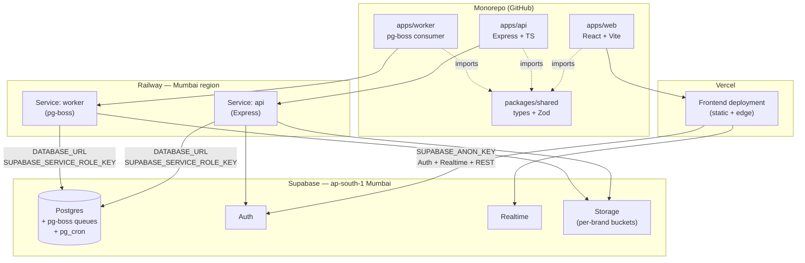

# F&B ERP — Architecture Reference

*Phase 3a deliverable — single source of truth for all architectural decisions*

Version 1.0 — 2026-05-05
Status: LIVING — amendment via DL entry

---

## Table of Contents

1. [Executive Summary & Reading Order](#1-executive-summary--reading-order)
2. [Tech Stack — Final Confirmed (with OQ resolutions)](#2-tech-stack--final-confirmed-with-oq-resolutions)
3. [Monorepo Structure & Deployment Topology](#3-monorepo-structure--deployment-topology)
4. [Multi-Tenancy Implementation](#4-multi-tenancy-implementation)
5. [Database & Schema Conventions](#5-database--schema-conventions)
6. [Service Layer Architecture](#6-service-layer-architecture)
7. [Audit Trail Architecture](#7-audit-trail-architecture)
8. [Concurrency & Idempotency Patterns](#8-concurrency--idempotency-patterns)
9. [Background Jobs & Scheduling](#9-background-jobs--scheduling)
10. [Real-Time Subscriptions](#10-real-time-subscriptions)
11. [Notification Center](#11-notification-center)
12. [Caching Strategy](#12-caching-strategy)
13. [File Storage](#13-file-storage)
14. [Search Strategy](#14-search-strategy)
15. [PDF Generation](#15-pdf-generation)
16. [Resilience & Offline](#16-resilience--offline)
17. [REST API Conventions](#17-rest-api-conventions)
18. [UI Design Tool Workflow](#18-ui-design-tool-workflow)
19. [Mockups vs Production Code Relationship](#19-mockups-vs-production-code-relationship)
20. [CI/CD Quality Gates](#20-cicd-quality-gates)
21. [Cross-Reference Index](#21-cross-reference-index)

Anchors for §2–§21 are forward-declared; sections land in subsequent Phase 3a build-plan tasks.

---

## 1. Executive Summary & Reading Order

### Mission

This document is the canonical architecture reference for the F&B ERP system. It captures every architectural decision made during Phase 3a (resolving Master Spec §11 OQ1–OQ8 + OQ11–OQ17, formally recording OQ9, and producing the OQ10 column-mapping deliverable) together with cross-cutting conventions that span every Phase 4 epic. Per Master Spec §11, these architectural decisions "must be resolved before any epic implementation begins" — this document is where that resolution is written down so it survives session resets and binds every subsequent contributor (human or AI agent) to the same architectural choices.

This is a reference document, not a tutorial. Sections are designed to be read partially, on demand, by an engineer or AI agent picking up a Phase 4 epic. Use the reading order below to orient before diving into the section relevant to the current task.

### Reading order

When picking up a Phase 4 epic for the first time, read in this sequence:

1. **Master Spec §1–§4** (`_planning/02-master-spec.md`) — domain model, closed architectural decisions, MVP scope. Establishes vocabulary and non-negotiables.
2. **This document §1–§4** (each section lands in subsequent Phase 3a build-plan tasks; today only §1 is authored) — orientation: how the doc is structured, the final tech stack with OQ resolutions, monorepo and deployment topology, the multi-tenancy implementation pattern that every service touches.
3. **Relevant epic-specific sections in this document** — depending on the epic, this typically means §5 (schema conventions), §6 (service layer), §7 (audit), §8 (concurrency), and whichever of §9–§16 the epic activates (e.g., notifications for Epic 3, PDF for Epic 6 dispatch).
4. **Relevant FRs in the PRD** (`_planning/03-prd.md`) — functional requirements numbered FR1–FR119; the epic's stories cite these directly.
5. **Screen inventory entries** (`_planning/05-screen-inventory.md`) — the canonical UI inventory; for each in-epic screen pull the row's 12 schema fields (purpose, data displayed, user actions, device class, tier, etc.).

Skim Master Spec §5 (Epic Implementation Sequence) to confirm epic ordering and gating rules. Defer DESIGN.md, decision log, and codebase inventory to point-of-need lookups.

### How this doc relates to other reference files

| File | Role |
|---|---|
| `CLAUDE.md` | Session-bootstrap instructions and critical rules; loaded automatically at session start. |
| `_planning/02-master-spec.md` | Single source of truth for scope, closed architectural decisions, domain model, and §11 OQ list. This document defers to it on anything closed in §3. |
| `_planning/03-prd.md` | Functional requirements (FR1–FR119); Phase 4 stories cite FRs directly. |
| `_planning/05-screen-inventory.md` | Canonical UI inventory: 112 screens × 12 schema fields each. |
| `_planning/06-phase-roadmap.md` | Canonical phase sequence and gating rules; defines what Phase 3a closes and what gates Phase 4. |
| `DESIGN.md` (project root) | Design tokens, components, visual system; consumed mechanically by mockups (Phase 2c-scoped) and production frontend (Phase 4). |
| `decision-log.md` | Append-only micro-decision log (DL-NNN entries); architectural-decision provenance for amendments to this document. |
| `codebase-inventory.md` (post-Epic-1) | Map of project structure once Epic 1 lands; not yet present, will be created after Phase 4 Epic 1. |

### Decision-log binding

This document is bound to the following decision-log entries. Every architectural commitment in §2–§21 traces back to one of these DLs; amendments require a new DL entry per the next subsection.

| DL | Title | One-line summary |
|---|---|---|
| DL-001 | Production Order canonical 5-status lifecycle | The Production Order lifecycle is canonical at five statuses: `Draft → Pending GR (no deduction) → Confirmed (no deduction yet — order is confirmed but not started) → In Progress (deduction fires via inventoryService.deductStock()) → Completed`. Material deduction fires exactly at the In Progress transition — never earlier (Pending GR or Confirmed do not deduct) and never later. The Kitchen Manager explicitly starts the production order, which moves it to In Progress and triggers the deduction. |
| DL-004 | OQ9 UI design tool resolution: in-repo Vite + shadcn (formal capture) | Master Spec §11 OQ9 (UI design tool selection — Stitch / Claude Imagine / hybrid) RESOLVED. Chosen path: in-repo Vite + React + Tailwind + shadcn/ui in this Claude Code workspace. NOT Google Stitch, NOT claude.ai Artifacts, NOT a hybrid of the two. Original §11 OQ9 options list (Stitch / Imagine / hybrid) is superseded — the chosen path was not on that list. |
| DL-005 | Mockups-vs-production-code seed relationship | `mockups/` (Phase 2c-scoped Vite + React + Tailwind + shadcn harness) is **visual specification, not production code seed**. Phase 4 epic implementation builds production code in `apps/web` + `apps/api` per Master Spec §3.2 monorepo structure, consuming `mockups/` as visual reference + reusing the 21 shell components (CC-* patterns) by copy-port (NOT by import dependency). The two trees stay separate. |
| DL-006 | OQ1 Monorepo tooling: Turborepo on pnpm workspaces | Master Spec §11 OQ1 (Monorepo tooling — Turborepo vs Nx vs pnpm workspaces) RESOLVED. Chosen: **Turborepo orchestrator on top of pnpm workspaces.** Package manager is pnpm; pnpm workspaces define the monorepo shape (`apps/web`, `apps/api`, `packages/shared`); Turborepo runs the task graph (`build`, `lint`, `typecheck`, `test`, `dev`) with local caching from day one. Remote caching deferred — enable only if GitHub Actions CI minutes become painful in Phase 4. |
| DL-007 | OQ2 Backend deployment target: Railway (Mumbai region) | Master Spec §11 OQ2 (Backend deployment target — Railway vs Render vs Fly.io) RESOLVED. Chosen: **Railway, deployed to the Railway-Mumbai region.** Express.js API process (Master Spec §3.1 FINAL) runs as a Railway service connected to the GitHub `apps/api` workspace via Turborepo (DL-006). PR preview environments enabled from day one. Hobby plan to start; usage-based billing scales with load. |
| DL-008 | OQ8 Caching layer: no Redis in MVP; TanStack Query + Postgres only; recipe-cost-snapshot carve-out | Master Spec §11 OQ8 (Caching layer — Redis additionally for hot paths?) RESOLVED. Chosen: **No additional server-side caching layer in MVP.** TanStack Query (FINAL §3.1) handles client-side server-state caching; Postgres + indexed `brand_id`-scoped reads handle the server-side read path. **One carve-out:** recipe cost roll-up (Master Spec §2.5 yield cascade — recursive across raw → semi → final products) is materialized as a Postgres `recipe_cost_snapshot` table, refreshed on yield-factor or ingredient-price write. This is database-resident memoization (one source of truth in Postgres), not a new caching layer. |
| DL-009 | OQ7 Background job engine: pg-boss + pg_cron | Master Spec §11 OQ7 (Background job engine — BullMQ vs Inngest vs pg_cron) RESOLVED. Chosen: **pg-boss** (Postgres-backed Node job queue) as the **primary application-level job engine** (notifications, accountant exports, recipe cost recompute, POS sales import, approval escalation, variance calculation, PDF rendering). **pg_cron** (Supabase Postgres extension) as the **complement for DB-only scheduled tasks** (materialized view safety-net refresh, audit log retention sweeps). No Redis. No Inngest in MVP. |
| DL-010 | OQ3 Real-time strategy: triaged subscription list (5 channels) | Master Spec §11 OQ3 (Real-time strategy — event-triage for Supabase Realtime FINAL §3.1) RESOLVED. **Five Realtime subscription channels in MVP** (all others use polling or on-demand refresh): `approval_requests` (filtered to approver), `notifications` (filtered to user), `production_orders` (filtered to user's locations), `dispatch_challans` (filtered to source dept or destination POS), `issue_tracker_threads` (filtered to user's threads). Polling (TanStack Query `refetchInterval`) covers POS sales sync, integration dashboard, and job queue depth. On-demand refresh covers all dashboards / reports / inventory views / master data. Optimistic UI covers low-contention writes and approval actions. |
| DL-011 | OQ16 Notification Center transport + dispatch model | Master Spec §11 OQ16 (Notification Center transport + dispatch — channels, email provider, dispatch model per FR19) RESOLVED. In-app channel writes to `notifications` table → Supabase Realtime channel #2 from DL-010 pushes to UI. Email channel uses **Resend** (React Email templates), enqueued via **pg-boss** (DL-009) — never synchronous. SMS / WhatsApp / mobile push deferred post-MVP. Dispatch model is data-driven via `notification_type_config` table with three shapes: in-app only, in-app + immediate email, in-app + batched daily digest email (digest aggregated via pg_cron). |
| DL-012 | OQ11 Multi-tenant query pattern: brandedDb factory | Master Spec §11 OQ11 (Multi-tenant query pattern enforcement — Express middleware vs Drizzle wrapper vs `withBrand` builder) RESOLVED. Chosen: **`brandedDb(brandId)` Drizzle factory.** Express middleware extracts `brand_id` from the Supabase JWT, constructs a per-request `brandedDb` instance wrapping Drizzle's query builder, and attaches as `req.db`. The wrapped builder automatically AND's `brand_id = $brandId` into every SELECT / UPDATE / DELETE on org-scoped tables and auto-injects `brand_id` into INSERTs. There is no escape hatch in normal service code; bypass requires explicit use of the underlying unscoped Drizzle client (reserved for migrations / housekeeping / pg-boss worker init). |
| DL-013 | OQ12 Audit trail: application-layer primary, trigger backstop on critical tables | Master Spec §11 OQ12 (Audit trail mechanism — triggers vs application-layer) RESOLVED. Chosen: **application-layer primary via `auditLog.record(...)` called from service methods**, with **Postgres trigger backstop on a critical-table set** (`users`, `enablement_matrix`, `recipes`, `chart_of_accounts`). Application-layer call is inside the same transaction as the mutation (atomic). Triggers on the four critical tables write `audit_log` rows on INSERT/UPDATE/DELETE with `actor_user_id` from `current_setting('app.user_id', true)` set by `brandedDb` middleware. When both layers fire, prefer the application-layer row (richer business context). |
| DL-014 | OQ14 RLS policy authoring: per-epic from canonical template, with CI lint | Master Spec §11 OQ14 (RLS policy authoring strategy — when, by whom, from what template) RESOLVED. Chosen: **per-epic authoring**, every `CREATE TABLE` migration emits RLS policies from the **canonical 2-policy template** authored in Phase 3a. **CI lint flags any new table without accompanying RLS policies in the same migration.** Template enables RLS, adds a `<table>_brand_isolation` policy that scopes all operations to the user's brand, and adds a `<table>_service_role_bypass` policy so Express (using the service_role key) is unrestricted. System tables get only the service_role bypass. |
| DL-015 | OQ15 brand_id index migration template: brandScopedTable Drizzle helper | Master Spec §11 OQ15 (canonical migration template / Drizzle helper for `brand_id` index per §3.2) RESOLVED. Chosen: **`brandScopedTable(name, columns)` Drizzle helper** that consolidates DL-012 + DL-013 + DL-014 + DL-015 into a single declaration. Per call, the helper adds `brand_id uuid not null` with a RESTRICT-on-delete FK to `brands.id`, adds the `idx_<table>_brand_id` index (or composite when explicit), emits the canonical 2-policy RLS template (DL-014), tags the table for `brandedDb` recognition (DL-012), and wires audit-trigger generation (DL-013) for the four critical tables via opt-in flag. |
| DL-016 | OQ17 Concurrency / idempotency: per-mechanism resolution | Master Spec §11 OQ17 (Concurrency / idempotency for deductStock + IRN paste + PO approval) RESOLVED with three mechanism-specific patterns. (1) `inventoryService.deductStock`: **Postgres `SELECT ... FOR UPDATE` row lock on the affected stock-batch rows, inside a single transaction** (FEFO selection, deduction, and journal entry all atomic; no advisory locks). (2) IRN paste: **unique constraint on `(brand_id, irn)`** with ON CONFLICT — IRN itself is the natural idempotency key. (3) PO approval: **status-guarded UPDATE** — `WHERE status = 'pending' AND brand_id = $brand`; double-click affects 0 rows and surfaces "Already approved by X at HH:MM". Pattern (3) generalizes to all state-machine transitions. |
| DL-017 | OQ13 File storage layout: per-brand bucket, signed-URL via Express | Master Spec §11 OQ13 (File storage layout — per-brand vs per-entity bucket; signed-URL vs direct upload) RESOLVED. Chosen: **per-brand Supabase Storage bucket with `${entityType}/${entityId}/${filename}` path structure, accessed via Express-issued signed URLs.** One bucket per brand (`brand-${brand_slug}`). Browser POSTs upload-intent to Express → Express validates size, MIME, entity-attribution authorization, content-type → Express generates a short-TTL (5 min) signed PUT URL → browser PUTs directly to Supabase Storage. Reads use short-TTL (5 min) signed GET URLs generated on demand. No client-side Supabase JS for storage operations; all access mediated by Express to enforce authorization + audit trail. |
| DL-018 | OQ6 Full-text search: Postgres tsvector + pg_trgm | Master Spec §11 OQ6 (Full-text search strategy — tsvector vs Meilisearch / Typesense) RESOLVED. Chosen: **Postgres `tsvector` (GIN-indexed) + `pg_trgm` (fuzzy / trigram matching).** No dedicated search service in MVP. Each searchable table gets a generated `search_vector tsvector` column populated via trigger (or generated column in PG12+) from the relevant text fields, with a GIN index. `pg_trgm` provides similarity matching for typo tolerance, used as a fallback when tsvector returns no results or as a UNION for combined ranking. Reconsider triggers post-MVP if latency exceeds 100ms or real faceted search is needed. |
| DL-019 | OQ5 PDF generation: @react-pdf/renderer on pg-boss worker | Master Spec §11 OQ5 (PDF generation library — react-pdf vs puppeteer vs @react-pdf/renderer) RESOLVED. Chosen: **`@react-pdf/renderer` (server-side), executed on the pg-boss worker process** (DL-009). Output written to per-brand Supabase Storage bucket (DL-017); API returns signed download URL once PDF lands. Used for B2B + dispatch challans, invoices, POs, GR slips, production order printouts, and financial report PDF exports. Charts in financial reports render server-side as SVG and embed via @react-pdf/renderer's SVG primitive; for chart-heavy reports, Excel is the primary path and PDF is the secondary "snapshot" path. |
| DL-020 | OQ4 Offline capability: deferred post-MVP; MVP resilience via TanStack retry + LocalStorage drafts | Master Spec §11 OQ4 (Offline capability depth — core for MVP or deferred; if core, which workflows) RESOLVED. Chosen: **Defer offline-first capability to post-MVP. No PWA / service worker / IndexedDB / sync engine in MVP.** MVP resilience covered by two lighter mechanisms: (1) TanStack Query automatic mutation retry on transient network failure with exponential backoff and jitter; (2) LocalStorage form-draft auto-save every 5 seconds on long-form screens (Goods Receipt entry, Recipe authoring, Production Order creation, B2B challan creation), restored on next visit with a confirmation prompt. Reconsider trigger is production telemetry showing a meaningful `network_offline_during_submit` event count. |

DL-002 (Tailwind v4 amendment) and DL-003 (Phase 3a re-sequencing) exist in the decision log but are governance / sequencing decisions rather than architectural commitments and are therefore not part of the binding list above. They remain authoritative for their respective domains.

### How to amend this doc

Amendments are not silent edits. To change any commitment in this document:

1. Open a new DL entry in `decision-log.md` (next available DL-NNN) following the format at the top of that file. Capture **Decision**, **Source**, **Why this matters**, and **Cross-references**.
2. In the **same commit**, update the affected section(s) of this document and append the new DL number to the binding list in §1.
3. The commit message must reference the DL number ("DL-NNN amends architecture.md §X — …").

The binding table above must include every architectural-domain DL entry. When adding a new architectural DL (one whose `Cross-references` cite this document or that resolves a Master Spec §11 OQ), update the binding table in the same commit. Governance/sequencing DLs (e.g., DL-002, DL-003) that do not introduce architectural commitments are intentionally excluded.

Never edit this document without an accompanying DL entry. The decision-log binding above is the audit trail; if a section says one thing and no DL backs it, that is an error and must be reconciled before further work proceeds. This rule mirrors the Master Spec §3 governance clause prohibiting silent overrides.

---

## 2. Tech Stack — Final Confirmed (with OQ resolutions)

This section reproduces Master Spec §3.1 verbatim and folds in the architectural OQ resolutions captured in `decision-log.md` (DL-006 through DL-020 minus governance entries). Where Master Spec §3.1 carried a `⚠ TBD` row, the resolved entry replaces it; where the OQ resolution introduces a new concern not yet in §3.1 (background jobs, email transport, search extension, PDF library, monorepo orchestrator), a new row is added. The `Decision` column either preserves the Master Spec wording or cites the resolving DL.

### 2.1 Frontend

| Technology | Version | Purpose | Decision |
|---|---|---|---|
| React | 18+ | UI framework | ✅ FINAL |
| TypeScript | 5.x strict mode | Type safety end-to-end | ✅ FINAL — no `any` types |
| Tailwind CSS | 4.x | Utility-first styling | ✅ FINAL — superseded 3.x at Phase 2c-prep, see DL-002 |
| shadcn/ui + Radix | Latest | Component library | ✅ FINAL |
| Inter | — | Font family | ✅ FINAL |
| TanStack Table | Latest | Data grids | ✅ FINAL |
| TanStack Query | Latest | Server state / caching | ✅ FINAL |
| React Hook Form + Zod | Latest | Forms + validation | ✅ FINAL |
| Zustand | Latest | Client state | ✅ FINAL |
| Recharts | Latest | Charts / visualisation | ✅ FINAL |

### 2.2 Backend

| Technology | Version | Purpose | Decision |
|---|---|---|---|
| Node.js | 20+ | Runtime | ✅ FINAL |
| Express.js | Latest | API server + business logic | ✅ FINAL |
| TypeScript | 5.x | End-to-end type safety | ✅ FINAL |
| Supabase | Hosted | PostgreSQL + Auth + Realtime + Storage | ✅ FINAL |
| Supabase Auth | — | Email/password (SSO post-MVP) | ✅ FINAL |
| Supabase RLS | — | Defence-in-depth (see §3.2) | ✅ FINAL |
| Supabase Realtime | — | WebSocket subscriptions | ✅ FINAL |
| Drizzle ORM | Latest | Type-safe DB access | ✅ FINAL — chosen over Prisma |
| pg-boss | Latest | Postgres-backed job queue | ✅ FINAL — DL-009 |
| Background jobs | pg-boss + pg_cron | Application-level job engine + DB-only scheduled tasks | ✅ FINAL — DL-009 |

### 2.3 Infrastructure

| Technology | Version | Purpose | Decision |
|---|---|---|---|
| Vercel | — | Frontend deployment | ✅ FINAL |
| Railway (Mumbai region) | — | Backend deployment | ✅ FINAL — DL-007 |
| GitHub | — | Version control | ✅ FINAL |
| GitHub Actions | — | CI/CD | ✅ FINAL |
| Sentry | — | Error tracking | ✅ FINAL |
| Resend | — | Email transport (React Email templates, enqueued via pg-boss) | ✅ FINAL — DL-011 |
| tsvector + pg_trgm (Postgres) | — | Full-text + fuzzy search extensions | ✅ FINAL — DL-018 |
| @react-pdf/renderer | Latest | PDF generation (server-side, on pg-boss worker) | ✅ FINAL — DL-019 |
| Turborepo on pnpm workspaces | Latest | Monorepo orchestrator + package manager | ✅ FINAL — DL-006 |

### 2.4 What is intentionally NOT in this stack

The OQ resolutions also crystallised explicit rejections. These are not "later" or "maybe" — they are out of scope for MVP, and adding any of them requires a new DL entry per the §1 amendment rule.

- **Redis (no server-side cache layer)** — DL-008. TanStack Query handles client-side server-state caching; indexed `brand_id`-scoped Postgres reads handle the server-side path. Recipe cost roll-up is materialised as a Postgres `recipe_cost_snapshot` table (database-resident memoisation), not a separate cache.
- **BullMQ (no Redis-backed job queue)** — DL-009. pg-boss provides transactional job creation in the same Postgres transaction as the business state change; BullMQ would resurrect the Redis decision rejected in DL-008 and break that exactly-once property.
- **Inngest (no third-party orchestration runtime)** — DL-009. Step-function DX is excellent but introduces vendor lock-in on orchestration runtime, US hop latency for control plane, and step-function complexity is overkill for current MVP job shapes.
- **Meilisearch / Typesense (no dedicated search service)** — DL-018. Postgres tsvector + pg_trgm covers the bounded ERP search surface (items, vendors, recipes, customers, transactions) at MVP scale without added infrastructure.
- **Puppeteer (no headless-Chrome PDF rendering)** — DL-019. Puppeteer ships ~100MB of Chrome binary, bloats the Railway worker image, slows cold starts, and introduces rendering nondeterminism. @react-pdf/renderer is a pure-Node (~5MB) component-based PDF library.
- **PWA / service worker / IndexedDB / sync engine (no offline-first capability)** — DL-020. Offline-first is deferred post-MVP. MVP resilience is covered by TanStack Query mutation retry with exponential backoff and LocalStorage form-draft auto-save on long-form screens.

### 2.5 Reconsider triggers

Each rejection above carries a post-MVP reconsider trigger drawn verbatim from the resolving DL. These are the empirical conditions that would re-open the decision; until one fires, the rejection stands.

| Technology | Reconsider trigger | DL |
|---|---|---|
| Redis | P95 API latency >300ms attributable to recurring read patterns | DL-008 |
| BullMQ | Sustained job throughput >100/sec | DL-009 |
| Inngest | Need durable multi-step workflows with branching / retry-per-step / time-traveling state | DL-009 |
| Meilisearch | Search latency on indexed Postgres exceeds 100ms at observed load; or need real faceted search at scale where Postgres facet aggregation becomes expensive | DL-018 |
| PWA | Production telemetry on `network_offline_during_submit` event count showing outage events cause real lost work at observed frequency | DL-020 |

When a trigger fires, the response is a new DL entry plus a same-commit amendment to this section per the §1 rule — not a silent reintroduction of the rejected technology.

---

## 3. Monorepo Structure & Deployment Topology

This section defines the physical shape of the codebase (one git repo, pnpm workspaces, Turborepo task graph) and the deployment topology (Vercel + Railway + Supabase, all India-region for the latency rationale in DL-007). It exists to make the Phase 4 Epic 1 bootstrap unambiguous: there is one correct way to lay the project out and one correct way to wire the deploy targets.

Source decisions: DL-006 (Turborepo on pnpm workspaces), DL-007 (Railway-Mumbai backend + implicit Supabase ap-south-1 commitment), DL-009 (pg-boss worker as separate Railway service). Master Spec §3.1 (Vercel FINAL frontend, Supabase FINAL DB, Express FINAL API, Node 20 FINAL) and §3.2 (`Monorepo. Shared TypeScript types in packages/shared. Frontend in apps/web, backend in apps/api.`) define the FINAL constraints this section operationalizes.

### 3.1 Monorepo layout

The repository is a single pnpm workspace with three deployable applications, one shared package, and a separate (non-deployable) mockup harness. Per DL-009, the pg-boss worker is its own application — sibling to `apps/api`, NOT a sub-process of it — because it deploys as a distinct Railway service.

```
/
  apps/
    web/         (React + Vite + TS frontend, deploys to Vercel)
    api/         (Express + TS backend, deploys to Railway as service "api")
    worker/      (pg-boss worker process, deploys to Railway as service "worker")
  packages/
    shared/      (TS types + Zod schemas + shared business constants)
  mockups/       (Phase 2c-scoped Vite harness — visual specification, NOT production code per DL-005)
  _planning/
  docs/
  DESIGN.md
  CLAUDE.md
  decision-log.md
  turbo.json
  pnpm-workspace.yaml
  package.json
```

Notes on each location:

- **`apps/web`** — React + Vite + TypeScript. Consumes types and Zod schemas from `packages/shared`. Build output deploys to Vercel.
- **`apps/api`** — Express + TypeScript. Produces pg-boss jobs; never executes them in the request path (DL-009). Imports the same `packages/shared` for request/response schema validation that the frontend uses.
- **`apps/worker`** — Node + TypeScript long-running process. Subscribes to pg-boss queues and runs job handlers (notification dispatch, PDF rendering, accountant exports, recipe cost recompute, POS sales import, approval escalation, variance calculation per DL-009). Shares the same `DATABASE_URL` and `SUPABASE_*` env vars as `apps/api` because pg-boss is a Postgres-backed queue (DL-009) and storage writes target the same Supabase project.
- **`packages/shared`** — TypeScript-only. Domain types (`Brand`, `Outlet`, `Material`, `Recipe`, etc.), Zod schemas mirroring those types for runtime validation at API boundaries, and shared business constants (status enums, role identifiers, OQ-resolved enumerations). Built first in the Turbo task graph; every other workspace depends on it.
- **`mockups/`** — The Phase 2c-scoped 15 mockup foundation. Vite + React harness with shadcn-vite components (DL-004). NOT a production deployable; treated by Turborepo as a workspace for `lint` / `typecheck` / `dev` purposes only. Per DL-005, mockups are visual specification artefacts, not production code.

### 3.2 Turborepo task graph

Turborepo (DL-006) orchestrates per-package tasks across the workspace. Six pipeline tasks cover the lifecycle:

| Task | Inputs | Outputs | Depends on | Cache |
|---|---|---|---|---|
| `dev` | source files | live dev server (no artefact) | — | NO (`cache: false`, `persistent: true`) |
| `build` | source files | `dist/**`, `.vercel/**` | `^build` (build dependencies first) | yes |
| `lint` | source files | none (pass/fail signal) | — | yes |
| `typecheck` | source files, types from deps | none (pass/fail signal) | `^build` (need built `packages/shared` `.d.ts`) | yes |
| `test` | source files, build output | test report | `build` (own package built first) | yes |
| `test:integration` | source, build, env (`DATABASE_URL`, `SUPABASE_URL`, `SUPABASE_SERVICE_ROLE_KEY`) | test report | `build` (own package) | yes (env-aware) |

The `^build` semantics matter: when `apps/api` is built, Turbo first builds `packages/shared` (its dependency), so type declarations are present. `typecheck` follows the same rule for the same reason — `apps/api`'s `tsc --noEmit` needs `packages/shared/dist/**.d.ts` resolved on disk.

`turbo.json` skeleton (Turborepo v2 syntax — `tasks:` not `pipeline:`):

```json
{
  "$schema": "https://turbo.build/schema.json",
  "tasks": {
    "build": {
      "dependsOn": ["^build"],
      "outputs": ["dist/**", ".vercel/**"]
    },
    "dev": {
      "cache": false,
      "persistent": true
    },
    "lint": {},
    "typecheck": {
      "dependsOn": ["^build"]
    },
    "test": {
      "dependsOn": ["build"]
    },
    "test:integration": {
      "dependsOn": ["build"],
      "env": ["DATABASE_URL", "SUPABASE_URL", "SUPABASE_SERVICE_ROLE_KEY"]
    }
  }
}
```

Local caching is on by default. Remote caching is **deferred** (see §3.6).

### 3.3 pnpm workspace setup

`pnpm-workspace.yaml` declares the three workspace globs:

```yaml
packages:
  - apps/*
  - packages/*
  - mockups
```

`apps/*` matches `apps/web`, `apps/api`, `apps/worker`. `packages/*` matches `packages/shared`. `mockups` is listed explicitly (singular path, not a glob) — it is one workspace, not a directory containing many.

### 3.4 Deployment topology

Three deploy targets, all in / connecting to the Mumbai region (DL-007). Vercel hosts the frontend; Railway runs two distinct services (the Express API and the pg-boss worker, per DL-009); Supabase is the shared backend (Postgres + Auth + Realtime + Storage per Master Spec §3.1).



Key arrows:

- **`apps/web` → Vercel → Supabase Auth/Realtime.** Frontend authenticates users directly against Supabase Auth and subscribes to the triaged Realtime channel set (DL-010).
- **`apps/api` → Railway "api" service → Supabase Postgres + Storage + Auth.** API process is the primary writer to Postgres, the producer of pg-boss jobs, and the issuer of signed Storage URLs.
- **`apps/worker` → Railway "worker" service → Supabase Postgres + Storage.** Worker subscribes to pg-boss queues (which live in Postgres per DL-009), executes handlers, writes outputs (e.g., generated PDFs to Storage). Worker does NOT terminate user-facing HTTP requests.
- All three Railway/Vercel deploy targets connect to **the same Supabase project** in `ap-south-1`. Co-location is the entire latency thesis of DL-007 — breaking it (e.g., provisioning Supabase in `us-east-1`) silently destroys the rationale.

### 3.5 Bootstrap obligations for Phase 4 Epic 1

The Phase 3a architecture build plan surfaces these as explicit setup tasks so they aren't deferred to "later" and forgotten. All five must complete before the first Epic 1 story can land:

- [ ] **Create the Supabase project in `ap-south-1` (Mumbai) region.** This is non-default — Supabase's project-creation UI offers `us-east-1` as a common default. Selecting the wrong region here invalidates DL-007's co-location latency rationale and is non-trivial to migrate post-bootstrap. Verify region in the Supabase project settings page before proceeding.
- [ ] **Create the Vercel project linked to `apps/web`.** Configure the build command and output directory to use Turborepo (`turbo build --filter=web`); root directory points at the monorepo root, not `apps/web/`, so Turbo's task graph resolves correctly.
- [ ] **Create the Railway service "api" in the Mumbai region linked to `apps/api`.** Build/start commands invoke Turborepo (`turbo build --filter=api`, then `node apps/api/dist/server.js` or equivalent). PR preview environments enabled per DL-007.
- [ ] **Create the Railway service "worker" in the Mumbai region linked to `apps/worker`.** Same monorepo, separate service (DL-009). Build/start commands invoke Turborepo (`turbo build --filter=worker`, then start the pg-boss consumer entrypoint). No public HTTP port exposed; this process consumes queues, it does not serve traffic.
- [ ] **Wire environment variables across the three deploy targets:**
  - `apps/web` (Vercel): `SUPABASE_URL`, `SUPABASE_ANON_KEY`.
  - `apps/api` (Railway "api"): `SUPABASE_URL`, `SUPABASE_SERVICE_ROLE_KEY`, `DATABASE_URL` (direct Postgres connection string for Drizzle + pg-boss producer side).
  - `apps/worker` (Railway "worker"): `SUPABASE_URL`, `SUPABASE_SERVICE_ROLE_KEY`, `DATABASE_URL` (same connection string — pg-boss consumer side), `RESEND_API_KEY` (email channel per DL-016 lives on the worker because email send is enqueued and dispatched out-of-band, never synchronous).

The `RESEND_API_KEY` placement on the worker (not the api service) is deliberate: per DL-016, all email sends route through pg-boss to avoid synchronous third-party calls in API request paths.

### 3.6 Remote cache enablement criterion

Turborepo Remote Cache is **disabled at bootstrap** and remains so until a measurable cost trigger fires (DL-006 default). The trigger is **GitHub Actions CI minutes becoming a measurable cost** — concretely, when monthly CI minutes consumed by the project approach the GitHub free-tier ceiling for the account, or when CI wall-clock time on a typical PR exceeds ~10 minutes and is dominated by re-running already-cached work across runners.

Until then, local caching alone (which is on by default with zero configuration) covers the solo-developer iteration loop. Enabling Remote Cache prematurely adds a Vercel account dependency and a token-management surface for no measurable gain at the current project shape (one developer, one CI runner per PR, no concurrent contributors competing for cache hits).

When the trigger fires: enable Vercel Remote Cache, store the token as a GitHub Actions secret, and add a same-commit DL entry recording the trigger that fired and the date — same discipline as the §2 reconsider-trigger table.

---

*Sections §4–§21 land in subsequent Phase 3a build-plan tasks. See `_planning/06-phase-roadmap.md` Phase 3a entry for the task sequence.*
