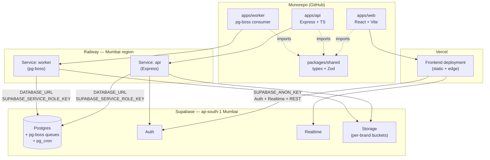

# F&B ERP — Architecture Reference

*Phase 3a deliverable — single source of truth for all architectural decisions*

Version 1.0 — 2026-05-05
Status: LIVING — amendment via DL entry

---

## Table of Contents

1. [Executive Summary & Reading Order](#1-executive-summary--reading-order)
2. [Tech Stack — Final Confirmed (with OQ resolutions)](#2-tech-stack--final-confirmed-with-oq-resolutions)
3. [Monorepo Structure & Deployment Topology](#3-monorepo-structure--deployment-topology)
4. [Multi-Tenancy Implementation](#4-multi-tenancy-implementation)
5. [Database & Schema Conventions](#5-database--schema-conventions)
6. [Service Layer Architecture](#6-service-layer-architecture)
7. [Audit Trail Architecture](#7-audit-trail-architecture)
8. [Concurrency & Idempotency Patterns](#8-concurrency--idempotency-patterns)
9. [Background Jobs & Scheduling](#9-background-jobs--scheduling)
10. [Real-Time Subscriptions](#10-real-time-subscriptions)
11. [Notification Center](#11-notification-center)
12. [Caching Strategy](#12-caching-strategy)
13. [File Storage](#13-file-storage)
14. [Search Strategy](#14-search-strategy)
15. [PDF Generation](#15-pdf-generation)
16. [Resilience & Offline](#16-resilience--offline)
17. [REST API Conventions](#17-rest-api-conventions)
18. [UI Design Tool Workflow](#18-ui-design-tool-workflow)
19. [Mockups vs Production Code Relationship](#19-mockups-vs-production-code-relationship)
20. [CI/CD Quality Gates](#20-cicd-quality-gates)
21. [Cross-Reference Index](#21-cross-reference-index)

Anchors for §2–§21 are forward-declared; sections land in subsequent Phase 3a build-plan tasks.

---

## 1. Executive Summary & Reading Order

### Mission

This document is the canonical architecture reference for the F&B ERP system. It captures every architectural decision made during Phase 3a (resolving Master Spec §11 OQ1–OQ8 + OQ11–OQ17, formally recording OQ9, and producing the OQ10 column-mapping deliverable) together with cross-cutting conventions that span every Phase 4 epic. Per Master Spec §11, these architectural decisions "must be resolved before any epic implementation begins" — this document is where that resolution is written down so it survives session resets and binds every subsequent contributor (human or AI agent) to the same architectural choices.

This is a reference document, not a tutorial. Sections are designed to be read partially, on demand, by an engineer or AI agent picking up a Phase 4 epic. Use the reading order below to orient before diving into the section relevant to the current task.

### Reading order

When picking up a Phase 4 epic for the first time, read in this sequence:

1. **Master Spec §1–§4** (`_planning/02-master-spec.md`) — domain model, closed architectural decisions, MVP scope. Establishes vocabulary and non-negotiables.
2. **This document §1–§4** (each section lands in subsequent Phase 3a build-plan tasks; today only §1 is authored) — orientation: how the doc is structured, the final tech stack with OQ resolutions, monorepo and deployment topology, the multi-tenancy implementation pattern that every service touches.
3. **Relevant epic-specific sections in this document** — depending on the epic, this typically means §5 (schema conventions), §6 (service layer), §7 (audit), §8 (concurrency), and whichever of §9–§16 the epic activates (e.g., notifications for Epic 3, PDF for Epic 6 dispatch).
4. **Relevant FRs in the PRD** (`_planning/03-prd.md`) — functional requirements numbered FR1–FR119; the epic's stories cite these directly.
5. **Screen inventory entries** (`_planning/05-screen-inventory.md`) — the canonical UI inventory; for each in-epic screen pull the row's 12 schema fields (purpose, data displayed, user actions, device class, tier, etc.).

Skim Master Spec §5 (Epic Implementation Sequence) to confirm epic ordering and gating rules. Defer DESIGN.md, decision log, and codebase inventory to point-of-need lookups.

### How this doc relates to other reference files

| File | Role |
|---|---|
| `CLAUDE.md` | Session-bootstrap instructions and critical rules; loaded automatically at session start. |
| `_planning/02-master-spec.md` | Single source of truth for scope, closed architectural decisions, domain model, and §11 OQ list. This document defers to it on anything closed in §3. |
| `_planning/03-prd.md` | Functional requirements (FR1–FR119); Phase 4 stories cite FRs directly. |
| `_planning/05-screen-inventory.md` | Canonical UI inventory: 112 screens × 12 schema fields each. |
| `_planning/06-phase-roadmap.md` | Canonical phase sequence and gating rules; defines what Phase 3a closes and what gates Phase 4. |
| `DESIGN.md` (project root) | Design tokens, components, visual system; consumed mechanically by mockups (Phase 2c-scoped) and production frontend (Phase 4). |
| `decision-log.md` | Append-only micro-decision log (DL-NNN entries); architectural-decision provenance for amendments to this document. |
| `codebase-inventory.md` (post-Epic-1) | Map of project structure once Epic 1 lands; not yet present, will be created after Phase 4 Epic 1. |

### Decision-log binding

This document is bound to the following decision-log entries. Every architectural commitment in §2–§21 traces back to one of these DLs; amendments require a new DL entry per the next subsection.

| DL | Title | One-line summary |
|---|---|---|
| DL-001 | Production Order canonical 5-status lifecycle | The Production Order lifecycle is canonical at five statuses: `Draft → Pending GR (no deduction) → Confirmed (no deduction yet — order is confirmed but not started) → In Progress (deduction fires via inventoryService.deductStock()) → Completed`. Material deduction fires exactly at the In Progress transition — never earlier (Pending GR or Confirmed do not deduct) and never later. The Kitchen Manager explicitly starts the production order, which moves it to In Progress and triggers the deduction. |
| DL-004 | OQ9 UI design tool resolution: in-repo Vite + shadcn (formal capture) | Master Spec §11 OQ9 (UI design tool selection — Stitch / Claude Imagine / hybrid) RESOLVED. Chosen path: in-repo Vite + React + Tailwind + shadcn/ui in this Claude Code workspace. NOT Google Stitch, NOT claude.ai Artifacts, NOT a hybrid of the two. Original §11 OQ9 options list (Stitch / Imagine / hybrid) is superseded — the chosen path was not on that list. |
| DL-005 | Mockups-vs-production-code seed relationship | `mockups/` (Phase 2c-scoped Vite + React + Tailwind + shadcn harness) is **visual specification, not production code seed**. Phase 4 epic implementation builds production code in `apps/web` + `apps/api` per Master Spec §3.2 monorepo structure, consuming `mockups/` as visual reference + reusing the 21 shell components (CC-* patterns) by copy-port (NOT by import dependency). The two trees stay separate. |
| DL-006 | OQ1 Monorepo tooling: Turborepo on pnpm workspaces | Master Spec §11 OQ1 (Monorepo tooling — Turborepo vs Nx vs pnpm workspaces) RESOLVED. Chosen: **Turborepo orchestrator on top of pnpm workspaces.** Package manager is pnpm; pnpm workspaces define the monorepo shape (`apps/web`, `apps/api`, `packages/shared`); Turborepo runs the task graph (`build`, `lint`, `typecheck`, `test`, `dev`) with local caching from day one. Remote caching deferred — enable only if GitHub Actions CI minutes become painful in Phase 4. |
| DL-007 | OQ2 Backend deployment target: Railway (Mumbai region) | Master Spec §11 OQ2 (Backend deployment target — Railway vs Render vs Fly.io) RESOLVED. Chosen: **Railway, deployed to the Railway-Mumbai region.** Express.js API process (Master Spec §3.1 FINAL) runs as a Railway service connected to the GitHub `apps/api` workspace via Turborepo (DL-006). PR preview environments enabled from day one. Hobby plan to start; usage-based billing scales with load. |
| DL-008 | OQ8 Caching layer: no Redis in MVP; TanStack Query + Postgres only; recipe-cost-snapshot carve-out | Master Spec §11 OQ8 (Caching layer — Redis additionally for hot paths?) RESOLVED. Chosen: **No additional server-side caching layer in MVP.** TanStack Query (FINAL §3.1) handles client-side server-state caching; Postgres + indexed `brand_id`-scoped reads handle the server-side read path. **One carve-out:** recipe cost roll-up (Master Spec §2.5 yield cascade — recursive across raw → semi → final products) is materialized as a Postgres `recipe_cost_snapshot` table, refreshed on yield-factor or ingredient-price write. This is database-resident memoization (one source of truth in Postgres), not a new caching layer. |
| DL-009 | OQ7 Background job engine: pg-boss + pg_cron | Master Spec §11 OQ7 (Background job engine — BullMQ vs Inngest vs pg_cron) RESOLVED. Chosen: **pg-boss** (Postgres-backed Node job queue) as the **primary application-level job engine** (notifications, accountant exports, recipe cost recompute, POS sales import, approval escalation, variance calculation, PDF rendering). **pg_cron** (Supabase Postgres extension) as the **complement for DB-only scheduled tasks** (materialized view safety-net refresh, audit log retention sweeps). No Redis. No Inngest in MVP. |
| DL-010 | OQ3 Real-time strategy: triaged subscription list (5 channels) | Master Spec §11 OQ3 (Real-time strategy — event-triage for Supabase Realtime FINAL §3.1) RESOLVED. **Five Realtime subscription channels in MVP** (all others use polling or on-demand refresh): `approval_requests` (filtered to approver), `notifications` (filtered to user), `production_orders` (filtered to user's locations), `dispatch_challans` (filtered to source dept or destination POS), `issue_tracker_threads` (filtered to user's threads). Polling (TanStack Query `refetchInterval`) covers POS sales sync, integration dashboard, and job queue depth. On-demand refresh covers all dashboards / reports / inventory views / master data. Optimistic UI covers low-contention writes and approval actions. |
| DL-011 | OQ16 Notification Center transport + dispatch model | Master Spec §11 OQ16 (Notification Center transport + dispatch — channels, email provider, dispatch model per FR19) RESOLVED. In-app channel writes to `notifications` table → Supabase Realtime channel #2 from DL-010 pushes to UI. Email channel uses **Resend** (React Email templates), enqueued via **pg-boss** (DL-009) — never synchronous. SMS / WhatsApp / mobile push deferred post-MVP. Dispatch model is data-driven via `notification_type_config` table with three shapes: in-app only, in-app + immediate email, in-app + batched daily digest email (digest aggregated via pg_cron). |
| DL-012 | OQ11 Multi-tenant query pattern: brandedDb factory | Master Spec §11 OQ11 (Multi-tenant query pattern enforcement — Express middleware vs Drizzle wrapper vs `withBrand` builder) RESOLVED. Chosen: **`brandedDb(brandId)` Drizzle factory.** Express middleware extracts `brand_id` from the Supabase JWT, constructs a per-request `brandedDb` instance wrapping Drizzle's query builder, and attaches as `req.db`. The wrapped builder automatically AND's `brand_id = $brandId` into every SELECT / UPDATE / DELETE on org-scoped tables and auto-injects `brand_id` into INSERTs. There is no escape hatch in normal service code; bypass requires explicit use of the underlying unscoped Drizzle client (reserved for migrations / housekeeping / pg-boss worker init). |
| DL-013 | OQ12 Audit trail: application-layer primary, trigger backstop on critical tables | Master Spec §11 OQ12 (Audit trail mechanism — triggers vs application-layer) RESOLVED. Chosen: **application-layer primary via `auditLog.record(...)` called from service methods**, with **Postgres trigger backstop on a critical-table set** (`users`, `enablement_matrix`, `recipes`, `chart_of_accounts`). Application-layer call is inside the same transaction as the mutation (atomic). Triggers on the four critical tables write `audit_log` rows on INSERT/UPDATE/DELETE with `actor_user_id` from `current_setting('app.user_id', true)` set by `brandedDb` middleware. When both layers fire, prefer the application-layer row (richer business context). |
| DL-014 | OQ14 RLS policy authoring: per-epic from canonical template, with CI lint | Master Spec §11 OQ14 (RLS policy authoring strategy — when, by whom, from what template) RESOLVED. Chosen: **per-epic authoring**, every `CREATE TABLE` migration emits RLS policies from the **canonical 2-policy template** authored in Phase 3a. **CI lint flags any new table without accompanying RLS policies in the same migration.** Template enables RLS, adds a `<table>_brand_isolation` policy that scopes all operations to the user's brand, and adds a `<table>_service_role_bypass` policy so Express (using the service_role key) is unrestricted. System tables get only the service_role bypass. |
| DL-015 | OQ15 brand_id index migration template: brandScopedTable Drizzle helper | Master Spec §11 OQ15 (canonical migration template / Drizzle helper for `brand_id` index per §3.2) RESOLVED. Chosen: **`brandScopedTable(name, columns)` Drizzle helper** that consolidates DL-012 + DL-013 + DL-014 + DL-015 into a single declaration. Per call, the helper adds `brand_id uuid not null` with a RESTRICT-on-delete FK to `brands.id`, adds the `idx_<table>_brand_id` index (or composite when explicit), emits the canonical 2-policy RLS template (DL-014), tags the table for `brandedDb` recognition (DL-012), and wires audit-trigger generation (DL-013) for the four critical tables via opt-in flag. |
| DL-016 | OQ17 Concurrency / idempotency: per-mechanism resolution | Master Spec §11 OQ17 (Concurrency / idempotency for deductStock + IRN paste + PO approval) RESOLVED with three mechanism-specific patterns. (1) `inventoryService.deductStock`: **Postgres `SELECT ... FOR UPDATE` row lock on the affected stock-batch rows, inside a single transaction** (FEFO selection, deduction, and journal entry all atomic; no advisory locks). (2) IRN paste: **unique constraint on `(brand_id, irn)`** with ON CONFLICT — IRN itself is the natural idempotency key. (3) PO approval: **status-guarded UPDATE** — `WHERE status = 'pending' AND brand_id = $brand`; double-click affects 0 rows and surfaces "Already approved by X at HH:MM". Pattern (3) generalizes to all state-machine transitions. |
| DL-017 | OQ13 File storage layout: per-brand bucket, signed-URL via Express | Master Spec §11 OQ13 (File storage layout — per-brand vs per-entity bucket; signed-URL vs direct upload) RESOLVED. Chosen: **per-brand Supabase Storage bucket with `${entityType}/${entityId}/${filename}` path structure, accessed via Express-issued signed URLs.** One bucket per brand (`brand-${brand_slug}`). Browser POSTs upload-intent to Express → Express validates size, MIME, entity-attribution authorization, content-type → Express generates a short-TTL (5 min) signed PUT URL → browser PUTs directly to Supabase Storage. Reads use short-TTL (5 min) signed GET URLs generated on demand. No client-side Supabase JS for storage operations; all access mediated by Express to enforce authorization + audit trail. |
| DL-018 | OQ6 Full-text search: Postgres tsvector + pg_trgm | Master Spec §11 OQ6 (Full-text search strategy — tsvector vs Meilisearch / Typesense) RESOLVED. Chosen: **Postgres `tsvector` (GIN-indexed) + `pg_trgm` (fuzzy / trigram matching).** No dedicated search service in MVP. Each searchable table gets a generated `search_vector tsvector` column populated via trigger (or generated column in PG12+) from the relevant text fields, with a GIN index. `pg_trgm` provides similarity matching for typo tolerance, used as a fallback when tsvector returns no results or as a UNION for combined ranking. Reconsider triggers post-MVP if latency exceeds 100ms or real faceted search is needed. |
| DL-019 | OQ5 PDF generation: @react-pdf/renderer on pg-boss worker | Master Spec §11 OQ5 (PDF generation library — react-pdf vs puppeteer vs @react-pdf/renderer) RESOLVED. Chosen: **`@react-pdf/renderer` (server-side), executed on the pg-boss worker process** (DL-009). Output written to per-brand Supabase Storage bucket (DL-017); API returns signed download URL once PDF lands. Used for B2B + dispatch challans, invoices, POs, GR slips, production order printouts, and financial report PDF exports. Charts in financial reports render server-side as SVG and embed via @react-pdf/renderer's SVG primitive; for chart-heavy reports, Excel is the primary path and PDF is the secondary "snapshot" path. |
| DL-020 | OQ4 Offline capability: deferred post-MVP; MVP resilience via TanStack retry + LocalStorage drafts | Master Spec §11 OQ4 (Offline capability depth — core for MVP or deferred; if core, which workflows) RESOLVED. Chosen: **Defer offline-first capability to post-MVP. No PWA / service worker / IndexedDB / sync engine in MVP.** MVP resilience covered by two lighter mechanisms: (1) TanStack Query automatic mutation retry on transient network failure with exponential backoff and jitter; (2) LocalStorage form-draft auto-save every 5 seconds on long-form screens (Goods Receipt entry, Recipe authoring, Production Order creation, B2B challan creation), restored on next visit with a confirmation prompt. Reconsider trigger is production telemetry showing a meaningful `network_offline_during_submit` event count. |

DL-002 (Tailwind v4 amendment) and DL-003 (Phase 3a re-sequencing) exist in the decision log but are governance / sequencing decisions rather than architectural commitments and are therefore not part of the binding list above. They remain authoritative for their respective domains.

### How to amend this doc

Amendments are not silent edits. To change any commitment in this document:

1. Open a new DL entry in `decision-log.md` (next available DL-NNN) following the format at the top of that file. Capture **Decision**, **Source**, **Why this matters**, and **Cross-references**.
2. In the **same commit**, update the affected section(s) of this document and append the new DL number to the binding list in §1.
3. The commit message must reference the DL number ("DL-NNN amends architecture.md §X — …").

The binding table above must include every architectural-domain DL entry. When adding a new architectural DL (one whose `Cross-references` cite this document or that resolves a Master Spec §11 OQ), update the binding table in the same commit. Governance/sequencing DLs (e.g., DL-002, DL-003) that do not introduce architectural commitments are intentionally excluded.

Never edit this document without an accompanying DL entry. The decision-log binding above is the audit trail; if a section says one thing and no DL backs it, that is an error and must be reconciled before further work proceeds. This rule mirrors the Master Spec §3 governance clause prohibiting silent overrides.

---

## 2. Tech Stack — Final Confirmed (with OQ resolutions)

This section reproduces Master Spec §3.1 verbatim and folds in the architectural OQ resolutions captured in `decision-log.md` (DL-006 through DL-020 minus governance entries). Where Master Spec §3.1 carried a `⚠ TBD` row, the resolved entry replaces it; where the OQ resolution introduces a new concern not yet in §3.1 (background jobs, email transport, search extension, PDF library, monorepo orchestrator), a new row is added. The `Decision` column either preserves the Master Spec wording or cites the resolving DL.

### 2.1 Frontend

| Technology | Version | Purpose | Decision |
|---|---|---|---|
| React | 18+ | UI framework | ✅ FINAL |
| TypeScript | 5.x strict mode | Type safety end-to-end | ✅ FINAL — no `any` types |
| Tailwind CSS | 4.x | Utility-first styling | ✅ FINAL — superseded 3.x at Phase 2c-prep, see DL-002 |
| shadcn/ui + Radix | Latest | Component library | ✅ FINAL |
| Inter | — | Font family | ✅ FINAL |
| TanStack Table | Latest | Data grids | ✅ FINAL |
| TanStack Query | Latest | Server state / caching | ✅ FINAL |
| React Hook Form + Zod | Latest | Forms + validation | ✅ FINAL |
| Zustand | Latest | Client state | ✅ FINAL |
| Recharts | Latest | Charts / visualisation | ✅ FINAL |

### 2.2 Backend

| Technology | Version | Purpose | Decision |
|---|---|---|---|
| Node.js | 20+ | Runtime | ✅ FINAL |
| Express.js | Latest | API server + business logic | ✅ FINAL |
| TypeScript | 5.x | End-to-end type safety | ✅ FINAL |
| Supabase | Hosted | PostgreSQL + Auth + Realtime + Storage | ✅ FINAL |
| Supabase Auth | — | Email/password (SSO post-MVP) | ✅ FINAL |
| Supabase RLS | — | Defence-in-depth (see §3.2) | ✅ FINAL |
| Supabase Realtime | — | WebSocket subscriptions | ✅ FINAL |
| Drizzle ORM | Latest | Type-safe DB access | ✅ FINAL — chosen over Prisma |
| pg-boss | Latest | Postgres-backed job queue | ✅ FINAL — DL-009 |
| Background jobs | pg-boss + pg_cron | Application-level job engine + DB-only scheduled tasks | ✅ FINAL — DL-009 |

### 2.3 Infrastructure

| Technology | Version | Purpose | Decision |
|---|---|---|---|
| Vercel | — | Frontend deployment | ✅ FINAL |
| Railway (Mumbai region) | — | Backend deployment | ✅ FINAL — DL-007 |
| GitHub | — | Version control | ✅ FINAL |
| GitHub Actions | — | CI/CD | ✅ FINAL |
| Sentry | — | Error tracking | ✅ FINAL |
| Resend | — | Email transport (React Email templates, enqueued via pg-boss) | ✅ FINAL — DL-011 |
| tsvector + pg_trgm (Postgres) | — | Full-text + fuzzy search extensions | ✅ FINAL — DL-018 |
| @react-pdf/renderer | Latest | PDF generation (server-side, on pg-boss worker) | ✅ FINAL — DL-019 |
| Turborepo on pnpm workspaces | Latest | Monorepo orchestrator + package manager | ✅ FINAL — DL-006 |

### 2.4 What is intentionally NOT in this stack

The OQ resolutions also crystallised explicit rejections. These are not "later" or "maybe" — they are out of scope for MVP, and adding any of them requires a new DL entry per the §1 amendment rule.

- **Redis (no server-side cache layer)** — DL-008. TanStack Query handles client-side server-state caching; indexed `brand_id`-scoped Postgres reads handle the server-side path. Recipe cost roll-up is materialised as a Postgres `recipe_cost_snapshot` table (database-resident memoisation), not a separate cache.
- **BullMQ (no Redis-backed job queue)** — DL-009. pg-boss provides transactional job creation in the same Postgres transaction as the business state change; BullMQ would resurrect the Redis decision rejected in DL-008 and break that exactly-once property.
- **Inngest (no third-party orchestration runtime)** — DL-009. Step-function DX is excellent but introduces vendor lock-in on orchestration runtime, US hop latency for control plane, and step-function complexity is overkill for current MVP job shapes.
- **Meilisearch / Typesense (no dedicated search service)** — DL-018. Postgres tsvector + pg_trgm covers the bounded ERP search surface (items, vendors, recipes, customers, transactions) at MVP scale without added infrastructure.
- **Puppeteer (no headless-Chrome PDF rendering)** — DL-019. Puppeteer ships ~100MB of Chrome binary, bloats the Railway worker image, slows cold starts, and introduces rendering nondeterminism. @react-pdf/renderer is a pure-Node (~5MB) component-based PDF library.
- **PWA / service worker / IndexedDB / sync engine (no offline-first capability)** — DL-020. Offline-first is deferred post-MVP. MVP resilience is covered by TanStack Query mutation retry with exponential backoff and LocalStorage form-draft auto-save on long-form screens.

### 2.5 Reconsider triggers

Each rejection above carries a post-MVP reconsider trigger drawn verbatim from the resolving DL. These are the empirical conditions that would re-open the decision; until one fires, the rejection stands.

| Technology | Reconsider trigger | DL |
|---|---|---|
| Redis | P95 API latency >300ms attributable to recurring read patterns | DL-008 |
| BullMQ | Sustained job throughput >100/sec | DL-009 |
| Inngest | Need durable multi-step workflows with branching / retry-per-step / time-traveling state | DL-009 |
| Meilisearch | Search latency on indexed Postgres exceeds 100ms at observed load; or need real faceted search at scale where Postgres facet aggregation becomes expensive | DL-018 |
| PWA | Production telemetry on `network_offline_during_submit` event count showing outage events cause real lost work at observed frequency | DL-020 |

When a trigger fires, the response is a new DL entry plus a same-commit amendment to this section per the §1 rule — not a silent reintroduction of the rejected technology.

---

## 3. Monorepo Structure & Deployment Topology

This section defines the physical shape of the codebase (one git repo, pnpm workspaces, Turborepo task graph) and the deployment topology (Vercel + Railway + Supabase, all India-region for the latency rationale in DL-007). It exists to make the Phase 4 Epic 1 bootstrap unambiguous: there is one correct way to lay the project out and one correct way to wire the deploy targets.

Source decisions: DL-006 (Turborepo on pnpm workspaces), DL-007 (Railway-Mumbai backend + implicit Supabase ap-south-1 commitment), DL-009 (pg-boss worker as separate Railway service). Master Spec §3.1 (Vercel FINAL frontend, Supabase FINAL DB, Express FINAL API, Node 20 FINAL) and §3.2 (`Monorepo. Shared TypeScript types in packages/shared. Frontend in apps/web, backend in apps/api.`) define the FINAL constraints this section operationalizes.

### 3.1 Monorepo layout

The repository is a single pnpm workspace with three deployable applications, one shared package, and a separate (non-deployable) mockup harness. Per DL-009, the pg-boss worker is its own application — sibling to `apps/api`, NOT a sub-process of it — because it deploys as a distinct Railway service.

```
/
  apps/
    web/         (React + Vite + TS frontend, deploys to Vercel)
    api/         (Express + TS backend, deploys to Railway as service "api")
    worker/      (pg-boss worker process, deploys to Railway as service "worker")
  packages/
    shared/      (TS types + Zod schemas + shared business constants)
  mockups/       (Phase 2c-scoped Vite harness — visual specification, NOT production code per DL-005)
  _planning/
  docs/
  DESIGN.md
  CLAUDE.md
  decision-log.md
  turbo.json
  pnpm-workspace.yaml
  package.json
```

Notes on each location:

- **`apps/web`** — React + Vite + TypeScript. Consumes types and Zod schemas from `packages/shared`. Build output deploys to Vercel.
- **`apps/api`** — Express + TypeScript. Produces pg-boss jobs; never executes them in the request path (DL-009). Imports the same `packages/shared` for request/response schema validation that the frontend uses.
- **`apps/worker`** — Node + TypeScript long-running process. Subscribes to pg-boss queues and runs job handlers (notification dispatch, PDF rendering, accountant exports, recipe cost recompute, POS sales import, approval escalation, variance calculation per DL-009). Shares the same `DATABASE_URL` and `SUPABASE_*` env vars as `apps/api` because pg-boss is a Postgres-backed queue (DL-009) and storage writes target the same Supabase project.
- **`packages/shared`** — TypeScript-only. Domain types (`Brand`, `Outlet`, `Material`, `Recipe`, etc.), Zod schemas mirroring those types for runtime validation at API boundaries, and shared business constants (status enums, role identifiers, OQ-resolved enumerations). Built first in the Turbo task graph; every other workspace depends on it.
- **`mockups/`** — The Phase 2c-scoped 15 mockup foundation. Vite + React harness with shadcn-vite components (DL-004). NOT a production deployable; treated by Turborepo as a workspace for `lint` / `typecheck` / `dev` purposes only. Per DL-005, mockups are visual specification artefacts, not production code.

### 3.2 Turborepo task graph

Turborepo (DL-006) orchestrates per-package tasks across the workspace. Six pipeline tasks cover the lifecycle:

| Task | Inputs | Outputs | Depends on | Cache |
|---|---|---|---|---|
| `dev` | source files | live dev server (no artefact) | — | NO (`cache: false`, `persistent: true`) |
| `build` | source files | `dist/**`, `.vercel/**` | `^build` (build dependencies first) | yes |
| `lint` | source files | none (pass/fail signal) | — | yes |
| `typecheck` | source files, types from deps | none (pass/fail signal) | `^build` (need built `packages/shared` `.d.ts`) | yes |
| `test` | source files, build output | test report | `build` (own package built first) | yes |
| `test:integration` | source, build, env (`DATABASE_URL`, `SUPABASE_URL`, `SUPABASE_SERVICE_ROLE_KEY`) | test report | `build` (own package) | yes (env-aware) |

The `^build` semantics matter: when `apps/api` is built, Turbo first builds `packages/shared` (its dependency), so type declarations are present. `typecheck` follows the same rule for the same reason — `apps/api`'s `tsc --noEmit` needs `packages/shared/dist/**.d.ts` resolved on disk.

`turbo.json` skeleton (Turborepo v2 syntax — `tasks:` not `pipeline:`):

```json
{
  "$schema": "https://turbo.build/schema.json",
  "tasks": {
    "build": {
      "dependsOn": ["^build"],
      "outputs": ["dist/**", ".vercel/**"]
    },
    "dev": {
      "cache": false,
      "persistent": true
    },
    "lint": {},
    "typecheck": {
      "dependsOn": ["^build"]
    },
    "test": {
      "dependsOn": ["build"]
    },
    "test:integration": {
      "dependsOn": ["build"],
      "env": ["DATABASE_URL", "SUPABASE_URL", "SUPABASE_SERVICE_ROLE_KEY"]
    }
  }
}
```

Local caching is on by default. Remote caching is **deferred** (see §3.6).

### 3.3 pnpm workspace setup

`pnpm-workspace.yaml` declares the three workspace globs:

```yaml
packages:
  - apps/*
  - packages/*
  - mockups
```

`apps/*` matches `apps/web`, `apps/api`, `apps/worker`. `packages/*` matches `packages/shared`. `mockups` is listed explicitly (singular path, not a glob) — it is one workspace, not a directory containing many.

### 3.4 Deployment topology

Three deploy targets, all in / connecting to the Mumbai region (DL-007). Vercel hosts the frontend; Railway runs two distinct services (the Express API and the pg-boss worker, per DL-009); Supabase is the shared backend (Postgres + Auth + Realtime + Storage per Master Spec §3.1).



Key arrows:

- **`apps/web` → Vercel → Supabase Auth/Realtime.** Frontend authenticates users directly against Supabase Auth and subscribes to the triaged Realtime channel set (DL-010).
- **`apps/api` → Railway "api" service → Supabase Postgres + Storage + Auth.** API process is the primary writer to Postgres, the producer of pg-boss jobs, and the issuer of signed Storage URLs.
- **`apps/worker` → Railway "worker" service → Supabase Postgres + Storage.** Worker subscribes to pg-boss queues (which live in Postgres per DL-009), executes handlers, writes outputs (e.g., generated PDFs to Storage). Worker does NOT terminate user-facing HTTP requests.
- All three Railway/Vercel deploy targets connect to **the same Supabase project** in `ap-south-1`. Co-location is the entire latency thesis of DL-007 — breaking it (e.g., provisioning Supabase in `us-east-1`) silently destroys the rationale.

### 3.5 Bootstrap obligations for Phase 4 Epic 1

The Phase 3a architecture build plan surfaces these as explicit setup tasks so they aren't deferred to "later" and forgotten. All five must complete before the first Epic 1 story can land:

- [ ] **Create the Supabase project in `ap-south-1` (Mumbai) region.** This is non-default — Supabase's project-creation UI offers `us-east-1` as a common default. Selecting the wrong region here invalidates DL-007's co-location latency rationale and is non-trivial to migrate post-bootstrap. Verify region in the Supabase project settings page before proceeding.
- [ ] **Create the Vercel project linked to `apps/web`.** Configure the build command and output directory to use Turborepo (`turbo build --filter=web`); root directory points at the monorepo root, not `apps/web/`, so Turbo's task graph resolves correctly.
- [ ] **Create the Railway service "api" in the Mumbai region linked to `apps/api`.** Build/start commands invoke Turborepo (`turbo build --filter=api`, then `node apps/api/dist/server.js` or equivalent). PR preview environments enabled per DL-007.
- [ ] **Create the Railway service "worker" in the Mumbai region linked to `apps/worker`.** Same monorepo, separate service (DL-009). Build/start commands invoke Turborepo (`turbo build --filter=worker`, then start the pg-boss consumer entrypoint). No public HTTP port exposed; this process consumes queues, it does not serve traffic.
- [ ] **Wire environment variables across the three deploy targets:**
  - `apps/web` (Vercel): `SUPABASE_URL`, `SUPABASE_ANON_KEY`.
  - `apps/api` (Railway "api"): `SUPABASE_URL`, `SUPABASE_SERVICE_ROLE_KEY`, `DATABASE_URL` (direct Postgres connection string for Drizzle + pg-boss producer side).
  - `apps/worker` (Railway "worker"): `SUPABASE_URL`, `SUPABASE_SERVICE_ROLE_KEY`, `DATABASE_URL` (same connection string — pg-boss consumer side), `RESEND_API_KEY` (email channel per DL-011 lives on the worker because email send is enqueued and dispatched out-of-band, never synchronous).

The `RESEND_API_KEY` placement on the worker (not the api service) is deliberate: per DL-011, all email sends route through pg-boss to avoid synchronous third-party calls in API request paths.

### 3.6 Remote cache enablement criterion

Turborepo Remote Cache is **disabled at bootstrap** and remains so until a measurable cost trigger fires (DL-006 default). The trigger is **GitHub Actions CI minutes becoming a measurable cost** — concretely, when monthly CI minutes consumed by the project approach the GitHub free-tier ceiling for the account, or when CI wall-clock time on a typical PR exceeds ~10 minutes and is dominated by re-running already-cached work across runners.

Until then, local caching alone (which is on by default with zero configuration) covers the solo-developer iteration loop. Enabling Remote Cache prematurely adds a Vercel account dependency and a token-management surface for no measurable gain at the current project shape (one developer, one CI runner per PR, no concurrent contributors competing for cache hits).

When the trigger fires: enable Vercel Remote Cache, store the token as a GitHub Actions secret, and add a same-commit DL entry recording the trigger that fired and the date — same discipline as the §2 reconsider-trigger table.

---

## 4. Multi-Tenancy Implementation

Master Spec §1.2 commits the system to "single-tenant now, multi-tenant ready" — every org-scoped table carries `brand_id` from day one, and the `brand_id` filter on every query is a non-negotiable rule per Master Spec §3.2 and §7.2 ("a missing `brand_id` filter is a security vulnerability"). This section specifies how that rule is enforced mechanically rather than by memory.

### 4.1 Three-layer enforcement model

Master Spec §3.2 frames multi-tenant isolation as defence-in-depth: the application layer is primary enforcement; RLS is the database backstop. This architecture realises that frame as three concrete layers, each anchored to a decision-log entry.

| Layer | Role | Mechanism | Decision |
|---|---|---|---|
| **Layer 1 — Application primary** | Mechanically scopes every query through the query builder so service code physically cannot omit the `brand_id` filter. | `brandedDb(brandId)` Drizzle factory wraps SELECT / UPDATE / DELETE / INSERT against org-scoped tables. | DL-012 |
| **Layer 2 — Database backstop** | Protects against direct DB access (Supabase Studio admin session, ad-hoc psql, debug query) when the application layer is bypassed. | Postgres Row Level Security policies — canonical 2-policy template per org-scoped table. | DL-014 |
| **Layer 3 — Declaration** | Single declaration that emits the `brand_id` column, the `brand_id` index, the RLS policy pair, and the marker the wrapper consumes — all in one call. | `brandScopedTable(name, columns)` Drizzle helper. | DL-015 |

**Why three layers, not two.** Master Spec §3.2 says explicitly: "RLS = Defence-in-depth, not primary enforcement. Express IS primary enforcement." Layer 1 honours that primacy — it is what fires on every real request. Layer 2 fires only when Layer 1 is bypassed (direct DB access). Layer 3 exists because Layer 1 and Layer 2 must stay in lockstep at the table level — adding an org-scoped table without RLS, or without the wrapper marker, recreates exactly the per-table-memory failure mode that Layer 1 was designed to eliminate. The helper makes the lockstep mechanical: one helper call, both layers wired.

### 4.2 `brandedDb` factory specification

Per DL-012, `brandedDb` is the application-layer primary enforcement boundary.

**API.** `const db = brandedDb(brandId)` returns an interface with the same shape as a Drizzle client (`db.select(...)`, `db.insert(...)`, `db.update(...)`, `db.delete(...)`).

**Behaviour on org-scoped tables** (tables declared with `brandScopedTable`, see §4.4):

- `SELECT` — auto-AND's `brand_id = $brandId` into the WHERE clause. No service code path can read a row from a different brand.
- `UPDATE` and `DELETE` — auto-AND's `brand_id = $brandId` into the WHERE clause. No service code path can mutate a row from a different brand.
- `INSERT` — auto-injects `brand_id = $brandId` into the row payload. Service code does not pass `brand_id` explicitly; passing one is rejected (the wrapper owns that field).

**Behaviour on system tables** (tables declared with plain Drizzle `pgTable` — `migrations`, `pgboss.*`, system-level audit views, the `brands` table itself): unchanged Drizzle. The wrapper recognises org-scoped tables by the `brandScopedTable` marker (§4.4) and short-circuits to the underlying Drizzle client for everything else.

**Express middleware wiring.** A single piece of middleware mounted before all route handlers:

1. Reads the Supabase JWT from the request (per §2 / Master Spec §3.2 — Express verifies the JWT via the Supabase service-role key).
2. Extracts `brand_id` from `auth.jwt().user_metadata.brand_id`.
3. Constructs `req.db = brandedDb(brand_id)` so downstream service-method calls receive the scoped client via dependency injection.
4. Sets the Postgres session variable `app.user_id = <jwt.sub>` on the underlying connection. This variable is consumed by the audit-trigger backstop on the four critical tables (§7 of this document; DL-013).

**Service-method signature pattern.** Every service method takes the scoped DB as its first argument:

```typescript
async function approvePurchaseOrder(
  db: BrandedDb,
  poId: string,
  approverId: string,
  reason: string,
): Promise<PurchaseOrder> {
  // db is brand-scoped; queries below cannot leak across tenants
  ...
}
```

The route handler passes `req.db` through. There is no thread-local, no implicit context — the scoped client is a value, threaded explicitly. This pattern makes service methods trivially testable (pass an in-memory `brandedDb` against a test brand) and removes any chance of "forgot to pull `brandId` from context" bugs.

**Bypass mechanism.** Migrations, the pg-boss worker initialisation path, and a small set of housekeeping scripts need to operate across all brands or before any brand context exists. They import `unscopedDb()` explicitly — a separately-named symbol that returns the underlying Drizzle client without the scoping wrapper. The naming is deliberate: any code review or grep for `unscopedDb` immediately surfaces a bypass site for inspection. Normal service code never imports it.

### 4.3 RLS canonical 2-policy template

Per DL-014, every `CREATE TABLE` migration emits RLS policies from this canonical template — authored Phase 3a, applied per-epic, enforced by CI lint (§20 of this document).

**For org-scoped tables:**

```sql
ALTER TABLE <table> ENABLE ROW LEVEL SECURITY;

-- Policy 1: brand isolation (defence-in-depth for direct DB access)
CREATE POLICY <table>_brand_isolation ON <table>
  FOR ALL
  USING (brand_id = (
    SELECT brand_id FROM users WHERE id = auth.uid()
  ));

-- Policy 2: service_role bypass (Express uses this key per Master Spec §3.2)
CREATE POLICY <table>_service_role_bypass ON <table>
  FOR ALL TO service_role
  USING (true);
```

Policy 1 is the actual defence-in-depth — it fires when a non-service-role principal (e.g., a developer connecting via Supabase Studio with a user JWT) hits the table directly. Policy 2 is the Express bypass — Express connects with the service-role key, so its queries are scoped by Layer 1 (`brandedDb`), not by RLS. Both policies must be present together: dropping Policy 2 breaks Express; dropping Policy 1 breaks the backstop.

**For system (non-org-scoped) tables** — `migrations`, `pgboss.*`, system-level audit views, the `brands` table itself:

```sql
ALTER TABLE <table> ENABLE ROW LEVEL SECURITY;
CREATE POLICY <table>_service_role_only ON <table>
  FOR ALL TO service_role
  USING (true);
```

Single policy: only the service role (Express) can touch these tables. There is no brand isolation to enforce because these tables are not brand-scoped; the protection is "no anonymous or user-JWT access ever."

### 4.4 `brandScopedTable` helper specification

Per DL-015, `brandScopedTable` is the single declaration that wires Layers 1, 2, and 3 together for an org-scoped table.

**Conceptual usage:**

```typescript
export const purchaseOrders = brandScopedTable('purchase_orders', {
  trn: text('trn').notNull().unique(),
  vendorId: uuid('vendor_id').notNull().references(() => vendors.id),
  status: poStatusEnum('status').notNull(),
  // brand_id, brand_id index, RLS policies all generated automatically
});
```

**What the helper guarantees per call** (verbatim from DL-015):

1. Adds `brand_id uuid not null` column with FK to `brands.id` (cascade on brand delete: RESTRICT — never silently drop tenant data).
2. Adds `idx_<table>_brand_id` B-tree index on `brand_id` (or composite with hot-path columns when explicitly declared).
3. Emits the canonical 2-policy RLS template from §4.3 / DL-014.
4. Tags the table for the `brandedDb` wrapper (§4.2 / DL-012) to recognise as org-scoped.
5. Wires audit-trigger generation (DL-013, §7 of this document) for the four critical tables (`users`, `enablement_matrix`, `recipes`, `chart_of_accounts`) via an opt-in flag.

**Composite-index option syntax.** Default emission is the single-column `brand_id` B-tree. Hot-path tables that filter by `(brand_id, location_id)` or similar declare composite indexes via an explicit options object:

```typescript
export const productionOrders = brandScopedTable('production_orders', {
  // ...columns
}, {
  indexes: { brandLocation: ['brand_id', 'location_id'] },
});
```

The helper does not guess index strategies. Composite indexes are an explicit performance decision per table (DL-015).

**Audit-trigger opt-in flag.** The four critical tables enumerated in DL-013 (`users`, `enablement_matrix`, `recipes`, `chart_of_accounts`) opt into the trigger backstop with an explicit flag:

```typescript
export const recipes = brandScopedTable('recipes', {
  // ...columns
}, {
  auditTrigger: true,
});
```

Every other org-scoped table relies on the application-layer audit pattern alone (`auditLog.record(...)` from service methods — see §7). Cross-reference DL-013.

**Opt-out for system tables.** Tables that are not brand-scoped (`migrations`, `pgboss.*`, the `brands` table itself, system-level views) use plain Drizzle `pgTable`. Choice of helper is the marker — `brandScopedTable` means org-scoped, `pgTable` means system / non-scoped. The `brandedDb` wrapper consumes this distinction.

### 4.5 Tenant theme integration with DESIGN.md §3

The `brand_id` column is also the join key for tenant visual identity. DESIGN.md §3 specifies a "tenant slot" mechanism: a small set of tokens (`tenant_display_name`, `tenant_logo_full_url`, `tenant_logo_nibble_url`, `tenant_brand_accent`, `tenant_brand_accent_soft`, `on_tenant_brand_accent`) that the frontend reads when rendering tenant-facing chrome — login screen, sidebar header, mobile top bar, B2B challan PDF header, accountant export PDF header, outbound email templates. DESIGN.md §3.1 enumerates the surfaces; DESIGN.md §3.2 gives the Wild Sugar concrete config.

**Schema bridge.** DESIGN.md §3.3 ("Adding a future tenant") describes the supply side abstractly — a new tenant supplies a logo full lockup, a logo nibble, a primary accent hex, and a display name. The bridge from that abstract description to the database is explicit: the `brands` table carries one column per DESIGN.md §3.2 token.

| DESIGN.md token | `brands` table column | Type / format |
|---|---|---|
| `tenant_display_name` | `display_name` | text |
| `tenant_logo_full_url` | `logo_full_url` | text (Supabase Storage URL) |
| `tenant_logo_nibble_url` | `logo_nibble_url` | text (Supabase Storage URL) |
| `tenant_brand_accent` | `accent_hex` | text (hex format `#RRGGBB`) |
| `tenant_brand_accent_soft` | `accent_soft_hex` | text (hex format `#RRGGBB`) |
| `on_tenant_brand_accent` | `on_accent_hex` | text (hex format `#RRGGBB`) |

**Frontend consumption.** A `useTenantTheme()` hook reads the row for the current `brand_id` (single row in single-tenant deployment; one row per tenant post-MVP) and exposes the six tokens to chrome components. The hook is the only consumer that touches the `brands` table from the browser-relevant code path; everything else queries via `brandedDb` against org-scoped tables.

**Why this matters.** DESIGN.md §3.3 leaves the supply mechanism abstract by design — it is a UI-system contract, not a data-layer contract. The schema bridge is what makes "adding a future tenant" a database insert plus two PNG uploads, with zero product code changes. DESIGN.md §3 retains its position as the single source of truth for *which* tokens exist; this section is the single source of truth for *where they live in the database* and *how the application reads them*. Cross-reference DESIGN.md §3.

### 4.6 Multi-tenant SaaS migration path (post-MVP)

Today the JWT carries one fixed `brand_id` per the single-tenant deployment model (Master Spec §1.2): there is exactly one `brands` row, every user's `user_metadata.brand_id` points at it, and `brandedDb` scopes every query to that single brand. Post-MVP, when the system serves multiple tenants, the JWT carries the tenant binding from the auth flow — the `brand_id` is per-user rather than constant. **Application code does not change.** `brandedDb`, the RLS policies, the `brandScopedTable` declarations, and `useTenantTheme()` already key on `brand_id`; the only difference is which `brand_id` value each request carries. This is the explicit guarantee Master Spec §1.2 makes when it says "single-tenant now, multi-tenant ready."

---

## 5. Database & Schema Conventions

This section codifies the schema-authoring rules every Phase 4 epic must follow. The conventions consolidate Master Spec §3.2 (Drizzle modular schema files), Master Spec §6.5 (compliance placeholder fields), Master Spec §7.2 (database rules), and the OQ resolutions that govern multi-tenant scoping (DL-012, DL-014, DL-015) and audit capture (DL-013). The goal is mechanical enforcement: an org-scoped table is one `brandScopedTable` call away from satisfying every requirement in this section, and CI lint catches what slips past the helper.

### 5.1 Schema file organization

Drizzle schema files are modular per domain — one file per epic-aligned domain — to keep IDE responsiveness usable as the schema grows (Master Spec §3.2 calls this out explicitly). Files live in `apps/api/src/db/schema/`:

```
schema/
  auth.ts            (users, roles, sessions)
  org.ts             (brands, clusters, locations, departments)
  inventory.ts       (items, batches, stock_levels, enablement_matrix)
  procurement.ts     (vendors, purchase_orders, goods_receipts)
  recipes.ts         (recipes, recipe_versions, recipe_lines)
  production.ts      (production_orders, production_outputs)
  dispatch.ts        (challans, challan_lines)
  pos.ts             (pos_locations, pos_sales, pos_imports)
  accounting.ts      (chart_of_accounts, journal_entries, journal_lines)
  hrm.ts             (employees, attendance, shifts)
  audit.ts           (audit_log)
  notifications.ts   (notifications, notification_type_config)
  approvals.ts       (approval_requests, approval_actions)
  files.ts           (file_attachments)
  reporting.ts       (report_line_config, saved_report_definitions)
  index.ts           (re-exports for the brandedDb wrapper to discover org-scoped tables)
```

**Coverage against Master Spec §5 (Epic Implementation Sequence).** Every epic that owns persistent data has at least one schema file:

| Epic | Schema file(s) |
|---|---|
| Epic 1 — Master Data Management | `org.ts`, plus item / category tables in `inventory.ts` |
| Epic 2 — User Management & Security | `auth.ts` |
| Epic 3 — Shared Infrastructure | `audit.ts`, `notifications.ts`, `approvals.ts`, `files.ts` |
| Epic 4 — Inventory Management | `inventory.ts` |
| Epic 5 — Procurement | `procurement.ts` |
| Epic 6 — Recipe Management | `recipes.ts` |
| Epic 7 — Production Planning | `production.ts` |
| Epic 8 — Dispatch & Distribution | `dispatch.ts` |
| Epic 9 — POS Integration | `pos.ts` |
| Epic 10 — Accounting & Financial | `accounting.ts` (and `reporting.ts` for §6.3 Trial Balance / P&L / Balance Sheet line config tables) |
| Epic 11 — HRMS | `hrm.ts` |
| Epic 12 — Analytics & Reporting | Read-only against existing tables; saved-report definitions live in `reporting.ts` |

The `index.ts` re-export module is what `brandedDb` (DL-012) walks at startup to enumerate org-scoped tables — every domain file's `brandScopedTable` declarations must be re-exported there or the wrapper will not scope queries against them.

### 5.2 Naming conventions

- **Table names:** plural, snake_case (`purchase_orders`, `journal_entries`, `stock_levels`).
- **Column names:** snake_case (`vendor_id`, `created_at`, `tax_rate_percent`).
- **Enum types:** end with `_enum` (`po_status_enum`, `production_status_enum`, `approval_state_enum`).
- **Foreign-key columns:** `{referenced_table_singular}_id` (`vendor_id` references `vendors.id`; `cluster_id` references `clusters.id`; `actor_user_id` references `users.id`).
- **Index names:** `idx_<table>_<column>` (`idx_purchase_orders_brand_id`, `idx_journal_entries_trn`); composite indexes append additional columns (`idx_production_orders_brand_id_location_id`).
- **Drizzle TypeScript identifiers:** camelCase mirroring the snake_case table/column (`purchaseOrders`, `vendorId`). The schema definition declares the snake_case database name explicitly via the column helper's name argument.

### 5.3 Standard columns on every table

Every table — org-scoped or system — carries:

| Column | Type | Default | Notes |
|---|---|---|---|
| `id` | `uuid` | `gen_random_uuid()` | Primary key. |
| `created_at` | `timestamptz` | `now()` | NOT NULL. Set on insert. |
| `updated_at` | `timestamptz` | `now()` | NOT NULL. Bumped on update via Drizzle middleware. |
| `created_by` | `uuid` | — | FK to `users.id`. NOT NULL on user-driven inserts; nullable for system / migration-seeded rows. |
| `updated_by` | `uuid` | — | FK to `users.id`. Set by the `brandedDb` write path (DL-012). |

**Org-scoped tables (declared via `brandScopedTable` per DL-015) additionally carry:**

| Column | Type | Default | Notes |
|---|---|---|---|
| `brand_id` | `uuid` | — | NOT NULL. FK to `brands.id` with `ON DELETE RESTRICT` — never silently drop tenant data. The helper emits the column, the `idx_<table>_brand_id` index, and the canonical 2-policy RLS template (DL-014) automatically. |

System / non-scoped tables (`migrations`, `pgboss.*`, `brands` itself, system-level views) use plain Drizzle `pgTable` and author RLS manually using the system-table template from DL-014 (one `service_role`-only policy).

### 5.4 Compliance placeholder field convention

Master Spec §6.5 establishes the placeholder strategy for compliance fields (GST, e-invoicing, TDS, e-way bill). The convention is reproduced verbatim here for binding force on schema authors:

> These fields exist from day one. Optional, nullable, never cause a validation failure if empty. When full compliance features are built in v2, the system writes to the same fields automatically. Schema convention applies to all placeholder fields:
>
> ```
> -- All placeholder fields follow this pattern:
> field_name TYPE,        -- nullable: true (NEVER NOT NULL)
>                         -- [PLACEHOLDER] tag in schema comment
>                         -- When feature built: system writes here, manual entry disabled
>                         -- DO NOT create a second field when building the feature.
> ```

**Three rules every schema author must obey:**

1. **Always nullable.** Never add `NOT NULL` to a placeholder field. Master Spec §7.2 calls this out: "All placeholder compliance fields are nullable. Never add `NOT NULL` to a placeholder field."
2. **`[PLACEHOLDER]` tag in the Drizzle column comment.** The tag is grep-able: CI lint (see §20) scans for placeholder fields and flags any that drop the tag, gain a `NOT NULL`, or get duplicated.
3. **Never create a duplicate field in v2.** The placeholder field IS the permanent field. When the v2 feature ships, the system writes to the same column and disables manual entry — no new column, no migration that adds `irn_v2` next to `irn`.

The catalogue of placeholder fields (GST fields on POs/GRs/Sales/Dispatch Challans, e-invoicing fields on POs/Sales, TDS fields on Vendor Payments, e-way bill fields on Stock Transfers/Dispatch Challans) lives in Master Spec §6.5. Schema authors consult that catalogue rather than re-deriving it here. When a new placeholder field is added in a future epic, the addition is a Master Spec §6.5 amendment plus a DL entry — never a per-epic ad-hoc decision.

### 5.5 TRN columns

Every transactional table — every table that represents a financially significant business event per Master Spec §6.2 — carries:

```
trn varchar(40) not null unique
```

The TRN format is fixed by Master Spec §6.2: `{TYPE}-{YYYY}-{LOCATION_CODE}-{SEQUENCE}` (e.g., `PO-2026-BRD-000123`, `GR-2026-CKA-000456`, `DC-2026-POS-AA-001234`). The 40-character width accommodates the longest currently-defined form (`DC-2026-POS-AA-001234`) plus headroom for future location codes.

**Generation contract.** TRN values are produced exclusively by `accountingService.getTRN(transactionType, locationCode)` per Master Spec §8.4. The call:

- Atomically increments the sequence for the `(type, year, location)` tuple.
- Returns the formatted string ready to insert.
- Runs **inside the same Postgres transaction** as the row insert so a failed insert does not burn a TRN sequence number (the `getTRN` reservation rolls back with the business write).

Service-layer code never composes TRN strings by hand and never reads sequence tables directly. Master Spec §7.2 ("Use Drizzle ORM for all queries. No raw SQL string interpolation.") forbids the alternative path.

### 5.6 Migration discipline

- **Location.** Migrations live in `apps/api/src/db/migrations/` — Drizzle's filesystem migration store. Drizzle Kit generates SQL from schema diffs; hand-written SQL is permitted only for RLS policies, audit triggers, and pg-boss schema bootstrap (concerns Drizzle Kit does not model).
- **Granularity.** One migration per logical change: a single table create, a single column add, a single index add, a single RLS policy add. Never bundle a table create with an unrelated column add — bisecting a regression across a multi-concern migration wastes time and obscures intent.
- **RLS on every CREATE TABLE.** Per Master Spec §7.2 ("Enable RLS on every table from creation") and DL-014 (RLS authoring strategy), every `CREATE TABLE` migration includes the canonical RLS policy block in the same file. CI lint (see §20) parses migration SQL and fails the build if any `CREATE TABLE` lacks an `ENABLE ROW LEVEL SECURITY` plus at least one `CREATE POLICY` on the new table.
- **`brandScopedTable` auto-includes the pair.** Org-scoped tables declared via the helper get the column, the `brand_id` index, and the 2-policy RLS template emitted automatically (DL-015 guarantees 1–4). Manual `pgTable` declarations for system tables author RLS manually using the system-table template from DL-014.
- **Audit-trigger backstop.** The four critical tables (`users`, `enablement_matrix`, `recipes`, `chart_of_accounts`) opt in to the trigger backstop via `brandScopedTable(..., { auditTrigger: true })` per DL-013. The trigger writes `audit_log` rows on INSERT/UPDATE/DELETE, capturing `actor_user_id` from `current_setting('app.user_id', true)` (set by `brandedDb` middleware per DL-012). The `audit_log` schema sketch is reproduced from DL-013:

  ```
  audit_log (
    id uuid pk, brand_id uuid fk, occurred_at timestamptz,
    actor_user_id uuid, table_name text, row_id text,
    action text,         -- 'insert' | 'update' | 'delete' | 'business_action'
    changed_fields jsonb,
    before jsonb, after jsonb,
    reason text,         -- application-layer only; null from trigger
    trn_reference text,
    context jsonb
  )
  ```

  See §7 (Audit Trail Architecture) for the application-layer `auditLog.record(...)` contract that complements the trigger backstop.
- **No destructive migrations without a DL entry.** Dropping a column or table requires an explicit DL entry justifying the destruction, plus a backup-export step in the migration. Soft-deprecation (rename to `_deprecated_<name>`, keep nullable, schedule removal in a later release) is the default.

### 5.7 Forbidden patterns

The following patterns are non-negotiable failures, mirroring Master Spec §7.2 (Database Rules) — a CI lint, code review, or self-check that surfaces any of them blocks the merge:

- **`any` types in schema or service code.** Master Spec §7.1: "Strict mode is ON. Zero `any` types in non-test files."
- **Raw SQL string interpolation.** Master Spec §7.2: "Use Drizzle ORM for all queries. No raw SQL string interpolation." Drizzle's `sql` template tag is permitted only for migration-side DDL (RLS policies, triggers) and never for runtime queries.
- **Missing `brand_id` filter on org-scoped queries.** Master Spec §7.2: "Every query touching org-scoped data MUST include a `brand_id` filter. A missing `brand_id` filter is a security vulnerability." `brandedDb` (DL-012) is the mechanical enforcement; bypassing the wrapper is the failure mode.
- **`NOT NULL` on a placeholder compliance field.** Master Spec §7.2 + §6.5. Forbidden by the placeholder convention (see §5.4 above).
- **Duplicate column for a v2 compliance feature.** Master Spec §7.2: "Never create a duplicate field when building a compliance feature. The placeholder field IS the permanent field." A v2 migration that adds `irn_v2` next to `irn` is a hard reject — extend the existing column's behaviour instead.
- **Missing `brand_id` index on a major table.** Master Spec §7.2: "Every major table MUST have a `brand_id` index created in its initial migration." `brandScopedTable` (DL-015) emits the index automatically; tables that opt out of the helper but should not have are caught by code review.
- **Missing RLS on a new table.** Master Spec §7.2: "Enable RLS on every table from creation." CI lint enforces (see §20).

---

## 6. Service Layer Architecture

This section defines how cross-module business logic is organized, how services compose, and how the Master Spec §8 Module Interface Contracts are realized in TypeScript code under the Phase 3a conventions established in §3–§5. The Master Spec §8 contracts are stable public APIs — they define intent. The conventions below define the mechanical shape every service file in the codebase follows.

### 6.1 Service-layer principles

The principles below are non-negotiable conventions that every service module in `apps/api/src/services/` must follow. They are the application-layer counterpart to §5's database conventions: they make wrong patterns mechanically harder to write than right patterns.

- **One service module per domain.** The codebase has exactly one module per business domain: `inventoryService`, `procurementService`, `recipeService`, `productionService`, `dispatchService`, `accountingService`, `approvalEngine`, `notificationCenter`, `auditLog`. Cross-domain logic lives in the calling Express route handler, which composes services. Services do not reach into each other's tables — they only call each other's exported methods.
- **Services receive `brandedDb` as their first argument (DL-012).** Every service method takes a `brandedDb` instance (constructed by the Express middleware per §4 and DL-012) as its first positional parameter. No service method reads `brand_id` from a thread-local, an `AsyncLocalStorage`, or any ambient context. The wrapper auto-scopes every query the service issues, including INSERT auto-injection, SELECT/UPDATE/DELETE auto-AND-filters, and bypass denial. **Important contract note:** the Master Spec §8 signatures reproduced verbatim in §6.2 below define *intent* — they describe the business arguments. The actual TypeScript files prepend `db: BrandedDb` to every method signature per this convention. This is a Phase-3a refinement applied universally, not a change to Master Spec §8 contracts.
- **Services compose, services do not call HTTP.** When `productionService.startProductionOrder` needs to deduct stock, it calls `inventoryService.deductStock(db, ...)` as a direct in-process function call inside the same Express request lifecycle. There is no internal HTTP fan-out, no service mesh, no RPC boundary between domain services. The single Express process is the integration point.
- **Mutations are wrapped in transactions.** Every service method that writes business state opens a Postgres transaction at the entry point. The transaction span covers (a) the business write, (b) the corresponding `audit_log` write per §7, and (c) any pg-boss enqueue per §9 (DL-009 transactional job creation). Either everything commits or everything rolls back. There is no "wrote the order but failed to enqueue the notification" failure mode.
- **Services throw typed errors.** Services do not return error envelopes; they throw domain-specific Error subclasses (see §6.5). The Express middleware specified in §17 catches these and maps to the standard error envelope per Master Spec §7.5.
- **Services export named methods on a plain object.** Each service file exports a single object literal with named methods (e.g., `export const inventoryService = { getAvailableStock, deductStock, ... }`). No class instances, no DI containers, no inheritance. Plain objects are easier to mock in tests, easier to tree-shake, and consistent with the functional style §5 establishes for schema definitions.

### 6.2 Refined Master Spec §8 contracts

The signatures below are reproduced verbatim from Master Spec §8.1–§8.4. Phase-3a refinements appear as **Refinement:** notes immediately after each contract. Refinements add invocation-point precision, idempotency mechanism, atomicity guarantees, and dispatch model — they never change the signature shape. The implementation TypeScript files prepend `db: BrandedDb` per §6.1; the contracts below describe the business arguments per Master Spec §8.

#### 6.2.1 inventoryService (Master Spec §8.1)

```typescript
inventoryService.getAvailableStock(itemId: string, departmentId: string)
  → Promise<StockLevel>
  → Returns: { itemId, departmentId, quantity, unit, lastUpdatedAt }

inventoryService.deductStock(
  itemId: string,
  departmentId: string,
  quantity: number,
  reason: StockDeductionReason,
  trnReference: string
)
  → Promise<DeductionResult>
  → Returns: { success, newBalance, journalEntryId }
  → Throws:  InsufficientStockError | EnablementViolationError
  → Ordering: Applies FEFO (First Expiry, First Out) batch selection per
              PRD FR31 — caller does not pick batches; service selects
              earliest-expiry batches first within the named department.

inventoryService.checkEnablement(itemId: string, departmentId: string)
  → Promise<boolean>
  → Must be called before any stock movement operation

inventoryService.transferStock(
  fromDeptId: string,
  toDeptId: string,
  itemId: string,
  quantity: number,
  trnReference: string
)
  → Promise<TransferResult>
  → Enforces: product type flow rules + enablement + cluster boundary rules
```

**Refinement (`getAvailableStock`):** Pure read. No transaction needed (default Postgres read-committed isolation is sufficient for a snapshot view). Uses the same indexed `(brand_id, item_id, department_id)` access path as `deductStock` so the cached query result is consistent with the next deduction's view.

**Refinement (`deductStock`):**
- **Invocation point fixed at Production Order In Progress transition (DL-001).** `deductStock` fires exactly when a Production Order moves from `Confirmed` to `In Progress` — never earlier (Pending GR or Confirmed do not deduct), never later. Any caller invoking `deductStock` from a different state transition is a contract violation.
- **Atomicity via row-lock pattern (DL-016 mechanism #1).** Inside the deduction transaction, the implementation issues `SELECT ... FOR UPDATE` on the candidate stock-batch rows for `(item_id, department_id)`, ordered by `expiry_date ASC` (FEFO). FEFO selection happens *inside the lock* — no race window between selecting batches and writing the deduction. Concurrent `deductStock` calls on the same item × department serialize naturally on these row locks.
- **`InsufficientStockError` rolls back the transaction.** If the locked batches do not sum to the requested quantity, the service throws `InsufficientStockError` *inside* the transaction; the transaction rolls back; the caller surfaces the error or retries.
- **Atomic with the COGS journal entry (FR89).** The journal entry generated per Master Spec §7.6 (DR COGS — Raw Material Consumption, CR Inventory — Raw Materials) writes inside the same transaction as the stock deduction. They commit or roll back as a unit.

**Refinement (`checkEnablement`):**
- **Pure read; no transaction needed.** Returns boolean from a single indexed `(brand_id, item_id, department_id)` lookup against the enablement table.
- **Cached for the duration of a single request.** The `brandedDb` request scope (per §4) memoizes the result for the request lifetime, so a route handler that calls `checkEnablement` upfront and then invokes `deductStock` (which re-checks internally) does not re-hit Postgres. Cache lives on `req.db`; nothing crosses the request boundary.
- **Master Spec §7.3 invariant:** Must be called before any stock movement. `deductStock` calls it internally as a defence-in-depth check; route handlers that need to render UI affordances (e.g., disable a "deduct" button) call it explicitly upfront.

**Refinement (`transferStock`):**
- **Enforces three rule families per the Master Spec §8.1 contract:**
  - **Product type flow rules** per PRD FR42 / FR43 (raw materials flow source → kitchen; semi-products flow kitchen → kitchen / kitchen → outlet within cluster; final products flow kitchen → outlet within cluster; raw materials never flow outlet → outlet).
  - **Enablement rules** per Master Spec §2.4 — the destination department must have the item enabled or the transfer fails before any write.
  - **Cluster boundary rules** per PRD FR44 — transfers across cluster boundaries are rejected; cross-cluster movements happen only via the formal stock-transfer document workflow (a different code path from intra-cluster `transferStock`).
- **Atomicity:** Single transaction wrapping the FROM-side deduction (uses the same FEFO + row-lock pattern as `deductStock`), the TO-side increment, and the audit log entries on both sides.

#### 6.2.2 approvalEngine (Master Spec §8.2 — Epic 3)

```typescript
approvalEngine.createApprovalRequest(entity: ApprovalEntity) → Promise<ApprovalRequest>
approvalEngine.getApprovalStatus(referenceId: string)        → Promise<ApprovalStatus>
approvalEngine.getPendingApprovals(approverId: string)       → Promise<ApprovalRequest[]>
```

**Refinement:**
- **Routing matrix is data-driven via `approval_matrix` table.** Per Master Spec §7.3 ("always route through the Unified Approval Engine"), no module hard-codes its approver chain. `approval_matrix` rows configure per-entity-type the required approver roles, value-band thresholds, and escalation timers; `createApprovalRequest` reads the matrix to derive the routing graph for the new request. New approval flows in Phase 4 epics are *configuration*, not code.
- **State transitions use the status-guarded UPDATE pattern (DL-016 mechanism #3).** Approve / reject actions execute as `UPDATE approval_requests SET status = 'approved', ... WHERE id = $req AND status = 'pending' AND brand_id = $brand`. A double-click or replayed action affects 0 rows; the service detects this and returns the current state (e.g., "Already approved by X at HH:MM") rather than throwing. This pattern generalizes to every state-machine transition in the codebase per DL-016.
- **State transitions notify the Notification Center.** On approve / reject, the service enqueues a `notificationCenter.send` call inside the same transaction (DL-009 transactional pg-boss enqueue) for the originator and any downstream watchers configured per `approval_matrix`.
- **Concurrency:** Multiple approvers acting simultaneously are serialized by the row-level lock implicit in the guarded UPDATE; whichever transaction commits first wins, the second sees the updated status and returns idempotently.

#### 6.2.3 notificationCenter (Master Spec §8.3 — Epic 3)

```typescript
notificationCenter.send(notification: NotificationPayload)         → Promise<void>
notificationCenter.sendBulk(notifications: NotificationPayload[])  → Promise<void>
```

**Refinement (data-driven dispatch model per DL-011):**
- **Payload includes a `type` field.** `NotificationPayload.type` is a typed identifier (e.g., `low_stock_alert`, `approval_pending`, `gr_received`) that maps into the `notification_type_config` table.
- **`notification_type_config` determines dispatch shape.** Per type, the config row specifies `(in_app: boolean, email_mode: 'none' | 'immediate' | 'digest', digest_window: ...)`. Three dispatch shapes:
  1. **In-app only** — service writes a `notifications` row; Supabase Realtime channel #2 (per DL-010 / §10) pushes to the recipient's UI. No email queued.
  2. **In-app + immediate email** — service writes the `notifications` row *and* enqueues a `send_email` pg-boss job. The user sees in-app instantly; email lands shortly after.
  3. **In-app + batched daily digest email** — service writes the `notifications` row with `digest_eligible: true`. A pg_cron job (daily) aggregates pending digestible notifications per user and enqueues a single digest email per user.
- **`send` returns immediately.** The synchronous work is the in-app `notifications` row write plus the pg-boss enqueue (a single Postgres insert). Email rendering, provider call, retry logic — all happen on the pg-boss worker, never in the API request path. This bounds API latency to the local DB write.
- **`sendBulk` opens a single transaction** that writes all `notifications` rows and enqueues all email jobs together; partial failures roll back the entire batch.
- **Email transport: Resend (DL-011).** React Email templates compose with DESIGN.md tokens. The pg-boss email worker is the only code path that calls Resend's SDK.

#### 6.2.4 accountingService (Master Spec §8.4 — Epic 10)

```typescript
accountingService.createJournalEntry(entry: JournalEntryInput) → Promise<JournalEntry>
// entry: { trnReference, date, lines: [{accountCode, debit?, credit?, narration}] }
// Validates: debits === credits (balanced entry)

accountingService.getTRN(transactionType: TRNType, locationCode: string) → Promise<string>
// Generates next sequential TRN. Immediately reserved (atomic increment).
```

**Refinement (`createJournalEntry`):**
- **Trigger event = source transaction status change to "confirmed" (Master Spec §7.6).** Per Master Spec §7.6 ("Every confirmed transaction auto-generates a journal entry. Triggered by status change to confirmed."), `createJournalEntry` is invoked from inside the source-transaction transaction at the moment its status transitions to `confirmed`. The journal entry write is atomic with the source mutation — both commit or both roll back. There is no separate "journal sweep" job; journals are not eventually-consistent with their source transactions.
- **Balance validation before write.** The service computes `sum(debits) === sum(credits)` *before* executing the INSERT. An unbalanced entry throws `ValidationError` synchronously and aborts the wrapping transaction. This is mechanical defence against accidentally writing an unbalanced journal — never logged, never repaired-after-the-fact.
- **Account codes resolved against the chart-of-accounts table.** Unknown account codes throw `ValidationError`; no silent insert of nonexistent accounts.

**Refinement (`getTRN`):**
- **Atomic increment via Postgres `RETURNING` clause + per-(type, location, year) sequence.** Implementation uses a `trn_sequence(brand_id, transaction_type, location_code, year, next_value)` table and an `UPDATE trn_sequence SET next_value = next_value + 1 WHERE ... RETURNING next_value` statement. The UPDATE atomically increments and returns the reserved value in a single round trip. Two concurrent callers serialize on the row lock; each receives a distinct value.
- **No gaps tolerated under normal operation.** The sequence is reserved inside the source transaction — if the source transaction rolls back, the TRN allocation rolls back too (the UPDATE is part of the same transaction), so the next caller reuses the same value. Per Master Spec §7.6 "TRN is immutable" — once committed, TRNs are never reused; once allocated and rolled back, the value is naturally returned to the pool.
- **Per-(type × location × year) namespacing.** Sequence keys include `year` so TRN format like `PO/MUM/2026/00001` resets cleanly at year boundaries without sequence-table sprawl.

### 6.3 Service catalogue (services beyond Master Spec §8)

These services are not in Master Spec §8 but are required by the architecture and called from Phase 4 epics. They follow the same §6.1 conventions.

- **`recipeService.recomputeCost(recipeId)` — refreshes `recipe_cost_snapshot` (DL-008 carve-out).** Per Master Spec §2.5, the recipe cost cascade (raw → semi-product → final product) is recursive and queried on every food-cost dashboard render. DL-008 carved out a Postgres-resident materialization (`recipe_cost_snapshot` table) refreshed on yield-factor write or ingredient-price write. `recomputeCost` is the entry point: triggered by a pg-boss event (DL-009) emitted from `recipeService.updateYieldFactor` and `procurementService.recordPriceChange`. Worker computes the recursive roll-up and updates the snapshot row. Per Master Spec §7.3, recipe-cost cascade must be automatic — `recomputeCost` enforces that.
- **`exportService.generateExport(format, dateRange, type)` — Tally / Zoho Books / Generic CSV (PRD FR96).** PRD FR96 mandates dual-format export (Tally + Zoho Books + Generic CSV) from MVP. Column-name mapping is the OQ10 Phase 3a deliverable (Task 23 of the architecture build plan). `generateExport` runs on a pg-boss worker (long-running file generation never blocks the API request); output writes to Supabase Storage (per §13) and surfaces via signed URL when complete. The user receives a notification (per §6.2.3 / §11) when the export is ready to download.
- **`auditLog.record(...)` — already specified in §7.** Cross-reference: §7 (Audit Trail Architecture) defines the application-layer `auditLog.record(...)` contract that complements the Postgres-trigger backstop (per §5.6). Service mutations call `auditLog.record(db, ...)` inside their transactions to capture business-action context (`reason`, `trn_reference`) that the trigger cannot see.

### 6.4 Service file location

All services live under `apps/api/src/services/{domain}.service.ts`. One file per domain. Each file exports a single object literal with named methods:

```
apps/api/src/services/
  inventory.service.ts
  procurement.service.ts
  recipe.service.ts
  production.service.ts
  dispatch.service.ts
  accounting.service.ts
  approval-engine.service.ts
  notification-center.service.ts
  audit-log.service.ts
  export.service.ts
```

Test files mirror the structure under `apps/api/src/services/__tests__/{domain}.service.test.ts`. The named-export-on-plain-object pattern (per §6.1) means tests mock methods by replacing properties on the imported object — no DI container, no class subclassing.

### 6.5 Error model

Services throw typed `Error` subclasses. Express middleware (specified in §17) catches and maps them to the standard error envelope per Master Spec §7.5 (`{ code, message, details?, timestamp }`).

The canonical error types and their mapping:

| Thrown error | Master Spec §7.5 category | Example trigger |
|---|---|---|
| `ValidationError` | `validation` | Unbalanced journal entry, malformed payload, unknown account code |
| `EnablementViolationError` | `business_rule_violation` | Stock movement attempted on a department where the item is not enabled |
| `InsufficientStockError` | `business_rule_violation` | `deductStock` candidate batches sum to less than requested quantity |
| `ApprovalConflictError` | `business_rule_violation` | Concurrent approve/reject on an already-finalized request (status-guarded UPDATE returned 0 rows) |
| `BusinessRuleViolationError` | `business_rule_violation` | Generic catch-all (cluster boundary violation, product type flow violation, etc.) |
| `NotFoundError` | `not_found` | Lookup by ID returns no row |
| `AuthorizationError` | `authorization` | Caller lacks role for the requested operation (rare — most authz happens in middleware) |

All other thrown errors (programmer errors, system failures) map to `system` per Master Spec §7.5.

The middleware mapping is one-way: services never construct error envelopes themselves. Routes never `try/catch` business errors and mutate them into envelopes. The single mapping point in §17 is the only place the envelope shape is materialized.

---

## 7. Audit Trail Architecture

This section is the canonical home of the audit-trail design. It binds every Phase 4 epic to a single mechanism for recording who changed what, when, and why, and to a single consumer pattern for the per-entity timeline screen pattern (CC-AUDIT-LINK).

The audit trail is mandated by PRD FR20 (append-only audit) and FR21 (per-entity activity timeline). The mechanism is fixed by DL-013 (application-layer primary, trigger backstop on four critical tables) and DL-012 (`brandedDb` middleware sets `app.user_id` Postgres session variable for the trigger backstop's actor identity). Append-only enforcement at the database level (no UPDATE / DELETE on `audit_log` rows) is governed by Master Spec §6.5 and reproduced in §5.6 of this document.

### 7.1 Two-layer audit model

Two complementary layers run concurrently. They are not redundant; they cover different bypass classes.

- **Application-layer (primary).** Every service-layer mutation calls `auditLog.record(db, { ... })` after the mutation succeeds, *inside the same Postgres transaction* (atomic with the business write — both commit or neither commits). The application layer is the only layer that can capture business context: human-supplied `reason`, the originating TRN (`trnReference`), and the screen / source `context`. This is the high-value audit signal that FR20/FR21 + CC-AUDIT-LINK actually surface.
- **Trigger backstop (defence-in-depth).** Postgres triggers on a small, explicit critical-table set write `audit_log` rows on INSERT/UPDATE/DELETE without going through the service layer. The set is exactly four tables (DL-013):
  - `users` — RBAC role/scope changes
  - `enablement_matrix` — material × department enablement (Master Spec §2.4 data integrity domain)
  - `recipes` — yield factor + cost (Master Spec §2.5 cascade impact)
  - `chart_of_accounts` — accounting structure (Master Spec §6 reporting integrity)

  Triggers fire only as a backstop: they cover the bypass class where someone touches the database directly (Supabase Studio admin session, a debug query, a migration script) without going through the service layer. Reason field is `null` from the trigger (no business context available). When both layers fire on the same write (which can happen if a service method mutates one of the four tables and the trigger also fires), prefer the application-layer row when reading — it is richer.

The four-table set is intentionally small. Adding a fifth table to the trigger backstop is a DL-level decision; it is not a routine schema change. Every other org-scoped table relies on application-layer audit only — the bypass-protection cost vs. signal value tradeoff did not cross the threshold for those tables.

### 7.2 `audit_log` schema

Reproduced verbatim from DL-013 "Schema sketch:". §5.6 (Migration discipline) reproduces this same schema for migration-discipline context — §7 is the canonical home.

```
audit_log (
  id uuid pk, brand_id uuid fk, occurred_at timestamptz,
  actor_user_id uuid, table_name text, row_id text,
  action text,         -- 'insert' | 'update' | 'delete' | 'business_action'
  changed_fields jsonb,
  before jsonb, after jsonb,
  reason text,         -- application-layer only; null from trigger
  trn_reference text,
  context jsonb
)
```

Notes on the columns:

- `action` is an enum-like text. The first three values (`insert` / `update` / `delete`) are the structural CRUD actions. The fourth, `business_action`, is reserved for service-layer events that are not 1:1 with a single row mutation (e.g. "approval routed to user X", "production order force-closed", "vendor scope widened from POS to Cluster"). Business-action rows always carry a `reason` and typically reference a TRN.
- `changed_fields` is the diff key set (e.g. `["unit_price", "quantity"]`) for `update` actions. Computed at the service layer from the before/after diff. For `insert` and `delete` it is null.
- `before` and `after` are full row snapshots as `jsonb`. For `insert`, `before` is null; for `delete`, `after` is null. Triggers populate via `to_jsonb(OLD)` / `to_jsonb(NEW)`.
- `reason` is text. Application-layer rows carry the human-supplied reason where the action mandates it (see §7.5 catalogue) or null where it does not. Trigger rows always carry null.
- `trn_reference` ties the audit row to the originating transaction reference number. Set by application-layer rows where the mutation is part of a TRN-bearing transaction (PO, GR, transfer challan, B2B challan, journal entry, etc.). Null on trigger rows and on service actions that are not TRN-bearing (a user RBAC change, a chart-of-accounts edit).
- `context` is a free-form `jsonb` blob for screen identifier, source classifier, and any other lightweight provenance that is useful for the CC-AUDIT-LINK timeline UI but not worth a dedicated column.

Append-only enforcement: per Master Spec §6.5 + FR20, UPDATE and DELETE on `audit_log` rows are blocked at the database level. Phase 4 Epic 1 ships the migration that revokes UPDATE/DELETE on the table from every application role; only INSERT is granted to the service role used by `brandedDb`. A CI lint additionally blocks any migration that attempts to grant UPDATE or DELETE on `audit_log`.

### 7.3 Application-layer pattern

Services call `auditLog.record(db, { ... })` inside the mutation transaction. The first argument is the same `brandedDb` instance the surrounding mutation uses, so the audit row inherits the `brand_id` scoping (DL-012) and lands in the same transaction.

```typescript
// Inside a service method, after the mutation
await auditLog.record(db, {
  action: 'update',
  tableName: 'purchase_orders',
  rowId: poId,
  before: oldRow,
  after: newRow,
  changedFields: diffKeys,
  reason: input.reason,            // human-supplied
  trnReference: oldRow.trn,
  context: { screen: 'PUR-004', source: 'approval_action' },
});
```

Conventions:

- **Same transaction, always.** `auditLog.record` is called on the wrapped `db` inside the same `db.transaction(...)` block as the business mutation. Calling it after the transaction has committed is a discipline failure caught by code review.
- **`changedFields` is computed at the service layer.** For `update` actions, the service computes the diff key set from `before` / `after` and passes it explicitly. The audit module does not re-derive the diff — service-layer code is the source of truth on what counts as "changed" (e.g. timestamp-only updates may be excluded by convention).
- **`context.screen` is the screen code.** Use the canonical screen code from `_planning/05-screen-inventory.md` (e.g. `PUR-004`, `INV-007`). The CC-AUDIT-LINK timeline UI uses `context.screen` to render the originating screen affordance.
- **`reason` is null when not required.** Routine CRUD actions (e.g. editing a recipe ingredient quantity within tolerance) pass `reason: null`. Reason-required actions (see §7.5 catalogue) pass the human-supplied string and the surrounding service method's input validation rejects requests without one.

### 7.4 Trigger backstop pattern

The plpgsql trigger function is a single template, applied to each of the four critical tables.

```sql
CREATE OR REPLACE FUNCTION audit_critical_table_trigger() RETURNS trigger AS $$
BEGIN
  INSERT INTO audit_log (
    brand_id, occurred_at, actor_user_id, table_name, row_id,
    action, before, after, reason
  ) VALUES (
    COALESCE(NEW.brand_id, OLD.brand_id), now(),
    current_setting('app.user_id', true)::uuid,
    TG_TABLE_NAME, COALESCE(NEW.id, OLD.id)::text,
    TG_OP::text, to_jsonb(OLD), to_jsonb(NEW), null
  );
  RETURN COALESCE(NEW, OLD);
END;
$$ LANGUAGE plpgsql;
```

Applied to each of the four tables:

```sql
CREATE TRIGGER audit_users_trigger
  AFTER INSERT OR UPDATE OR DELETE ON users
  FOR EACH ROW EXECUTE FUNCTION audit_critical_table_trigger();

CREATE TRIGGER audit_enablement_matrix_trigger
  AFTER INSERT OR UPDATE OR DELETE ON enablement_matrix
  FOR EACH ROW EXECUTE FUNCTION audit_critical_table_trigger();

CREATE TRIGGER audit_recipes_trigger
  AFTER INSERT OR UPDATE OR DELETE ON recipes
  FOR EACH ROW EXECUTE FUNCTION audit_critical_table_trigger();

CREATE TRIGGER audit_chart_of_accounts_trigger
  AFTER INSERT OR UPDATE OR DELETE ON chart_of_accounts
  FOR EACH ROW EXECUTE FUNCTION audit_critical_table_trigger();
```

Notes:

- **`actor_user_id` from session variable.** The trigger reads `current_setting('app.user_id', true)::uuid`. The `brandedDb` middleware (DL-012) sets this Postgres session variable at the start of every request from the authenticated Supabase JWT. Direct DB sessions (Supabase Studio, manual `psql`) typically do not set this variable; the `true` second argument to `current_setting` returns null in that case, and the audit row is written with `actor_user_id` null — the row is still preserved (the bypass is detectable: a `null actor_user_id` on a trigger-emitted row signals direct-DB write).
- **`brand_id` from the row.** `COALESCE(NEW.brand_id, OLD.brand_id)` ensures the audit row inherits the same `brand_id` scoping as the mutated row, so RLS / `brandedDb` reads of `audit_log` continue to scope correctly.
- **`reason` is hard-coded null.** Triggers cannot capture business reason; the column is null on every trigger-emitted row. Application-layer rows always populate `context` (the §7.3 pattern always sets at least `context.screen`), so `reason` alone is not a sufficient discriminator — routine application-layer CRUD also passes `reason: null` per §7.5. Querying `audit_log WHERE reason IS NULL AND context IS NULL` is the canonical filter for "trigger-emitted (i.e., bypass-class) audit rows", matching the §7.7 timeline render rule.
- **Opt-in via `brandScopedTable`.** Per DL-013 + DL-015, the four critical tables opt in to the trigger backstop via the `brandScopedTable(..., { auditTrigger: true })` helper. Adding the trigger to a fifth table requires a DL entry per §7.1.

### 7.5 Reason field discipline

The `reason` field carries the business justification for an action. Two regimes apply:

- **Reason-required actions.** A defined catalogue of actions (see §7.6) requires a non-null `reason` string. Required-ness is enforced at the **service-method input layer** — the input schema (Zod) rejects requests without `reason` before the mutation runs. This is the same enforcement layer that validates other business-rule constraints (Master Spec §7.5 → maps to `ValidationError` per §6.5 of this document). Reason-required actions cover three categories:
  1. **Warn-and-log overrides.** Per Master Spec §1 + FR59 / FR62 / FR65 / FR114 / FR115, the warn-and-log model lets a Kitchen Manager / Store Manager proceed past a warning by supplying a reason. The reason is the audit evidence that the warn was acknowledged.
  2. **Manual adjustments and variances.** Inventory adjustments, closing inventory variances, yield variances, and substitutions all require a reason because they break the otherwise-deterministic flow (PO → GR → stock; recipe → output).
  3. **Force-actions.** Force-close production order, manual override of pricing, scope-widening of vendor records, GST invoice override for non-registered customers — actions where the system would otherwise refuse, but the user has authority to override given a documented reason.

- **Routine CRUD.** Inserts and routine updates that do not break a flow rule, do not override a warning, and do not force-close anything carry `reason: null`. Examples: editing a recipe ingredient name (typo fix), updating a user's display name, adding a new vendor record. The audit row still captures the before/after diff and actor — only the human reason field is null.

Code reviewers verify: every service method in the §7.6 catalogue has its input schema rejecting null `reason`, and every service method NOT in the catalogue passes `reason: null` (or the TypeScript type `null`) to `auditLog.record`.

### 7.6 Reason-required action catalogue

Compiled from PRD FR-tagged "with reason" / "reason required" / "manual override" / "mandatory reason code" workflows. Source FRs in the third column; screen ids reference `_planning/05-screen-inventory.md`. The catalogue is the canonical list — additions require a PRD update + DL entry.

| Action | Screen(s) | Why required (PRD source) |
|---|---|---|
| Per-user permission grant / revoke (overrides on top of fixed role) | USR-* (User Management) | FR15a — each override records mandatory reason code, modifying user, timestamp, optional expiry. |
| Closing inventory variance recording (POS, Dispatch) | POS-* closing flow, DSP-* closing flow | FR35 — physical closing inventory at POS / Dispatch with mandatory reason codes for variances. |
| Inventory adjustment (manual stock adjustment outside flow) | INV-* adjustment screens | FR37 — mandatory reason codes + approval workflow. |
| Goods Receipt rejection at formal QC | PUR-* GR flow | FR47a — rejection reason code is mandatory; captured in audit trail; cascades to PO close + Credit Note draft + production-order closure path. |
| Production warn-and-log override: enablement / stock warning at production-order creation | PRO-* production order create / edit | FR59, FR62 — Kitchen Manager overrides red/yellow ingredient warnings with reason; permanently logged on management dashboards. |
| Ingredient substitution at production order level | PRO-* production order detail | FR61 — mandatory reason code at substitution time + enablement check on substitute + audit capture; surfaced on Brand Owner override-frequency dashboard (FR70). |
| Pending-GR / unconfirmed-GR override (Kitchen Manager proceeds before GR confirmed) | PRO-* production order, INV-* GR confirm | FR65 — override unconfirmed GR with reason code, proceed immediately while notifying Store Manager. |
| Production output yield variance recording | PRO-* output recording | FR69 — record actual vs expected yield, mandatory reason codes for variance. |
| GST invoice raised for Unregistered / Consumer customer | DSP-* B2B invoice / FIN-* GST invoice | FR73, FR119 — warning + mandatory reason code override before `gst_invoice_raised = true` is allowed; logged on Brand Owner dashboard. |
| Implausibility-warn override (GR > 150% of PO; output > theoretical max; closing > opening + receipts − dispatches) | PUR-*, PRO-*, POS-*, DSP-* | FR114 — warn requiring reason code override to proceed; consistent with warn-and-log model (CC-IMPLAUSIBILITY-WARN). |
| Duplicate-warn override (likely duplicate GR / dispatch / record) | PUR-*, DSP-* | FR115 — confirm and proceed with reason code if entry is legitimate (CC-DUPLICATE-WARN). |
| Vendor scope change (widening POS → Cluster → Brand; narrowing where allowed) | PUR-* vendor master | Master Spec §3 vendor scope rules — scope widening with reason code captured in audit trail; narrowing requires no open transactions at removed locations. |
| Force-close / cancel pre-confirmed transaction (CC-REVERSE-CANCEL) | All TRN-bearing screens | FR117 — reverse/cancel pre-confirmed only; post-confirmed correction is a compensating document; reverse action carries reason. |

The catalogue intentionally excludes purely-structural admin actions (creating a new user, defining a new chart-of-accounts code) — those carry `reason: null` by default and rely on the trigger backstop for the four critical tables.

### 7.7 CC-AUDIT-LINK consumer pattern

Per `_planning/05-screen-inventory.md` §3 line 166: `CC-AUDIT-LINK | Per-record link to append-only audit timeline | FR20, FR21`.

Every entity-detail screen in Phase 4 wires up CC-AUDIT-LINK by mounting a single shared component, `<AuditTimeline />`, that reads `audit_log` rows scoped to the entity and renders the chronological history.

**Component contract:**

```typescript
interface AuditTimelineProps {
  /** The audited table's name — matches audit_log.table_name verbatim. */
  tableName: string;
  /** The entity's primary key value — matches audit_log.row_id (always serialized as text). */
  entityId: string;
  /**
   * Optional: limit the timeline to actions matching this set.
   * Default: all actions ('insert' | 'update' | 'delete' | 'business_action').
   */
  actionFilter?: Array<'insert' | 'update' | 'delete' | 'business_action'>;
  /** Optional: cap the visible row count (default 50, with "Load more" affordance). */
  pageSize?: number;
}
```

**Read query (server-side, via the audit service):**

```sql
SELECT *
FROM audit_log
WHERE table_name = $1
  AND row_id = $2
  AND brand_id = $brandId   -- via brandedDb wrapper, automatic
ORDER BY occurred_at DESC
LIMIT $pageSize;
```

The query is scoped by `brandedDb` (DL-012) automatically — no manual `brand_id` filter needed in service code.

**Render conventions** (per FR21 activity timeline + DESIGN.md timeline tokens):

- Rows ordered most-recent first.
- Each row shows: timestamp (relative + absolute on hover), actor (display name from `actor_user_id` join), action verb (from `action` column), and a one-line summary of the change.
- For `update` rows, the summary lists `changed_fields` keys; expanding the row shows the before/after diff for each changed field.
- For `business_action` rows, the summary is `context.label` (services populate this for human readability) and `reason` is rendered prominently.
- For trigger-emitted rows (`reason IS NULL` and `context IS NULL`), the row is rendered with a "system" actor prefix and a small "direct DB" badge — these are the bypass-class rows surfaced for operator visibility.
- The `trn_reference` column, when non-null, links to the originating transaction screen via the canonical TRN-display affordance (CC-TRN-DISPLAY).

**Mounting:**

- Every Tier 1 hero screen and every entity-detail screen for an audited table includes the affordance — typically as a "History" tab or side-panel toggle on the entity detail.
- Screen-inventory entries that mark `chrome: includes CC-AUDIT-LINK` are the canonical inventory of where the component mounts.
- The component is one of the foundation chrome components built in Phase 2c-scoped (15 mockup foundation) and frozen at the chrome-freeze review gate per the Phase 4 invariants.

---

## 8. Concurrency & Idempotency Patterns

This section is the canonical reference for the three concurrency / idempotency mechanisms used across the system. Per DL-016, each of the three problem shapes (multi-row stock deduction, paste-style external identifier capture, state-machine transition) gets its own pattern — there is no generic idempotency-key middleware. All three patterns are Postgres-native; no Redis (DL-008), no separate locking service. Service-layer code adheres to one of these three patterns whenever it mutates data subject to concurrent access.

### 8.1 Pattern 1: Row-lock for stock deduction

**Use case.** `inventoryService.deductStock` (Master Spec §8.1) — the canonical stock-decrementing call. Per DL-001, this fires exactly at the Production Order **In Progress** transition (the third of the five canonical statuses `Draft → Pending GR → Confirmed → In Progress → Completed`). The Kitchen Manager explicitly starts a production order; the same transaction that flips the status row also locks and deducts the underlying stock batches and writes the COGS journal entry (FR89). Every other deduction site (sales, dispatch challan dispatch, manual adjustment) routes through this same service method and inherits the same pattern.

**Mechanism.** Inside a single Postgres transaction:

1. `SELECT ... FROM stock_batches WHERE item_id = $i AND department_id = $d AND quantity_remaining > 0 FOR UPDATE ORDER BY expiry_date ASC` — locks all candidate batches scoped to the affected (item, department), ordered FEFO (Master Spec §8.1, PRD FR31).
2. Walk locked batches in FEFO order, decrementing `quantity_remaining` until the requested quantity is satisfied. Raise `InsufficientStockError` if the requested quantity exceeds the sum across locked batches.
3. `UPDATE stock_batches` for each touched batch with the new `quantity_remaining`.
4. `INSERT INTO journal_entries` for the COGS posting (FR89 mapping rule for the originating transaction class).
5. `INSERT INTO audit_log` for the business-action row (per §7.3, application-layer pattern, populated with `reason`, `trn_reference`, `context`).
6. `COMMIT`.

**Code shape (TypeScript, Drizzle):**

```typescript
await db.transaction(async (tx) => {
  // 1. Lock candidate batches FEFO
  const batches = await tx
    .select()
    .from(stockBatches)
    .where(
      and(
        eq(stockBatches.itemId, itemId),
        eq(stockBatches.departmentId, departmentId),
        gt(stockBatches.quantityRemaining, 0),
      ),
    )
    .orderBy(asc(stockBatches.expiryDate))
    .for('update');

  // 2. FEFO walk + InsufficientStockError if total < requested
  const allocations = allocateFefo(batches, quantity);

  // 3. Apply per-batch UPDATEs
  for (const a of allocations) {
    await tx
      .update(stockBatches)
      .set({ quantityRemaining: a.remainingAfter })
      .where(eq(stockBatches.id, a.batchId));
  }

  // 4. COGS journal entry (FR89)
  await tx.insert(journalEntries).values(buildCogsEntry(allocations, trnReference));

  // 5. Audit row (§7.3)
  await tx.insert(auditLog).values({
    tableName: 'stock_batches',
    action: 'business_action',
    context: { label: 'Stock deducted', allocations },
    reason,
    trnReference,
  });
});
```

**Why row lock, not advisory lock.** Per DL-016, advisory locks (`pg_advisory_xact_lock(item_id, dept_id)`) were explicitly rejected. Row locks are scoped to actual data rows the system intends to mutate; advisory locks are namespace-managed conventions whose lock-key discipline drifts as the codebase evolves. Concurrent deductions on the same `(item_id, department_id)` serialize naturally because they contend on the same `stock_batches` rows.

**Failure semantics.** `InsufficientStockError` raised inside the transaction triggers rollback — none of the UPDATEs, journal entry, or audit row commit. The caller (typically the Production Order status-transition service) propagates the error to the UI; the operator either reduces the production quantity or sources additional stock and retries.

### 8.2 Pattern 2: Unique constraint for paste-style idempotency

**Use case.** IRN paste in DSP-010 (Master Spec §6.5 e-invoicing fields — `irn` placeholder field). In MVP the user pastes a 64-char IRN hash from the IRP portal manually; in v2 the system generates it. The user may paste the same IRN twice (network blip, page reload, two operators racing). Re-paste must not duplicate state.

**Mechanism.** Add a unique constraint `(brand_id, irn)` to every table that captures an IRN — purchase orders, sales transactions, dispatch challans. The INSERT (or UPDATE that sets `irn`) uses `ON CONFLICT (brand_id, irn) DO NOTHING` and a follow-up SELECT to surface the existing record:

```typescript
const inserted = await db
  .insert(dispatchChallans)
  .values({ ...payload, irn })
  .onConflictDoNothing({ target: [dispatchChallans.brandId, dispatchChallans.irn] })
  .returning();

if (inserted.length === 0) {
  // The IRN was already attached to a record. Surface "already attached" in the UI.
  const existing = await db
    .select()
    .from(dispatchChallans)
    .where(eq(dispatchChallans.irn, irn));
  return { alreadyAttached: true, current: existing[0] };
}
```

The UI ("IRN already attached" toast or inline state in DSP-010) consumes the `alreadyAttached` flag and stops short of any further mutation.

**Generalization.** Any user-pasted external identifier follows this pattern. Likely future occurrences:

- e-way bill number (when transport tracking lands).
- IRN cancel reason / cancellation reference.
- Transporter ID / vehicle number tied to dispatch.
- Bank UTR / payment reference on vendor payments.

In each case the pasted identifier is the natural idempotency key — no separate idempotency-key infrastructure (header, table, middleware) is needed. The unique constraint enforces it at the database boundary; the service layer reads back the existing row on conflict and returns it to the caller.

### 8.3 Pattern 3: Status-guarded UPDATE for state-transition idempotency

**Use case.** Every state-machine transition in the system. The motivating example (DL-016) is PO approval (PUR-004) — a double-click on "Approve" must not approve twice, and a stale tab reopened after another user acted must not silently overwrite their action. The same shape applies everywhere a row's `status` column drives behavior.

**Mechanism.** A single `UPDATE ... WHERE id = $id AND status = $expected_old AND brand_id = $brand RETURNING *`. Postgres reports `0 rows affected` when the row's current status no longer matches `$expected_old` — meaning either the transition already happened, or the row is in a state that disallows it. The service performs a follow-up SELECT to fetch the current state and returns an `alreadyTransitioned` (or equivalent) marker to the caller.

**Code shape:**

```typescript
const updated = await db
  .update(purchaseOrders)
  .set({ status: 'approved', approvedAt: new Date(), approvedBy: userId })
  .where(
    and(
      eq(purchaseOrders.id, poId),
      eq(purchaseOrders.status, 'pending'),
    ),
  )
  .returning();

if (updated.length === 0) {
  const current = await db
    .select()
    .from(purchaseOrders)
    .where(eq(purchaseOrders.id, poId));
  return { alreadyTransitioned: true, current: current[0] };
}

return { alreadyTransitioned: false, current: updated[0] };
```

`brand_id` is added automatically by `brandedDb` (DL-012, §4.2) — it is shown explicitly above only to make the guard explicit; in production service code the developer writes `eq(purchaseOrders.id, poId)` and `eq(purchaseOrders.status, 'pending')` and `brandedDb` injects the `brand_id` predicate.

**Generalization — canonical pattern for ALL state-machine transitions.** Every status-bearing entity in the system uses this pattern for every transition. The state machines that exist in MVP scope:

- **Purchase Order status** — `draft → pending → approved → ...` (PUR-004 approval, plus subsequent close transitions).
- **Goods Receipt status** — receipt confirmation, formal QC pass / reject (FR47a, Master Spec §10).
- **Production Order 5-status** — `Draft → Pending GR → Confirmed → In Progress → Completed` (DL-001). Each arrow is a status-guarded UPDATE; the **In Progress** transition additionally takes the row lock from §8.1 inside the same transaction.
- **Dispatch Challan status** — challan creation, dispatch, acknowledgement (DSP-010 + B2B challan spec).
- **Approval Engine generic status** — every entity routed through `approvalEngine.requestApproval` / `decide` (Master Spec §8.2) is a row whose `status` is mutated by the engine using exactly this pattern.
- **Confirmed-vs-not on every transactional entity** — Master Spec §10.5 and §7 rule "every confirmed operational transaction auto-generates a journal entry, triggered by status change to 'confirmed'" depends on the transition itself being idempotent under guard. Without this pattern the journal-mapping rule could double-post on retry.

**Helper signature.** The architecture build plan (Phase 4 Epic 1 setup) lands a service-layer helper:

```typescript
function transitionStatus<T extends { id: string; status: string }>(
  table: PgTable,           // Drizzle table reference
  id: string,
  fromStatus: T['status'],
  toStatus: T['status'],
  otherFields?: Partial<T>, // e.g., approvedAt, approvedBy
): Promise<{ alreadyTransitioned: boolean; current: T }>;
```

Per-domain service modules wrap `transitionStatus` for type-narrowing and to colocate side effects (journal entry, audit row, pg-boss enqueue per §8.4) — e.g., `purchaseOrderService.approve(poId, userId)` calls `transitionStatus(purchaseOrders, poId, 'pending', 'approved', { approvedAt: now(), approvedBy: userId })` then enqueues notification jobs in the same transaction.

### 8.4 Transaction discipline

The patterns in §8.1–§8.3 share one binding rule: **every mutation that touches more than one table runs inside a single Postgres transaction.** Specifically, the transaction span includes:

1. The business write (the row UPDATE / INSERT that changes user-visible state).
2. The audit row (per §7.3 application-layer pattern — `audit_log` insert is atomic with the business commit).
3. The pg-boss job enqueue (DL-009 — pg-boss supports **transactional enqueue**: the producer enqueues a job in the same Postgres transaction as the business state change, so the job is durable iff and only iff the business write commits).

The rule, stated negatively: **if a side effect must NOT fire when the business write rolls back, the side effect goes through pg-boss inside the same transaction.** Direct synchronous side effects (HTTP call to Resend, push to Supabase Realtime, write to Supabase Storage) are forbidden from the same code path as a business write — they cannot participate in a Postgres transaction and so cannot be rolled back. Per DL-009 this eliminates the "job fired but business state didn't commit" failure class that BullMQ-Redis or Inngest would have forced us to defend with outbox patterns.

Practical consequence for service authors: when implementing a mutation, identify every downstream effect (notification, journal entry, cache invalidation, PDF render trigger, accountant export refresh) and route each one either (a) into the same transaction as a direct table write, or (b) as a pg-boss job enqueued in the same transaction. Nothing fires synchronously after `COMMIT`.

---

*Sections §9–§21 land in subsequent Phase 3a build-plan tasks. See `_planning/06-phase-roadmap.md` Phase 3a entry for the task sequence.*
